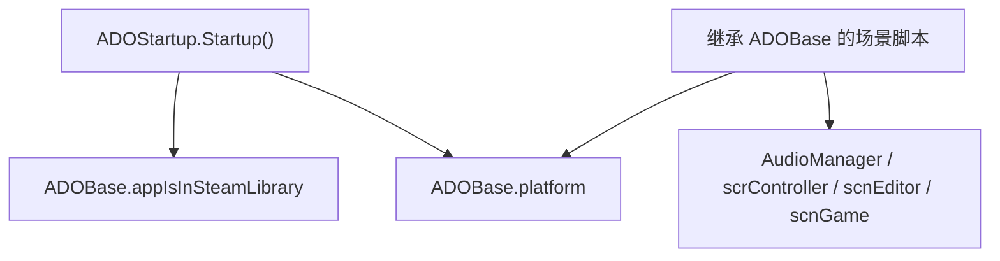

# ADOBase

## 基本信息

| 项目 | 内容 |
| --- | --- |
| 源码路径 | `7thRhythmSource/ADOFAi/ADOBase.cs` |
| 类型 | `public class ADOBase : RDBaseDll` |
| 命名空间 | 全局命名空间 |
| 主要职责 | 为 ADOFAI 的 MonoBehaviour 类提供全局对象访问器、场景状态判断、关卡跳转、平台判断和少量通用工具方法。 |

`ADOBase` 是 ADOFAI 中大量场景脚本、UI 脚本和运行时效果脚本可以继承的基础类。它不保存复杂实例状态，而是把 `AudioManager`、`scrConductor`、`scrController`、`scnEditor`、`scnGame`、`scrLevelMaker` 等常用单例集中暴露出来，并提供当前场景、当前关卡类型、平台和设备类型的判断。

## 静态字段

| 字段 | 类型 | 初始值 | 作用 |
| --- | --- | --- | --- |
| `levelScenes` | `Scene[]` | 未在本文件初始化 | 保存关卡场景数组。 |
| `appIsInSteamLibrary` | `bool` | `false` | 由 `ADOStartup.DetermineAppLocation()` 写入，用于记录程序是否位于 Steam 库目录。 |
| `ClearWhite` | `Color` | `new Color(1f, 1f, 1f, 0f)` | 透明白色常量。 |
| `platform` | `Platform` | `Platform.None` | 由 `ADOStartup.Startup()` 内部的 `GetPlatform()` 根据 `Application.platform` 写入。 |

## 全局访问器

| 属性 | 类型 | 指向 |
| --- | --- | --- |
| `audioManager` | `AudioManager` | `AudioManager.Instance` |
| `conductor` | `scrConductor` | `scrConductor.instance` |
| `loader` | `scrLoader` | `scrLoader.instance` |
| `controller` | `scrController` | `scrController.instance` |
| `lm` | `scrLevelMaker` | `scrLevelMaker.instance` |
| `uiController` | `scrUIController` | `scrUIController.instance` |
| `cls` | `scnCLS` | `scnCLS.instance` |
| `editor` | `scnEditor` | `scnEditor.instance` |
| `customLevel` | `scnGame` | `scnGame.instance` |
| `levelPath` | `string` | `scnGame.instance.levelPath` |
| `gc` | `RDConstants` | `RDConstants.data` |
| `worldData` | `Dictionary<string, GCNS.WorldData>` | `GCNS.worldData` |
| `levelSelect` | `scnLevelSelect` | `scnLevelSelect.instance` |
| `platformHelper` | `IPlatformHelper` | `PlatformHelper.instance` |

这些属性都是直接读其他单例或静态数据。调用方需要确保对应对象已经初始化；例如 `levelPath` 会直接访问 `scnGame.instance.levelPath`，如果当前没有 `scnGame.instance` 会产生空引用风险。

## 场景与关卡状态属性

| 属性 | 类型 | 行为 |
| --- | --- | --- |
| `isLevelEditor` | `bool` | `editor != null`。 |
| `isScnGame` | `bool` | `customLevel != null` 且不是编辑器。 |
| `isCLSLevel` | `bool` | 当前是 `scnGame` 且不是内部关卡。 |
| `isEditingLevel` | `bool` | 当前是编辑器且 `controller.paused` 为真。 |
| `isCLS` | `bool` | `cls != null`。 |
| `isLevelSelect` | `bool` | `LevelSelectBase.instance != null`。 |
| `isFreeroamScene` | `bool` | 在选关场景返回真；否则读 `controller.isPuzzleRoom`。 |
| `isInternalLevel` | `bool` | `GCS.internalLevelName != null`。 |
| `isDLCLevel` | `bool` | 读取 `GCNS.worldData[scrController.currentWorldString].isDLC`。 |
| `isOfficialLevel` | `bool` | 存在 `controller`、不是 CLS 关卡、且不是编辑器。 |
| `isBossLevel` | `bool` | `currentLevel.Contains("-X")`。 |
| `isBundleLevel` | `bool` | `GCS.loadCustomFromBundle`。 |
| `isPlayingLevel` | `bool` | 官方关卡或精选关卡中，且不在选关场景。 |
| `playerIsOnIntroScene` | `bool` | `sceneName == "scnIntro"`。 |

`isFeaturedLevel`、`isClassicFeaturedLevel`、`isTechFeaturedLevel` 都依赖 `GCS.customLevelId`，当它能解析为 `uint` 时，分别检查 `GCNS.FeaturedLevelsIDs` 和 `GCNS.TechFeaturedLevelsIDs`。

## 平台与设备属性

| 属性 | 类型 | 行为 |
| --- | --- | --- |
| `isUnityEditor` | `bool` | `Application.isEditor`。 |
| `isGamepad` | `bool` | Switch 平台返回真；否则读 `RDC.runningOnSteamDeck`。 |
| `isSwitch` | `bool` | `platform == Platform.Switch`。 |
| `isMobile` | `bool` | `platform` 为 Android 或 iOS。 |
| `isDesktop` | `bool` | 固定返回真。 |
| `isSteamworks` | `bool` | 固定返回真。 |
| `isIntelMac` | `bool` | 固定返回假。 |
| `isMobileMenu` | `bool` | 固定返回假。 |
| `isExpo` | `bool` | 固定返回假。 |
| `isTournament` | `bool` | 固定返回假。 |

## 实例属性

| 属性 | 类型 | 行为 |
| --- | --- | --- |
| `practiceAvailable` | `bool` | 如果 `controller.isPuzzleRoom` 为真返回假；CLS 关卡和 boss 关卡返回真；其他情况返回假。 |
| `bb` | `bool` | 读取 `GCS.bb`。 |
| `randomFloat` | `float` | 读取 `UnityEngine.Random.value`。 |
| `dlcManagers` | `HashSet<DLCManager>` | 读取 `DLCManager.DLCManagers`。 |
| `neoCosmosManager` | `NeoCosmosManager` | `NeoCosmosManager.instance`。 |
| `vegaDLCManager` | `VegaDLCManager` | `VegaDLCManager.instance`。 |
| `featuredDLCManager` | `FeaturedDLCManager` | `FeaturedDLCManager.instance`。 |

## 可写速度属性

| 属性 | 类型 | 行为 |
| --- | --- | --- |
| `d_speed` | `float` | 读写 `scrController.instance.d_speed`。 |

`d_speed` 是静态属性，会直接访问 `scrController.instance`。文档后续讲 `scrController` 时需要把它和控制器内部速度字段一起解释。

## 方法

| 方法 | 返回值 | 行为 |
| --- | --- | --- |
| `IsNotAMikoSkipMandatorySprite(string filename)` | `bool` | 仅当当前关卡为 `XM-X` 且视觉质量为 Low 时启用检查；文件名不含 `boat` 且不含 `tile90` 时返回真。 |
| `GetLevelNumber(string levelName = null)` | `int` | 解析关卡名中 `-` 后的编号；后缀为 `X` 时返回当前世界的 `levelCount`。 |
| `GetPreviousLevelName(string levelName = null)` | `string` | 基于当前世界名和当前关卡编号返回上一关，最小编号为 1。 |
| `GetNextLevelName(string levelName = null)` | `string` | 基于当前世界关卡数返回下一关；倒数终点使用 `X`。 |
| `GoToLevelSelect()` | `void` | 调用 `DOTween.KillAll()` 后通过 `loader.LoadScene(GCNS.sceneLevelSelect)` 进入选关场景。 |
| `GoToCalibration(bool bypassUnsavedCheck = false)` | `void` | 从编辑器进入校准前会检查未保存内容；随后重置时间、音频暂停、checkpoint 状态并加载 `scnCalibration`。 |
| `RestartScene()` | `void` | 重新加载当前场景；在编辑器中固定重载 `scnEditor`，并保存待打开关卡路径。 |
| `GoToLevelEditor()` | `void` | 结束 DOTween 并加载 `scnEditor`。 |
| `GetLocalizedLevelName(string sceneName)` | `string` | 处理特殊关卡名后返回编号加本地化标题。 |
| `GetLocalizedLevelNameWithCheck(string sceneName, out bool exists)` | `string` | 与 `GetLocalizedLevelName` 类似，同时返回本地化键是否存在。 |
| `IsAprilFools()` | `bool` | 4 月 1 日到 8 日之间，并且世界 0 完成时返回真。 |
| `IsHalloweenWeek()` | `bool` | 10 月 24 日之后或 11 月 2 日之前，并且世界 0 完成时返回真。 |
| `IsCNY()` | `bool` | 读取农历新年日期，判断当前时间是否在新年当天到 15 天后之间。 |
| `GetDisplayWidth()` | `int` | 返回 `Display.main.systemWidth`。 |
| `GetDisplayHeight()` | `int` | 返回 `Display.main.systemHeight`。 |
| `FlushUnusedMemory()` | `void` | 如果 `audioManager` 存在，调用 `audioManager.FlushData()`。 |
| `OnBeat()` | `void` | 虚方法，基类为空实现。 |

## 关卡名处理

`ProcessLevelName(string sceneName)` 是私有静态方法，供本地化关卡名方法使用。它会处理三类特殊名称：

| 条件 | 处理 |
| --- | --- |
| 世界前缀 `IsVega()` | 把 `EX-` 替换为 `-E`。 |
| 世界前缀以 `TX` 结尾 | 把 `TX-` 替换为 `-T`。 |
| `GCS.FOOL_JOKER` 且名称以 `J-X` 结尾 | 移除 `J` 并在显示名末尾加 `?`。 |

## 生命周期关系

`ADOBase` 自身没有 Unity 生命周期方法。它的字段主要由 [ADOStartup](/api/core/ADOStartup.md) 写入或由其他单例提供。
