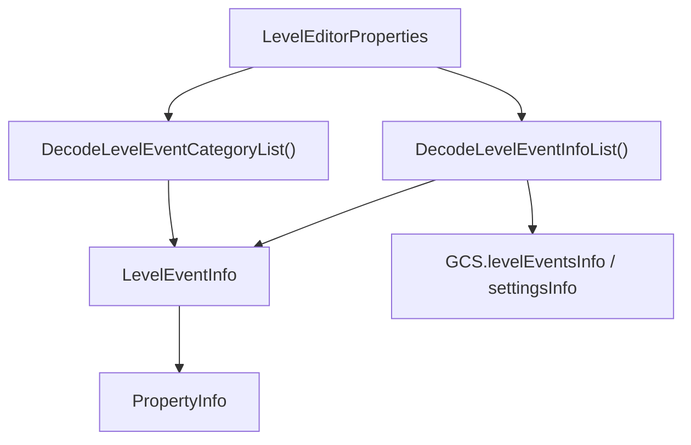

# ADOStartup

## 基本信息

| 项目 | 内容 |
| --- | --- |
| 源码路径 | `7thRhythmSource/ADOFAi/ADOStartup.cs` |
| 类型 | `public static class ADOStartup` |
| 命名空间 | 全局命名空间 |
| 主要职责 | 在场景加载前初始化平台、存档、事件元数据、DLC、Steam、输入、音频、加载器和全局渲染属性。 |

`ADOStartup` 使用 `RuntimeInitializeOnLoadMethod(RuntimeInitializeLoadType.BeforeSceneLoad)` 标记私有 `Startup()` 方法。Unity 会在第一个场景加载前调用它。这个类是 ADOFAI 运行时初始化顺序的核心入口。

## 字段

| 字段 | 类型 | 初始值 | 作用 |
| --- | --- | --- | --- |
| `errorCanvas` | `ErrorCanvas` | `null` | 首次捕获运行时错误时实例化错误画布并显示错误内容。 |
| `addedMods` | `List<string>` | `new List<string>()` | `ModWasAdded(string modName)` 把非空名称加入此列表，并输出日志。 |

## Startup 初始化顺序

| 顺序 | 步骤 | 主要行为 |
| --- | --- | --- |
| 1 | 注册日志回调 | `Application.logMessageReceived += LogMessageReceived`。 |
| 2 | `GetPlatform()` | 根据 `Application.platform` 写入 `ADOBase.platform`。 |
| 3 | `DetermineAppLocation()` | 检查程序目录是否位于 Steam `steamapps/common` 结构下，写入 `ADOBase.appIsInSteamLibrary`。 |
| 4 | `SetBuildDateAndCommit()` | 从 Resources 读取 `buildDate` 和 `buildCommit` 到 `GCNS`。 |
| 5 | `SetLocale()` | 把当前线程 culture 设置为 `en-US`。 |
| 6 | `LoadSaveData()` | 调用 `Persistence.Load()`。 |
| 7 | `SetupSystems()` | 调用 `RDString.Setup()`。 |
| 8 | `InitializeSteamSDK()` | 调用 `SteamIntegration.Setup()`。 |
| 9 | `GameServices.Instance.Initialize()` | 初始化游戏服务。 |
| 10 | `FixResolution()` | 确保最低窗口尺寸；Steam Deck 下选择 1280x800 最大化窗口。 |
| 11 | `SetupLevelEventsInfo()` | 读取并解析 `LevelEditorProperties`，建立事件和属性元数据。 |
| 12 | `SetSettings()` | 把持久化设置写入 DOTween、GCS、RDC、RDUtils、QualitySettings 和 `scrController` 静态字段。 |
| 13 | `ForceResolutionOnLofi()` | lofi 版本且非移动端时强制窗口模式，开场场景可设置 800x400。 |
| 14 | `LoadCalibration()` | 加载默认校准预设并更新当前音频输出。 |
| 15 | `SetupSfxHandler()` | 实例化 `RDConstants.data.prefab_sfxHandler` 并设置为不随场景销毁。 |
| 16 | `InitializeSteamIntegration()` | 非 Steam 库时把 DLC manager 的 `own` 置真；读取 Steam beta branch 名称。 |
| 17 | DLC 检查 | 遍历 `DLCManager.DLCManagers`，依次执行 `CheckInstalled()` 和 `CheckUpToDate()`。 |
| 18 | Shader 属性初始化 | 写入 `scrFloor`、`FloorRenderer`、`scrDecorationManager` 的 shader property id 和 shader 引用。 |
| 19 | Discord | 非移动端创建 `DiscordController`。 |
| 20 | 成就 | 调用 `Persistence.GiveAchievements()`。 |
| 21 | Rewired 和 RDInput | 实例化 `prefab_rewiredManager`，并调用 `RDInput.Setup(rewiredManager)`。 |
| 22 | Analytics | 调用 `Analytics.LimitAnalyticsIfModded()` 和 `Analytics.UploadBranchToUnity()`。 |
| 23 | 音频配置 | 把 `Persistence.audioBufferSize` 写入 `AudioSettings` 配置并 Reset。 |
| 24 | `SetupLoader()` | 实例化 `RDConstants.data.prefab_loader` 并设置为不随场景销毁。 |

## 平台判定

`GetPlatform()` 根据 Unity 的 `RuntimePlatform` 枚举映射到 ADOFAI 自己的 `Platform`：

| Unity 平台 | ADOFAI 平台 |
| --- | --- |
| `WindowsPlayer`、`WindowsEditor` | `Platform.Windows` |
| `OSXEditor`、`OSXPlayer` | `Platform.Mac` |
| `LinuxPlayer`、`LinuxEditor` | `Platform.Linux` |
| `Android` | `Platform.Android` |
| `IPhonePlayer` | `Platform.iOS` |
| `Switch` | `Platform.Switch` |
| `WebGLPlayer` | `Platform.WebGL` |
| 其他 | `Platform.Windows` |

## 事件元数据解析

`SetupLevelEventsInfo()` 是编辑器事件系统的启动入口。它读取 `Resources.Load<TextAsset>("LevelEditorProperties").text`，通过 `GDMiniJSON.Json.Deserialize` 得到字典，然后执行：

| 写入目标 | 数据来源 |
| --- | --- |
| `GCS.levelEventsInfo` | JSON 中的 `levelEvents`。 |
| `GCS.settingsInfo` | JSON 中的 `settings`。 |
| 事件分类 | JSON 中的 `categories`，由 `DecodeLevelEventCategoryList()` 写回每个事件信息。 |
| `GCS.levelEventTypeString` | 遍历 `LevelEventType` 枚举，建立枚举到字符串的字典。 |

`DecodeLevelEventInfoList()` 会跳过 `enabled` 为假 的事件配置，然后创建 `LevelEventInfo`。它读取事件名、`stretchViewport`、枚举类型、pro 标记、Taro DLC 标记、首格限制、是否为装饰、分组、执行时机和属性列表。属性列表中的每一项会构造为 `PropertyInfo`，并按 JSON 顺序写入 `order`。

## 日志与错误画布

`LogMessageReceived(string logString, string stackTrace, LogType type)` 只在 `Application.isPlaying` 且日志类型为 Error、Exception 或 Assert 时继续。方法会把错误类型、内容和堆栈拼成文本，并过滤以下包含项：

| 过滤文本 |
| --- |
| `GLSL link error` |
| `No cloud project ID was found by the Analytics SDK.` |
| `The system is running out of memory.` |
| `AABB` |
| `IsFinite` |

未被过滤的错误会实例化 `RDConstants.data.prefab_errorCanvas`，取得 `ErrorCanvas` 后调用 `ShowError(text)`。

## 公共方法

| 方法 | 返回值 | 行为 |
| --- | --- | --- |
| `SetupLevelEventsInfo()` | `void` | 解析事件、设置和分类元数据。 |
| `DecodeLevelEventInfoList(List<object> eventInfoList)` | `Dictionary<string, LevelEventInfo>` | 把 JSON 字典列表转换为事件信息字典。 |
| `DecodeLevelEventCategoryList(List<object> categoryInfoList)` | `void` | 把分类配置写入对应 `LevelEventInfo.categories`。 |
| `LogMessageReceived(string logString, string stackTrace, LogType type)` | `void` | 过滤并显示运行时错误。 |
| `ModWasAdded(string modName)` | `void` | 非空名称加入 `addedMods`，并写 Debug 日志。 |
| `DetermineAppLocation()` | `void` | 检查安装目录是否位于 Steam 库结构。 |
| `StartupLog(object log)` | `void` | 输出带 `Startup:` 前缀的普通日志。 |
| `StartupLogError(object log)` | `void` | 输出带 `Startup Error:` 前缀的错误日志。 |
| `SetupSystems()` | `void` | 调用 `RDString.Setup()`。 |

## 与其他核心类型的关系

| 类型 | 关系 |
| --- | --- |
| [ADOBase](/api/core/ADOBase.md) | `Startup()` 写入 `ADOBase.platform` 和 `ADOBase.appIsInSteamLibrary`。 |
| `Persistence` | 启动时加载存档、读取音量、抗锯齿、音频 buffer、帧率、vSync、解锁设置等。 |
| `GCS` | 启动时写入震动、命中窗口、Steam branch、事件元数据和若干运行时状态。 |
| `GCNS` | 启动时写入构建日期和 commit。 |
| `scrConductor` | 启动时加载校准预设并更新音频输出。 |
| `RDInput` | 启动时接收 Rewired manager 并完成输入系统设置。 |
