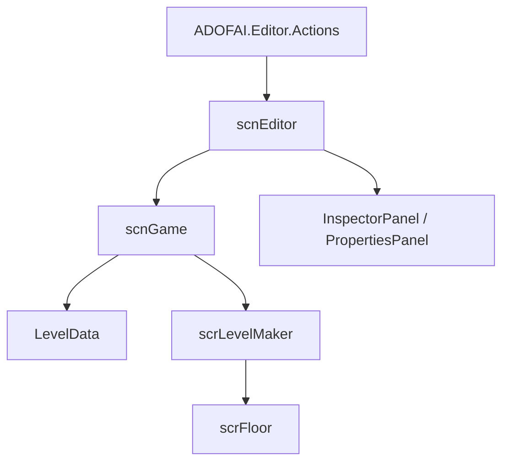

# scnEditor

## 基本信息

| 项目 | 内容 |
| --- | --- |
| 源码路径 | `7thRhythmSource/ADOFAi/scnEditor.cs` |
| 类型 | `public class scnEditor : ADOBase` |
| 命名空间 | 全局命名空间 |
| 主要职责 | 管理 ADOFAI 关卡编辑器场景、附加加载 `scnGame`、文件打开保存、选择状态、事件面板、属性面板、撤销重做、快捷键、播放预览和弹窗。 |

`scnEditor` 是 ADOFAI 关卡编辑器的主控制类。它持有大量 UI 引用和编辑状态，并通过 [scnGame](/api/core/scnGame.md) 操作 `LevelData`、路径、装饰和事件效果。编辑器命令由 `ADOFAI.Editor.Actions` 中的 `EditorAction` 派生类承接，`scnEditor` 在启动时注册快捷键到 `EditorKeybindManager`。

## 内部类型

| 类型 | 字段 | 作用 |
| --- | --- | --- |
| `SettingsTabType` | `None`、`Level`、`Song` | 设置面板 tab 类型。 |
| `PopupType` | 多个弹窗类型 | 保存、导出、打开 URL、版权、转换、未保存、确认等弹窗状态。 |
| `LevelState` | `data`、`selectedFloors`、`selectedDecorationIndices`、`settingsEventType`、`floorEventType` 等 | 撤销重做保存的编辑器状态。 |
| `NotificationAction` | `text`、`action` | 通知弹窗按钮动作。 |
| `ClipboardContent` | `None`、`Floors`、`Decorations` | 剪贴板内容类型。 |
| `FloorData` | `stringDirection`、`floatDirection`、`levelEventData`、`attachedDecorations` | 复制粘贴 floor 时保存的路径方向、事件和附着装饰。 |
| `PointerDownObjectType` | `Decoration`、`Floor`、`Gizmo`、`None` | 鼠标按下对象类型。 |

## 静态字段

| 字段 | 类型 | 作用 |
| --- | --- | --- |
| `instance` | `scnEditor` | 当前编辑器实例。 |
| `savedLevelString` | `string` | 已保存关卡文本。 |
| `applyEventsToFloorsOnPlay` | `bool` | 播放前是否应用事件到地板，默认真。 |
| `selectingFloorID` | `bool` | 是否处于选择 floor id 模式。 |
| `editorHasBeenEntered` | `bool` | 编辑器是否已进入过。 |
| `levelToOpenOnLoad` | `string` | 编辑器加载时需要自动打开的关卡路径。 |
| `MaxUndoSteps` | `int` | 撤销栈最大步数，值为 100。 |

## 主要 UI 与面板引用

| 分组 | 代表字段 | 作用 |
| --- | --- | --- |
| 场景和弹窗 | `levelEditorScene`、`popupPanel`、`popupWindow`、`savePopupContainer`、`unsavedChangesPopupContainer` | 编辑器主场景和各种弹窗容器。 |
| 文件按钮 | `buttonNew`、`buttonOpen`、`buttonOpenRecent`、`buttonOpenURL`、`buttonSave`、`buttonSaveAs`、`buttonPreferences`、`buttonExit` | 文件操作入口。 |
| 播放按钮 | `playPause`、`playPauseIcon`、`rewind`、`buttonAuto`、`buttonNoFail`、`buttonUnlockKeyLimiter` | 播放、自动、无失败和 unlock key limiter 控制。 |
| 地板按钮 | `buttonD`、`buttonW`、`buttonA`、`buttonS`、`buttonE`、`buttonQ` 等 | 路径方向与特殊地板创建按钮。 |
| Inspector | `levelEventsPanel`、`settingsPanel`、`inspectorTabs`、`inspectorPanels` | 事件和设置属性面板。 |
| 偏好与帮助 | `prefsMenu`、`propertyHelpContainer`、`propertyHelpText`、`propertyHelpURLButton` | 编辑器偏好和属性帮助。 |
| 查找面板 | `findFloorPanel`、`findCommentPanel`、`findFloorSelectedInfo` | 查找 floor 和评论。 |

## 关键编辑状态

| 字段或属性 | 类型 | 作用 |
| --- | --- | --- |
| `initialized` | `bool` | 编辑器是否完成初始化。 |
| `autoFailed` | `bool` | auto 状态是否失败。 |
| `pausedInPlayMode` | `bool` | 播放模式中是否暂停。 |
| `lockPathEditing` | `bool` | 是否锁定路径编辑。 |
| `inStrictlyEditingMode` | `bool` | 是否严格处于编辑模式。 |
| `isLoading` | `bool` | 是否正在加载关卡。 |
| `showFloorNums` | `bool` | 是否显示 floor 编号。 |
| `selectedFirstFloor` | `bool` | 当前是否选中第一个 floor。 |
| `playMode` | `bool` | 根据 `pausedInPlayMode` 和 controller 状态判断是否在播放模式。 |
| `userIsEditingAnInputField` | `bool` | 当前 EventSystem 选中对象是否是 TMP 输入框。 |

选择状态由 `selectedFloors`、`selectedDecorations`、`multiSelectPoint`、`lastSelectedFloor`、`lastSelectedFloorsCount`、`lastSelectedDecorations` 等字段共同维护。源码中选择 floor 或 decoration 时，会通过 `SaveStateScope` 保存状态，更新颜色、面板和相机位置。

## Awake 与 Start

| 方法 | 行为 |
| --- | --- |
| `Awake()` | 调用 `RDString.LoadLevelEditorFonts()`，注册退出事件，并调用 `LoadGameScene()`。 |
| `LoadGameScene()` | 如果没有已加载的 `scnGame`，使用 `SceneManager.LoadScene("scnGame", LoadSceneMode.Additive)` 附加加载游戏场景。 |
| `Start()` | 加载事件与分类 sprite，调用 `LoadEditorProperties()`，绑定 decoration list 回调，注册按钮事件，加载 web artist 数据，显示难度选择器，处理 `levelToOpenOnLoad`。 |
| `RegisterKeybinds()` | 注册播放、撤销重做、选择、移动、保存、打开、偏好、事件分页、日志目录等快捷键。 |

## 快捷键与 EditorAction

`RegisterKeybinds()` 把按键组合注册到 `EditorKeybindManager`，动作类来自 `ADOFAI.Editor.Actions`。

| 动作类型 | 代表快捷键 | 代表动作类 |
| --- | --- | --- |
| 播放 | `P`、`Space` | `PlayEditorAction` |
| 变速播放 | `Ctrl+P`、`Ctrl+Space` | `PlayWithSpeedEditorAction` |
| 撤销重做 | `Ctrl+Z`、`Ctrl+Y`、`Ctrl+Shift+Z` | `UndoEditorAction`、`RedoEditorAction` |
| 选择 floor | 方向键、Home、End | `SelectPreviousFloorEditorAction`、`SelectNextFloorEditorAction`、`SelectFirstFloorEditorAction`、`SelectLastFloorEditorAction` |
| 文件 | `Ctrl+S`、`Ctrl+Shift+S`、`Ctrl+O`、`Ctrl+U` | 保存、另存、打开、打开 URL |
| 面板 | 查找、文件动作、偏好、日志目录 | 对应 `Toggle*` 或 `Open*` action |

## 文件打开与保存

| 方法 | 行为 |
| --- | --- |
| `CheckUnsavedChanges(Action quitLevelAction, bool skipCloseAnim = false)` | 检查未保存状态，必要时显示未保存弹窗。 |
| `OpenLevel()` | 检查未保存后启动 `OpenLevelCo()`。 |
| `OpenLevel(string filePath)` | 直接启动 `OpenLevelCo(filePath)`。 |
| `OpenLevelCo(string definedLevelPath = null)` | 选择或使用指定路径，调用 `customLevel.LoadLevel()`，成功后 `RemakePath()`、选择第一块地板、更新装饰并显示加载通知。 |
| `OpenRecent(bool checkCtrl = false)` | 读取 `Persistence.GetLastOpenedLevel()`，存在时打开最近文件。 |
| `OpenLevelFromURL()` | 从 URL 下载关卡并打开。 |
| `SaveLevel()` | 保存当前关卡；未有路径时转入 `SaveLevelAs()`。 |
| `SaveLevelAs(bool newLevel = false, string path = null)` | 启动 `SaveLevelAsCo()`，让用户选择路径或使用传入路径。 |
| `NewLevel()` | 选择新关卡路径，清空选择和装饰，保存并重建路径。 |

## 选择系统

| 方法 | 行为 |
| --- | --- |
| `SelectFloor(scrFloor floorToSelect, bool cameraJump = true)` | 清空旧选择，选中单个 floor，刷新信息和选中颜色，必要时移动相机。 |
| `SelectFirstFloor()` | 选择第一块 floor。 |
| `MultiSelectFloors(scrFloor startFloor, scrFloor endFloor, bool setSelectPoint = false)` | 选择一段连续 floor。 |
| `DeselectFloors(bool skipSaving = false)` | 取消 floor 选择。 |
| `SelectionIsEmpty()`、`SelectionIsSingle()` | 判断 floor 选择状态。 |
| `SelectDecoration(...)` | 选择 decoration 事件，可跳转相机并显示属性面板。 |
| `DeselectDecoration(LevelEvent levelEvent)`、`DeselectAllDecorations()` | 取消一个或全部 decoration 选择。 |
| `SelectionDecorationIsEmpty()`、`SelectionDecorationIsSingle()` | 判断 decoration 选择状态。 |

`UpdateSelectedFloor()` 每帧检查选中 floor 数量或单选对象变化，变化时调用 `OnSelectedFloorChange()`。`OnSelectedFloorChange()` 会刷新 inspector、事件指标和选择信息。

## 路径编辑与剪贴板

| 方法 | 行为 |
| --- | --- |
| `CreateFloor(char floorType, ...)` | 在当前选中 floor 后创建旧式字符路径 floor。 |
| `CreateFloor(float floorAngle, ...)` | 在当前选中 floor 后创建角度路径 floor。 |
| `CreateFloorWithCharOrAngle(float angle, char chara, ...)` | 根据角度或字符创建 floor。 |
| `InsertCharFloor(int sequenceID, char floorType)` | 插入字符 floor 并 `RemakePath()`。 |
| `InsertFloatFloor(int sequenceID, float floorAngle)` | 插入角度 floor 并 `RemakePath()`。 |
| `FlipFloor()`、`FlipSelection()` | 翻转单个或选中路径。 |
| `RotateFloor()`、`RotateSelection()`、`RotateFloor180()`、`RotateSelection180()` | 旋转单个或选中路径。 |
| `CopyFloor()`、`MultiCopyFloors()`、`CutFloor()`、`PasteFloors()` | floor 复制、剪切、粘贴。 |
| `CopyDecoration()`、`MultiCopyDecorations()`、`CutDecoration()`、`PasteDecorations()` | decoration 复制、剪切、粘贴。 |
| `PasteEvents(scrFloor targetFloor, FloorData floorData, ...)` | 把 `FloorData` 中的事件粘贴到目标 floor。 |

多数路径和剪贴板操作都包在 `SaveStateScope` 中，之后调用 `RemakePath()` 或 `ApplyEventsToFloors()` 保持场景和数据一致。

## 事件面板

| 方法 | 行为 |
| --- | --- |
| `LoadEditorProperties()` | 加载编辑器属性元数据并设置面板。 |
| `ShowEventsPage(int pageNum)` | 显示指定事件页。 |
| `RepositionEventButtons()` | 重新摆放事件按钮。 |
| `UpdateCategoryVisibility()` | 刷新事件分类显示状态。 |
| `SetCategory(LevelEventCategory eventCategory, bool changedFavorites = false)` | 切换事件分类。 |
| `AddFavoriteEvent(LevelEventType type)` / `RemoveFavoriteEvent(LevelEventType type)` | 修改收藏事件。 |
| `DecideInspectorTabsAtSelected()` | 根据当前选择决定 inspector tab。 |
| `AddEventAtSelected(LevelEventType eventType)` | 在选中 floor 上添加事件。 |
| `AddDecoration(LevelEvent dec, int index = -1)` | 添加 decoration 事件。 |
| `RemoveEvent(LevelEvent evnt, bool skipDecorationUpdate = false)` | 移除事件。 |
| `GetSelectedFloorEvents(LevelEventType eventType)` | 取当前选中 floor 中指定类型事件。 |

## 播放预览与编辑模式

| 方法 | 行为 |
| --- | --- |
| `Play()` | 记录当前选择，清空 UI 选择，`RemakePath(applyEventsToFloors: false)`，然后调用 `customLevel.Play(num)` 进入播放预览。 |
| `SwitchToEditMode(bool clsToEditor = false)` | 退出播放预览，恢复编辑 UI、选择、难度 selector、controller 状态和装饰选择。 |
| `TogglePause(bool clsToEditor = false)` | 切换播放暂停。 |
| `ResetScene(bool clsToEditor = false)` | 重置场景并恢复编辑器状态。 |

播放时 `GCS.editorQuickPitchedPlaying` 会根据 Control 键状态设置，`playbackSpeed` 取 `Persistence.shortcutPlaySpeed / 100f` 或 1。播放前会缓存选中事件和 decoration，返回编辑模式时用于恢复选择。

## 撤销重做

| 方法 | 行为 |
| --- | --- |
| `SaveState(bool clearRedo = true, bool dataHasChanged = true)` | 保存 `LevelState`，包含关卡数据和选择状态。 |
| `Undo()` | 调用 `UndoOrRedo(redo: false)`。 |
| `Redo()` | 调用 `UndoOrRedo(redo: true)`。 |
| `UndoOrRedo(bool redo)` | 取出对应状态，重建路径、装饰、选择和粒子编辑器目标。 |

撤销重做会调用 `RemakePath()`、`UpdateDecorationObjects()`，并按保存的 floor 或 decoration 选择状态恢复 UI。

## 与核心系统的关系

## 后续拆分

`scnEditor.cs` 是大型文件，本页只记录阶段 1 所需的编辑器主入口骨架。阶段 3 会继续拆分 EditorAction、InspectorPanel、PropertiesPanel、PropertyControl、偏好设置、粒子编辑器、事件按钮和各类弹窗。
