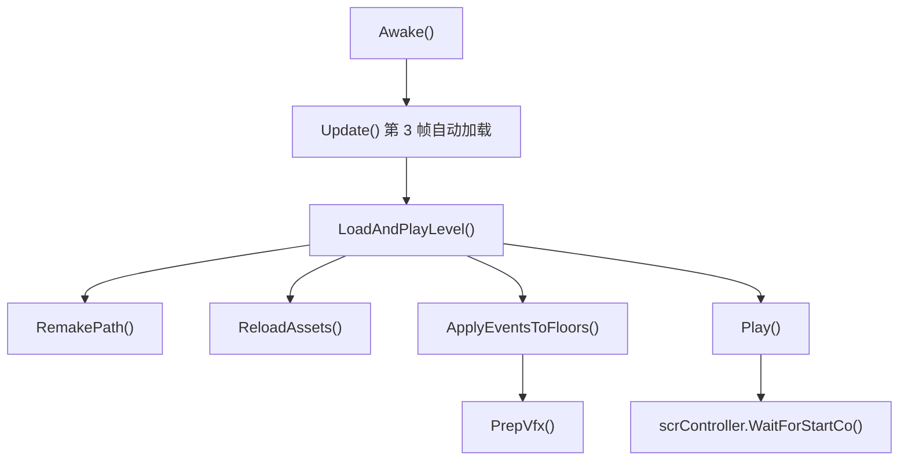

# scnGame

## 基本信息

| 项目 | 内容 |
| --- | --- |
| 源码路径 | `7thRhythmSource/ADOFAi/scnGame.cs` |
| 类型 | `public class scnGame : ADOBase` |
| 命名空间 | 全局命名空间 |
| 主要职责 | 加载自定义或内部关卡，维护 `LevelData`，重建路径，刷新资源，创建装饰，把事件应用到地板并准备运行时 VFX。 |

`scnGame` 是 ADOFAI 自定义关卡和内部关卡运行场景的主入口。它持有当前 `LevelData`、`scrLevelMaker`、装饰管理器、视频背景、图片缓存和关卡路径，并把 `LevelEvent` 转换为地板上的 `ffxPlusBase` 组件。

## 常量与静态字段

| 名称 | 值或类型 | 作用 |
| --- | --- | --- |
| `SpeedMargin` | `0.05f` | 速度相关容差。 |
| `InternalLevelsSharedPath` | `InternalLevels/Shared` | 内部关卡共享资源路径。 |
| `PlanetsWarning` | 字符串 | 多于 3 个 planet 的警告文本。 |
| `NoTag` | `NO TAG` | 无事件标签常量。 |
| `ConditionalEventTags` | `string[9]` | 条件事件标签名：perfect、early、late、loss、checkpoint 等。 |
| `instance` | `scnGame` | 当前场景实例，`Awake()` 中赋值。 |

## 主要字段与属性

| 字段或属性 | 类型 | 作用 |
| --- | --- | --- |
| `decManager` | `scrDecorationManager` | 当前关卡装饰管理器。 |
| `imgHolder` | `TextureManager` | 图片和纹理缓存管理器。 |
| `videoBG` | `VideoPlayer` | 视频背景播放器。 |
| `editorBG` | `GameObject` | 编辑器背景对象。 |
| `customEditorBG` | `GameObject` | 自定义编辑器背景对象。 |
| `camParent` | `Transform` | 相机父节点。 |
| `custBG` | `scrCustomBackgroundSprite` | 自定义背景 sprite 组件。 |
| `levelEditor` | `GameObject` | 关卡编辑器对象。 |
| `highestBPM` | `float` | 当前关卡最高 BPM。 |
| `levelData` | `LevelData` | 当前关卡数据。 |
| `levelMaker` | `scrLevelMaker` | 路径与地板生成器。 |
| `levelPath` | `string` | 当前关卡文件路径。 |
| `checkpointsUsed` | `int` | 本次关卡使用 checkpoint 数量。 |
| `isLoading` | `bool` | 当前是否处于加载状态。 |
| `forceOldLevelStyle` | `bool` | 强制旧关卡风格。 |
| `events` | `List<LevelEvent>` | `levelData.levelEvents`。 |
| `decorations` | `List<LevelEvent>` | `levelData.decorations`。 |
| `paused` | `bool` | `scrController.instance.paused`。 |
| `filterToComp` | `Dictionary<Filter, MonoBehaviour>` | `scrVfxPlus.instance.filterToComp`。 |

`suitableDecManager` 是静态属性：如果 `scnGame.instance` 存在就返回 `instance.decManager`，否则查找场景中的 `Decoration Container` 并取得 `scrDecorationManager`。

## Awake 与自动加载

`Awake()` 的主要行为：

| 步骤 | 行为 |
| --- | --- |
| 1 | `instance = this`。 |
| 2 | 如果处于 `scnGame`、没有内部关卡名、没有自定义路径，则把 `GCS.internalLevelName` 设为 `AR-X`。 |
| 3 | 设置 `isLoading = true`，清理未使用内存与资源。 |
| 4 | 初始化 `levelData = new LevelData()` 和 `levelMaker = scrLevelMaker.instance`。 |
| 5 | 读取 controller 相机、`Flash` 对象和新 `TextureManager`。 |
| 6 | 调用 `ffxSetFilterAdvancedPlus.ResetVariables()`。 |
| 7 | 注册 `videoBG.prepareCompleted` 和 `videoBG.errorReceived` 回调。 |

`Update()` 会在自定义路径或内部关卡存在、不是编辑器、并且距离 `startFrame` 第 3 帧时调用 `LoadAndPlayLevel(text)`。同一方法还会按当前相机正交尺寸缩放 flash 渲染对象。

## 关卡加载流程

| 方法 | 行为 |
| --- | --- |
| `LoadLevel(string levelPath, out LoadResult status)` | 清理内存，设置 `isLoading`，调用 `levelData.LoadLevel()`；成功后写入 `this.levelPath` 并通知 `scrUIController.instance.LevelFinishedLoading()`。 |
| `LoadAndPlayLevel(string levelPath)` | 调用 `LoadLevel()`；成功后更新编辑器文件名、加载内部关卡材质、重建路径、刷新资源、更新装饰、应用事件、重置装饰、绘制多星体与 hold，最后调用 `Play()`。失败时加载 `scnCLS` 并显示错误画布。 |
| `ReloadAssets(bool force = false, bool reloadDecorations = true)` | 标记图片缓存、重载歌曲、更新背景图片、装饰、地板纹理、背景、视频，并卸载未使用图片。 |

## 路径重建

`RemakePath(bool applyEventsToFloors = true, bool remakeLevel = true)` 负责把 `LevelData` 转成场景地板：

| 步骤 | 行为 |
| --- | --- |
| 1 | 调用 `ADOBase.conductor.SetupConductorWithLevelData(levelData)`。 |
| 2 | 确保 `levelMaker` 指向 `scrLevelMaker.instance`。 |
| 3 | 写入 `levelMaker.leveldata`、`floorAngles`、`isOldLevel` 和 `scrLevelMaker2.BigTiles`。 |
| 4 | 写入 `ADOBase.controller.tileShape`。 |
| 5 | `remakeLevel` 为真时调用 `levelMaker.MakeLevel()`。 |
| 6 | 写入 `scrConductor.instance.countdownTicks`。 |
| 7 | 需要时调用 `ApplyEventsToFloors(floors)`。 |
| 8 | 调用 `levelMaker.DrawHolds()` 和 `levelMaker.DrawMultiPlanet()`。 |

## 事件应用到地板

`ApplyEventsToFloors(List<scrFloor> floors, LevelData levelData, scrLevelMaker lm, List<LevelEvent> events)` 的核心流程：

| 步骤 | 行为 |
| --- | --- |
| 1 | 为每个 floor 创建事件列表，只把 `active` 的事件按 `levelEvent.floor` 放入对应列表。 |
| 2 | 删除每个地板上已有的 `ffxPlusBase` 组件，清空 `floor.plusEffects`。 |
| 3 | 调用 `lm.CalculateSingleFloorAngleLength(floor)`。 |
| 4 | 处理核心事件并重新计算地板 entry time。 |
| 5 | 读取 `LevelData` 的轨道颜色、纹理、动画、planet ease、stickToFloors 等默认值。 |
| 6 | 遍历每个地板的事件，根据事件类型改变临时轨道状态或创建运行时效果。 |
| 7 | 处理 `RepeatEvents`、`SetConditionalEvents` 和默认相机效果。 |

本方法体很长，后续阶段会把 `SetSpeed`、`ColorTrack`、`AnimateTrack`、`MoveTrack`、条件事件和 RepeatEvents 继续拆到事件效果专题。

## ApplyEvent 映射

`ApplyEvent(LevelEvent evnt, float bpm, float pitch, List<scrFloor> floors, float offset = 0f, int? customFloorID = null)` 把事件对象转换为地板上的 `ffxPlusBase` 派生组件。

| `LevelEventType` | 组件 |
| --- | --- |
| `Checkpoint` | `ffxCheckpoint` |
| `SetHitsound` | `ffxSetHitsound` |
| `SetHoldSound` | `ffxSetHoldsound` |
| `CustomBackground` | `ffxCustomBackgroundPlus` |
| `MoveCamera` | `ffxCameraPlus` |
| `Flash` | `ffxFlashPlus` |
| `RecolorTrack` | `ffxRecolorFloorPlus` |
| `MoveTrack` | `ffxMoveFloorPlus` |
| `MoveDecorations` | `ffxMoveDecorationsPlus` |
| `SetParticle` | `ffxSetParticlePlus` |
| `EmitParticle` | `ffxEmitParticlePlus` |
| `SetText` | `ffxSetTextPlus` |
| `SetObject` | `ffxSetObjectPlus` |
| `SetDefaultText` | `ffxSetDefaultText` |
| `SetFilter` | `ffxSetFilterPlus` |
| `SetFilterAdvanced` | `ffxSetFilterAdvancedPlus` |
| `HallOfMirrors` | `ffxHallOfMirrorsPlus` |
| `ShakeScreen` | `ffxShakeScreenPlus` |
| `Bloom` | `ffxBloomPlus` |
| `ScreenTile` | `ffxScreenTilePlus` |
| `ScreenScroll` | `ffxScreenScrollPlus` |
| `CallMethod` | `ffxCallMethod` |
| `AddComponent` | `ffxAddComponent` |
| `KillPlayer` | `ffxKillPlayer` |
| `PlaySound` | `ffxPlaySound` |
| `ScalePlanets` | `ffxScalePlanetsPlus` |
| `SetFrameRate` | `ffxSetFrameRatePlus` |
| `SetInputEvent` | `ffxSetInputEventPlus` |

创建组件后，方法会写入 `floorID`、`floors`、`crotchet`，调用 `Decode(evnt)`，把组件加入 `floors[num].plusEffects`，再用事件的 `angleOffset` 调用 `SetStartTime(bpm, output + offset)`。如果事件有 `eventTag`，且装饰管理器中存在对应 hitbox event tag，组件会加入装饰的 `hitboxEvents`，同时设为 `runManually`。

## 装饰与素材刷新

| 方法 | 行为 |
| --- | --- |
| `UpdateDecorationObjects(bool reloadDecorations = true)` | 清除装饰；遍历 `decorations` 创建装饰或加载装饰图片；再遍历 `MoveDecorations` 事件加载启用的 `decorationImage`。 |
| `UpdateBackgroundSprites()` | 遍历 `CustomBackground` 事件，按 `bgImage` 从关卡目录加载 sprite。 |
| `UpdateFloorSprites()` | 遍历 `ColorTrack` 事件，按 `trackTexture` 从关卡目录加载 texture。 |
| `UpdateVideo()` | 读取 `levelData.miscSettings["bgVideo"]`，内部关卡可走 Addressables，普通关卡走文件路径。 |
| `DisableFilters()` | 禁用 `filterToComp` 中所有滤镜组件，并调用 `ffxSetFilterAdvancedPlus.ResetAllFilters()`。 |

## 播放与完成加载

`Play(int seqID = 0, bool isRestart = false)` 会：

| 步骤 | 行为 |
| --- | --- |
| 1 | 如果 misc settings 中存在 `customClass`，用反射创建 `Level` 实例并写入 `scrController.instance.level`。 |
| 2 | 地板数量为 1 时返回假。 |
| 3 | 设置自定义结算文本、原始关卡名、HUD 文本和 checkpoint 计数。 |
| 4 | 标记 `scrController.gameworld = true`，写入 caption，清空 conductor 的 `onBeats`。 |
| 5 | 停止所有音效，重绕相机、相机父节点和 conductor。 |
| 6 | 设置起始 floor、旋转 ease、是否从 checkpoint 开始、是否跳过倒计时等状态。 |
| 7 | 非编辑器中启动 `scrController.WaitForStartCo(seqID, isRestart)`。 |

`FinishCustomLevelLoading(int seqID, bool isRestart = false)` 在编辑器中会重置装饰 hitbox events、重新应用事件或清除已触发状态，重置玩家第一格角度，重置装饰，显示已经经过的地板 glow，更新视频，并在编辑器中调用 `PrepVfx()`。

## VFX 预处理

`PrepVfx(List<scrFloor> floors, int seqID, List<LevelEvent> events = null, bool isRestart = false)` 会：

| 步骤 | 行为 |
| --- | --- |
| 1 | 如果传入 events，就按 floor 建立事件列表。 |
| 2 | 调用 `scrVfxPlus.instance.Reset()`。 |
| 3 | 遍历地板，预处理 `ffxChangeTrack`，记录 `startPos`，恢复透明度。 |
| 4 | 非 restart 且传入 events 时，读取 `RepeatEvents` 和 `SetConditionalEvents`，为带 `bgImage` 的事件创建额外 `ffxCustomBackgroundPlus`。 |
| 5 | 清空每个地板的 9 类条件效果集合。 |
| 6 | 遍历 `floor.plusEffects`，按 `conditionalInfo` 放入对应条件集合，或加入 `scrVfxPlus.effects`。 |
| 7 | 对每个 effect 调用 `PrepVfx()`。 |
| 8 | 如果从 checkpoint 进入，把最近 checkpoint 的 `onCheckpointEffects` 加回 VFX 列表。 |
| 9 | 按 `startTime - startEffectOffset` 和 floor seqID 排序 VFX。 |

## 辅助方法

| 方法 | 行为 |
| --- | --- |
| `IDFromTile(Tuple<int, TileRelativeTo> tile, int tileID, List<scrFloor> floors)` | 把相对 tile 描述转为绝对 floor id，并夹在有效范围内。 |
| `StringToTile(string sTile)` | 解析形如 `(数字,TileRelativeTo)` 的字符串为 tile tuple。 |
| `SetFxPlusFromComponents(List<scrFloor> listFloors, bool useComponentNotation)` | 从地板已有组件恢复 `plusEffects` 并设置 start time。 |
| `GetWorldPaths(string levelPath, bool excludeMain = false, bool renamed = false)` | 获取世界路径列表。 |
| `ResetScene(bool isResetCustomLevel = false)` | 重置条件 floor、输入事件、星体位置、VFX、路径、地板状态、装饰和 HUD。 |
| `ResetPlanetsPosition()` | 重置玩家星体位置。 |

## 生命周期关系

## 后续拆分

本页覆盖 `scnGame` 的主干。阶段 2 会补 `LevelData` 与 `LevelEvent` 的数据细节；阶段 5 会按 `LevelEventType` 和 `ffx` 类族展开事件效果；阶段 4 会继续补场景重置、关卡播放、视频背景和资源加载细节。
