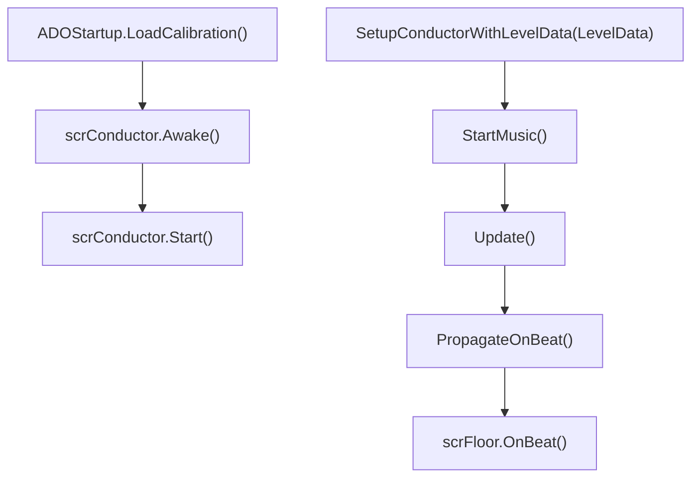

# scrConductor

## 基本信息

| 项目 | 内容 |
| --- | --- |
| 源码路径 | `7thRhythmSource/ADOFAi/scrConductor.cs` |
| 类型 | `public class scrConductor : ADOBase` |
| 命名空间 | 全局命名空间 |
| 主要职责 | 管理歌曲 AudioSource、DSP 时间、BPM、倒计时、节拍传播、hitsound、hold sound、校准预设和音频输出变化。 |

`scrConductor` 是 ADOFAI 的音频和节拍时钟核心。它继承 [ADOBase](/api/core/ADOBase.md)，由 `ADOBase.conductor` 作为全局入口访问。它把 Unity `AudioSettings.dspTime`、歌曲排程时间、校准输入偏移、视觉偏移和关卡 BPM 组合成 `songposition_minusi` 与 `songposition_minusv`，再驱动 `OnBeat()` 回调和地板 `OnBeat()`。

## 内部结构体与枚举

| 类型 | 字段 | 作用 |
| --- | --- | --- |
| `HitSoundsData` | `hitSound`、`time`、`volume`、`played` | 保存预排 hitsound 的声音类型、DSP 播放时间和音量。 |
| `HoldSoundsData` | `name`、`time`、`endTime`、`volume`、`played` | 保存 hold sound 的资源名、开始时间、结束时间和音量。 |
| `ExtraTickData` | `time`、`count`、`speed` | 保存额外倒计时 tick 的播放时间、剩余计数和速度。 |
| `DuckState` | `None`、`Starting`、`Ducked`、`Stopping` | 歌曲 duck 音量状态。 |

## 静态校准字段

| 字段或属性 | 类型 | 作用 |
| --- | --- | --- |
| `isAudioOutputDeviceChanged` | `bool` | 音频输出设备变化标记，`Update()` 中会触发 `scrController.CheckForAudioOutputChange()`。 |
| `defaultPresets` | `List<CalibrationPreset>` | 默认校准预设列表，启动时由 `CalibrationPreset.LoadDefaults()` 赋值。 |
| `userPresets` | `List<CalibrationPreset>` | 用户校准预设列表。 |
| `currentPreset` | `CalibrationPreset` | 当前音频输出使用的校准预设。 |
| `visualOffset` | `int` | 视觉偏移，毫秒单位。 |
| `calibration_i` | `float` | `currentPreset.inputOffset / 1000f`，输入偏移秒数。 |
| `calibration_v` | `float` | `visualOffset / 1000f`，视觉偏移秒数。 |

## 音频组件字段

| 字段 | 类型 | 作用 |
| --- | --- | --- |
| `song` | `AudioSource` | 主歌曲音源，`Start()` 中取 `GetComponents<AudioSource>()[0]`。 |
| `song2` | `AudioSource` | 第二音源，存在时取 `GetComponents<AudioSource>()[1]`。 |
| `song3` | `AudioSource` | 第三音源，代码中用于排程和 duck。 |
| `editorComponent` | `scnEditor` | 编辑器组件引用。 |
| `CLSComponent` | `scnCLS` | CLS 组件引用。 |
| `customLevelComponent` | `scnGame` | 自定义关卡组件引用。 |
| `txtOffset` | `Text` | UI 偏移文本，`Awake()` 中可从 `ADOBase.uiController.txtOffset` 取得。 |

## 歌曲参数字段

| 字段或属性 | 类型 | 作用 |
| --- | --- | --- |
| `addoffset` | `double` | 歌曲偏移，`SetupConductorWithLevelData()` 从 `levelData.offset` 毫秒换算。 |
| `bpm` | `float` | 当前 BPM。 |
| `crotchetAtStart` | `double` | 每拍秒数，常用公式 `60f / bpm`。 |
| `isGameWorld` | `bool` | 是否处于游戏世界。 |
| `separateCountdownTime` | `bool` | 歌曲是否不自带倒计时，需要游戏另加倒计时和 cymbal。 |
| `countdownTicks` | `int` | 倒计时 tick 数，默认 4。 |
| `countdownSpeedMultiplier` | `float` | 倒计时速度倍率。 |
| `adjustedCountdownTicks` | `float` | `countdownTicks / countdownSpeedMultiplier`。 |
| `hasSongStarted` | `bool` | 歌曲是否到达真正开始时间。 |
| `skipOffset` | `bool` | 是否跳过长 intro offset。 |
| `fastTakeoff` | `bool` | 快速起飞标记，会影响 `dspTimeSong`。 |

## 时间属性

| 字段或属性 | 类型 | 行为 |
| --- | --- | --- |
| `dspTime` | `double` | conductor 自己维护的 DSP 时间。 |
| `dspTimeSong` | `double` | 歌曲位置零点对应的 DSP 时间。 |
| `dspTimeSongPosZero` | `double` | `dspTimeSong + addoffset / song.pitch`。 |
| `songposition_minusi` | `double` | 歌曲位置减去输入偏移；WebGL conductor 会额外按 pitch 做修正。 |
| `songposition_minusv` | `double` | `songposition_minusi + calibration_i - calibration_v`。 |
| `deltaSongPos` | `double` | 本帧歌曲位置变化量，最小为 0。 |
| `nextBeatTime` | `double` | 下一次 beat 回调时间。 |
| `nextBarTime` | `double` | 下一次 bar 时间。 |
| `beatNumber` | `int` | 已经过的 beat 数。 |
| `barNumber` | `int` | 已经过的 bar 数。 |
| `onBeatFrame` | `int` | 最近一次 `PropagateOnBeat()` 的帧号。 |
| `onBeatHappened` | `bool` | 当前帧是否正好等于 `onBeatFrame`。 |

## hitsound 与 hold sound 字段

| 字段 | 类型 | 作用 |
| --- | --- | --- |
| `forceHitSounds` | `bool` | 非编辑器关卡中强制启用独立 hitsound。 |
| `hitSound` | `HitSound` | 默认 hitsound，初始为 `HitSound.Kick`。 |
| `hitSoundGroup` | `AudioMixerGroup` | hitsound 使用的 mixer group。 |
| `hitSoundVolume` | `float` | hitsound 音量，范围 0 到 2。 |
| `holdStartSound` | `HoldStartSound` | hold 开始声音。 |
| `holdEndSound` | `HoldEndSound` | hold 结束声音。 |
| `holdLoopSound` | `HoldLoopSound` | hold 循环声音。 |
| `holdMidSound` | `HoldMidSound` | hold 中段声音，默认 `None`。 |
| `holdMidSoundType` | `HoldMidSoundType` | 中段声音播放方式。 |
| `holdMidSoundDelay` | `float` | 中段声音延迟。 |
| `holdMidSoundTiming` | `HoldMidSoundTimingRelativeTo` | 中段声音相对起点或终点计算。 |
| `holdSoundVolume` | `float` | hold 声音音量。 |
| `useMidspinHitSound` | `bool` | midspin 是否使用专门 hitsound。 |
| `midspinHitSound` | `HitSound` | midspin hitsound，默认 `ReverbClack`。 |

## Awake 与 Start

| 方法 | 行为 |
| --- | --- |
| `Awake()` | 根据平台和 `GCS.d_webglConductor` 设置 buffer；绑定 UI offset 文本；如果不在编辑器中设置 `scnCLS.instance`；存在 controller 时调用 `SetupImportantVariables()`。 |
| `Start()` | 计算 `crotchetAtStart`，读取 `AudioSource` 组件，初始化 beat/bar 时间、DSP 时间和 UI 文本，设置 `WorldVolume` mixer 音量，并把自己加入 `ADOBase.conductor.onBeats`。 |
| `Rewind()` | 重置游戏世界标记、拍号、bar、歌曲开始状态、spectrum、`dspTimeSong` 和玩家 `lastHit`。 |

## 从 LevelData 设置音频

`SetupConductorWithLevelData(LevelData levelData)` 从关卡数据写入 conductor：

| LevelData 属性 | 写入目标 |
| --- | --- |
| `bpm` | `bpm` 与 `crotchetAtStart`。 |
| `offset` | `addoffset`，毫秒转秒。 |
| `volume` | `song.volume`，百分比转 0 到 1。 |
| `hitsoundVolume` | `hitSoundVolume`，百分比转 0 到 1。 |
| `hitsound` | `hitSound` 和 `midspinHitSound`。 |
| `separateCountdownTime` | `separateCountdownTime`。 |
| `pitch` | `song.pitch`，百分比转倍率；自定义关卡乘 `GCS.currentSpeedTrial`，编辑器乘 `ADOBase.editor.playbackSpeed`。 |

## 音乐排程

`StartMusic()` 会停止已有 `startMusicCoroutine`，再启动 `StartMusicCo()`。

`StartMusicCo()` 的主要流程：

| 步骤 | 行为 |
| --- | --- |
| 1 | 如果不是游戏世界，重置 `nextBeatTime`。 |
| 2 | 设置 `dspTimeSong = dspTime + buffer + 0.1`，新 conductor 路径会等待 0.1 秒后改为 `dspTime + buffer`。 |
| 3 | `fastTakeoff` 为真时减去倒计时长度。 |
| 4 | 根据 `Persistence.skipIntroBehavior`、死亡次数、`addoffset`、`GCS.longIntroThresholdSec` 和 checkpoint 决定 `skipOffset`。 |
| 5 | 根据 `separateCountdownTime` 计算歌曲实际 scheduled time。 |
| 6 | `skipOffset` 为真时用 `PlayScheduled(num2)` 并设置 `song.time`；否则按计算时间排程。 |
| 7 | `song2`、`song3` 同步 `PlayScheduled(num)`。 |
| 8 | 启动 `ToggleHasSongStarted(dspTimeSong)`。 |
| 9 | checkpoint 为 0 时调用 `PlayHitTimes()`。 |
| 10 | 触发 `onSongScheduled`，等待歌曲播放结束后触发 `onComplete`。 |

## Update 时钟与节拍传播

`Update()` 每帧执行以下核心工作：

| 工作 | 行为 |
| --- | --- |
| 音频输出变化 | `isAudioOutputDeviceChanged` 为真时调用 `scrController.CheckForAudioOutputChange()` 并清除标记。 |
| 平台 helper | 调用 `PlatformHelper.instance.Update()`。 |
| DSP 时间 | 在未暂停、应用聚焦、帧间隔小于 0.1 秒时用 `Time.unscaledTimeAsDouble` 推进 `dspTime`；如果 `AudioSettings.dspTime` 变化，则以 Unity DSP 时间校准。 |
| 异步输入时间 | `AsyncInputManager.isActive` 时同步 frame tick、DSP time、offset tick 和 `dspTimeSong`，且 controller 未暂停时调用 `UpdateInput()`。 |
| 预排声音 | 歌曲开始且处于游戏世界时，提前 5 秒调度 extra tick、hold sound 和 hitsound。 |
| 歌曲位置 | 新 conductor 使用 `(dspTime - dspTimeSong - calibration_i) * song.pitch - addoffset`；旧或 WebGL 路径使用 `song.time - calibration_i - addoffset / song.pitch`。 |
| beat/bar | `songposition_minusi > nextBeatTime` 时调用 `PropagateOnBeat()`；超过 `nextBarTime` 时推进 bar。 |
| spectrum | `getSpectrum` 为真且不是 lofi 版本时，从当前音源读取 `GetSpectrumData()`。 |

`PropagateOnBeat()` 会遍历 `onBeats`，移除空引用并调用每个对象的 `OnBeat()`。如果存在 controller 且 `gameworld` 为真，还会遍历 `ADOBase.lm.listFloors` 并调用每个 `scrFloor.OnBeat()`。

## hitsound 与 hold sound 预排

`PlayHitTimes()` 会在以下条件之一成立时直接返回：

| 返回条件 |
| --- |
| 场景名包含 `scnCalibration` |
| `ADOBase.lm == null` |
| `GCS.d_hitsounds` 为假 |
| 存在 controller、不是自定义关卡、且 `forceHitSounds` 为假 |

继续执行时，它会：

| 阶段 | 行为 |
| --- | --- |
| 倒计时 tick | 遍历地板的 `countdownTicks`，计算未来 tick 时间并加入 `extraTicksCountdown`。 |
| 普通 hitsound | 遍历地板，读取 `ffxSetHitsound` 改写当前 hitsound、midspin hitsound 和音量，再按 `entryTimePitchAdj` 与 offset 生成 `HitSoundsData`。 |
| free roam hitsound | 如果地板启用 free roam 且配置 on/off beat sound，就按 0.5 beat 间隔添加额外 hitsound。 |
| 多星体变化 sound | 当前地板和前一地板 `numPlanets` 不同，添加 `VehiclePositive` 或 `VehicleNegative`。 |
| hold sound | 读取 `ffxSetHoldsound`，按 hold 起点、循环、中段、终点生成 `HoldSoundsData`。 |
| 结尾 cymbal | 根据配置在关卡末尾排程 `sndCymbalCrash`。 |

## 校准与音频输出

| 方法 | 行为 |
| --- | --- |
| `GetCurrentAudioOutputType()` | 返回 `PlatformHelper.instance.GetActiveAudioDeviceType()`。 |
| `GetCurrentAudioOutputName()` | 返回 `PlatformHelper.instance.GetActiveAudioDeviceName()`。 |
| `UpdateCurrentAudioOutput()` | 设置 `currentPreset = GetSuitablePresetForCurrentAudioOutput()`，并通知暂停菜单的音频设置页。 |
| `GetSuitablePresetForCurrentAudioOutput(bool searchOnlyForDefaultPresets = false)` | 先查用户预设，再按输出类型和输出名过滤默认预设，并按 `priority` 倒序选择。 |
| `UsePreset(CalibrationPreset preset)` | 把参数写为 `currentPreset`。 |
| `HasAudioOutputChanged()` | 比较当前输出类型、输出名和 `currentPreset`。 |
| `ReduceInputOffset()`、`IncreaseInputOffset()` | 按粗调 10 或细调 1 修改 `currentPreset.inputOffset` 并保存。 |
| `ReduceVisualOffset()`、`IncreaseVisualOffset()` | 按粗调 10 或细调 1 修改 `visualOffset` 并保存到 `Persistence.visualOffset` 和 `PlayerPrefs`。 |
| `SaveCurrentPreset()` | 如果用户预设中已有同类型同名称项则更新，否则追加当前预设。 |
| `GetDeviceInfo()` | 返回平台、系统、设备型号、输出类型、输出名和输入偏移。 |

## 音量 duck 与声音控制

| 方法 | 行为 |
| --- | --- |
| `DuckSongStart(float duckFactor = 0.25f, float fadeLength = 0.1f)` | 保存 duck 前音量，用 DOTween 把 `song`、`song2`、`song3` 淡到原音量乘 `duckFactor`。 |
| `DuckSongDucked()` | `Starting` 状态完成后切到 `Ducked`。 |
| `DuckSongStop(float fadeLength = 1f)` | 把三个歌曲音源淡回 duck 前音量。 |
| `DuckSongFinish()` | `Stopping` 完成后切回 `None`。 |
| `PlayWithEndTime(string snd, double time, double endTime, float volume = 1f, int priority = 128)` | 从 `AudioManager` 创建循环音源，按 DSP 时间开始并设置 scheduled end time。 |
| `KillAllSounds()` | 启动协程，跨数帧调用 `AudioManager.Instance.StopAllSounds()`。 |

## 生命周期关系

## 后续拆分

本页覆盖 conductor 的核心字段、时间计算、排程和校准。阶段 4 会继续把 hitsound、hold sound、异步输入时间同步、校准 UI 和音频输出切换拆到运行时音频专题中。
