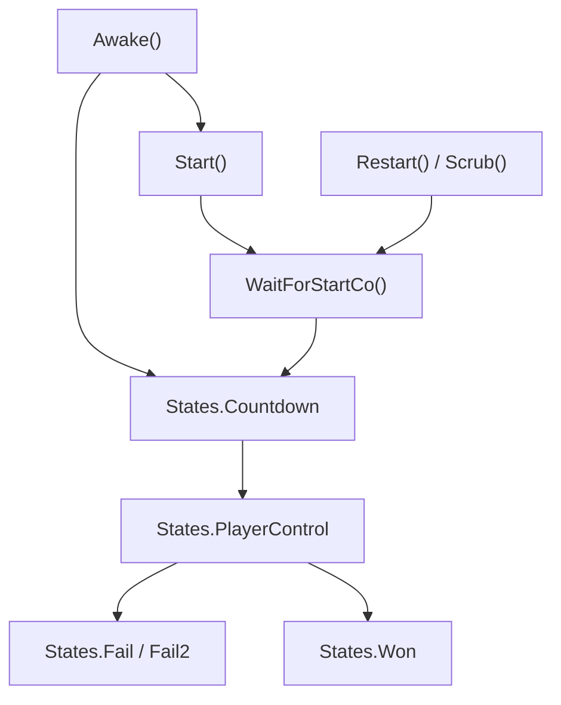

# scrController

## 基本信息

| 项目 | 内容 |
| --- | --- |
| 源码路径 | `7thRhythmSource/ADOFAi/scrController.cs` |
| 类型 | `public class scrController : StateBehaviour` |
| 命名空间 | 全局命名空间 |
| 状态枚举 | `States`，源码路径 `7thRhythmSource/ADOFAi/States.cs` |
| 主要职责 | 管理游戏场景主状态、暂停、输入、关卡进入、重开、传送门、死亡、胜利、画面和若干运行时全局变量。 |

`scrController` 是 ADOFAI 运行时的主控制器。它继承 `MonsterLove.StateMachine.StateBehaviour`，通过 `States` 枚举驱动 `Start`、`Countdown`、`Checkpoint`、`PlayerControl`、`Fail`、`Fail2` 和 `Won` 等状态。它也被 [ADOBase](/api/core/ADOBase.md) 的 `controller` 访问器作为全局入口使用。

## States

| 枚举值 | 作用 |
| --- | --- |
| `None` | 空状态。 |
| `Start` | 初始状态。 |
| `Countdown` | 倒计时阶段。 |
| `Checkpoint` | checkpoint 进入或恢复阶段。 |
| `PlayerControl` | 玩家可操作阶段。 |
| `Fail` | 第一段失败状态。 |
| `Fail2` | 第二段失败状态。 |
| `Won` | 胜利状态。 |

`scrController.deathStates` 是静态数组，包含 `States.Fail` 和 `States.Fail2`。

## 静态字段与单例

| 字段或属性 | 类型 | 作用 |
| --- | --- | --- |
| `volume` | `int` | 全局音量值，启动时由 `ADOStartup.SetSettings()` 写入 `Persistence.globalVolume`。 |
| `showDetailedResults` | `bool` | 是否显示详细结果，启动时由 `Persistence.showDetailedResults` 写入。 |
| `currentWorldString` | `string` | 当前世界字符串，`currentWorld` 通过它查 `GCNS.worldData`。 |
| `deaths` | `int` | 死亡次数计数。 |
| `checkpointsUsed` | `int` | 使用 checkpoint 的次数。 |
| `coopMode` | `bool` | 合作模式标记。 |
| `displayedMultiFingerHint` | `bool` | 多指提示是否已显示。 |
| `lastTimeStatsUploaded` | `float` | 最近上传 Steam 统计的时间。 |
| `instance` | `scrController` | 如果 `_instance` 为空，使用 `FindAnyObjectByType<scrController>()` 查找。 |
| `currentWorld` | `int` | `GCNS.worldData[currentWorldString].index`。 |

## 主要场景引用字段

| 字段 | 类型 | 作用 |
| --- | --- | --- |
| `background` | `GameObject` | 主背景对象。 |
| `lofiBackground` | `GameObject` | lofi 背景对象。 |
| `decorationManager` | `scrDecorationManager` | 装饰管理器引用。 |
| `camy` | `scrCamera` | 相机控制组件。 |
| `firstFloor` | `scrFloor` | 第一块地板。 |
| `pauseMenu` | `PauseMenu` | 暂停菜单。 |
| `errorMeter` | `scrHitErrorMeter` | 击打误差显示。 |
| `takeScreenshot` | `TakeScreenshot` | 截图组件。 |
| `creditsText` | `scrCreditsText` | 片尾文本组件。 |
| `dummyPlanets` | `List<PlanetRenderer>` | 多星体或占位星体渲染对象。 |
| `multiPlanetLines` | `List<LineRenderer>` | 多星体连线。 |
| `virtualAvatarPrefab` | `GameObject` | 虚拟 avatar 预制体。 |

## 运行时状态字段

| 字段 | 类型 | 作用 |
| --- | --- | --- |
| `d_speed` | `float` | 当前速度，`ADOBase.d_speed` 直接读写此字段。 |
| `levelName` | `string` | 当前关卡名。 |
| `currentState` | `States` | 每帧从 `stateMachine.GetState()` 写入。 |
| `currentSeqID` | `int` | 当前序列 ID，用于等待启动、重开和异步流程的有效性判断。 |
| `setupComplete` | `bool` | 初始化是否完成。 |
| `startedFromCheckpoint` | `bool` | 本次是否从 checkpoint 开始。 |
| `averageFrameTime` | `float` | 平均帧时间。 |
| `endLevelInfo` | `scrMistakesManager.EndLevelInfo` | 结算信息。 |
| `menuPhase` | `int` | 菜单阶段。 |
| `boothModeDebounceCounter` | `float` | booth 模式防抖计时。 |
| `responsive` | `bool` | 是否响应输入，默认真。 |
| `noFail` | `bool` | 无失败模式。 |
| `noFailInfiniteMargin` | `bool` | 无限判定边界的无失败模式。 |
| `levelWasSkipped` | `bool` | 关卡是否被跳过。 |
| `portalDestination` | `Portal` | 传送门目标，默认 `Portal.EndOfLevel`。 |
| `portalArguments` | `string` | 传送门参数。 |
| `currentFloorID` | `int` | 当前地板编号。 |
| `listBPM` | `List<Tuple<double, double>>` | BPM 列表。 |
| `lockInput` | `float` | 输入锁定剩余时间。 |
| `isCutscene` | `bool` | 当前是否为 cutscene。 |
| `isPuzzleRoom` | `bool` | 当前是否为 puzzle room。 |
| `canExitLevel` | `bool` | 是否允许退出关卡，默认真。 |

## 重要属性

| 属性 | 类型 | 行为 |
| --- | --- | --- |
| `planetarySystem` | `PlanetarySystem` | `playerOne.planetarySystem`。 |
| `mistakesManager` | `scrMistakesManager` | `playerManager.mistakesManager`。 |
| `chosenPlanet` | `scrPlanet` | `planetarySystem.chosenPlanet`。 |
| `playerManager` | `scrPlayerManager` | `scrPlayerManager.instance`。 |
| `playerOne` | `scrPlayer` | `playerManager.players[0]`。 |
| `tileSize` | `float` | `baseFloorDimensions.x * 2f`。 |
| `planetBlue`、`planetRed`、`planetGreen` | `scrPlanet` | 从 `planetarySystem` 读取对应星体。 |
| `audioPaused` | `bool` | 读写 `AudioListener.pause`。 |
| `paused` | `bool` | 写入 `_paused`，同时按暂停、选关、CLS、Gameplay 切换 `RDInput` mapping。 |

`baseFloorDimensions` 根据 `tileShape` 返回地板尺寸：`TileShape.Long` 使用 `scrFloor.LongDimensions`，`TileShape.Short` 使用 `scrFloor.ShortDimensions`，其他情况使用 `customFloorDimensions`。

## Awake 与初始设置

`Awake()` 是控制器初始化入口。源码片段显示它会处理 checkpoint、Unity Editor 自定义 checkpoint、恢复 checkpoint 进度、初始化错误计量器、设置 `paused = ADOBase.isLevelEditor`，并调用一系列设置方法。相关公开方法包括：

| 方法 | 行为 |
| --- | --- |
| `ResetInputEventFfx()` | 重置 `inputEventFfx` 数组。 |
| `UpdateVisualSettings()` | 更新视觉质量和视觉效果相关状态。 |
| `SetupImportantVariables()` | 设置重要运行时变量。 |
| `Awake_Rewind()` | 重绕或重开时的 Awake 辅助流程。 |

`Awake_Rewind()` 末尾会调用 `ChangeState(States.Start)`，把状态机切到初始状态。

## Start 与关卡开始

| 方法 | 行为 |
| --- | --- |
| `Start()` | Unity Start 生命周期入口。 |
| `WaitForStartCo(int seqID = 0, bool isRestart = false)` | 等待关卡开始的协程，包含 checkpoint、事件预处理、暂停 tween、UI 和倒计时相关流程。 |
| `Start_Rewind(int _currentSeqID = -1)` | 重绕或重开时重新开始，源码中会切到 `States.Countdown`。 |
| `OnMusicScheduled()` | 音乐排程后，根据条件切到 `States.Checkpoint` 或其他状态。 |

## Update 主循环

`Update()` 中会刷新 `currentState = (States)(object)base.stateMachine.GetState()`。同一文件中还定义了多个每帧辅助方法：

| 方法 | 行为 |
| --- | --- |
| `AnalyticsUpdate()` | 处理统计或分析更新，包含 Steam 统计上传节奏。 |
| `DebugUpdate()` | 处理调试输入和调试 HUD。 |
| `UpdateFreeroam()` | 处理 free roam 运行状态。 |
| `UpdateInput()` | 处理玩家输入。 |
| `UpdateLockInput()` | 更新输入锁定计时。 |
| `LateUpdate()` | Unity LateUpdate 生命周期入口。 |

`ProcessKeyInputs(ulong eventTick)` 是私有方法。源码显示它在 `paused` 为真时直接返回，因此暂停会阻断该输入处理路径。

## 暂停与输入映射

`paused` 属性 setter 会执行三件事：

| 步骤 | 行为 |
| --- | --- |
| 1 | 写入 `_paused`。 |
| 2 | 根据当前状态选择输入 mapping：暂停时为 `Pause`，选关为 `LevelSelect`，CLS 为 `CLS`，其他为 `Gameplay`。 |
| 3 | 调用 `RDInput.SetMapping(...)`。 |

切换暂停的方法片段显示它还会同步 `audioPaused`、`base.enabled` 和 `Time.timeScale`。暂停时 `audioPaused = true`，`Time.timeScale = 0f`；恢复时相反。

## 场景与关卡跳转

| 方法 | 行为 |
| --- | --- |
| `StartLoadingScene(WipeDirection wipeDirection = WipeDirection.StartsFromRight)` | 开始加载场景并触发转场。 |
| `EnterWorld(string worldOrLevel, bool speedTrial = false)` | 进入世界或世界内关卡。 |
| `EnterLevel(string worldAndLevel, bool speedTrial = false)` | 进入指定官方关卡。 |
| `LoadCustomWorld(string levelPath, bool skipToMain = false, string levelId = null, bool fromBundle = false)` | 加载自定义世界。 |
| `LoadCustomLevel(string levelPath, string levelId = null, bool fromBundle = false)` | 加载自定义关卡。 |
| `GoToNextLevel()` | 进入下一关。 |
| `GoToPrevLevel()` | 进入上一关。 |
| `QuitToMainMenu()` | 退出到主菜单。 |

这些方法是选关、官方关卡、自定义关卡和菜单返回之间的主要入口。具体加载细节后续会在场景流程专题继续展开。

## 关卡控制方法

| 方法 | 行为 |
| --- | --- |
| `BeatLevel()` | 节拍推进相关入口。 |
| `Scrub(int floorNum, bool forceDontStartMusicFourTilesBefore = false)` | 跳转到指定地板位置，并可控制是否提前播放音乐。 |
| `ScrubAdjacent(bool forward)` | 向前或向后 scrub。 |
| `Restart(bool fromBeginning = false)` | 重开关卡。 |
| `RestartProgress()` | 重置进度。 |
| `SetPracticeMode(bool practice)` | 切换练习模式。 |
| `SkipLevel()` | 跳过关卡。 |
| `SaveProgress(bool save)` | 调用 `scrMistakesManager.SaveCheckpointProgress(save)` 保存或清理 checkpoint 进度。 |

## 状态机方法

| 方法 | 状态 | 行为 |
| --- | --- | --- |
| `ChangeToStartState()` | `Start` | 调用 `ChangeState(States.Start)`。 |
| `Countdown_Update()` | `Countdown` | 倒计时结束时切到 `States.PlayerControl`。 |
| `Checkpoint_Enter()` | `Checkpoint` | checkpoint 状态进入。 |
| `Checkpoint_Update()` | `Checkpoint` | 满足条件后切到 `States.PlayerControl`。 |
| `Checkpoint_Exit()` | `Checkpoint` | checkpoint 状态退出。 |
| `PlayerControl_Enter()` | `PlayerControl` | 玩家控制状态进入，源码中会处理暂停 tween。 |
| `PlayerControl_Update()` | `PlayerControl` | 玩家控制状态更新。 |
| `Won_Enter()` | `Won` | 胜利状态进入。 |
| `Won_Update()` | `Won` | 胜利状态更新。 |
| `Fail2_Update()` | `Fail2` | 第二失败状态更新。 |

## 死亡、失败与胜利

| 方法 | 行为 |
| --- | --- |
| `OnLandOnPortal(scrPlanet planetThatWon, Portal portalDestination, string portalArguments)` | 玩家星体落上传送门时处理传送门目标和参数。 |
| `PortalTravelAction(Portal destination)` | 执行传送门目标动作。 |
| `OnPlayerDied(scrPlayer deadPlayer, bool overload = false, bool multipress = false, string failMessage = "", bool hitbox = false)` | 玩家死亡入口。 |
| `FailAction(bool overload = false, bool multipress = false, string failMessage = "", bool hitbox = false)` | 失败处理，源码中会切到 `States.Fail`。 |
| `Fail2Action()` | 第二段失败处理，源码中会切到 `States.Fail2`。 |

源码中 `OnLandOnPortal` 会在满足胜利条件时调用 `ChangeState(States.Won)`。

## 相机和显示辅助

| 方法 | 行为 |
| --- | --- |
| `ScreenShake(float duration, float strength)` | 屏幕震动。 |
| `MoveCameraToTile(scrFloor floor, scrFloor from, float fSecs, Ease ease, float zoom = -1f)` | 移动相机到地板。 |
| `MoveCameraToObject(GameObject o, float fSecs, Ease ease, float zoom = -1f)` | 移动相机到对象。 |
| `MoveCameraToPlayer(float fSecs, Ease ease, float zoom = -1f)` | 移动相机到玩家。 |
| `LevelNameTextAway()` | 隐藏或移走关卡名文本。 |
| `LevelNameTextRestore()` | 恢复关卡名文本。 |
| `EnableHallOfMirrors(bool homEnabled)` | 切换 Hall of Mirrors 标记。 |

## 生命周期关系

## 后续拆分

`scrController.cs` 文件体量很大。本页先覆盖字段分区、状态机、暂停、跳转和主生命周期。判定细节、输入处理、free roam、传送门、失败结算和 Steam 统计后续会在运行时系统专题继续展开，避免单页过长。
