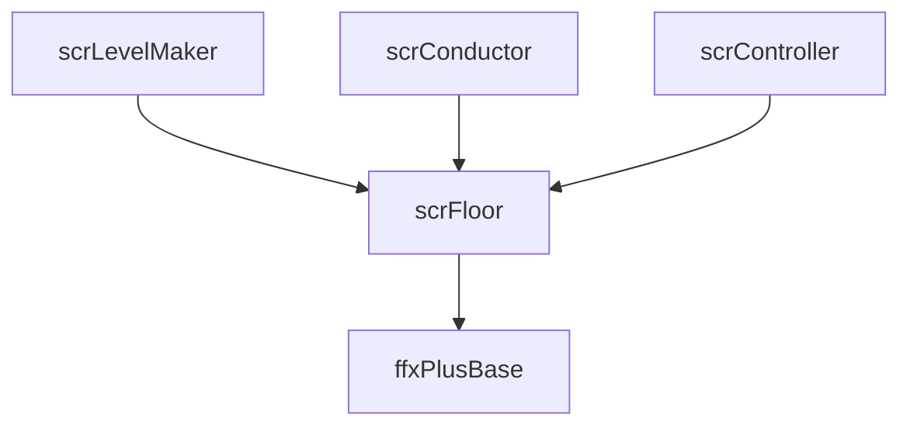

# scrFloor

## 基本信息

| 项目 | 内容 |
| --- | --- |
| 源码路径 | `7thRhythmSource/ADOFAi/scrFloor.cs` |
| 类型 | `public class scrFloor : ADOBase` |
| 命名空间 | 全局命名空间 |
| 主要职责 | 表示一块轨道地板，保存角度、时间、速度、图标、视觉样式、判定状态、条件效果、hold、free roam 和 VFX 组件列表。 |

`scrFloor` 是 ADOFAI 运行时轨道的基本单位。`scrLevelMaker` 生成 `listFloors` 后，`scnGame.ApplyEventsToFloors()` 会把 `LevelEvent` 解析成 `ffxPlusBase` 组件并挂到对应地板。`scrConductor.PropagateOnBeat()` 在游戏世界中也会遍历地板并调用 `OnBeat()`。

## 静态字段

| 字段 | 类型 | 作用 |
| --- | --- | --- |
| `LongDimensions` | `Vector2` | 长地板尺寸，`0.75 x 0.4125`。 |
| `ShortDimensions` | `Vector2` | 短地板尺寸，`0.5 x 0.413`。 |
| `ShaderProperty_Alpha` | `int` | `_Alpha` shader property id，由 `ADOStartup` 写入。 |
| `ShaderProperty_Color` | `int` | `_Color` shader property id，由 `ADOStartup` 写入。 |
| `randomOffsets` | `List<Vector4>` | 随机偏移列表。 |

## 渲染与图标字段

| 字段 | 类型 | 作用 |
| --- | --- | --- |
| `floorRenderer` | `FloorRenderer` | 地板渲染器抽象。 |
| `legacyFloorSpriteRenderer` | `SpriteRenderer` | 旧式 sprite renderer。 |
| `iconsprite` | `SpriteRenderer` | 地板图标 sprite。 |
| `outlineSprite` | `SpriteRenderer` | 图标描边 sprite。 |
| `topGlow`、`bottomGlow` | `SpriteRenderer` | 顶部与底部 glow。 |
| `disableGlow` | `bool` | 禁用 glow。 |
| `editorNumText` | `scrLetterPress` | 编辑器中的数字文本。 |

## 游戏属性字段

| 字段 | 类型 | 作用 |
| --- | --- | --- |
| `seqID` | `int` | 地板序号。 |
| `speed` | `float` | 当前地板速度倍率。 |
| `rotatecamera` | `float` | 相机旋转量。 |
| `isLandable` | `bool` | 是否可落地。 |
| `isCCW` | `bool` | 是否逆时针。 |
| `tapsNeeded` | `int` | 需要点击次数。 |
| `midSpin` | `bool` | 是否 midspin。 |
| `planetEase` | `Ease` | 星体旋转缓动。 |
| `planetEaseParts` | `int` | 旋转缓动分段。 |
| `planetEasePartBehavior` | `EasePartBehavior` | 分段行为。 |
| `holdLength` | `int` | hold 长度，默认 -1。 |
| `unstable`、`isSafe`、`stickToFloor`、`isFake` | `bool` | 运行时或事件写入的地板状态。 |
| `graySetSpeedIcon`、`redSwirl` | `bool` | 特殊图标或视觉标记。 |

## 角度与时间字段

| 字段或属性 | 类型 | 作用 |
| --- | --- | --- |
| `exitangle` | `double` | 离开当前地板时的角度。 |
| `entryangle` | `double` | 进入当前地板时的角度。 |
| `angleLength` | `double` | 当前地板对应的旋转角长度。 |
| `entryTime` | `double` | 进入当前地板的歌曲时间。 |
| `entryTimePitchAdj` | `double` | pitch 调整后的进入时间。 |
| `entryBeat` | `double` | 进入 beat。 |
| `entryTimeAfterExtraBeats` | `double` | `entryTime + conductor.crotchetAtStart * extraBeats / speed`。 |
| `prevfloor`、`nextfloor` | `scrFloor` | 前后地板引用。 |

## 事件与条件效果字段

| 字段 | 类型 | 作用 |
| --- | --- | --- |
| `plusEffects` | `List<ffxPlusBase>` | 挂在该地板上的运行时事件效果。 |
| `perfectEffects` | `HashSet<ffxPlusBase>` | Perfect 条件效果。 |
| `earlyPerfectEffects` | `HashSet<ffxPlusBase>` | 早 Perfect 条件效果。 |
| `latePerfectEffects` | `HashSet<ffxPlusBase>` | 晚 Perfect 条件效果。 |
| `veryEarlyEffects`、`veryLateEffects` | `HashSet<ffxPlusBase>` | Very early/late 条件效果。 |
| `tooEarlyEffects`、`tooLateEffects` | `HashSet<ffxPlusBase>` | Too early/late 条件效果。 |
| `lossEffects` | `HashSet<ffxPlusBase>` | 失败条件效果。 |
| `onCheckpointEffects` | `HashSet<ffxPlusBase>` | checkpoint 条件效果。 |
| `eventIcon` | `LevelEventType` | 地板显示的事件图标类型。 |
| `setHitsound`、`setGameSound` | `ffxSetHitsound` | hitsound 事件组件缓存。 |
| `targetDecorations` | `List<scrDecoration>` | 事件目标装饰列表。 |

## Hold 与 free roam 字段

| 字段 | 类型 | 作用 |
| --- | --- | --- |
| `holdGO` | `GameObject` | hold 渲染对象。 |
| `holdCompletion`、`holdCompletionEased` | `float` | hold 完成度。 |
| `holdRenderer` | `scrHoldRenderer` | hold 渲染器。 |
| `holdDistance` | `float` | hold 距离。 |
| `showHoldTiming` | `bool` | 是否显示 hold timing。 |
| `freeroam` | `bool` | 是否为 free roam 地板。 |
| `freeroamGenerated` | `bool` | free roam 是否已生成。 |
| `freeroamRegion` | `int` | free roam 区域编号。 |
| `freeroamFloors` | `List<scrFloor>` | 所属 free roam 地板列表。 |
| `extraBeats` | `float` | 额外 beat。 |
| `freeroamOffset`、`freeroamDimensions` | `Vector2` | free roam 偏移与尺寸。 |
| `freeroamSoundOnBeat`、`freeroamSoundOffBeat` | `HitSound` | free roam on/off beat 声音。 |

## 判定与物理字段

| 字段 | 类型 | 作用 |
| --- | --- | --- |
| `coll` | `Collider2D` | 地板碰撞体。 |
| `collShouldBeEnabled` | `bool` | 碰撞体目标启用状态。 |
| `countdownTicks` | `int` | 当前地板倒计时 tick 数。 |
| `marginScale` | `double` | 判定边界倍率。 |
| `grade` | `HitMargin` | 当前判定结果。 |
| `radiusScale` | `float` | 半径倍率。 |
| `isWarning` | `bool` | 是否为 warning 地板。 |
| `auto` | `bool` | 是否自动。 |
| `hideJudgment`、`hideIcon` | `bool` | 隐藏判定文本或图标。 |
| `numPlanets` | `int` | 当前地板星体数量，默认 2。 |

## 生命周期

| 方法 | 行为 |
| --- | --- |
| `Awake()` | 缓存 controller、conductor、常量、VFX；初始化位置旋转；确保 `floorRenderer`；缓存 `ffxSetHitsound`；创建 topGlow；按 controller 设置 `stickToFloor`；把自己加入 conductor 的 `onBeats`。 |
| `Start()` | 设置自定义世界材质、更新 glow sorting order、检查 portal sprite。 |
| `Reset()` | 把速度、图标、角度、时间、事件效果、hold、free roam、判定、视觉状态和缓存字段恢复默认，并重新调用 `Awake()`、`Start()`。 |
| `Update()` | 处理地板每帧视觉、透明度、glow、collider、hold 和状态刷新。 |
| `LateUpdate()` | 处理后置更新。 |
| `OnBecameVisible()` / `OnBecameInvisible()` | 处理可见性变化。 |

## 常用方法

| 方法 | 行为 |
| --- | --- |
| `CheckPortalSprite()` | 根据 `checkIsPortal` 设置 portal 图标。 |
| `UpdateIconSprite(bool resetToDefault = true)` | 刷新地板图标 sprite。 |
| `SetIconSprite(Sprite sprite)` | 设置图标 sprite。 |
| `SetIconOutlineSprite(Sprite sprite)` | 设置图标描边 sprite。 |
| `SetIconFlipped(bool flipped)` | 设置图标翻转。 |
| `SetIconColor(Color color)` | 设置图标颜色。 |
| `SetIconAngle(float radians)` | 设置图标角度。 |
| `SetIconScale(float scale)` | 设置图标缩放。 |
| `UpdateCommentGlow(bool enabled)` | 切换评论 glow。 |
| `LightUp(HitMargin hitmargin = HitMargin.Perfect)` | 点亮地板并记录判定。 |
| `SetTileColor(Color color)` | 设置地板颜色。 |
| `SetToRandomColor()` | 设置随机颜色。 |
| `SpawnPortalParticles()` | 生成 portal 粒子。 |
| `UpdateAngle(bool rotate = true)` | 根据地板方向更新角度和 sprite。 |
| `SetTrackStyle(TrackStyle style, bool initial = false, Color? customShadowColor = null)` | 设置轨道风格。 |
| `ForceSnap()` | 强制地板位置、旋转、缩放贴合当前状态。 |
| `SetColor(Color color)` | 设置颜色。 |
| `SetSortingOrder(int order)` | 设置渲染排序。 |
| `ColorFloor(...)` | 按颜色类型、缓动、脉冲参数为地板上色。 |
| `SetRotation(float angle)` | 设置旋转。 |
| `SetOpacity(float opacity)` | 设置透明度。 |
| `ToggleCollider(bool collEn)` | 切换碰撞体。 |
| `ResetToLevelStart()` | 把地板恢复到关卡开始状态。 |
| `UpdateMultitapTexture()` | 更新 multitap 纹理。 |

## 关系图

## 后续拆分

本页记录 `scrFloor` 的字段和生命周期骨架。阶段 4 会继续拆分判定、hold、free roam、多星体和渲染更新；阶段 5 会从 `plusEffects` 和条件集合继续追踪事件效果执行。
