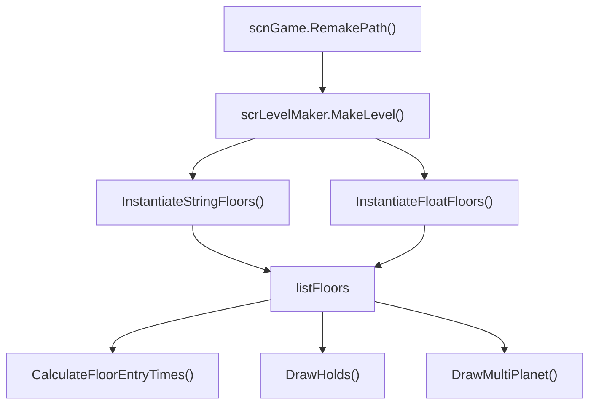

# scrLevelMaker

## 基本信息

| 项目 | 内容 |
| --- | --- |
| 源码路径 | `7thRhythmSource/ADOFAi/scrLevelMaker.cs` |
| 类型 | `public class scrLevelMaker : ADOBase` |
| 辅助组件 | `scrLevelMaker2`，源码路径 `7thRhythmSource/ADOFAi/scrLevelMaker2.cs` |
| 主要职责 | 把 `LevelData.pathData` 或 `LevelData.angleData` 转换为 `scrFloor` 列表，计算角度长度与 entry time，并绘制 hold、free roam 和多星体辅助对象。 |

`scrLevelMaker` 是路径生成器。它由 [scnGame](/api/core/scnGame.md) 的 `RemakePath()` 调用：先把 `levelData.pathData`、`angleData`、`isOldLevel` 写入本类，再调用 `MakeLevel()` 生成或复用 `scrFloor` 对象。

## 角度字符常量

| 常量 | 字符 | 角度含义 |
| --- | --- | --- |
| `Angle0` | `R` | 0 度方向。 |
| `Angle45` | `E` | 45 度方向。 |
| `Angle60` | `T` | 60 度方向。 |
| `Angle90` | `U` | 90 度方向。 |
| `Angle135` | `Q` | 135 度方向。 |
| `Angle150` | `G` | 150 度方向。 |
| `Angle180` | `L` | 180 度方向。 |
| `Angle225` | `Z` | 225 度方向。 |
| `Angle240` | `F` | 240 度方向。 |
| `Angle270` | `D` | 270 度方向。 |
| `Angle300` | `M` | 300 度方向。 |
| `Angle315` | `C` | 315 度方向。 |
| `Angle330` | `B` | 330 度方向。 |
| `AngleMidspin` | `!` | midspin 标记。 |

源码还定义了 15、30、75、105、120、165、195、210、255、285、345 度以及增量角字符。`midSpinAngle` 为 `999f`，`sAngle` 为 `-999f`。

## 主要字段

| 字段 | 类型 | 作用 |
| --- | --- | --- |
| `spriteFloor` | `GameObject` | 旧式 sprite 地板预制体。 |
| `meshFloor` | `GameObject` | 新式 mesh 地板预制体。 |
| `caption` | `string` | 关卡标题文本。 |
| `addoffset` | `float` | 歌曲偏移。 |
| `lockChanges` | `bool` | 锁定变更标记。 |
| `isgameworld` | `bool` | 是否为游戏世界，默认真。 |
| `isOldLevel` | `bool` | 是否使用旧式字符串路径生成。 |
| `useInitialTrackStyle` | `bool` | 是否使用初始轨道风格。 |
| `hideDifficultyUI` | `bool` | 是否隐藏难度 UI。 |
| `leveldata` | `string` | 旧式路径字符串。 |
| `floorAngles` | `float[]` | 新式角度数组。 |
| `listFloors` | `List<scrFloor>` | 当前生成的地板列表。 |
| `listFreeroam` | `List<FreeroamArea>` | free roam 区域列表。 |
| `listFreeroamStartTiles` | `List<scrFloor>` | free roam 起点地板。 |
| `bpm_forUnityUseOnly`、`pitch_forUnityUseOnly`、`volume_forUnityUseOnly` | `float` | Unity 场景中复制到 conductor 的参数。 |
| `holdContainer` | `GameObject` | hold 渲染对象容器。 |
| `lm2` | `scrLevelMaker2` | 地板 sprite、颜色、hold texture 和辅助数组。 |

## 单例与初始化

`instance` 属性在运行时会比较当前 active scene handle 与 `sceneInstanceID`。当 `_instance` 为空且需要刷新时，它使用 `FindFirstObjectByType<scrLevelMaker>()` 查找实例并调用 `Init()`。

| 方法 | 行为 |
| --- | --- |
| `Awake()` | 写入 `_instance = this` 并调用 `Init()`。 |
| `Init()` | 读取同对象上的 `scrLevelMaker2`。 |
| `FixListFloors()` | 查找场景中所有 `scrFloor`，按 `seqID` 排序写入 `listFloors`，并同步 `lm2.listFloorClone`。 |
| `CopyProperties()` | 把本类的 offset、BPM、pitch、volume、tile shape 和 caption 写入 conductor 与 controller。 |

## MakeLevel

`MakeLevel()` 根据 `isOldLevel` 选择路径生成方式：

| 条件 | 方法 |
| --- | --- |
| `isOldLevel == true` | `InstantiateStringFloors()` |
| `isOldLevel == false` | `InstantiateFloatFloors()` |

生成后，它会遍历 `listFloors`：

| 步骤 | 行为 |
| --- | --- |
| 1 | `styleNum = 0`。 |
| 2 | 游戏世界中调用 `scrFloor.UpdateAngle()`。 |
| 3 | 用 `lm2.tilecolor` 设置地板颜色。 |
| 4 | 按列表倒序计算 sorting order。 |
| 5 | 保存 `startPos`、`startRot`、`tweenRot` 和 `offsetPos`。 |
| 6 | 如果是 portal 且运行中，调用 `SpawnPortalParticles()`。 |

如果 `LevelData.shouldTryMigrate` 为真且编辑器关卡版本为 9，源码还会遍历编辑器的 `levelEvents`，针对 `Pause` 事件做一次 duration 迁移。

## 旧式字符串路径

`InstantiateStringFloors()` 读取 `leveldata` 字符串。它会创建或复用地板对象，把第 0 块地板放在原点，并把每个路径字符转换成下一块地板的位置和角度。

| 字符类别 | 行为 |
| --- | --- |
| 方向字符 | 转成弧度方向，并生成下一块地板。 |
| `!` | 标记前一块地板为 `midSpin`。 |
| `S`、`X`、`O`、`P` | 分别设置速度 0.25、0.5、2、4。 |
| `/` | 切换顺/逆时针方向。 |
| `>`、`*`、`_`、`<`、`%`、`-` | 设置兔子或蜗牛图标，并按倍率调整速度。 |
| `[角度]` 或 `[*角度]` | 编辑器路径中解析自定义角度，带 `*` 时使用相对角度。 |

最后一块地板在游戏世界中会被设置为 portal，`levelnumber = Portal.EndOfLevel`。

## 新式角度数组路径

`InstantiateFloatFloors()` 读取 `floorAngles`。它使用 `meshFloor` 生成地板，用数组中的角度计算下一块地板位置，并在最后一块地板设置 portal。该路径是当前 `.adofai` 数据模型中更直接的角度表示。

## 时间计算

| 方法 | 行为 |
| --- | --- |
| `CalculateFloorAngleLengths()` | 遍历 `listFloors` 计算每块地板的角度长度。 |
| `CalculateSingleFloorAngleLength(scrFloor cf)` | 设置 `prevfloor`，根据 entry/exit angle、方向和中旋计算单块地板 `angleLength`。 |
| `CalculateFloorEntryTimes()` | 根据 `scrConductor` 的 BPM、pitch、每块地板 speed、angleLength、pause 和 extra beats 计算 `entryTime` 与 `entryTimePitchAdj`。 |

[scnGame](/api/core/scnGame.md) 在 `ApplyEventsToFloors()` 中会先调用 `CalculateSingleFloorAngleLength()`，处理核心事件后再调用 `CalculateFloorEntryTimes()`。

## 转换工具

| 方法 | 行为 |
| --- | --- |
| `OldToNewAngle(double oldAngle)` | 把旧角度转换到新角度表达。 |
| `GetAngleFromFloorCharDirectionWithCheck(char direction, out bool exists)` | 把路径字符转角度，并返回字符是否存在映射。 |
| `GetAngleFromFloorCharDirection(char direction)` | 把路径字符转角度。 |
| `StringToAngleArray(string levelStr)` | 把旧式路径字符串转成角度数组。 |
| `StringToAngle(char path)` | 单字符转角度。 |

## Free roam、hold 与多星体

| 方法 | 行为 |
| --- | --- |
| `ClearFreeroam()` | 清理 free roam 数据。 |
| `DrawFreeroam()` | 遍历地板绘制 free roam 区域。 |
| `MakeFreeroamGrid(scrFloor floorComp)` | 根据地板生成 free roam 网格。 |
| `ColorFreeroam()` | 为 free roam 地板上色。 |
| `DrawHolds(bool unfillHolds = false)` | 根据地板 hold 数据生成 hold 渲染对象。 |
| `DrawMultiPlanet(bool forcePlaying = false)` | 根据地板 `numPlanets` 生成或刷新多星体显示。 |
| `RefreshAngles()` | 遍历地板刷新角度。 |

## scrLevelMaker2

`scrLevelMaker2` 是同对象上的辅助组件，保存地板 sprite 数组、tile 颜色、`listFloorClone`、hold texture 和 free roam sprite。`scrLevelMaker` 生成地板时会读取 `lm2.BigTiles`、`lm2.tilecolor` 和各类 sprite 数组。

## 调用关系

