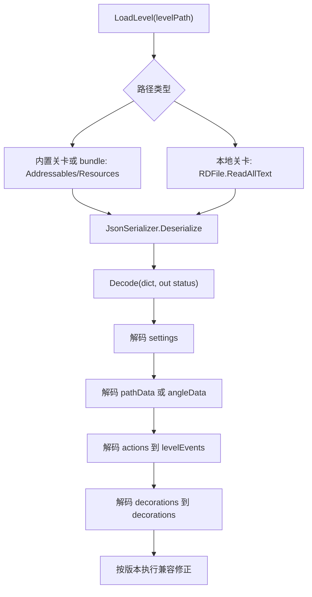

# LevelData

## 基本信息

| 项目 | 内容 |
| --- | --- |
| 源码路径 | `7thRhythmSource/ADOFAi/ADOFAI/LevelData.cs` |
| 命名空间 | `ADOFAI` |
| 类型 | `class LevelData` |
| 特性 | `[Serializable]` |
| 主要职责 | 保存 `.adofai` 关卡的路径、角度、事件、装饰和全局 settings，并负责关卡文件的读取、编码、解码和复制。 |

`LevelData` 是 ADOFAI 自定义关卡数据的核心容器。运行时的 `scnGame` 会持有 `levelData`，编辑器的 `scnEditor` 也围绕同一数据结构执行打开、保存、选择、撤销和面板回写。它本身不负责生成地板对象，路径生成交给 `scrLevelMaker`，事件具体效果交给 `ffx*Plus`、`ffx*` 和 `ADOFAI.FloorFX` 类族。

## 字段

| 名称 | 类型 | 默认值或初始化 | 作用 |
| --- | --- | --- | --- |
| `_hash` | `string` | 私有缓存 | 缓存由作者、艺术家和歌曲名计算出的关卡哈希。 |
| `pathData` | `string` | `Setup()` 中设为 `RRRRRRRRRR` | 旧式路径字符串。旧关卡或旧风格运行时会使用它。 |
| `angleData` | `List<float>` | `Setup()` 中创建 10 个角度 | 新式角度数组。非旧式关卡优先使用它描述每块地板角度。 |
| `levelEvents` | `EventsArray<LevelEvent>` | `new EventsArray<LevelEvent>()` | 普通事件数组，对应 `.adofai` 文件中的 `actions`。 |
| `decorations` | `DecorationsArray<LevelEvent>` | `new DecorationsArray<LevelEvent>()` | 装饰事件数组，对应 `.adofai` 文件中的 `decorations`。 |
| `songSettings` | `LevelEvent` | `Setup()` 创建 | 歌曲设置事件，提供 BPM、音频文件、音量、偏移等属性。 |
| `levelSettings` | `LevelEvent` | `Setup()` 创建 | 关卡设置事件，提供艺术家、歌名、作者、预览图和难度等属性。 |
| `trackSettings` | `LevelEvent` | `Setup()` 创建 | 轨道设置事件，提供轨道颜色、纹理、消失动画和显示范围等属性。 |
| `backgroundSettings` | `LevelEvent` | `Setup()` 创建 | 背景设置事件，提供背景颜色、图片、平铺、默认背景形状等属性。 |
| `cameraSettings` | `LevelEvent` | `Setup()` 创建 | 相机设置事件，提供初始相机参考、位置、旋转、缩放和低特效开关。 |
| `miscSettings` | `LevelEvent` | `Setup()` 创建 | 杂项设置事件，提供视频、地板图标描边、星球缓动和默认文本颜色等属性。 |
| `eventSettings` | `LevelEvent` | `Setup()` 创建 | 事件设置元对象。 |
| `decorationSettings` | `LevelEvent` | `Setup()` 创建 | 装饰设置元对象。 |
| `version` | `int` | 解码时读取 | `.adofai` 文件版本。当前编码写入版本 `18`。 |
| `legacyFlash` | `bool` | 解码时按版本计算 | 旧版闪烁兼容标记。 |
| `legacyCamRelativeTo` | `bool` | 解码时按版本计算 | 旧版相机参考兼容标记。 |
| `isOldLevel` | `bool` | `Setup()` 可由 `scnGame.forceOldLevelStyle` 设置 | 控制是否使用旧式路径行为。 |
| `oldCameraFollowStyle` | `bool` | 字段声明默认值 | 旧版相机跟随兼容标记。 |
| `legacyTween` | `bool` | 解码时按版本计算 | 旧版缓动兼容标记。 |
| `disableV15Features` | `bool` | 解码时按版本计算 | 低于 15 版本关卡禁用新版特性。 |
| `shouldTryMigrate` | `static bool` | 静态字段 | `LoadLevel` 成功解码后置为 `true`。 |
| `_requiredDLC` | `DLCManager[]` | 私有字段 | `RefreshRequiredDLC()` 根据事件需求刷新。 |

8 个 settings 字段被 `[NonSerialized]` 标记，它们不是直接由 JSON 字段反序列化成字段，而是通过 `Decode()` 将 `settings` 字典解码进对应的 `LevelEvent`。

## 属性

### 聚合属性

| 名称 | 类型 | 读写 | 作用 |
| --- | --- | --- | --- |
| `Hash` | `string` | 只读 | 用 `author + artist + song` 计算 MD5，并缓存到 `_hash`。 |
| `settings` | `LevelEvent[]` | 只读 | 以固定顺序返回 8 个 settings 事件：歌曲、关卡、轨道、背景、相机、杂项、事件、装饰。 |
| `requiredDLC` | `DLCManager[]` | 只读 | 返回 `_requiredDLC`。 |
| `fullCaption` | `string` | 只读 | 返回移除富文本标签后的 `fullCaptionTagged`。 |
| `fullCaptionTagged` | `string` | 只读 | 当歌曲名为空返回空字符串；艺术家为空返回歌曲名；否则返回 `艺术家 - 歌曲名`，并处理以括号结尾的艺术家署名。 |

### 关卡与歌曲属性

| 名称 | 来源 settings | 作用 |
| --- | --- | --- |
| `artist`、`song`、`author` | `levelSettings` | 关卡展示用的艺术家、歌曲名和作者。 |
| `previewImage`、`previewIcon`、`previewIconColor` | `levelSettings` | 关卡预览图、预览图标和图标颜色。 |
| `previewSongStart`、`previewSongDuration` | `levelSettings` | 关卡选择或预览时使用的歌曲片段范围。 |
| `seizureWarning`、`levelDesc`、`levelTags` | `levelSettings` | 光敏警告、描述和标签。 |
| `artistPermission`、`artistLinks`、`difficulty` | `levelSettings` | 艺术家授权信息、链接和难度。 |
| `songFilename`、`bpm`、`volume`、`pitch`、`offset` | `songSettings` | 音频文件、BPM、音量、音高和偏移。 |
| `hitsound`、`hitsoundVolume` | `songSettings` | 命中音类型和音量。 |
| `separateCountdownTime`、`countdownTicks` | `songSettings` | 倒计时分离时间和倒计时节拍数。 |

这些属性通过 `LevelEvent` 索引器读取或写入 settings 事件的属性字典。例如 `artist` 实际读写 `levelSettings["artist"]`，`bpm` 实际读取 `songSettings["bpm"]`。

### 轨道、背景、相机与杂项属性

| 名称 | 来源 settings | 作用 |
| --- | --- | --- |
| `trackColorType`、`trackColor`、`secondaryTrackColor`、`trackShadowColor` | `trackSettings` | 控制轨道颜色模式、主色、副色和阴影色。 |
| `trackColorAnimDuration`、`trackColorPulse`、`trackPulseLength` | `trackSettings` | 控制轨道颜色动画和脉冲。 |
| `trackStyle`、`trackTextureScale`、`trackGlowIntensity`、`tileShape` | `trackSettings` | 控制轨道样式、纹理缩放、发光强度和地板形状。 |
| `trackTexture` | `trackSettings` | 从关卡目录加载轨道纹理并设置 `TextureWrapMode.Repeat`。 |
| `trackAnimation`、`trackDisappearAnimation`、`trackBeatsAhead`、`trackBeatsBehind` | `trackSettings` | 控制轨道出现、消失和显示节拍范围。 |
| `backgroundColor`、`bgImage`、`bgImageColor` | `backgroundSettings` | 控制背景底色、背景图和背景图颜色。 |
| `bgParallax`、`bgTiling`、`bgLooping`、`bgFitScreen`、`bgLockRot`、`bgSmoothing` | `backgroundSettings` | 控制背景图视差、平铺、循环、适配、旋转锁定和抗锯齿。 |
| `bgShowDefaultBGIfNoImage`、`bgShowDefaultBGTile`、`bgDefaultBGTileColor` | `backgroundSettings` | 控制默认背景地板的显示与颜色。 |
| `showBGShape`、`bgShapeType`、`bgDefaultBGShapeColor`、`scalingRatio` | `backgroundSettings` | 控制默认背景形状和缩放比例。 |
| `camRelativeTo`、`camPosition`、`camRotation`、`camZoom` | `cameraSettings` | 控制初始相机参考对象、位置、旋转和缩放。 |
| `pulseCamOnLandingFloor`、`camEnabledOnLowVFX` | `cameraSettings` | 控制落地时相机脉冲和低特效下初始相机是否启用。 |
| `bgVideo`、`floorIconOutlines`、`stickToFloors` | `miscSettings` | 控制背景视频、地板图标描边和星球贴地行为。 |
| `planetEase`、`planetEaseParts`、`planetEasePartBehavior` | `miscSettings` | 控制星球缓动和分段行为。 |
| `defaultTextColor`、`defaultTextShadowColor` | `miscSettings` | 控制文本事件默认颜色和阴影颜色。 |

## 方法

| 签名 | 主要行为 |
| --- | --- |
| `static string GetCustomLevelName(string path)` | 读取关卡文件文本，解析 JSON 的 `settings`，提取 `song` 和 `artist`，并返回移除富文本标签后的显示名。 |
| `LevelData(bool setup = true)` | 构造关卡数据；`setup` 为 `true` 时调用 `Setup()` 创建默认路径和 settings。 |
| `void Setup()` | 初始化 10 块默认路径、旧式路径字符串和 8 个 settings `LevelEvent`。 |
| `static LevelData LoadLevel(string levelPath, out LoadResult status)` | 根据路径类型读取内置关卡、bundle 关卡或本地文件，反序列化 JSON 后调用 `Decode()`。 |
| `string Encode()` | 将 `EncodeToDictionary()` 的结果序列化为格式化 JSON，使用自定义 `LevelArrayConverter`。 |
| `Dictionary<string, object> EncodeToDictionary()` | 生成 `.adofai` 字典：写入 `pathData` 或 `angleData`、`settings`、`actions` 和 `decorations`。 |
| `void Decode(Dictionary<string, object> dict, out LoadResult status)` | 从 JSON 字典恢复版本、settings、路径、事件和装饰，并执行旧版本兼容处理。 |
| `LevelData Copy()` | 深复制路径、角度、兼容标记、事件、装饰和 8 个 settings 事件。 |
| `void RefreshRequiredDLC()` | 扫描 `levelEvents`，当存在需要 Taro DLC 的事件时把 `NeoCosmosManager.instance` 写入 `_requiredDLC`。 |
| `List<string> GetMissingParams()` | 检查关卡基础信息，缺失艺术家、歌曲、作者或预览图时返回对应本地化键。 |

## 读取与解码流程

`Decode()` 会先读取 `settings.version`。版本大于 18 时返回 `FutureVersion`；运行中检测到必需外部依赖或 DLC 不满足时会返回对应 `LoadResult`。版本 7 的旧文件会在 `LoadLevel()` 中把文本里的 `"enabled"` 替换成 `"active"` 后再解码一次。

## 编码流程

`EncodeToDictionary()` 写出的结构与 `.adofai` 文件对应：

| 字段 | 来源 |
| --- | --- |
| `pathData` 或 `angleData` | 取决于 `isOldLevel`。旧式关卡写 `pathData`，新式关卡写 `angleData`。 |
| `settings` | 写入版本 18、6 个主要 settings 事件和兼容标记。 |
| `actions` | 从 `levelEvents` 中筛选 `active` 事件，按 `floor` 排序后调用 `LevelEvent.Encode()`。 |
| `decorations` | 从 `decorations` 中筛选 `active` 装饰，调用 `LevelEvent.Encode()`。 |

编码只保存活动事件；被禁用的事件属性是否写入由 `LevelEvent.Encode()` 根据属性元数据决定。

## 版本兼容

`Decode()` 包含多段旧版本迁移逻辑：

| 版本条件 | 行为 |
| --- | --- |
| `< 4` | `legacyFlash` 设为 `true`。 |
| `< 5` | `isOldLevel` 设为 `true`。 |
| `< 11` | `legacyCamRelativeTo` 设为 `true`。 |
| `< 14` | `legacyTween` 设为 `true`。 |
| `< 15` | `disableV15Features` 设为 `true`。 |
| `9..16` | 根据 `Twirl`、`MultiPlanet`、`Hold`、`Pause`、`FreeRoam` 事件重算部分暂停和自由移动时长。 |

`9..16` 的迁移会构造 `MinimizedFloorData` 列表，结合路径角度、逆向旋转、多星体和 hold 长度计算每块地板的角度长度。随后它会修正 `Pause.duration`，并把部分 `FreeRoam.duration` 的小数余量合并到已有暂停事件或新增一个 `Pause` 事件。

## 相关类型

| 类型 | 关系 |
| --- | --- |
| [LevelEvent](/api/data-models/LevelEvent.md) | `LevelData` 的 settings、actions 和 decorations 都用 `LevelEvent` 表示。 |
| [scnGame](/api/core/scnGame.md) | 持有运行时 `LevelData`，并根据它重建路径、加载素材和应用事件。 |
| [scrLevelMaker](/api/core/scrLevelMaker.md) | 使用 `pathData` 或 `angleData` 生成地板列表。 |
| [scrFloor](/api/core/scrFloor.md) | 运行时地板会接收与自身 floor 相关的事件效果。 |
| `EventsArray<T>` | 普通事件列表容器。 |
| `DecorationsArray<T>` | 装饰事件列表容器，新增或插入装饰时会通知编辑器装饰列表刷新。 |

