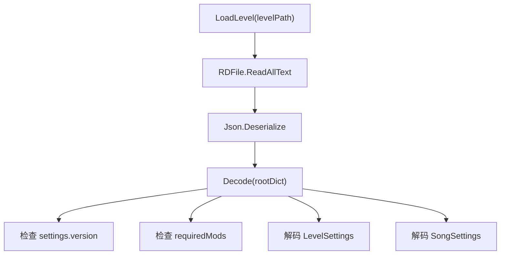

# LevelDataCLS

## 基本信息

| 项目 | 内容 |
| --- | --- |
| 源码路径 | `7thRhythmSource/ADOFAi/ADOFAI/LevelDataCLS.cs` |
| 命名空间 | `ADOFAI` |
| 类型 | `class LevelDataCLS : GenericDataCLS` |
| 主要职责 | 为自定义关卡选择界面提供轻量关卡数据，只读取关卡 settings，不解析路径、事件和装饰。 |

`LevelDataCLS` 和 [LevelData](/api/data-models/LevelData.md) 的用途不同。`LevelData` 是完整关卡数据，负责 `.adofai` 运行和编辑；`LevelDataCLS` 是 CLS 关卡选择使用的摘要数据，只需要标题、作者、预览图、标签、难度、DLC 需求和歌曲文件等信息。

## 继承关系

| 类型 | 关系 |
| --- | --- |
| `GenericDataCLS` | 抽象基类，定义关卡选择条目需要的标题、艺术家、作者、描述、难度、预览图、图标和标签属性。 |
| `LevelDataCLS` | 表示一个关卡条目。 |
| `FolderDataCLS` | `GenericDataCLS` 的另一个分支，表示文件夹条目。 |

`GenericDataCLS` 还提供 `isLevel`、`isFolder`、`level`、`folder` 和 `Hash`。`Hash` 使用 `author + artist + title` 计算 MD5。

## 字段

| 名称 | 类型 | 默认值或初始化 | 作用 |
| --- | --- | --- | --- |
| `songSettings` | `LevelEvent` | 构造函数创建 | 只读取歌曲 settings。 |
| `levelSettings` | `LevelEvent` | 构造函数创建 | 只读取关卡 settings。 |
| `workshopTags` | `string[]` | `new string[0]` | 额外 Workshop 标签，用于 DLC 需求判断。 |

## 属性

| 名称 | 类型 | 来源 | 作用 |
| --- | --- | --- | --- |
| `artist` | `string` | `levelSettings["artist"]` | 艺术家。 |
| `title` | `string` | `levelSettings["song"]` | 歌曲标题。 |
| `author` | `string` | `levelSettings["author"]` | 关卡作者。 |
| `previewImage` | `string` | `levelSettings["previewImage"]` | 预览图路径。 |
| `previewIcon` | `string` | `levelSettings["previewIcon"]` | 预览图标。 |
| `previewIconColor` | `Color` | `levelSettings.GetColor("previewIconColor")` | 预览图标颜色。 |
| `previewSongStart` | `int` | `levelSettings["previewSongStart"]` | 预览音乐起点。 |
| `previewSongDuration` | `int` | `levelSettings["previewSongDuration"]` | 预览音乐时长。 |
| `seizureWarning` | `bool` | `levelSettings["seizureWarning"]` | 光敏警告。 |
| `description` | `string` | `levelSettings["levelDesc"]` | 关卡描述。 |
| `artistLinks` | `string` | `levelSettings["artistLinks"]` | 艺术家链接。 |
| `speedTrialAim` | `float` | `levelSettings["speedTrialAim"]` | 速通目标。 |
| `difficulty` | `int` | `levelSettings["difficulty"]` | 难度。 |
| `tags` | `string[]` | `levelSettings["levelTags"]` | 将逗号标签拆成数组。 |
| `requiredDLCs` | `DLCManager[]` | `tags`、`workshopTags` | 根据 DLC 管理器的 `steamWorkshopTag` 匹配所需 DLC。 |
| `songFilename` | `string` | `songSettings["songFilename"]` | 歌曲文件名，可读写。 |
| `volume` | `int` | `songSettings["volume"]` | 歌曲音量。 |
| `loadResult` | `LoadResult` | 私有 setter | 保存最近一次解码结果。 |

## 方法

| 签名 | 行为 |
| --- | --- |
| `LevelDataCLS()` | 从 `GCS.settingsInfo` 取 `SongSettings` 和 `LevelSettings` 元数据，创建两个 settings `LevelEvent`。 |
| `bool LoadLevel(string levelPath)` | 读取本地关卡文件文本，使用 `GDMiniJSON.Json.Deserialize` 解析根字典，成功后调用 `Decode()`。 |
| `bool Decode(Dictionary<string, object> rootDict)` | 读取 `settings` 字典，检查版本和必需外部依赖，然后只解码 `LevelSettings` 与 `SongSettings`。 |

## 解码边界

`LevelDataCLS.Decode()` 不读取 `pathData`、`angleData`、`actions` 或 `decorations`。它只服务关卡列表展示，因此比完整的 `LevelData.Decode()` 更轻。

## 相关类型

| 类型 | 关系 |
| --- | --- |
| [LevelData](/api/data-models/LevelData.md) | 完整关卡数据，与 `LevelDataCLS` 的轻量摘要用途不同。 |
| [LevelEvent](/api/data-models/LevelEvent.md) | `songSettings` 和 `levelSettings` 都是 `LevelEvent`。 |
| [读取结果与序列化](/api/data-models/serialization-validation.md) | 说明 `LoadResult`、`LevelArrayConverter` 和当前空校验类。 |
| `scnCLS` | 关卡选择场景会使用 `LevelDataCLS` 读取和展示自定义关卡条目。 |

