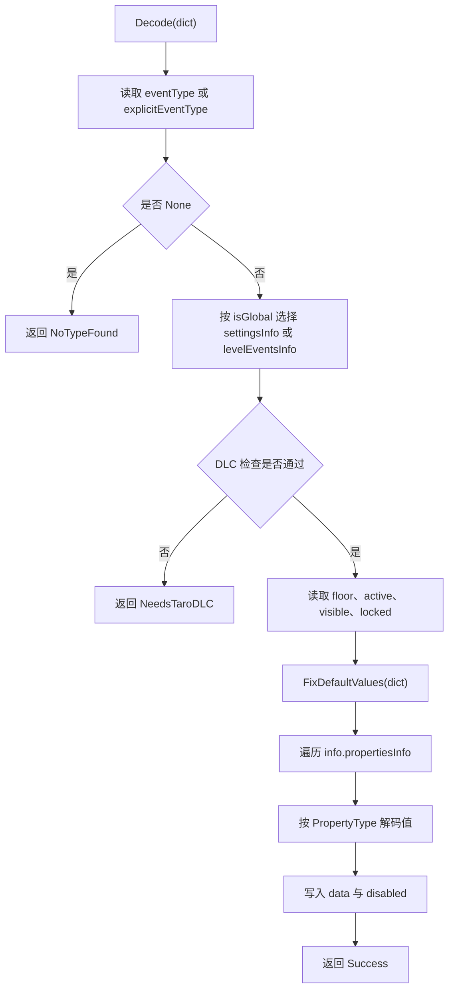

# LevelEvent

## 基本信息

| 项目 | 内容 |
| --- | --- |
| 源码路径 | `7thRhythmSource/ADOFAi/ADOFAI/LevelEvent.cs` |
| 命名空间 | `ADOFAI` |
| 类型 | `class LevelEvent` |
| 主要职责 | 保存单个关卡事件或 settings 事件的类型、楼层、属性值、禁用状态和元数据，并提供解码、编码、复制与属性读取方法。 |

ADOFAI 的事件不是每种事件一个数据类，而是用统一的 `LevelEvent` 表示。事件的具体字段由 `LevelEventInfo.propertiesInfo` 决定，字段值存放在 `data` 字典里，字段是否处于禁用状态存放在 `disabled` 字典里。

## 嵌套类型与常量

| 名称 | 内容 |
| --- | --- |
| `DecodeResult` | 解码结果枚举：`Success`、`NoTypeFound`、`NeedsTaroDLC`。 |
| `NoFloor` | 常量 `-1`，表示事件没有绑定具体楼层。 |

## 字段

| 名称 | 类型 | 默认值或初始化 | 作用 |
| --- | --- | --- | --- |
| `floor` | `int` | `-1` | 事件所在楼层。settings 事件和无楼层事件可以保持 `-1`。 |
| `eventType` | `LevelEventType` | 构造或解码时设置 | 事件类型。 |
| `data` | `Dictionary<string, object>` | 构造或解码时填充 | 事件属性值字典。 |
| `disabled` | `Dictionary<string, bool>` | 构造或解码时填充 | 记录属性是否被禁用。 |
| `isFake` | `bool` | 字段声明默认值 | 标记伪事件。 |
| `realEvents` | `List<LevelEvent>` | `new List<LevelEvent>()` | 伪事件对应的真实事件列表，供 `ApplyPropertiesToRealEvents()` 回写。 |
| `info` | `LevelEventInfo` | 构造或解码时设置 | 事件元数据，包含属性定义、装饰标记、DLC 检查等。 |
| `active` | `bool` | `true` | 控制事件是否参与编码和运行。 |
| `visible` | `bool` | `true` | 控制事件在编辑器中的可见状态。 |
| `locked` | `bool` | `false` | 控制事件在编辑器中的锁定状态。 |

## 属性与索引器

| 名称 | 类型 | 读写 | 作用 |
| --- | --- | --- | --- |
| `this[string key]` | `object` | 读写 | 读取时调用 `Get<object>(key)`；写入时直接更新 `data[key]`。 |
| `IsDecoration` | `bool` | 只读 | 返回 `info.isDecoration`，用于区分普通事件和装饰事件。 |

## 构造函数

| 签名 | 主要行为 |
| --- | --- |
| `LevelEvent(int newFloor, LevelEventType type)` | 用默认可见、未锁定、活动状态创建事件。 |
| `LevelEvent(int newFloor, LevelEventType type, LevelEventInfo customInfo)` | 使用指定元数据创建事件。 |
| `LevelEvent(int newFloor, LevelEventType type, LevelEventInfo customInfo, Dictionary<string, object> newData, Dictionary<string, bool> disabled, bool active, bool visible, bool locked)` | 完整构造入口。没有传入 `data` 时，会按 `info.propertiesInfo` 的默认值创建属性字典，并按 `startEnabled` 初始化禁用状态。 |
| `LevelEvent(Dictionary<string, object> dict)` | 调用 `Decode(dict)` 从字典恢复事件。 |

构造函数会通过 `GCS.levelEventTypeString[eventType]` 找到事件名，再从 `GCS.levelEventsInfo` 读取元数据。settings 事件的元数据则由 `Decode(..., isGlobal: true)` 从 `GCS.settingsInfo` 读取。

## 读取方法

| 签名 | 作用 |
| --- | --- |
| `T Get<T>(string key, T defaultValue = default)` | 从 `data` 读取指定类型值，不存在时返回默认值。 |
| `bool TryGet<T>(string key, out T value)` | 尝试读取指定类型值。 |
| `bool TryGetAndSet<T>(string key, ref T output, bool onlyIfEnabled = false)` | 读取后写入引用参数；`onlyIfEnabled` 为 `true` 时会跳过禁用属性。 |
| `object GetData(string key)` | 返回原始 `data` 值。 |
| `bool ContainsKey(string key)` | 检查 `data` 是否包含指定属性。 |
| `float GetFloat(string key)` | 读取浮点数。 |
| `string GetString(string key)` | 读取字符串。 |
| `string GetStringLocalized(string key)` | 读取本地化字符串，处理 `[[key]]` 片段。 |
| `int GetInt(string key)` | 读取整数。 |
| `bool GetBool(string key)` | 读取布尔值。 |
| `Tuple<int, TileRelativeTo> GetTile(string key)` | 读取地板引用。 |
| `Tuple<float, float> GetFloatPair(string key)` | 读取浮点数对。 |
| `Color GetColor(string key)` | 读取颜色。 |
| `MinMaxGradient GetMinMaxGradient(string key)` | 读取粒子渐变。 |
| `T GetIfEnabled<T>(string key, T defaultValue = default)` | 属性未禁用时读取值，否则返回默认值。 |
| `Color? GetNullableColor(string key)` | 读取可空颜色。 |
| `T? GetNullable<T>(string key) where T : struct` | 读取可空值类型。 |

这些方法把外部调用集中到类型化入口，避免调用方直接处理 `object` 字典。运行时效果、编辑器控件和 settings 便利属性都依赖这组方法读取事件字段。

## 解码流程

`Decode(Dictionary<string, object> dict, string explicitEventType = null, bool isGlobal = false)` 会把 JSON 字典恢复为事件对象。

解码时会处理缺失字段：如果属性不存在，`LevelEvent` 会把该属性写入默认值，并把 `disabled[property]` 设为 `true`。如果属性存在，则按 `PropertyType` 转换为运行时使用的类型。

## 属性类型解码

| 属性类型 | 解码结果 |
| --- | --- |
| `Enum` | 通过 `RDUtils.ParseEnum` 转成枚举值。 |
| `Bool` | 通过 `RDEditorUtils.DecodeBool` 转成布尔值。 |
| `Float` | 转成 `float`。 |
| `Int`、`Rating` | 转成 `int`。 |
| `Vector2` | 支持单值、列表和工具函数解码形式，最终转成 `Vector2`。 |
| `Tile` | 解码为 `Tuple<int, TileRelativeTo>`。 |
| `Array` | 通过 `RDEditorUtils.DecodeModsArray` 解码。 |
| `FilterProperties` | 通过 `RDEditorUtils.DecodeFilterProperties` 解码。 |
| `List` | 保留为列表数据。 |
| `FloatPair` | 解码为 `Tuple<float, float>`。 |
| `MinMaxGradient` | 解码为 `MinMaxGradient`。 |
| `Vector2Range` | 解码为 `Tuple<Vector2, Vector2>`。 |

`FixDefaultValues()` 在正式解码前处理旧字段和改名字段。例如 `AddDecoration.decText` 会迁移到 `decorationImage`，旧的 `depth` 会转换成 `parallax`，`CustomBackground` 和 `BackgroundSettings` 的旧缩放字段会转换成 `scalingRatio`。

## 编码流程

| 方法 | 行为 |
| --- | --- |
| `Dictionary<string, object> Encode(bool settings = false)` | 把事件转换成可写入 JSON 的字典。settings 模式不会写入 `floor`、`eventType`、`active`、`visible`、`locked`。 |
| `static string EscapeTextForJSON(string text)` | 对反斜杠、换行、制表符和引号做字符串转义。 |

普通事件编码时会写入：

| 字段 | 写入条件 |
| --- | --- |
| `floor` | `floor != -1`。 |
| `eventType` | 普通事件始终写入。 |
| `active` | 仅当 `active == false`。 |
| `visible` | 仅当 `visible == false`。 |
| `locked` | 仅当 `locked == true`。 |
| 事件属性 | 属性存在于 `info.propertiesInfo`、允许编码，并且没有因可禁用属性而处于禁用状态。 |

属性值编码会按 `PropertyType` 分派：`Float` 转成 `decimal`，`Enum` 写枚举名，`Vector2`、`Tile`、`FilterProperties`、`FloatPair` 和 `Vector2Range` 交给 `RDEditorUtils` 编码，其余基础类型直接写入字典。

## 复制与伪事件回写

| 签名 | 作用 |
| --- | --- |
| `LevelEvent Copy()` | 创建包含相同 floor、类型、元数据、数据、禁用状态和显示状态的新事件。 |
| `LevelEvent CopyShallow()` | 创建浅复制事件，但强制 `active`、`visible` 为 `true`，`locked` 为 `false`。 |
| `string ToString()` | 输出事件类型和所有 `data` 键值。 |
| `void ApplyPropertiesToRealEvents()` | 把当前事件的启用属性写回 `realEvents`。向量属性会按非 `NaN` 分量覆盖；装饰事件在编辑器中还会调用 `ADOBase.editor.UpdateDecorationObject()`。 |

`ApplyPropertiesToRealEvents()` 用于伪事件批量修改真实事件。它会跳过禁用属性，并对 `floor` 字段做特殊处理：属性名为 `floor` 时直接写真实事件的 `floor` 字段，而不是写 `data` 字典。

## 相关类型

| 类型 | 关系 |
| --- | --- |
| [LevelData](/api/data-models/LevelData.md) | 持有普通事件、装饰事件和 settings 事件。 |
| `LevelEventInfo` | 提供事件元数据和属性定义。 |
| `PropertyInfo` | 定义单个属性的类型、默认值、是否可禁用、是否编码。 |
| `LevelEventType` | 事件类型枚举，决定读取哪个元数据条目。 |
| `PropertyType` | 属性类型枚举，决定解码和编码分支。 |
| `GCS.levelEventsInfo` | 普通事件元数据来源。 |
| `GCS.settingsInfo` | settings 事件元数据来源。 |

