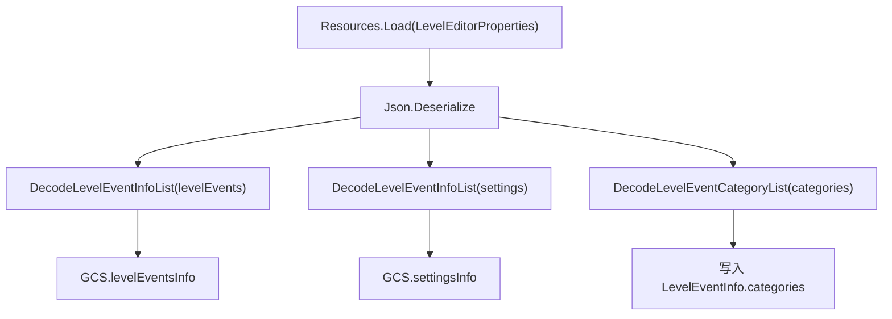

# LevelEventInfo

## 基本信息

| 项目 | 内容 |
| --- | --- |
| 源码路径 | `7thRhythmSource/ADOFAi/ADOFAI/LevelEventInfo.cs` |
| 命名空间 | `ADOFAI` |
| 类型 | `class LevelEventInfo` |
| 主要职责 | 保存某一种关卡事件或 settings 事件的元数据，包括事件名、事件类型、属性定义、分类、执行时机、DLC 限制、分组和装饰标记。 |

`LevelEventInfo` 不保存具体关卡里的事件值。具体事件值由 [LevelEvent](/api/data-models/LevelEvent.md) 保存，`LevelEventInfo` 则说明这个事件应该有哪些属性、能否显示、能否在第一块地板使用，以及是否属于装饰事件。

## 嵌套结构

| 名称 | 字段 | 作用 |
| --- | --- | --- |
| `Group` | `name`、`icon`、`isDefault` | 描述属性面板中的属性分组。`ADOStartup.DecodeLevelEventInfoList()` 读取事件元数据的 `groups` 数组后创建。 |

## 字段

| 名称 | 类型 | 作用 |
| --- | --- | --- |
| `name` | `string` | 事件元数据名称，也用于匹配 `LevelEventType`。 |
| `type` | `LevelEventType` | 由 `name` 解析出的事件类型。 |
| `pro` | `bool` | 标记该事件是否属于 Pro 事件。 |
| `taroDLC` | `bool` | 标记该事件是否需要 Neo Cosmos/Taro DLC。 |
| `propertiesInfo` | `Dictionary<string, PropertyInfo>` | 事件属性定义表，键是属性名。 |
| `categories` | `List<LevelEventCategory>` | 事件分类列表，由 `ADOStartup.DecodeLevelEventCategoryList()` 写入。 |
| `executionTime` | `LevelEventExecutionTime` | 事件执行时机，来自资源字段 `executionTime`。 |
| `allowFirstFloor` | `bool?` | 是否允许放在第一块地板；为空时由 `allowFirstFloorCheck` 计算。 |
| `isDecoration` | `bool` | 标记事件是否属于装饰事件。 |
| `useGroups` | `bool` | 标记属性面板是否使用分组。 |
| `groups` | `List<Group>` | 属性分组列表。 |
| `stretchViewport` | `bool` | 标记编辑器面板是否拉伸视口。 |

## 属性

| 名称 | 类型 | 行为 |
| --- | --- | --- |
| `allowFirstFloorCheck` | `bool` | 如果 `allowFirstFloor` 有值，直接返回该值；否则检查 `propertiesInfo` 是否包含 `angleOffset`。 |
| `taroDLCCheck` | `bool` | 官方关卡始终通过；非官方关卡在 DLC 未安装时，只有 `taroDLC == false` 才通过。 |
| `isActive` | `bool` | 非 Pro 事件直接检查 `taroDLCCheck`；Pro 事件需要编辑器条件或 `Persistence.enableProEvents` 允许后再检查 DLC。 |

## 元数据创建流程

`LevelEventInfo` 由 `ADOStartup.SetupLevelEventsInfo()` 创建，不在 `LevelEventInfo` 自身构造函数中解析资源。

`DecodeLevelEventInfoList()` 会跳过 `enabled == false` 的事件元数据，随后创建 `LevelEventInfo`，解析 `name`、`type`、`pro`、`taroDLC`、`allowFirstFloor`、`isDecoration`、`groups`、`executionTime` 和属性列表。

## 与事件对象的关系

| 使用点 | 关系 |
| --- | --- |
| `LevelEvent` 构造函数 | 通过 `GCS.levelEventsInfo[eventTypeName]` 找到普通事件元数据，并用 `propertiesInfo` 默认值初始化 `data`。 |
| `LevelEvent.Decode(..., isGlobal: true)` | 从 `GCS.settingsInfo` 读取 settings 事件元数据。 |
| `LevelData.Decode()` | 创建 `LevelEvent` 后检查 `levelEvent.info.isActive` 和 `levelEvent.info.taroDLCCheck`。 |
| 编辑器事件按钮与面板 | 读取 `LevelEventInfo` 的分类、分组、装饰标记和属性表生成 UI。 |

## 相关类型

| 类型 | 关系 |
| --- | --- |
| [PropertyInfo](/api/data-models/PropertyInfo.md) | `LevelEventInfo.propertiesInfo` 的值类型。 |
| [LevelEvent](/api/data-models/LevelEvent.md) | 每个事件对象持有一个 `LevelEventInfo`。 |
| [事件类型与属性枚举](/api/data-models/event-metadata-enums.md) | `LevelEventType`、`LevelEventCategory`、`LevelEventExecutionTime` 决定类型、分类和执行时机。 |

