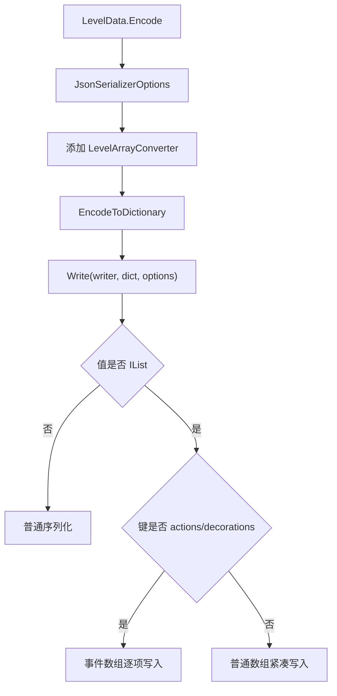

# 读取结果与序列化

## 基本信息

| 类型 | 源码路径 | 作用 |
| --- | --- | --- |
| `LoadResult` | `7thRhythmSource/ADOFAi/ADOFAI/LoadResult.cs` | 关卡、纹理和文件读取结果枚举。 |
| `LevelArrayConverter` | `7thRhythmSource/ADOFAi/ADOFAI.Serialization/LevelArrayConverter.cs` | `LevelData.Encode()` 使用的 JSON 写入转换器。 |
| `LevelValidation` | `7thRhythmSource/ADOFAi/LevelValidation.cs` | 当前源码中是空类，没有实现校验字段或方法。 |

本页补齐阶段 2 的边缘数据模型：读取结果、JSON 写入格式化和校验占位类。

## LoadResult

| 成员 | 源码中出现的用途 |
| --- | --- |
| `Successful` | `LevelData.Decode()` 完成后设置；`RDFile_Default.InternalReadAllBytes()` 读取成功后设置；`TextureManager` 成功加载贴图后设置。 |
| `FutureVersion` | `LevelData.Decode()` 或 `LevelDataCLS.Decode()` 遇到高于 18 的关卡版本时设置。 |
| `ModRequired` | `LevelData.Decode()` 或 `LevelDataCLS.Decode()` 检测到必需外部依赖时设置。 |
| `Error` | 多个读取入口的默认失败状态。 |
| `TaroDLCRequired` | `LevelData.Decode()` 在运行中遇到未满足 DLC 条件的事件时设置。 |
| `UnauthorizedAccess` | `RDFile_Default.InternalReadAllBytes()` 捕获 `UnauthorizedAccessException` 时设置。 |
| `MissingFile` | `TextureManager.LoadTexture()` 初始状态，文件不存在时保持该结果。 |

`LoadResult` 是状态枚举，本身不带消息。调用方需要结合上下文决定如何显示错误。例如 `scnEditor` 在加载关卡失败后会根据结果处理未授权、缺失文件或通用错误。

## LevelArrayConverter

| 项目 | 内容 |
| --- | --- |
| 命名空间 | `ADOFAI.Serialization` |
| 基类 | `JsonConverter<Dictionary<string, object>>` |
| 已实现方法 | `Write()`、`CanConvert()` |
| 未实现方法 | `Read()` 抛出 `NotImplementedException` |

`LevelArrayConverter` 用于 `LevelData.Encode()` 的 JSON 写入。`LevelData.Encode()` 创建 `JsonSerializerOptions` 时添加该转换器，并启用缩进输出。

### 写入规则

| 情况 | 行为 |
| --- | --- |
| 字典值不是 `IList` | 直接调用 `JsonSerializer.Serialize(writer, obj2)`。 |
| 字典值是普通列表 | 使用无缩进的内部 `Utf8JsonWriter` 写成紧凑数组，再写入原 writer。 |
| 字典键是 `actions` 或 `decorations` | 手动写数组，每个事件单独序列化成一行，并根据当前深度补空格。 |

源码中 `EventArrayKeys` 固定为 `actions` 和 `decorations`。因此 `.adofai` 输出时，事件数组会保持比普通数组更展开的可读格式。



### CanConvert

`CanConvert(Type typeToConvert)` 只在目标类型等于 `Dictionary<string, object>` 时返回 `true`。它不会处理其他字典泛型或自定义类型。

## LevelValidation

`LevelValidation` 当前源码内容为空：

```csharp
public class LevelValidation
{
}
```

因此当前阶段不能把它描述成已经实现的校验系统。实际已确认的校验逻辑分散在其他类型中：

| 校验位置 | 已确认行为 |
| --- | --- |
| [LevelData](/api/data-models/LevelData.md) | `GetMissingParams()` 检查艺术家、歌曲、作者和预览图是否缺失。 |
| [PropertyInfo](/api/data-models/PropertyInfo.md) | `Validate()` 方法限制浮点、整数、向量和浮点数对的范围。 |
| [LevelDataCLS](/api/data-models/LevelDataCLS.md) | `Decode()` 检查版本和必需外部依赖。 |
| [LevelEvent](/api/data-models/LevelEvent.md) | `Decode()` 按 `PropertyType` 转换属性，并处理缺失字段默认值。 |

## 相关类型

| 类型 | 关系 |
| --- | --- |
| [LevelData](/api/data-models/LevelData.md) | 使用 `LevelArrayConverter` 编码完整关卡数据，并通过 `LoadResult` 报告读取结果。 |
| [LevelDataCLS](/api/data-models/LevelDataCLS.md) | 读取关卡摘要时也保存 `LoadResult`。 |
| [PropertyInfo](/api/data-models/PropertyInfo.md) | 提供当前源码中最明确的字段级范围校验。 |

