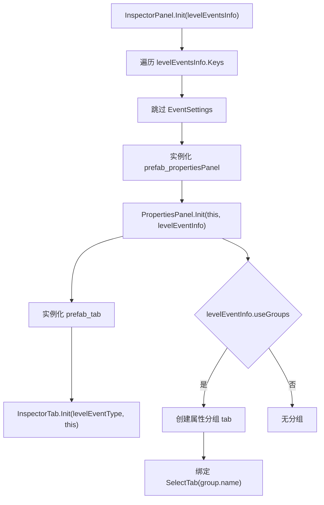
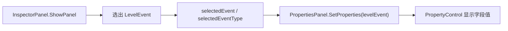

# InspectorPanel

## 基本信息

| 项目 | 内容 |
| --- | --- |
| 源码路径 | `7thRhythmSource/ADOFAi/ADOFAI/InspectorPanel.cs` |
| 命名空间 | `ADOFAI` |
| 类型 | `class InspectorPanel : ADOBase` |
| 主要职责 | 管理编辑器右侧 Inspector 面板、事件 tab、属性面板显示、事件启用/隐藏按钮、装饰多选合并和艺术家下拉 UI。 |

`InspectorPanel` 是 ADOFAI 编辑器事件属性编辑的入口。它不直接渲染每一个输入控件，而是为每个 `LevelEventType` 创建一个 [PropertiesPanel](/api/editor/PropertiesPanel.md)，再由 `PropertiesPanel` 根据 `LevelEventInfo.propertiesInfo` 创建属性行。

## 常量与静态字段

| 名称 | 类型 | 值或来源 | 作用 |
| --- | --- | --- | --- |
| `selectionColor` | `Color` | `new Color(39f / 85f, 47f / 51f, 1f, 1f)` | Inspector tab 选中颜色。 |
| `cacheSelectedEventType` | `LevelEventType` | `None` | 缓存最近一次选择的事件类型。 |
| `tabHeight` | `float` | `68f` | tab 垂直间距。 |
| `artistPrefabHeight` | `float` | `35f` | 艺术家候选项高度。 |
| `artistPopupPaddingHeight` | `float` | `12f` | 艺术家弹窗内边距高度。 |
| `addArtistKey` | `string` | `editor.addArtist` | 添加艺术家按钮本地化键。 |

## UI 字段

| 名称 | 类型 | 作用 |
| --- | --- | --- |
| `rect` | `RectTransform` | Inspector 面板根布局。 |
| `title` | `TMP_Text` | 当前事件标题。 |
| `panels` | `RectTransform` | 属性面板容器。 |
| `tabs` | `RectTransform` | 事件 tab 容器。 |
| `deleteEventButton` | `Button` | 删除当前事件按钮。 |
| `disableEventButton` | `Button` | 禁用普通事件或隐藏装饰事件按钮。 |
| `disableEventButtonImage` | `Image` | 禁用/隐藏按钮图标。 |
| `titleCanvas` | `GameObject` | 标题显示对象。 |
| `messageCanvas`、`messageText` | `GameObject`、`TMP_Text` | 面板提示文本。 |
| `showInspector`、`permaHideInspector` | `bool` | 面板显示状态与永久隐藏状态。 |
| `artistPopup`、`artistContainer`、`artistPrefab` | `RectTransform`、`RectTransform`、`GameObject` | 艺术家搜索弹窗和候选项预制体。 |
| `addArtist`、`addArtistText` | `GameObject`、`Text` | 添加艺术家入口。 |
| `artistUIDisclaimer` | `ArtistUIDisclaimer` | 艺术家 UI 免责声明组件。 |
| `approvalLevelPrefab`、`approvalLevelBadge` | `GameObject`、`ApprovalLevelBadge` | 艺术家授权等级 UI。 |
| `visibleIcon`、`hiddenIcon`、`powerIcon` | `Sprite` | 装饰可见、装饰隐藏和事件启用图标。 |
| `subTabButtons`、`subTabGroupTemplate`、`subTabButtonTemplate` | `RectTransform`、`RectTransform`、`PropertiesSubTabButton` | 属性分组 tab 容器与模板。 |

## 运行时字段

| 名称 | 类型 | 作用 |
| --- | --- | --- |
| `panelsList` | `List<PropertiesPanel>` | 所有事件类型对应的属性面板。 |
| `selectedEventType` | `LevelEventType` | 当前选中事件类型。 |
| `selectedEvent` | `LevelEvent` | 当前正在编辑的事件对象。 |
| `cacheEventIndex` | `int` | 同类型事件的选中序号缓存。 |
| `floorPanel` | `bool` | 标记该 Inspector 是否用于地板事件面板。 |
| `currentArtist` | `ArtistData` | 当前艺术家弹窗关联的艺术家数据。 |
| `lastLevelPath` | `string` | 艺术家相关流程使用的上一次关卡路径。 |
| `showingPanel` | `bool` | 标记当前是否正在切换面板。 |
| `currentArtistDisclaimerAction` | `Action` | 当前艺术家免责声明确认回调。 |

## 属性

| 名称 | 类型 | 作用 |
| --- | --- | --- |
| `editorWebServices` | `EditorWebServices` | 返回 `ADOBase.editor.webServices`。 |

## 方法

| 签名 | 主要行为 |
| --- | --- |
| `void Init(Dictionary<string, LevelEventInfo> levelEventsInfo, bool floorPanel)` | 根据事件元数据创建 `PropertiesPanel`、事件 tab 和属性分组 tab，并绑定删除与启用按钮。 |
| `void Update()` | 根据当前事件是否为装饰，切换按钮图标为电源、可见或隐藏图标。 |
| `void ShowPanel(LevelEventType eventType, int eventIndex = 0)` | 切换到指定事件类型面板，解析当前应编辑的 `LevelEvent`，调用 `PropertiesPanel.SetProperties()` 刷新控件。 |
| `void ShowPanelOfEvent(LevelEvent evnt)` | 在当前选中地板事件列表中计算同类型事件序号，然后调用 `ShowPanel()`。 |
| `InspectorTab GetTabForEventType(LevelEventType eventType)` | 根据事件类型查找对应 tab。 |
| `int EventNumOfTab(LevelEventType eventType)` | 计算指定事件类型在当前地板上有几个事件。 |
| `InspectorTab GetSelectedEventTab()` | 返回当前选中事件类型对应的 tab。 |
| `void CycleSelectedEventTab(bool next)` | 在同类型多个事件之间循环。 |
| `void CycleTabs(bool selectNext)` | 在事件 tab 之间循环。 |
| `void HideAllInspectorTabs()` | 隐藏全部 tab 和面板。 |
| `void ShowTabsForFloor(int floorID)` | 根据地板上的事件显示可用 tab。 |
| `void ShowInspector(bool show, bool forceAction = false)` | 显示或隐藏 Inspector 面板。 |
| `PropertiesPanel GetPanelOfType(LevelEvent levelEvent)` | 根据事件对象查找对应 `PropertiesPanel`。 |
| `void UpdatePropertyText(LevelEvent ev, string property)` | 更新指定事件属性在面板中的显示文本。 |
| `void ToggleArtistPopup(string search, float yPos, PropertyControl_Text artistPropertyControl)` | 打开或刷新艺术家搜索弹窗。 |
| `void HideArtistDropdown()` | 隐藏艺术家弹窗。 |
| `void NewArtist()` | 进入新增艺术家流程。 |

## 初始化流程

`EditorComment` 面板会被插入到 `panelsList` 开头，`Bookmark` tab 会放到最后。事件元数据开启分组时，`InspectorPanel` 会为该事件创建一组 `PropertiesSubTabButton`，并保存到对应 `PropertiesPanel.tabButtons`。

## ShowPanel 选择事件的规则

`ShowPanel()` 会先激活目标事件类型对应的 `PropertiesPanel`，隐藏其他面板。随后根据事件类型选择要编辑的 `LevelEvent`：

| 情况 | 事件来源 |
| --- | --- |
| settings 事件 | 从 `ADOBase.editor.levelData` 的 8 个 settings 字段取。 |
| 装饰事件单选 | 从 `ADOBase.editor.selectedDecorations[0]` 取。 |
| 装饰事件多选且类型相同 | 创建 `isFake = true` 的临时 `LevelEvent`，把真实事件放入 `realEvents`，并把相同字段合并到临时事件。 |
| 装饰事件多选但类型不同 | 隐藏标题，显示 `editor.dialog.differentTypeDecorationSelected` 提示。 |
| 普通地板事件 | 从 `ADOBase.editor.GetSelectedFloorEvents(eventType)` 取指定序号。 |

多选装饰合并时，普通属性只有所有选中装饰值相等才保持启用；`Vector2` 会分别比较 x、y 分量，不相同的分量写成 `NaN`；`floor` 会单独写到临时事件的 `floor` 字段。

## 与 PropertiesPanel 的关系

`InspectorPanel` 负责选择“哪个事件对象正在编辑”，`PropertiesPanel` 负责把这个事件对象写入具体控件。

## 相关类型

| 类型 | 关系 |
| --- | --- |
| [PropertiesPanel](/api/editor/PropertiesPanel.md) | Inspector 中每个事件类型对应一个属性面板。 |
| [LevelEvent](/api/data-models/LevelEvent.md) | 当前选中和编辑的事件对象。 |
| [LevelEventInfo](/api/data-models/LevelEventInfo.md) | Inspector 初始化时读取事件元数据、分类和分组。 |
| [PropertyInfo](/api/data-models/PropertyInfo.md) | 多选装饰合并时用于比较属性值。 |
| [scnEditor](/api/core/scnEditor.md) | 提供选中地板、选中装饰、事件列表和删除/启用/隐藏操作。 |

