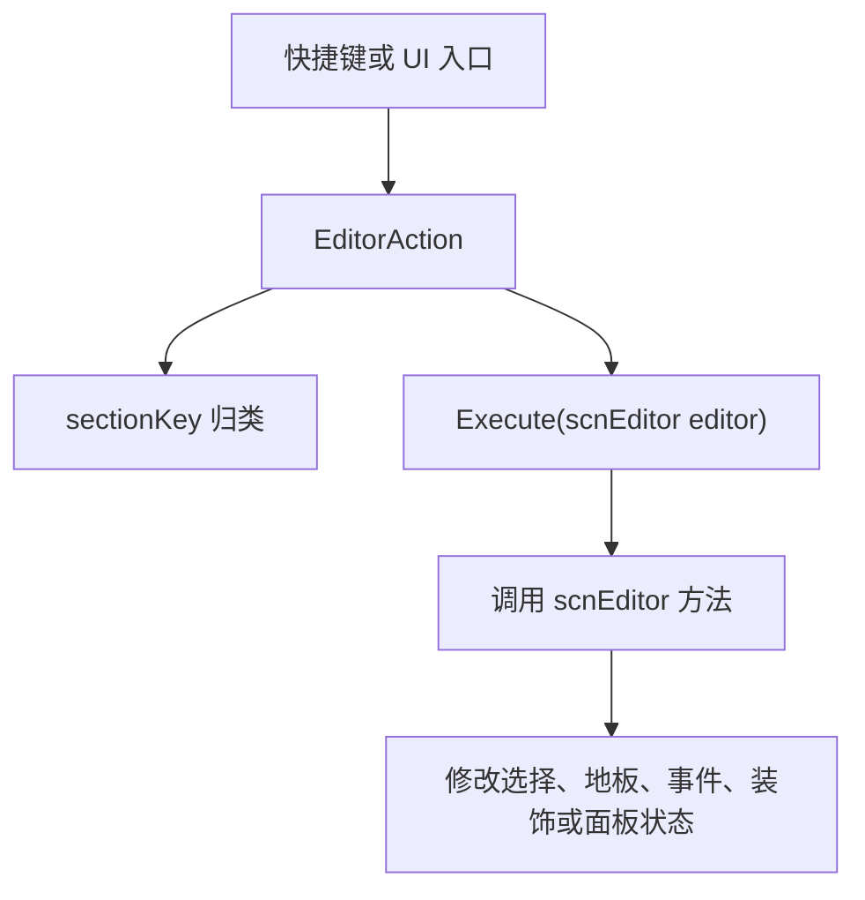

# ADOFAI.Editor.Actions

## 基本信息

| 项目 | 内容 |
| --- | --- |
| 源码目录 | `7thRhythmSource/ADOFAi/ADOFAI.Editor.Actions` |
| 命名空间 | `ADOFAI.Editor.Actions` |
| 核心基类 | `EditorAction` |
| 主要职责 | 把编辑器快捷键、菜单按钮和命令入口封装成可执行动作，统一接收 `scnEditor` 并调用对应编辑器方法。 |

`ADOFAI.Editor.Actions` 目录由大量小类组成。每个动作类通常只负责一件事：播放、保存、选择、复制、粘贴、删除、旋转、翻转、打开弹窗或切换某个编辑器面板。动作类本身不保存关卡数据，真正的编辑操作落在 [scnEditor](/api/core/scnEditor.md)。

## 基类与组合动作

| 类型 | 源码文件 | 行为 |
| --- | --- | --- |
| `EditorAction` | `EditorAction.cs` | 抽象基类，要求实现 `sectionKey` 和 `Execute(scnEditor editor)`；默认 `descriptionKey` 为类名去掉 `EditorAction`。 |
| `SimpleEditorAction` | `SimpleEditorAction.cs` | 包装一个 `Action`，执行时直接调用委托。 |
| `ConditionalEditorAction` | `ConditionalEditorAction.cs` | 根据 `Func<bool>` 的结果执行 trueAction 或 falseAction。 |
| `CompositeEditorAction` | `CompositeEditorAction.cs` | 按顺序执行多个 `EditorAction`。 |

## EditorTabKey

| 成员 | 用途 |
| --- | --- |
| `None` | 不归入快捷键说明分组，常用于组合或内部动作。 |
| `BasicEditing` | 基础编辑。 |
| `SelectionAndDeletion` | 选择和删除。 |
| `FlippingAndRotation` | 翻转与旋转。 |
| `AdvancedEditing` | 高级编辑。 |
| `Bookmarks` | 书签。 |
| `EditorWorkflow` | 编辑器工作流。 |
| `Gameplay` | 游戏玩法相关。 |
| `Other` | 其他。 |

`sectionKey` 是动作进入快捷键面板和动作分组的依据。部分动作会覆盖 `descriptionKey`，例如 `CreateMidspinFloorEditorAction` 返回 `Midspin`，循环事件 tab 和循环选中事件返回更通用的描述键。

## 工作流与文件动作

| 动作 | 分组 | 执行内容 |
| --- | --- | --- |
| `NewLevelEditorAction` | `EditorWorkflow` | 取消 UI 选中后调用 `editor.NewLevel()`。 |
| `OpenLevelEditorAction` | `EditorWorkflow` | 取消 UI 选中后调用 `editor.OpenLevel()`。 |
| `SaveLevelEditorAction` | `EditorWorkflow` | 取消 UI 选中后调用 `editor.SaveLevel()`。 |
| `SaveLevelAsEditorAction` | `EditorWorkflow` | 构造时保存 `newLevel`，执行时调用 `editor.SaveLevelAs(newLevel)`。 |
| `OpenRecentEditorAction` | `EditorWorkflow` | 打开最近关卡，构造函数可带 `checkCtrl`。 |
| `OpenPreferencesEditorAction` | `EditorWorkflow` | 打开偏好设置。 |
| `OpenUrlEditorAction` | `EditorWorkflow` | 打开外部链接。 |
| `OpenLogDirectoryEditorAction` | `Other` | 打开日志目录。 |

## 播放与撤销动作

| 动作 | 分组 | 执行内容 |
| --- | --- | --- |
| `PlayEditorAction` | `BasicEditing` | 调用 `editor.Play()`。 |
| `PlayWithSpeedEditorAction` | `BasicEditing` | 当前源码同样调用 `editor.Play()`。 |
| `UndoEditorAction` | `BasicEditing` | 调用 `editor.Undo()`。 |
| `RedoEditorAction` | `BasicEditing` | 调用 `editor.Redo()`。 |

## 地板创建动作

| 动作 | 分组 | 执行内容 |
| --- | --- | --- |
| `CreateFloorWithCharOrAngleEditorAction` | `None` | 保存固定角度/字符或函数形式角度/字符，执行时调用 `editor.CreateFloorWithCharOrAngle()`。 |
| `CreateArbitraryFloorAction` | `BasicEditing` | 当任意角度按钮容器处于激活状态时调用 `editor.CreateArbitraryFloor()`，并清空 UI 选中对象。 |
| `CreateMidspinFloorEditorAction` | `BasicEditing` | 当前 UI 没有选中 `Selectable` 时，用角度 `999f`、字符 `!` 创建 midspin 地板。 |
| `Create360FloorEditorAction` | `BasicEditing` | 创建 360 度相关地板。 |
| `CreatePentagonEditorAction`、`CreateUpsideDownPentagonEditorAction` | `FlippingAndRotation` | 创建五边形和倒置五边形路径片段。 |
| `CreateHeptagonEditorAction`、`CreateUpsideDownHeptagonEditorAction` | `FlippingAndRotation` | 创建七边形和倒置七边形路径片段。 |

## 选择与删除动作

| 动作 | 分组 | 执行内容 |
| --- | --- | --- |
| `SelectNextFloorEditorAction` | `SelectionAndDeletion` | 非空选择时选中当前选择最后一块的下一块地板。 |
| `SelectPreviousFloorEditorAction` | `SelectionAndDeletion` | 非空选择时选中当前选择第一块的上一块地板。 |
| `SelectFirstFloorEditorAction`、`SelectLastFloorEditorAction` | `SelectionAndDeletion` | 跳转到第一块或最后一块地板。 |
| `SelectToFirstFloorEditorAction`、`SelectToLastFloorEditorAction` | `SelectionAndDeletion` | 扩展选择到第一块或最后一块地板。 |
| `MoveSelectionLeftEditorAction`、`MoveSelectionRightEditorAction` | `SelectionAndDeletion` | 按多选锚点向左或向右扩展/移动选择，`descriptionKey` 为 `MoveSelection`。 |
| `DeselectAllEditorAction` | `SelectionAndDeletion` | 取消当前选择。 |
| `DeleteFloorsEditorAction` | `SelectionAndDeletion` | 单选时调用 `DeleteSingleSelection(backwards)`，多选时调用 `DeleteMultiSelection(backwards)`。 |
| `DeletePrecedingFloorsEditorAction`、`DeleteSubsequentFloorsEditorAction` | `SelectionAndDeletion` | 删除当前选择前方或后方地板。 |
| `DeleteDecorationsEditorAction` | `AdvancedEditing` | 删除选中的装饰。 |

## 复制、剪切与粘贴动作

| 动作 | 分组 | 执行内容 |
| --- | --- | --- |
| `CopyFloorEditorAction` | `BasicEditing` | 复制选中地板。 |
| `CutFloorEditorAction` | `BasicEditing` | 剪切选中地板。 |
| `PasteFloorEditorAction` | `BasicEditing` | 粘贴地板。 |
| `PasteFloorWithoutDecorationsEditorAction` | `BasicEditing` | 粘贴地板但不带装饰。 |
| `CopyEventsEditorAction` | `AdvancedEditing` | 单选时复制当前地板上的选中事件。 |
| `CutEventsEditorAction` | `AdvancedEditing` | 单选时剪切当前地板上的选中事件。 |
| `PasteEventsEditorAction` | `AdvancedEditing` | 根据剪贴板内容把事件粘贴到单块或多块选中地板；多选超过 1000 块时会弹出确认。 |
| `CopyAllSameTypeEventsEditorAction`、`CutAllSameTypeEventsEditorAction` | `AdvancedEditing` | 复制或剪切当前同类型事件。 |
| `CopyTrackColorEditorAction`、`PasteTrackColorEditorAction`、`PasteTrackColorSingleTileEditorAction` | `AdvancedEditing` | 复制/粘贴轨道颜色设置。 |
| `CopyHitSoundEditorAction`、`PasteHitSoundSingleTileEditorAction` | `AdvancedEditing` | 复制/粘贴命中音设置。 |
| `DuplicateDecorationsEditorAction` | `AdvancedEditing` | 复制选中装饰。 |

## 翻转、旋转和形状动作

| 动作 | 分组 | 执行内容 |
| --- | --- | --- |
| `FlipFloorsHorizontalEditorAction` | `FlippingAndRotation` | 水平翻转选中地板。 |
| `FlipFloorsVerticalEditorAction` | `FlippingAndRotation` | 垂直翻转选中地板。 |
| `RotateFloors90ClockwiseEditorAction` | `FlippingAndRotation` | 顺时针旋转 90 度，`descriptionKey` 为 `RotateFloors90`。 |
| `RotateFloors90CounterClockwiseEditorAction` | `FlippingAndRotation` | 逆时针旋转 90 度，`descriptionKey` 为 `RotateFloors90`。 |
| `RotateFloors180EditorAction` | `FlippingAndRotation` | 旋转 180 度。 |

## 事件、书签和面板动作

| 动作 | 分组 | 执行内容 |
| --- | --- | --- |
| `AddNumberedEventEditorAction` | `None` | 按数字添加事件。 |
| `SelectEventCategoryEditorAction` | `None` | 按数字选择事件分类。 |
| `CycleNextEventTabEditorAction`、`CyclePreviousEventTabEditorAction` | `EditorWorkflow` | 在事件 tab 之间循环，`descriptionKey` 为 `CycleEventTab`。 |
| `CycleNextSelectedEventEditorAction`、`CyclePreviousSelectedEventEditorAction` | `EditorWorkflow` | 在同类型选中事件之间循环，`descriptionKey` 为 `CycleSelectedEvent`。 |
| `ShowFirstEventPageEditorAction`、`ShowPreviousEventPageEditorAction`、`ShowNextEventPageEditorAction`、`ShowLastEventPageEditorAction` | `EditorWorkflow` | 切换事件页。 |
| `ToggleBookmarkEditorAction` | `Bookmarks` | 当前地板已有 `Bookmark` 事件时移除，否则添加。 |
| `SelectNextBookmarkEditorAction`、`SelectPreviousBookmarkEditorAction` | `Bookmarks` | 调用 `editor.SelectBookmark()`，构造函数保存是否相对选择。 |
| `ToggleShortcutsPanelEditorAction` | `Other` | 切换快捷键面板。 |
| `ToggleFindFloorPanelEditorAction`、`ToggleFindCommentPanelEditorAction`、`ToggleFileActionsPanelEditorAction` | `Other` | 切换查找地板、查找注释和文件动作面板。 |

## 其他开关动作

| 动作 | 分组 | 执行内容 |
| --- | --- | --- |
| `ToggleAutoEditorAction` | `Other` | 当路径编辑锁定、选择为空或按住 Alt 时调用 `editor.ToggleAuto()`。 |
| `ToggleNoFailEditorAction` | `Gameplay` | 切换无失败。 |
| `ToggleFloorNumsEditorAction` | `Other` | 切换地板编号显示。 |
| `LockSelectedDecorationsEditorAction` | `AdvancedEditing` | 锁定或解锁选中的装饰。 |
| `ShowCurrentFloorNumberEditorAction` | `Other` | 显示当前地板编号。 |
| `ShowCopyrightPopupEditorAction` | `Other` | 显示版权弹窗。 |
| `TryQuitToMenuEditorAction` | `EditorWorkflow` | 尝试退出到菜单。 |

## 执行链路

动作类把快捷键入口和编辑器实现解耦。它们通常只做前置判断、参数保存和分派，复杂编辑逻辑集中在 `scnEditor`。

## 相关类型

| 类型 | 关系 |
| --- | --- |
| [scnEditor](/api/core/scnEditor.md) | 所有动作的执行目标。 |
| [InspectorPanel](/api/editor/InspectorPanel.md) | 事件 tab 和选中事件切换动作会操作 Inspector。 |
| [PropertiesPanel](/api/editor/PropertiesPanel.md) | 部分动作影响当前属性面板显示。 |
| [LevelData](/api/data-models/LevelData.md) | 保存动作最终修改的关卡数据。 |

