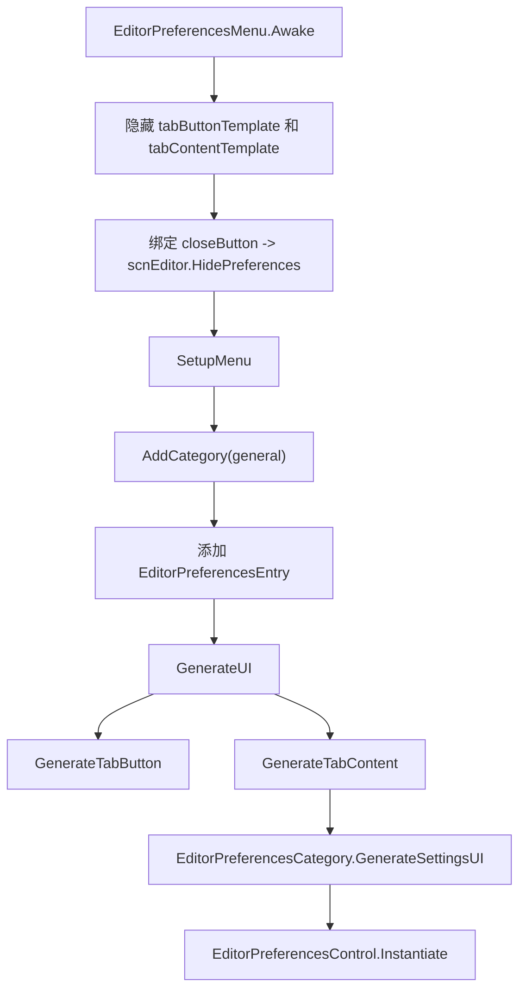

# 偏好设置、粒子编辑器与辅助面板

## 基本信息

| 分组 | 源码路径 | 作用 |
| --- | --- | --- |
| 编辑器偏好设置 | `7thRhythmSource/ADOFAi/ADOFAI.Editor.Preferences` | 生成编辑器偏好设置弹窗、分类、字段和控件。 |
| 粒子编辑器 | `7thRhythmSource/ADOFAi/ADOFAI.Editor.ParticleEditor` | 为 `AddParticle` 事件提供分组属性编辑和粒子预览。 |
| 查找注释面板 | `7thRhythmSource/ADOFAi/ADOFAI.Editor.Panels/FindCommentPanel.cs` | 根据注释文本搜索并跳转到匹配地板。 |

本页覆盖阶段 3 的编辑器辅助面板。它们都由 [scnEditor](/api/core/scnEditor.md) 显示或隐藏，并与 [PropertiesPanel](/api/editor/PropertiesPanel.md)、[PropertyControl 控件族](/api/editor/property-controls.md) 和 [LevelEvent](/api/data-models/LevelEvent.md) 协作。

## 编辑器偏好设置

### 类型清单

| 类型 | 源码文件 | 作用 |
| --- | --- | --- |
| `EditorPreferencesMenu` | `EditorPreferencesMenu.cs` | 偏好设置弹窗主控制器，生成分类 tab 和内容页。 |
| `EditorPreferencesTabContent` | `EditorPreferencesTabContent.cs` | 偏好设置内容容器，持有竖向/横向字段模板。 |
| `EditorPreferencesTabButton` | `EditorPreferencesTabButton.cs` | 偏好设置分类按钮。 |
| `EditorPreferencesField` | `EditorPreferencesField.cs` | 单条偏好设置字段 UI，包含 label、description 和 control 容器。 |
| `EditorPreferencesCategory` | `EditorPreferencesCategory.cs` | 偏好设置分类数据，保存 `EditorPreferencesEntry` 列表并生成 UI。 |
| `EditorPreferencesEntry` | `EditorPreferencesEntry.cs` | 单条偏好设置项，保存名称和控件。 |
| `EditorPreferencesControl` | `EditorPreferencesControl.cs` | 偏好控件抽象基类。 |
| `EditorPreferencesValueControl<T>` | `EditorPreferencesValueControl.cs` | 带 getter/setter 的值控件基类。 |
| `EditorPreferencesToggle` | `EditorPreferencesToggle.cs` | 开关控件，使用 `Switch` 预制体。 |
| `EditorsPreferencesText` | `EditorsPreferencesText.cs` | 文本输入控件。 |
| `EditorPreferencesControlType` | `EditorPreferencesControlType.cs` | 控件布局枚举：`Vertical`、`Horizontal`。 |

### 菜单生成流程

当前 `SetupMenu()` 只创建 `general` 分类。已确认的偏好项如下：

| 偏好项 | 绑定字段或方法 | 变化时行为 |
| --- | --- | --- |
| `markFloorWithComment` | `Persistence.markFloorWithComment` | 写入后调用 `scnEditor.instance.RemakePath()`。 |
| `disableRewindButton` | `Persistence.GetDisableRewindButton()`、`Persistence.disableRewindButton` | 切换 rewind 按钮显示，并调整 playPause 按钮位置。 |
| `useLegacyZoom` | `Persistence.editorUseLegacyZoom` | 写入 Persistence。 |
| `disableEventsPageRepeat` | `Persistence.disableEventsPageRepeat` | 写入 Persistence。 |
| `disableAutoAngleOffset` | `Persistence.disableAutoAngleOffset` | 写入 Persistence。 |
| `disableCameraDecorationFocus` | `Persistence.disableCameraDecorationFocus` | 写入 Persistence。 |

`EditorPreferencesCategory.GenerateSettingsUI()` 会为每个 entry 实例化横向或竖向字段模板，label 使用 `editor.prefs.fields.{entryName}`，description 使用 `editor.prefs.fields.{entryName}.description`，存在时才显示。

### 显示和关闭

`scnEditor.ShowPreferences()` 会先调用 `CloseAllPanels()`，然后显示 `prefsContainer`，用 DOTween 把遮罩透明度变到 0.5，并把 `prefsMenu` 的 pivot Y 动画到 0.5。

`scnEditor.HidePreferences()` 做相反动画，完成后隐藏 `prefsContainer`。`EditorPreferencesMenu.Update()` 在收到取消输入且用户没有正在编辑输入框时调用 `HidePreferences()`。

## 粒子编辑器

### 类型清单

| 类型 | 源码文件 | 作用 |
| --- | --- | --- |
| `ParticleEditor` | `ParticleEditor.cs` | 粒子编辑器主控制器，生成粒子属性 tab、播放预览、停止、重置和关闭逻辑。 |
| `ParticleEditorTabType` | `ParticleEditorTabType.cs` | 粒子编辑器 tab 枚举：`General`、`Shape`、`Transform`。 |

### 字段分组

`ParticleEditor.DrawSettings()` 首次打开时创建三组 `PropertiesPanel`：

| 分组 | 属性键 |
| --- | --- |
| `General` | `maxParticles`、`simulationSpace`、`simulationSpeed`、`playDuration`、`loop`、`randomSeed` |
| `Shape` | `decorationImage`、`randomTextureTiling`、`startRotation`、`color`、`particleLifetime`、`particleSize`、`shapeType`、`shapeRadius`、`emissionRate` |
| `Transform` | `velocity`、`velocityLimitOverLifetime`、`rotationOverTime`、`colorOverLifetime`、`sizeOverLifetime`、`arc`、`arcMode` |

每个属性通过 `PropertiesPanel.RenderControl()` 生成控件。它会复制 `GCS.levelEventsInfo["AddParticle"].propertiesInfo[key].dict`，并移除其中的 `control` 字段，再创建新的 `PropertyInfo`。

### 设置事件与预览

| 方法 | 行为 |
| --- | --- |
| `SetEvent(LevelEvent ev)` | 确保设置已绘制，保存 `SelectedEvent`，同步 `inspectorPanel.selectedEvent`，用 `previewDec.Setup()` 建立粒子装饰预览，并把事件值写入所有 tab。 |
| `UpdatePreview(bool restart)` | restart 为 true 时先停止并清空粒子，再调用 `previewDec.ResetParticle()`，最后重新播放。 |
| `SelectCategory(ParticleEditorTabType tab)` | 切换 tab 按钮选中状态、tab 内容显示状态和标题文本。 |

播放按钮会根据 `previewDec.particleSystem.isPlaying` 在播放和暂停之间切换；停止按钮会停止并清空粒子，重置按钮会清空并把时间归零。`Update()` 中会在没有打开颜色和渐变弹窗时处理 Ctrl+Z 撤销与 Ctrl+Shift+Z 重做。

### 显示和关闭

`scnEditor.ShowParticleEditor(LevelEvent targetEvent)` 会关闭文件动作面板，调用 `particleEditor.SetEvent(targetEvent)`，然后用 DOTween 显示遮罩和面板。`HideParticleEditor()` 做相反动画并在完成后隐藏容器。

取消输入时，`ParticleEditor.Update()` 的关闭顺序是：

1. 如果颜色弹窗打开，先隐藏颜色弹窗。
2. 如果渐变编辑器打开，隐藏渐变编辑器。
3. 否则隐藏粒子编辑器。

## 查找注释面板

`FindCommentPanel` 负责根据 `EditorComment` 等注释文本搜索地板。

| 字段 | 类型 | 作用 |
| --- | --- | --- |
| `findCommentPanelTitle` | `Text` | 面板标题。 |
| `matchText` | `Text` | 当前匹配序号和总数。 |
| `findArrow` | `Image` | 查找箭头图像。 |
| `findValue` | `Property` | 搜索输入属性行。 |
| `findButton`、`prevButton`、`nextButton` | `Button` | 搜索、上一个、下一个按钮。 |
| `targetFloors` | `int[]` | 当前搜索结果地板序号。 |
| `selectedIndex` | `int` | 当前搜索结果索引。 |
| `lastSearchTerm` | `string` | 上一次搜索词。 |

### 方法

| 方法 | 行为 |
| --- | --- |
| `Awake()` | 设置本地化标题和按钮文字，绑定 Search、Prev、Next。 |
| `Search()` | 调用 `ADOBase.editor.SearchByComment()`，有结果时选中第一条结果，没有结果时选中第一块地板。 |
| `Prev()` | 搜索词变化或无结果时刷新；能向前移动时选中上一条结果。 |
| `Next()` | 搜索词变化或无结果时刷新；能向后移动时选中下一条结果。 |

`scnEditor.ShowFindCommentPanel(bool show)` 负责滑出或收起该面板。打开时会选中 `findValue` 的文本输入框，并隐藏快捷键面板。

## 相关类型

| 类型 | 关系 |
| --- | --- |
| [scnEditor](/api/core/scnEditor.md) | 负责显示和隐藏偏好设置、粒子编辑器、查找注释面板。 |
| [PropertiesPanel](/api/editor/PropertiesPanel.md) | 粒子编辑器复用它生成属性控件。 |
| [PropertyControl 控件族](/api/editor/property-controls.md) | 偏好设置和粒子编辑器都使用具体 UI 控件。 |
| [LevelEvent](/api/data-models/LevelEvent.md) | 粒子编辑器编辑 `AddParticle` 事件。 |
| [ADOFAI.Editor.Actions](/api/editor/editor-actions.md) | `OpenPreferencesEditorAction`、`ToggleFindCommentPanelEditorAction` 等动作会打开这些面板。 |

