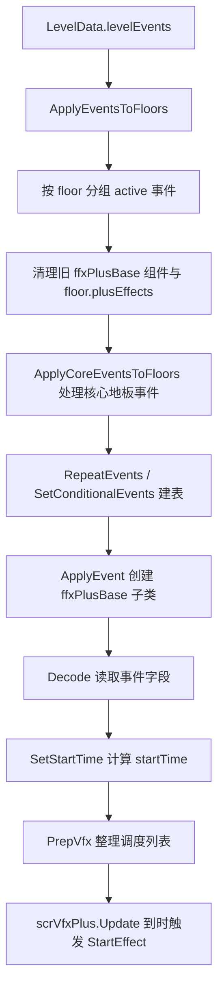

# 事件执行总览

本页记录 ADOFAI 运行时事件怎样从 `LevelEvent` 变成 `ffxPlusBase` 组件，并在歌曲时间推进时触发。阶段 5 后续页面会继续按事件族拆分字段和具体效果；本页先建立事件执行主线。

## 源码范围

| 类型或方法 | 源码路径 | 角色 |
| --- | --- | --- |
| `LevelEventType` | `7thRhythmSource/ADOFAi/ADOFAI/LevelEventType.cs` | 关卡事件枚举，包含 settings、轨道、装饰、相机、滤镜、输入、粒子和运行时控制事件。 |
| `scnGame.ApplyEventsToFloors` | `7thRhythmSource/ADOFAi/scnGame.cs` | 把激活的事件按地板分组，清理旧效果组件，应用核心地板事件，并为 VFX 事件创建 `ffxPlusBase`。 |
| `scnGame.ApplyEvent` | `7thRhythmSource/ADOFAi/scnGame.cs` | 将单个 `LevelEventType` 映射到具体 `ffxPlusBase` 子类。 |
| `scnGame.PrepVfx` | `7thRhythmSource/ADOFAi/scnGame.cs` | 重置 `scrVfxPlus`，整理条件事件、手动事件和时间调度列表。 |
| `ffxPlusBase` | `7thRhythmSource/ADOFAi/ffxPlusBase.cs` | 所有运行时效果组件的基类，定义起始时间、持续时间、条件信息、手动运行和 scrub 行为。 |
| `scrVfxPlus` | `7thRhythmSource/ADOFAi/scrVfxPlus.cs` | 运行时 VFX 调度器，按 `songposition_minusi` 触发效果。 |

## 执行主线

## `LevelEventType` 分层

`LevelEventType` 枚举同时包含数据 settings、核心地板事件、普通 VFX 事件和特殊运行时入口。运行时并不是所有枚举都会通过 `ApplyEvent()` 创建 `ffxPlusBase`。

| 分层 | 事件类型 |
| --- | --- |
| Settings | `LevelSettings`、`SongSettings`、`TrackSettings`、`BackgroundSettings`、`CameraSettings`、`MiscSettings`、`EventSettings`、`DecorationSettings` |
| 核心地板与路径 | `SetSpeed`、`Twirl`、`Checkpoint`、`ChangeTrack`、`ColorTrack`、`AnimateTrack`、`SetPlanetRotation`、`PositionTrack`、`Hold`、`MultiPlanet`、`FreeRoam`、`FreeRoamTwirl`、`FreeRoamRemove`、`FreeRoamWarning`、`Pause`、`AutoPlayTiles`、`Hide`、`ScaleMargin`、`ScaleRadius`、`Multitap`、`TileDimensions`、`SetFloorIcon` |
| 装饰创建与编辑器标记 | `AddDecoration`、`AddText`、`AddObject`、`AddParticle`、`EditorComment`、`Bookmark` |
| VFX 与运行时效果 | `MoveCamera`、`CustomBackground`、`RecolorTrack`、`MoveTrack`、`MoveDecorations`、`SetParticle`、`EmitParticle`、`SetText`、`SetObject`、`SetDefaultText`、`SetFilter`、`SetFilterAdvanced`、`HallOfMirrors`、`ShakeScreen`、`Bloom`、`ScreenTile`、`ScreenScroll`、`Flash`、`SetHitsound`、`SetHoldSound`、`CallMethod`、`AddComponent`、`KillPlayer`、`PlaySound`、`ScalePlanets`、`SetFrameRate`、`SetInputEvent` |
| 事件控制 | `RepeatEvents`、`SetConditionalEvents` |

## `ApplyEventsToFloors`

`ApplyEventsToFloors(List<scrFloor> floors, LevelData levelData, scrLevelMaker lm, List<LevelEvent> events)` 是事件应用主入口。

| 步骤 | 行为 |
| --- | --- |
| 分组 | 创建长度等于地板数的 `List<LevelEvent>[]`，只把 `active` 事件加入对应 floor。 |
| 清理 | 遍历所有地板，销毁已有 `ffxPlusBase` 组件，清空 `floor.plusEffects`，并调用 `lm.CalculateSingleFloorAngleLength(floor)`。 |
| 核心事件 | 调用 `ApplyCoreEventsToFloors(array)` 处理速度、旋转、轨道颜色、hold、free roam 等会影响地板状态的事件。 |
| 时间重算 | 调用 `lm.CalculateFloorEntryTimes()` 重新计算地板 entry time。 |
| 重复事件 | 读取激活的 `RepeatEvents`，按 floor 和 tag 建立重复次数、拍间隔、是否在当前地板执行、gap length。 |
| 条件事件 | 读取激活的 `SetConditionalEvents`，为 floor 建立 9 类条件 tag，并标记 `floor.hasConditionalChange = true`。 |
| 创建效果 | 遍历所有 active 事件，按 repeat 设置调用 `ApplyEvent()`；如果事件命中条件 tag，则写入 `ffxPlusBase.conditionalInfo`。 |
| 初始相机 | 在 0 号地板插入一个 `ffxCameraPlus`，起始时间为 0，持续时间为 0。 |

## `ApplyEvent` 映射表

`ApplyEvent(LevelEvent evnt, float bpm, float pitch, List<scrFloor> floors, float offset = 0f, int? customFloorID = null)` 只对下列事件创建 `ffxPlusBase` 子类；其他事件返回 `null`。

| `LevelEventType` | 创建或取得的组件 |
| --- | --- |
| `Checkpoint` | `gameObject.GetComponent<ffxCheckpoint>()` |
| `SetHitsound` | `ffxSetHitsound` |
| `SetHoldSound` | `ffxSetHoldsound` |
| `CustomBackground` | `ffxCustomBackgroundPlus` |
| `MoveCamera` | `ffxCameraPlus` |
| `Flash` | `ffxFlashPlus` |
| `RecolorTrack` | `ffxRecolorFloorPlus` |
| `MoveTrack` | `ffxMoveFloorPlus` |
| `MoveDecorations` | `ffxMoveDecorationsPlus` |
| `SetParticle` | `ffxSetParticlePlus` |
| `EmitParticle` | `ffxEmitParticlePlus` |
| `SetText` | `ffxSetTextPlus` |
| `SetObject` | `ffxSetObjectPlus` |
| `SetDefaultText` | `ffxSetDefaultText` |
| `SetFilter` | `ffxSetFilterPlus` |
| `SetFilterAdvanced` | `ffxSetFilterAdvancedPlus` |
| `HallOfMirrors` | `ffxHallOfMirrorsPlus` |
| `ShakeScreen` | `ffxShakeScreenPlus` |
| `Bloom` | `ffxBloomPlus` |
| `ScreenTile` | `ffxScreenTilePlus` |
| `ScreenScroll` | `ffxScreenScrollPlus` |
| `CallMethod` | `ffxCallMethod` |
| `AddComponent` | `ffxAddComponent` |
| `KillPlayer` | `ffxKillPlayer` |
| `PlaySound` | `ffxPlaySound` |
| `ScalePlanets` | `ffxScalePlanetsPlus` |
| `SetFrameRate` | `ffxSetFrameRatePlus` |
| `SetInputEvent` | `ffxSetInputEventPlus` |

创建组件后，`ApplyEvent()` 会设置 `floorID`、`floors`、`crotchet`，调用 `Decode(evnt)`，把组件加入 `floors[num].plusEffects`，再读取 `angleOffset` 并调用 `SetStartTime(bpm, output + offset)`。

如果事件有非空 `eventTag`，`ApplyEvent()` 会按空格拆分 tag，查找 `scrDecorationManager.instance.hitboxEventTagDecorations`，把效果加入目标装饰的 `hitboxEvents`，并设置 `runManually = true`。

## `ffxPlusBase`

`ffxPlusBase` 继承 `ADOBase`，所有通过 `ApplyEvent()` 创建的效果都继承它。

### 字段

| 字段 | 类型 | 作用 |
| --- | --- | --- |
| `hifiEffect` | `bool` | 高质量视觉效果标记。 |
| `disableIfMinFx` | `bool` | 最低视觉效果设置下禁用。 |
| `disableIfMaxFx` | `bool` | 最高视觉效果设置下禁用。 |
| `startTime` | `double` | 触发歌曲时间。 |
| `startEffectOffset` | `double` | 提前触发偏移。 |
| `duration` | `float` | 效果持续时间。 |
| `ease` | `Ease` | DOTween ease，默认 `Ease.Linear`。 |
| `triggered` | `bool` | 是否已经触发或被条件系统接管。 |
| `degreeOffset` | `float` | 角度偏移。 |
| `conditionalInfo` | `bool[]` | 条件事件命中信息。 |
| `runManually` | `bool` | 是否不进入普通时间调度，改由 hitbox 或其他入口手动触发。 |
| `sourceLevelEvent` | `LevelEvent` | 来源事件对象。 |
| `cam`、`ctrl`、`cond`、`floor`、`vfx` | 运行时引用 | `Awake()` 中缓存相机、控制器、导体、所在地板和 VFX 调度器。 |
| `floors` | `List<scrFloor>` | 当前关卡地板列表。 |
| `floorID` | `int` | 效果所属地板序号。 |
| `crotchet` | `float` | 当前速度下的一拍秒数。 |

### 生命周期

| 方法 | 行为 |
| --- | --- |
| `Awake()` | 缓存运行时引用；把旧 5 位条件数组扩展为 8 位，否则创建新的 8 位数组。 |
| `Decode(LevelEvent evnt)` | 空实现；子类重写后读取事件字段。 |
| `PrepVfx()` | 空实现；子类可在调度前整理额外数据。 |
| `StartEffect()` | 调用 `StartEffect(null)`。 |
| `StartEffect(scrPlanet planet)` | 抽象方法，子类实现具体效果。 |
| `StartEffectWithOffset(scrPlanet planet = null)` | 根据 `degreeOffset`、BPM、pitch 和地板速度延迟调用 `StartEffect(planet)`；暂停时不触发。 |
| `SetStartTime(float bpm, float degreeOffset = 0f)` | 用所在地板 `entryTime`、角度偏移、BPM 和地板速度计算 `startTime`。 |
| `ScrubToTime(float t)` | 如果 scrub 时间已到，触发效果并推进 `eventTweens`；到达结束时间时 kill 并 complete tween。 |
| `Kill()` | kill `eventTweens` 中的 tween。 |
| `AdjustDurationForHardbake()` | 非自定义关卡下按歌曲 pitch 缩短 duration。 |

## `PrepVfx`

`PrepVfx(List<scrFloor> floors, int seqID, List<LevelEvent> events = null, bool isRestart = false)` 在关卡开始、重开或 checkpoint 恢复前整理调度状态。

| 步骤 | 行为 |
| --- | --- |
| 重置调度器 | 调用 `scrVfxPlus.instance.Reset()`。 |
| 准备轨道变化 | 如果地板上有 `ffxChangeTrack`，调用 `PrepFloor(isRestart)`。 |
| 处理背景图片 | 对带 `bgImage` 的事件补建 `ffxCustomBackgroundPlus`，并处理 repeat 与条件 tag。 |
| 清理条件集合 | 清空每个地板的 `perfectEffects`、`earlyPerfectEffects`、`latePerfectEffects`、`veryEarlyEffects`、`veryLateEffects`、`tooEarlyEffects`、`tooLateEffects`、`lossEffects`、`onCheckpointEffects`。 |
| 条件事件 | 如果 `plusEffect.conditionalInfo` 中有 true，把效果放入对应条件集合，设置 `triggered = true`，并标记 `floor.hasConditionalChange = true`。 |
| 手动事件 | 如果 `plusEffect.runManually` 为 true，设置 `triggered = true`，不加入普通时间调度。 |
| 普通时间事件 | 如果效果不是 `runOnHit`，加入 `scrVfxPlus.effects`。 |
| 子类准备 | 对每个 `plusEffect` 调用 `PrepVfx()`。 |
| checkpoint 恢复 | 如果 `seqID` 非 0，查找最近的 `onCheckpointEffects` 地板，把这些效果重新加入调度列表。 |
| 排序 | 按 `startTime - startEffectOffset` 和 `floor.seqID` 排序 `scrVfxPlus.effects`。 |

## 触发入口

| 入口 | 源码行为 |
| --- | --- |
| 普通时间调度 | `scrVfxPlus.Update()` 在未暂停且歌曲开始后，比较 `cond.songposition_minusi` 和 `startTime - startEffectOffset`，满足条件后调用 `StartEffect()` 并设置 `triggered = true`。 |
| `runOnHit` | `scrPlanet` 在移动到下一地板时，如果组件 `runOnHit` 且未触发，调用 `movingToNext.DoFFX(ffxPlusBase2)`。 |
| checkpoint 恢复 | `scrController` 在 checkpoint 不为 0 时，对已经经过的地板执行 `runOnHit` 效果；`ffxCheckpoint` 只刷新地板图标。 |
| 条件事件 | `scrPlayer` 的输入事件处理会从对应数组取 `ffxSetInputEventPlus`，并对其 `inputEvents` 调用 `StartEffectWithOffset(chosenPlanet)`；条件命中集合由 `PrepVfx()` 写入地板。 |
| 装饰 hitbox | `scrDecoration` 在 `HitboxType.Event` 下遍历 `hitboxEvents`，调用 `StartEffectWithOffset(planet)`。 |
| Scrub | `scrVfxPlus.ScrubToTime(float t)` 遍历未触发效果，调用 `effect.ScrubToTime(t)`；触发后的效果从调度列表移除。 |

## 与其他页面的关系

| 页面 | 关系 |
| --- | --- |
| [运行时效果族补充](/api/runtime/effect-families.md) | 展开地板、装饰、文本、声音、帧率、输入和粒子效果的字段与执行细节。 |
| [相机与 VFX 运行链路](/api/runtime/camera-vfx-chain.md) | 展开相机、滤镜、闪屏、震屏、Bloom 和 `scrVfxPlus` 调度。 |
| [官方关卡脚本运行入口](/api/runtime/official-level-scripts.md) | 展开 `CallMethod` 通过 `ffxCallMethod` 调用 `Level` 方法的路径。 |
