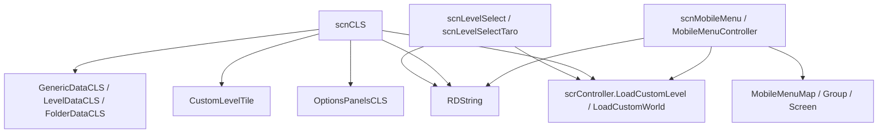

# CLS、关卡选择、移动菜单与本地化

## 基本信息

| 类型或类族 | 源码路径 | 主要职责 |
| --- | --- | --- |
| `LevelSelectBase` | `7thRhythmSource/ADOFAi/LevelSelectBase.cs` | 桌面关卡选择和 Taro 菜单的共同基类，维护静态 `instance`。 |
| `scnLevelSelect` | `7thRhythmSource/ADOFAi/scnLevelSelect.cs` | 桌面主关卡选择场景，处理岛屿切换、作弊码、传送门跳转、相机位置和 RD offer。 |
| `scnLevelSelectTaro` | `7thRhythmSource/ADOFAi/scnLevelSelectTaro.cs` | Taro DLC 菜单场景的关卡选择控制器，处理 Taro 菜单内按键和相机跳转。 |
| `scnCLS` | `7thRhythmSource/ADOFAi/scnCLS.cs` | 自定义关卡选择场景，扫描本地/Workshop/精选关卡，生成关卡 tile，显示 portal 信息并进入自定义关卡。 |
| `OptionsPanelsCLS` | `7thRhythmSource/ADOFAi/OptionsPanelsCLS.cs` | CLS 左右选项面板，负责分类、排序、搜索、No Fail、Speed Trial 和 key limiter。 |
| `GenericDataCLS` / `FolderDataCLS` / `LevelDataCLS` | `7thRhythmSource/ADOFAi/ADOFAI/*.cs` | CLS 使用的数据模型，统一关卡、文件夹和 `.adofai` 摘要。 |
| `CustomLevelTile` | `7thRhythmSource/ADOFAi/CustomLevelTile.cs` | CLS 关卡列表中的单个 tile，负责高亮、删除状态、不可用状态和图标加载。 |
| `MobileMenu` | `7thRhythmSource/ADOFAi/MobileMenu/*.cs` | 移动端/主机菜单系统，包含地图、分组、screen、输入、拖拽、子关卡和 DLC 入口。 |
| `RDString` | `7thRhythmSource/ADOFAi/RDString.cs` | 本地化入口，包装 Localization、字体切换、平台后缀、参数替换和 CJK 文本处理。 |

## 桌面关卡选择

`LevelSelectBase.Awake()` 只把 `instance` 设为当前对象。`scnLevelSelect` 和 `scnLevelSelectTaro` 都继承它，因此外部可通过 `LevelSelectBase.instance` 或各自的 `instance` 访问当前关卡选择控制器。

| 类型 | 关键成员 | 行为 |
| --- | --- | --- |
| `scnLevelSelect` | `CrownEntrance`、`CrownExit`、`MuseDashEntrance`、`MuseDashExit`、岛屿位置字段 | 使用固定位置区分主岛、Xtra、Crown、Muse Dash、CR2024 和 changing room。 |
| `scnLevelSelect` | `islands` | `Dictionary<GCNS.WorldData.IslandType, LevelSelectIsland>`，把世界 island 类型映射到场景岛屿对象。 |
| `scnLevelSelect` | `responsive` | 依赖控制器、移动状态、暂停、cutscene、输入和菜单状态决定是否响应跳转。 |
| `scnLevelSelect` | `JumpVertical()`、`JumpHorizontal()`、`JumpWithKey()`、`JumpAndWipeWithKey()` | 处理方向输入和快捷键式关卡选择跳转。 |
| `scnLevelSelect` | `JumpToWorldPortal()`、`JumpToIslandFloor()`、`JumpTo()` | 将世界名或岛屿位置转成星体/相机跳转。 |
| `scnLevelSelect` | `GoToCheatIsland()`、`GoToMuseDashIsland()` | 特殊入口跳转。 |
| `scnLevelSelect` | `CheckAudioBreak()` | 用 DSP 时间检查音频输出异常并触发提示。 |
| `scnLevelSelectTaro` | `JumpWithKey()`、`JumpToWorldPortal()`、`JumpToPosition()` | 在 Taro 菜单里根据按键、世界名或坐标移动。 |

`scnLevelSelect` 保存了多组 `RDCheatCode`，包括进入隐藏岛、解锁、切换特殊显示和进入小游戏等输入串。作弊码检测逻辑在 `Update()` 中和普通移动、DLC 入口、编辑器入口等输入一起处理。

## CLS 分类和数据来源

`scnCLS.Category` 包含 `Selection`、`Workshop`、`Featured`、`Tech`。`FeaturedLevelsSource` 包含 `Workshop`、`Local`、`DLC`、`None`。

| 数据来源 | 判断或路径 | 读取方式 |
| --- | --- | --- |
| Workshop | Steamworks 可用时，精选关卡默认走 Workshop source | `SteamWorkshop.GetSubscribedItems()` 查询已订阅 item，再读取安装目录。 |
| 本地 Featured | 文档目录下 `A Dance of Fire and Ice/Featured` 存在时 | 读取 `{id}/main.adofai`。 |
| DLC Addressables | `FeaturedLevelsSource.DLC` | 读取 Addressables 中 `FeaturedLevels/{id}/main`。 |
| Resources Featured | 兜底路径 | 读取 `Resources/FeaturedLevels/{id}/main`。 |
| 本地 Worlds | `A Dance of Fire and Ice/Worlds` | 扫描自定义世界目录。 |

`scnCLS.Awake()` 会设置 `localWorldsPath`、`localFeaturedPath`、`featuredLevelsSource`、字体、loading 文案、精选关卡缓存、DLC warning 文案和 level importer。精选关卡使用 `GCNS.FeaturedLevelsIDs`、`GCNS.TechFeaturedLevelsIDs` 与 `GCNS.featuredFolders` 建立 `extraLevels`、`techExtraLevels` 和 folder 数据。

## CLS 数据模型

| 类型 | 关键成员 | 行为 |
| --- | --- | --- |
| `GenericDataCLS` | `title`、`artist`、`author`、`description`、`difficulty`、`previewImage`、`previewIcon`、`previewIconColor`、`tags` | CLS 统一摘要基类。 |
| `GenericDataCLS.Hash` | `MD5Hash.GetHash(author + artist + title)` | 首次读取时计算并缓存，用作自定义世界成绩键。 |
| `GenericDataCLS.isLevel` / `isFolder` | 类型判断 | 区分 `LevelDataCLS` 和 `FolderDataCLS`。 |
| `FolderDataCLS` | `containingLevels` | 文件夹持有子关卡或子文件夹，索引器按 key 读写。 |
| `FolderDataCLS` | `localized`、`title`、`artist`、`author`、`description` | `localized` 为真时通过 `RDString.Get()` 返回本地化文案，否则返回原始字符串。 |
| `FolderDataCLS.Rename()` | 新标题不同才写入 | 返回是否真正改名。 |
| `LevelDataCLS` | 见 [LevelDataCLS](/api/data-models/LevelDataCLS.md) | 只解码关卡选择需要的 settings、标签、预览图、DLC 需求和读取结果。 |

## CLS 扫描、选择与进入关卡

| 方法 | 行为 |
| --- | --- |
| `Refresh(bool setup = false)` | 清空选择、停止预览、重置缓存；Workshop 分类会启动 `SteamWorkshop.GetSubscribedItems()`；随后扫描关卡并显示列表。 |
| `ScanLevels(CancellationToken cancelToken)` | 根据当前分类扫描 Workshop、Featured、Tech 或本地 Worlds；建立 `loadedLevels`、`loadedLevelDirs`、`loadedLevelTiles`、`loadedLevelIsDeleted` 和 `isWorkshopLevel`。 |
| `SearchLevels(string sub, bool alsoSelect = true)` | 根据搜索字符串筛选 tile；存在结果且 `alsoSelect` 为真时选择第一项。 |
| `SelectLevel(CustomLevelTile tileToSelect, bool snap)` | 高亮 tile，移动星体到 tile 位置，设置 `levelToSelect`，加载附近图标并停止旧的音频加载。 |
| `LoadTileIconsNearby(int targetIndex, int nearbyCount = 10)` | 只为附近 tile 加载图标，避免一次性处理所有图像。 |
| `DisplayLevel(string levelKey)` | 更新 portal 预览、作者、标题、描述、难度、统计、badge、DLC warning、seizure warning 和雷达图。 |
| `EnterLevel()` | 根据 `levelToSelect` 进入文件夹、订阅 Workshop item、打开 DLC 商店页或加载自定义关卡/世界。 |
| `EnterCategory(Category category)` | 设置分类并调用 `Refresh(setup: true)`。 |

`EnterLevel()` 会把 `GCS.customLevelIndex` 设为 0，按 `optionsPanels.speedTrial` 写入 `GCS.speedTrialMode`，关闭 practice，停止 MP3 加载。若选中项是文件夹，进入文件夹；若选中 Workshop item 但没有本地路径且 Steamworks 可用，就订阅该 item；若缺少 required DLC 且不是 Switch，就打开对应 Steam 商店页。真正加载时，精选内置关卡使用 `FeaturedLevels/{levelToSelect}/main`，本地目录则通过 `AdoPackageInstaller.FindLevelFile()` 找到关卡文件。

## OptionsPanelsCLS

| 成员 | 行为 |
| --- | --- |
| `PanelShown` | 表示左面板、右面板或无面板。 |
| `OptionName` | 包含 sorting、search、noFail、speedTrial、unlockKeyLimiter 等选项。 |
| `Option.SetState()` | 设置高亮和选中状态，切换图像颜色、文本颜色和缩放动画。 |
| `CheckInputs()` | 处理打开/关闭面板、上下切换选项、选择当前选项和搜索模式输入。 |
| `ToggleLeftPanel()` / `ToggleRightPanel()` | 切换分类/功能面板显示。 |
| `SortedLevelKeys()` | 按当前排序方式输出 CLS 关卡 key 列表。 |
| `UpdateSorting()` / `UpdateOrderText()` | 更新排序方式并写入 UI 文案。 |
| `ToggleNoFail()` | 切换 `GCS.useNoFail`。 |
| `ToggleSpeedTrial()` | 切换 speed trial 状态。 |
| `ToggleUnlockKeyLimiter()` | 切换 `GCS.useUnlockKeyLimiter`。 |
| `ToggleSearchMode(bool search)` | 打开或关闭搜索输入框，Switch 上搜索不可用。 |

`Persistence.clsSortingParameter` 和 `Persistence.clsSortingReversed` 会保存 CLS 排序选择；`Persistence.displayedCLSIntro` 控制首次进入 CLS 的引导面板。

## CustomLevelTile

| 方法 | 行为 |
| --- | --- |
| `StartEffect(scrPlanet planet)` | 继承 `ffxPlusBase`，作为地板效果入口。 |
| `Highlight(bool highlight = true, bool instant = false)` | 记录选中状态，并对 `InfoContainer` 和 blur 做动画。 |
| `SetDeleted()` | 设置删除状态，显示 removed 文案。 |
| `MarkUnavailable()` | 标记不可用 tile。 |
| `LoadTileIcon(string iconPath, Color iconColor)` | 启动图标加载协程。 |
| `ProcessIconTexture(Texture2D icon, Color iconColor)` | 处理图标纹理并写入 `RawImage`。 |
| `OnDestroy()` | 停止未完成的图标加载协程。 |

## 移动菜单结构

移动菜单位于 `MobileMenu` 命名空间。它用 JSON 地图资源生成分组和 screen，再由 `MobileMenuController` 处理移动、触摸、按钮、DLC 入口和进入关卡。

| 类型 | 关键成员或方法 | 行为 |
| --- | --- | --- |
| `scnMobileMenu` | `firstTimeLoadingScene`、`introPhase`、`menuController`、`reviewPromptController`、`coopIntroController` | 场景入口；`Start()` 根据 intro 状态、地图和加载完成事件启动菜单。 |
| `MobileMenuController` | `map`、`selectedScreenIndex`、`currentGroup`、`currentScreen` | 当前移动菜单状态。 |
| `MobileMenuController` | `LoadMap()` / `LoadMapAsync()` | 加载 `MobileMenuMap` 并生成 screen。 |
| `MobileMenuController` | `JumpToScreen()` | 切换当前 screen，刷新 caption、背景、按钮、难度和子关卡 UI。 |
| `MobileMenuController` | `MoveInDirection()` | 根据方向在当前 group 或链接 group 之间移动。 |
| `MobileMenuController` | `EnterLevel()` | 静态方法，调用控制器进入指定世界关卡。 |
| `MobileMenuController` | `OpenFeaturedLevels()` | 打开 CLS 的 Featured 或 Tech 分类。 |
| `MobileMenuMap` | `rootGroup`、`groupLUT`、`portalLUT`、`mapCenter` | 解析地图资源并建立 group 和 portal 查找表。 |
| `MobileMenuMap` | `Build()` | 建立 group 连接、位置和 screen transform。 |
| `MobileMenuMap` | `EvaluateAllConditions()` | 遍历所有 screen，根据 visibility conditions 设置可见性。 |
| `MobileMenuGroup` | `screens`、`visibleScreens`、`captionKey`、`linkedGroup`、`groupToSpawn`、`theme`、`speedTheme` | 一组横向 screen 和上下左右链接关系。 |
| `MobileMenuScreen` | `New(string screenType)`、`Decode()`、`Select()`、`Interact()`、`GetDescription()`、`GetDifficulty()` | screen 基类，按类型创建 title、portal、description、gallery、credits、DLC transition 等子类。 |

`MobileMenuMap.EvaluateConditions()` 支持以下条件：`completed:{world}`、`speedTrial:{world}`、`stage:{number}`、`condition:{name}`、`singleplayer`、`showTech`。自定义条件包括 `XF`、`XC`、`XR`、`XH`、`TaroRift`、`NeoCosmosAd`。

## 本地化入口

`RDString` 是主工程使用最频繁的文本入口。

| 成员或方法 | 行为 |
| --- | --- |
| `Setup()` | 初始化 Localization、语言和字体数据。 |
| `AvailableLanguages` | 返回 `Localization.AvailableLanguages`。 |
| `languageSuffix` | 根据当前语言返回后缀。 |
| `isCJK` / `isChinese` | 判断当前语言是否需要 CJK 处理。 |
| `SetLocalizedFont(this Text/TMP_Text/TextMesh)` | 为 UI Text、TMP Text 或 TextMesh 设置适合当前语言的字体。 |
| `SetRDString(this Text text, string key)` | 设置字体并把 `RDString.Get(key)` 写入 UI Text。 |
| `Get(string key, Dictionary<string, object> parameters = null)` | 调用 `GetWithCheck()`，返回本地化字符串。 |
| `GetEnumValue()` | 先查 `enum.{type}.{value}`，失败后查 `enum.common.{value}`。 |
| `GetWithCheck()` | 依次查 Switch 后缀 `.nx`、gamepad 后缀 `.gamepad`、mobile 后缀 `.mobile`、原始 key；`RDNull` 会回退英文。 |
| `ChangeLanguage(SystemLanguage language)` | 修改语言并通知 Localization。 |
| `AddSpacesToChineseString()` | 对中文字符串插入排版用空格。 |
| `DownloadStringsFromWeb()` | 从配置的 localization 文档拉取公开表格数据，并重设当前语言。 |
| `ReplaceParameters()` | 替换字符串中的参数占位。 |

`RDStringToUIText` 是组件式桥接：`Start()` 会把 key 本地化到 Text，并可按 CJK 缩放、移动端放大和语言字体设置处理 UI。

## 调用关系

## 相关页面

| 页面 | 关系 |
| --- | --- |
| [LevelDataCLS](/api/data-models/LevelDataCLS.md) | CLS 摘要数据的解码细节。 |
| [场景流转与加载跳转](/api/runtime/scene-loading-flow.md) | 解释自定义关卡和世界如何进入 `scnGame`。 |
| [全局状态、常量与存档](/api/platform/global-state-persistence.md) | 解释 CLS 排序、播放次数、自定义世界成绩和 `GCS.customLevelPaths`。 |
| [平台 Helper、DLC、Steam 与服务](/api/platform/platform-dlc-steam-services.md) | 解释 Workshop、DLC 和平台 URL 打开。 |
