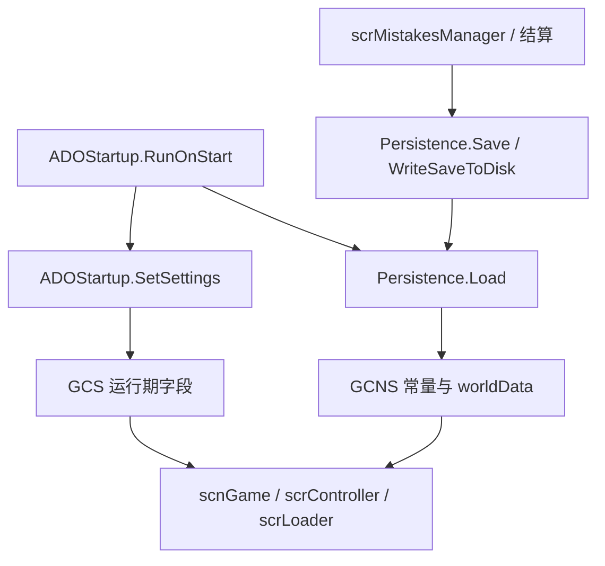

# 全局状态、常量与存档

## 基本信息

| 类型 | 源码路径 | 继承关系 | 主要职责 |
| --- | --- | --- | --- |
| `GCS` | `7thRhythmSource/ADOFAi/GCS.cs` | 普通静态状态容器 | 保存跨场景临时状态、运行时开关、命中窗口常量、文件扩展名、输入键集合和调试分支判断。 |
| `GCNS` | `7thRhythmSource/ADOFAi/GCNS.cs` | 普通常量容器 | 保存发布号、场景名、世界元数据、精选关卡 ID、分支列表、bundle 路径和世界分类数组。 |
| `Persistence` | `7thRhythmSource/ADOFAi/Persistence.cs` | `RDClassDll` | 统一读写通用存档、自定义关卡存档、设置项、世界进度、成就同步、云存档比较和延迟保存。 |

这三个类型共同组成 ADOFAI 的全局状态层。`GCS` 偏向本次运行中的当前状态，`GCNS` 偏向不会随玩家操作变化的常量和元数据，`Persistence` 负责把玩家设置与进度写入 `PlayerPrefsJson` 或 Unity `PlayerPrefs`。

## GCS：运行期状态容器

`GCS` 没有命名空间，也没有 Unity 生命周期方法。源码中字段几乎全部为 `public static`，由启动流程、选关、运行时控制器、编辑器和暂停菜单直接读写。

| 字段或属性组 | 代表成员 | 源码行为 |
| --- | --- | --- |
| checkpoint 与练习 | `_checkpointNum`、`checkpointNum`、`savedCheckpointNum`、`checkpointBeforePractice`、`practiceMode`、`practiceLength`、`practiceSpeed` | 运行时 checkpoint、练习模式和练习片段长度。`checkpointNum` 属性只是包装 `_checkpointNum` 的 get/set。 |
| speed trial | `speedTrialMode`、`speedTrialModeBeforePractice`、`currentSpeedTrial`、`nextSpeedRun`、`speedRunBeforePractice`、`minSpeedrunSpeed`、`multiplierIncrement` | 关卡进入、练习模式和重开时使用的速度倍率状态。 |
| 自定义关卡 | `customLevelPaths`、`loadCustomFromBundle`、`customLevelIndex`、`internalLevelName`、`customLevelId` | `LoadCustomLevel`、`LoadCustomWorld`、内部文件关卡和精选关卡识别会读写这些字段。 |
| 事件元数据 | `levelEventsInfo`、`settingsInfo`、`levelEventIcons`、`eventCategoryIcons`、`levelEventTypeString`、`filteredEvent` | `ADOStartup.SetupLevelEventsInfo()` 写入，编辑器按钮、属性面板和 `LevelEvent` 构造读取。 |
| 场景加载 | `sceneToLoad`、`previousScene`、`directionToWipe`、`lastVisitedScene` | `scrLoader` 与 `scrController.PortalTravelAction()` 用这些字段在场景之间传递目标和 wipe 方向。 |
| 命中窗口 | `HITMARGIN_COUNTED`、`HITMARGIN_PERFECT`、`HITMARGIN_PURE`、`HITMARGIN_MINIMUM_SECONDS_*`、`hitMarginLimit` | `scrMisc.GetHitMargin` 和输入判定模块读取这些常量或设置，按难度、移动端和 speed trial 修正命中窗口。 |
| 文件扩展名 | `SupportedAudioFiles`、`SupportedImageFiles`、`SupportedVideoFiles`、`levelExtensions`、`levelZipExtensions`、`levelTextExtensions` | 编辑器文件浏览、音频导入、图片导入和自定义关卡压缩包判断使用。 |
| 输入键集合 | `SpecialKeys`、`LevelSelectKeys`、`CLSKeys`、`joystickButtons` | 输入过滤、选关和自定义关卡选择界面的快捷键集合。 |
| 调试与分支 | `steamBranchName`、`isDev`、`isTester`、`allowDebug`、`isInternalBranch` | 通过 Discord 用户 ID、Steam 分支名和 `GCNS` 分支数组判断是否允许调试入口。 |
| 临时演出标记 | `seenCutscene*`、`enableCutsceneT5`、`banished`、`puzzle`、`FOOL_SWIRL`、`FOOL_JOKER` | 官方流程、特殊演出或隐藏逻辑使用的运行期布尔标记。 |

## GCNS：场景名、世界元数据与 bundle 路径

`GCNS` 同样是静态容器，但它主要保存常量和由资源文件懒加载出的世界数据。

| 成员 | 类型 | 源码行为 |
| --- | --- | --- |
| `releaseNumber` | `const int` | 当前发布号为 `141`，`Persistence.Load()` 和 `WriteSaveToDisk()` 都会把存档版本写成该数值。 |
| `buildDate` / `buildCommit` | `string` | 启动时由 `ADOStartup.SetBuildDateAndCommit()` 从 Resources 写入。 |
| `WorldData` | 嵌套类 | 从 `LevelMetadata` 的世界字典解码 index、关卡数量、speed trial 目标、checkpoint、DLC、tech、credits、medal、difficulty、island 等字段。 |
| `FeaturedFolder` | record | 保存精选文件夹 ID、标题、作者、难度、颜色字符串、关卡 ID 数组和 tech 标记。 |
| `FeaturedLevelsIDs` / `TechFeaturedLevelsIDs` | `uint[]` | `ADOBase.isClassicFeaturedLevel`、`isTechFeaturedLevel` 和存档迁移逻辑用于判断精选关卡。 |
| `worldData` | `Dictionary<string, WorldData>` | 首次读取时加载 `Resources/LevelMetadata`，反序列化为世界名到 `WorldData` 的字典。 |
| `allWorlds` | `string[]` | 从 `worldData` 中筛掉 `doNotBuild` 和 `notRealWorld` 后缓存。 |
| `dlcWorlds` / `xtraWorlds` / `museDashWorlds` / `crownWorlds` | `string[]` | 按 `WorldData.isTaro`、`isXtra`、`isMuseDash`、`isCrown` 过滤并缓存。 |
| `sceneLevelSelect` | `string` | 根据 `ADOBase.isMobileMenu` 返回 `scnMobileMenu` 或 `scnLevelSelect`。 |
| `FeaturedLevelsBuildPath` | `string` | `Persistence.DataPath + "/Bundles"`。 |
| `FeaturedLevelsLoadPath` / `BundlesLoadPath` | `string` | `Path.GetFullPath("./") + "Bundles"`。 |
| `neoCosmosBundleAssetsPath` / `neoCosmosBundleScenesPath` / `bundleShadersPath` | `string` | 指向 Bundles 目录中的 DLC assets、scenes 和 builtin shaders bundle 文件。 |

## Persistence：存档分区

`Persistence` 同时使用 `PlayerPrefsJson` 和 Unity `PlayerPrefs`。源码中 `generalPrefs` 与 `customPrefs` 是主要入口：

| 分区 | 类型 | 用途 |
| --- | --- | --- |
| `generalPrefs` | `PlayerPrefsJson.Get(PlayerPrefsJson.FileType.General)` | 普通设置、官方进度、校准预设、语言、音量、视觉质量、编辑器设置、DLC 进度和临时 checkpoint progress。 |
| `customPrefs` | `PlayerPrefsJson.Get(PlayerPrefsJson.FileType.CustomWorld)` | 自定义世界完成度、尝试次数、准确率、speed trial、play index、精选关卡订阅状态和 CLS 总游玩次数。 |
| Unity `PlayerPrefs` | `PlayerPrefs.Get*` / `Set*` | 源码中仍用于 audio buffer、输入偏移、视觉偏移、编辑器高度、最近目录和最近打开关卡等字段。 |

`PersistenceCoroutineExecuter` 是私有嵌套 `MonoBehaviour`。`coroutineExecuter` 属性在首次保存时创建名为 `Persistence Saver` 的 GameObject，并 `DontDestroyOnLoad`，用于 0.5 秒延迟保存。

## Persistence 属性分组

| 分组 | 代表属性 | 读写行为 |
| --- | --- | --- |
| 当前关卡与解锁 | `savedCurrentLevel`、`unlockedXF`、`unlockedXC`、`unlockedXH`、`unlockedXR`、`unlockedMD`、`unlockAllLevels` | 读取或写入 `generalPrefs` 中的关卡、解锁和全解锁键；部分 setter 会调用 `Save()`。 |
| 音频与画面 | `globalVolume`、`musicVolume`、`hitSoundVolume`、`sfxVolume`、`interfaceVolume`、`audioBufferSize`、`visualQuality`、`visualEffects`、`realVisualEffects`、`antiAliasing`、`vSync` | 启动设置和选项菜单读取；`audioBufferSize` setter 会同步修改 Unity `AudioSettings` 配置。 |
| 偏移与语言 | `inputOffset`、`visualOffset`、`language` | `inputOffset` 默认值为 `999f`，表示未设置；语言从 `generalPrefs` 映射到 `SystemLanguage`。 |
| 编辑器偏好 | `favoriteEditorEvents`、`editorScale`、`markFloorWithComment`、`disableRewindButton`、`shortcutPlaySpeed`、`quickScrubbedPlay`、`editorUseLegacyZoom`、`disableEventsPageRepeat`、`disableAutoAngleOffset`、`disableCameraDecorationFocus`、`enableProEvents` | 编辑器动作、面板、偏好设置和播放预览读取。 |
| 判定与输入 | `hitMarginLimit`、`keyLimiterKeys`、`showUnlockKeyLimiterButton`、`GetChosenAsynchronousInput()`、`GetDefaultDifficulty()` | 输入系统、命中限制和难度默认值读取。 |
| UI 与展示 | `showDetailedResults`、`showXAccuracy`、`hitErrorMeterSize`、`hitErrorMeterShape`、`skipIntroBehavior`、`multiTapTileBehavior`、`holdBehavior`、`hideRichPresenceDetails`、`displayedCLSIntro` | 暂停、结算、错误条、片头跳过、Rich Presence 和 CLS 引导相关设置。 |
| DLC 与特殊进度 | `taroStoryProgress`、`taroEXProgress`、`banishmentPuzzleComplete`、`t5BestTime`、`clearedTechFeatured`、`mobileTechUnlocked` | DLC 菜单、官方关卡流程、tech 精选解锁和移动端技术解锁读取。 |
| 玩家外观 | `GetPlayerColor()`、`SetPlayerColor()`、`GetSamuraiMode()`、`SetSamuraiMode()`、`GetEmojiMode()`、`SetEmojiMode()` | 读写双星体颜色、自定义颜色、武士模式和表情模式键。 |

## 世界进度方法族

官方世界进度按世界 index 加 `dd(index)` 后缀保存。`dd(int num, bool ignoreFools = false)` 会把数字格式化成两位字符串；当 `GCS.FOOL_JOKER` 为真且未忽略时，会把小于 1000 的数字加 1000。

| 方法族 | 代表方法 | 保存内容 |
| --- | --- | --- |
| 完成度 | `GetPercentCompletion()`、`SetPercentCompletion()`、`IsWorldComplete()`、`ResetWorldProgress()` | 世界完成比例和完成判断。 |
| 准确率 | `GetBestPercentAccuracy()`、`SetBestPercentAccuracy()`、`GetBestPercentXAccuracy()`、`SetBestPercentXAccuracy()`、`IsWorldPerfect()` | 普通准确率、X 准确率和 perfect 判断。 |
| speed trial | `GetBestSpeedMultiplier()`、`SetBestSpeedTrial()`、`IsSpeedTrialComplete()`、`GetSpeedTrialAimForWorld()` | 世界最佳速度倍率和目标倍率判断。 |
| 尝试次数 | `GetWorldAttempts()`、`SetWorldAttempts()`、`IncrementWorldAttempts()`、`GetWorldAttemptsWithoutNewBest()`、`IncrementWorldAttemptsWithoutNewBest()` | 世界尝试次数、新纪录间隔尝试次数。 |
| 教程进度 | `GetLevelTutorialProgress()`、`SetLevelTutorialProgress()` | 世界内教程或关卡推进位置。 |
| 最高可能准确率 | `GetIsHighestPossibleAcc()`、`SetIsHighestPossibleAcc()` | 是否达成该世界当前可获得的最高准确率。 |

## 自定义关卡与 CLS 存档

自定义关卡存档统一使用 hash 作为键的一部分，前缀为 `CustomWorld_`。

| 方法 | 键模式 | 行为 |
| --- | --- | --- |
| `GetCustomWorldCompletion()` / `SetCustomWorldCompletion()` | `CustomWorld_{hash}_Completion` | 读取或写入自定义世界完成度。 |
| `GetCustomWorldAttempts()` / `SetCustomWorldAttempts()` / `IncrementCustomWorldAttempts()` | `CustomWorld_{hash}_Attempts` | 读取、写入或递增自定义世界尝试次数；递增后保存。 |
| `GetCustomWorldAccuracy()` / `SetCustomWorldAccuracy()` | `CustomWorld_{hash}_Accuracy` | 读取或写入自定义世界普通准确率。 |
| `GetCustomWorldXAccuracy()` / `SetCustomWorldXAccuracy()` | `CustomWorld_{hash}_XAccuracy` | 读取或写入自定义世界 X 准确率。 |
| `GetCustomWorldSpeedTrial()` / `SetCustomWorldSpeedTrial()` | `CustomWorld_{hash}_SpeedTrial` | 读取或写入自定义世界 speed trial 倍率。 |
| `GetCustomWorldMinDeaths()` / `SetCustomWorldMinDeaths()` | `CustomWorld_{hash}_MinDeaths` | 读取或写入自定义世界最少死亡次数，读取默认值为 `-1`。 |
| `GetCustomWorldPlayIndex()` / `SetCustomWorldPlayIndex()` | `CustomWorld_{hash}_PlayIndex` | 读取或写入自定义世界播放顺序索引，读取默认值为 `-1`。 |
| `GetCustomWorldIsHighestPossibleAcc()` / `SetCustomWorldIsHighestPossibleAcc()` | `CustomWorld_{hash}_isHighestPossibleAcc` | 读取或写入自定义世界最高可能准确率标记。 |
| `GetCLSTotalPlays()` / `SetCLSTotalPlays()` / `IncrementCLSTotalPlays()` | `CLSTotalPlays` | 读取、写入或递增 CLS 总游玩次数；递增后保存。 |
| `HasSubscribedToFeatured()` / `SetSubscribedToFeatured()` | `SubscribedToFeatured_{levelId}` | 读取或写入精选关卡订阅状态。 |

## checkpoint 临时进度

`GetSavedProgress()`、`SetSavedProgress()`、`DeleteSavedProgress()` 使用 `generalPrefs` 的 `savedProgress` 字典。运行时结算与 checkpoint 模块会把 hit margins、checkpoint、level、hardestDifficulty 和 checkpointsUsed 写入这个字典；重新进入关卡时再恢复。

## 加载、迁移与保存

| 方法 | 主要行为 |
| --- | --- |
| `Load()` | 设置 `PlayerPrefsJson.nonSyncedKeys`，加载所有 prefs 文件；为新文件写入 `version = 141`；把旧 general prefs 中的 `CLSTotalPlays`、`CustomWorld_`、`SubscribedToFeatured_` 键迁移到 `customPrefs`；迁移旧 `skipIntroAfterFirstTry` 和 `perfectsOnlyMode`；处理若干版本升级；重建 `scrConductor.userPresets`；根据已完成的 Taro 世界推进 DLC story progress；最后把 general 与 custom 的版本写为 `141`。 |
| `Save(bool instant = false)` | `instant` 为真时直接 `SaveAction()`；否则停止现有保存协程，启动等待 0.5 秒的 `SaveCo()`。 |
| `SaveAction()` | 调用 `WriteSaveToDisk()`，如果 `GameServices.Instance` 已初始化且 load status 完成，则调用 `LoadGame()`。 |
| `WriteSaveToDisk()` | 把 `scrConductor.userPresets` 转成列表写入 `calibrationPresets`，设置 general 与 custom 版本为 `141`，然后 `PlayerPrefsJson.SaveAllFiles()`。 |
| `GiveAchievementsAndSave()` | 非 Unity Editor 下先 `GiveAchievements()`，再 `Save()`。 |
| `RecoverSaveDataFromAchievements()` | Steam 初始化后读取已获得成就，补写世界完成、perfect、speed trial、DLC story progress 和 DLC medal。 |
| `IsCompatibleWithCloud(PlayerPrefsJson cloudPrefs)` | 当本地发布号 `141` 大于等于云存档版本时返回真。 |
| `CheckWithCloud(PlayerPrefsJson cloudPrefs, bool firstTime)` | 遍历世界并比较云端 progress、准确率、speed trial 等数据，把更高进度同步到本地。 |

`Load()` 捕获 `IOException` 中 HResult 低 16 位为 `39` 或 `112` 的情况，并调用 `Notification.instance.ShowNoSpace()`，用于处理存储空间不足类错误。

## 与启动和运行时的关系

## 相关页面

| 页面 | 关系 |
| --- | --- |
| [ADOStartup](/api/core/ADOStartup.md) | 启动时调用 `Persistence.Load()`，并把 `Persistence` 中的设置写入全局运行状态。 |
| [场景流转与加载跳转](/api/runtime/scene-loading-flow.md) | 解释 `GCS.sceneToLoad`、`customLevelPaths`、`internalLevelName` 如何驱动关卡加载。 |
| [结算、成绩与进度保存](/api/runtime/results-save-flow.md) | 解释运行时成绩如何写回 `Persistence`。 |
| [编辑器长流程](/api/editor/scnEditor-workflows.md) | 解释最近关卡、最近目录、播放预览和编辑器状态如何使用 `Persistence` 与 `GCS`。 |
