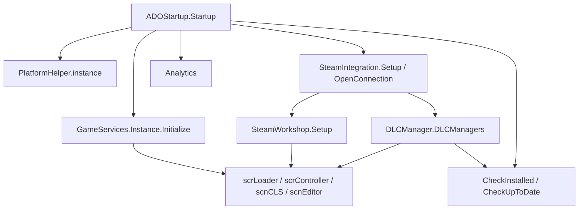

# 平台 Helper、DLC、Steam 与服务

## 基本信息

| 类型或类族 | 源码路径 | 主要职责 |
| --- | --- | --- |
| `ADOFAI.Common.Platform` | `7thRhythmSource/ADOFAi/ADOFAI.Common.Platform/*.cs` | 根据当前平台选择 helper，读取活动音频输出设备，打开外部 URL。 |
| `DLCManager` | `7thRhythmSource/ADOFAi/DLCManager.cs` | 管理 DLC 拥有状态、安装状态、bundle 名、Addressables build commit 和 DLC 场景/关卡识别。 |
| `NeoCosmosManager` | `7thRhythmSource/ADOFAi/NeoCosmosManager.cs` | Neo Cosmos DLC 的具体管理器，识别 Taro 场景和 Taro 关卡。 |
| `VegaDLCManager` | `7thRhythmSource/ADOFAi/VegaDLCManager.cs` | Team Vega DLC 的具体管理器，识别 Vega 场景和非 Taro 的 EX 关卡。 |
| `FeaturedDLCManager` | `7thRhythmSource/ADOFAi/FeaturedDLCManager.cs` | Featured Levels 的管理器，源码中默认拥有，但 `CheckInstalled()` 会把 installed 设为 false。 |
| `SteamIntegration` | `7thRhythmSource/ADOFAi/SteamIntegration.cs` | 初始化 Steamworks、读取 Steam 分支和用户统计、写入成就、检测 DLC license、驱动 Steam callbacks。 |
| `SteamWorkshop` | `7thRhythmSource/ADOFAi/SteamWorkshop.cs` | Workshop 浏览、订阅、查询、下载、发布、更新和错误状态记录。 |
| `GameServices` | `7thRhythmSource/ADOFAi/GameServices.cs` | 平台服务抽象层，处理登录、云存档同步、成就队列、震动、帧率和磁盘空间接口。 |
| `Analytics` | `7thRhythmSource/ADOFAi/Analytics.cs` | 记录官方关卡、编辑器制作、编辑器播放、自定义关卡游玩时间，并上传 Steam stats 或 Unity branch 事件。 |

## 启动顺序中的位置

`ADOStartup.Startup()` 在场景加载前执行。和本页相关的调用顺序如下：

| 顺序 | 调用 | 行为 |
| --- | --- | --- |
| 1 | `GetPlatform()` | 判断当前平台，供 `PlatformHelper.Init()` 后续选择 helper。 |
| 2 | `LoadSaveData()` | 先加载本地存档，供设置和服务层读取。 |
| 3 | `SetupSystems()` | 初始化基础系统。 |
| 4 | `InitializeSteamSDK()` | 初始化 Steam SDK 前置逻辑。 |
| 5 | `GameServices.Instance.Initialize()` | 初始化平台服务；默认实现是 `GameServicesEmpty`。 |
| 6 | `InitializeSteamIntegration()` | 读取 Steam 分支，初始化 Steam callbacks 和 workshop。 |
| 7 | DLC `CheckInstalled()` | 遍历 `DLCManager.DLCManagers` 检查 bundle 文件存在性。 |
| 8 | DLC `CheckUpToDate()` | 已拥有且已安装时读取 Addressables 中的 `buildCommit`，和 `GCNS.buildCommit` 比较。 |
| 9 | `Persistence.GiveAchievements()` | 根据本地进度补发 Steam 成就。 |
| 10 | `Analytics.LimitAnalyticsIfModded()` / `UploadBranchToUnity()` | 根据是否检测到修改关闭异常捕获，并按天上传 branch 信息。 |

## 平台 Helper

`PlatformHelper.instance` 是懒加载单例，`Init()` 根据 `ADOBase.platform` 返回具体实现。

| 实现 | 源码路径 | 行为 |
| --- | --- | --- |
| `PlatformHelperDefault` | `ADOFAI.Common.Platform/PlatformHelperDefault.cs` | 音频设备名返回 `"*"`，设备类型返回默认类型，`OpenURL()` 调用 `Application.OpenURL()`，`Update()` 为空。 |
| `PlatformHelperWindows` | `ADOFAI.Common.Platform.Windows/PlatformHelperWindows.cs` | 通过 `adofaiplatformhelper` 原生库读取 speaker name/type，初始化后注册 speaker name callback；回调会把 `scrConductor.isAudioOutputDeviceChanged` 设为 true。 |
| `PlatformHelperMac` | `ADOFAI.Common.Platform.Mac/PlatformHelperMac.cs` | 通过 `adofaiplatformhelper` 的 `get_speaker_name`、`get_speaker_type` 和 speaker callback 维护静态音频设备名/类型；设备变化时写 `scrConductor.isAudioOutputDeviceChanged`。 |
| `PlatformHelperLinux` | `ADOFAI.Common.Platform.Linux/PlatformHelperLinux.cs` | 通过 `adofaipulse` 的 `get_device_name()` 读取设备名，构造时启动线程每秒刷新；设备名变化时写 `scrConductor.isAudioOutputDeviceChanged`。 |

`AudioDevice.Default` 返回名称 `"*"` 和默认 `AudioOutputType`。`IPlatformHelper` 只定义四个成员：`GetActiveAudioDeviceName()`、`GetActiveAudioDeviceType()`、`Update()`、`OpenURL(string url)`。

## DLCManager 基类

`DLCManager` 是抽象类，静态构造会调用 `Setup()`。`Setup()` 只执行一次，并把 `NeoCosmosManager`、`VegaDLCManager`、`FeaturedDLCManager` 加入 `DLCManagers`。

| 成员 | 类型 | 作用 |
| --- | --- | --- |
| `steamAppId` | `uint` | DLC 对应的 Steam app id，`SteamIntegration.OpenConnection()` 用它检查 license。 |
| `winDepotId` / `win64DepotId` / `macDepotId` / `linuxDepotId` | `uint` | 各平台 depot id。 |
| `steamWorkshopTag` | `string` | Workshop 标签；发布关卡时可作为依赖 tag，打开 Workshop 时也会用于排除未安装 DLC 标签。 |
| `groupName` | `string` | Addressables group 名和 bundle 名来源。 |
| `own` | `bool` | 是否拥有 DLC；Steam 初始化后由 `SteamApps.BIsDlcInstalled()` 写入，部分管理器构造时也会设置。 |
| `installed` | `bool` | 本地 bundle 是否已安装。 |
| `buildCommit` | `string` | 从 Addressables 的 `{groupName}/buildCommit` 读取。 |
| `upToDate` | `bool` | 当前 build commit 是否和 DLC build commit 一致。 |
| `bundleName` | `string` | `groupName.ToLower().Replace(" ", "")`。 |

| 方法 | 行为 |
| --- | --- |
| `GetMenuScene()` | 子类返回 DLC 菜单场景。 |
| `IsDLCScene(string name)` | 子类判断场景名是否属于该 DLC。 |
| `IsDLCLevel(string name)` | 子类判断关卡名是否属于该 DLC。 |
| `IsDLCSceneOrLevel(string name)` | 先判断场景，再判断关卡。 |
| `CheckInstalled()` | 检查 `GCNS.BundlesLoadPath` 下 `{bundleName}_scenes_all.bundle` 与 `{bundleName}_assets_all.bundle` 是否同时存在。 |
| `CheckUpToDate()` | 未拥有或未安装时直接返回；非稳定 Steam 分支下直接设为 upToDate；否则读取 Addressables buildCommit 并和 `GCNS.buildCommit` 比较。 |

## DLC 子类行为

| 子类 | 初始化字段 | 场景识别 | 关卡识别 | 菜单场景 |
| --- | --- | --- | --- | --- |
| `NeoCosmosManager` | `steamAppId = 1977570`，depot id 为 1977571 到 1977574，`steamWorkshopTag = "Neo Cosmos"`，`groupName = "Neo Cosmos"` | `name.StartsWith("scnTaro")` | 非空且首字符为 `T` | `scrController.instance.GetTaroMenuToGoTo()` |
| `VegaDLCManager` | `steamAppId = 2016430`，depot id 为 2016431 到 2016434，`groupName = "Team Vega"` | `name.ToLower().Contains("vega")` | 非空、首字符不是 `T` 且以 `EX` 结尾 | `scnVegaMenu` |
| `FeaturedDLCManager` | `own = true`，`groupName = "Featured Levels"` | 永远 false | 永远 false | `GCNS.sceneLevelSelect` |

`RDUtils.IsTaro()`、`IsTaroScene()`、`IsVega()`、`IsVegaScene()` 都直接委托对应 DLC 管理器。`RDUtils.CheckDLCLevelPlayable(string name)` 遍历所有 DLC 管理器；如果某个管理器认为该名称是 DLC 关卡，就返回它的 `installed`，否则返回 true。

## SteamIntegration

`SteamIntegration.instance` 懒加载时会调用 `Setup()`。`Setup()` 创建实例并执行 `OpenConnection()`；如果 Steamworks 已初始化，还会调用 `SteamWorkshop.Setup()`，并读取 Steam Deck 状态写入 `RDC.runningOnSteamDeck` 和 `RDC.isSteamDeckOnSteamOS`。

| 成员 | 行为 |
| --- | --- |
| `initialized` | `SteamAPI.Init()` 成功后为 true。 |
| `everInitialized` | 防止同一 session 重复初始化 SteamAPI。 |
| `gameID` | `OpenConnection()` 中由 `SteamUtils.GetAppID()` 创建。 |
| `steamStatArray` | 当前只包含 `stat_test`。 |
| `steamAchievementArray` | 保存 29 个基础成就，包含 World complete、perfect、trial、BonusComplete、Game100PercentComplete。 |
| `userStatsReceived` / `userStatsStored` / `userAchievementStored` | 通过 Steamworks callback 接收统计、保存和成就事件。 |

| 方法 | 行为 |
| --- | --- |
| `OpenConnection()` | 创建 callbacks，遍历 DLC 管理器并用 `SteamApps.BIsDlcInstalled()` 写入 `own`；请求当前 stats 后读取 `steamStatArray`。 |
| `CheckCallbacks()` | `initialized` 为真时调用 `SteamAPI.RunCallbacks()`。 |
| `CloseConnection()` | 当前实例关闭时调用 `SteamAPI.Shutdown()`，并重置初始化标记。 |
| `GetStatValue()` / `SetStatValue()` | 从本地 stats 数组读取或累加写入 Steam stats，并调用 `StoreStats()`。 |
| `GetSteamFriends()` / `GetPlayersName()` | 读取 Steam 好友名数组和当前 persona name。 |
| `UnlockAchievementWithName(string achievement)` | 直接调用 `SteamUserStats.SetAchievement(achievement)`。 |
| `ClearAllAchievements()` / `ResetAllData()` | 清除本地数组中的所有成就，或重置 Steam stats/achievement 数据。 |

`OnUserStatsReceived()` 在 game id 匹配且结果 OK 时刷新成就状态、成就显示名、成就描述和 stat 值；失败时写日志。`OnUserStatsStored()` 处理 stats 存储失败，invalid param 时会用 OK 结果重刷一次 stats。`OnAchievementStored()` 输出解锁或进度日志。

## SteamWorkshop

`SteamWorkshop` 是纯静态类。它用 `errors` 列表表示最近一次 Workshop 操作的错误，`OperationSuccess` 等价于 `errors.Count == 0`。

| 成员 | 作用 |
| --- | --- |
| `WorkshopError` | 枚举 Workshop 查询、下载、上传、删除、预览图、目录和 tag 转换等错误。 |
| `ResultItem` | 保存 Workshop item id、标题、本地路径、预览图路径和 tags。 |
| `resultItems` | 查询已发布或已订阅项目后的结果列表。 |
| `itemUploadProgress` | `CheckUploadInfo()` 根据 `SteamUGC.GetItemUpdateProgress()` 更新。 |
| `gettingSubscribedItemsInProgress` | `GetSubscribedItems()` 执行期间为 true，并在 finally 中复位。 |
| `mustAcceptWorkshopLegalAgreement` | `SubmitItemUpdateResult_t` 返回需要接受协议时写入。 |
| `overlayActive` | Steam overlay activate callback 写入。 |

| 方法 | 行为 |
| --- | --- |
| `Setup()` | 注册下载、取消订阅、overlay 和 Steam Deck 浮动输入 callbacks。 |
| `OpenWorkshop()` | 打开 ADOFAI Workshop 页面；对有 `steamWorkshopTag` 但未安装的 DLC，把 tag 加入 `excludedtags[]`。 |
| `ShowItemOnWorkshop()` | 打开指定 `PublishedFileId_t` 的 Steam community file 页面。 |
| `OverlayEnabled()` / `ShowTextInput()` | 调用 Steam overlay 和 Steam Deck 浮动输入 API。 |
| `Subscribe()` / `Unsubscribe()` | 调用 `SteamUGC.SubscribeItem()` 或 `UnsubscribeItem()`。 |
| `GetPublishedItems(int pageNumber = 1)` | 查询当前用户发布的 Workshop 项目，并下载预览图到 `Application.persistentDataPath`。 |
| `GetSubscribedItems()` | 查询订阅项目，必要时下载，读取安装路径和 tags，生成 `ResultItem`。 |
| `ItemIsUsable()` | 检查 item state：不是下载中、等待下载或需要更新，并且已安装。 |
| `GetItemDownloadProgress()` | 读取下载字节数并返回 0 到 1 的进度；NaN 时返回 0。 |
| `UploadToWorkshop()` | 校验标题、预览图、内容目录、tag 和描述；创建或更新 item，设置标题、描述、tag、预览图、内容目录和可见性，并为 required DLC 添加 app dependency。 |
| `CheckUploadInfo()` | 读取上传进度并更新 `itemUploadProgress`。 |

`UploadToWorkshop()` 中，按住 Shift 和 `U` 时可见性设为 Unlisted，否则设为 Public。上传失败且已经创建 item 时，会调用私有 `DeleteItem()` 删除刚创建的项目。

## GameServices 与默认实现

`GameServices.Instance` 如果没有平台专用实现，会创建 `GameServicesEmpty`。

| 成员或方法 | `GameServices` 行为 |
| --- | --- |
| `LoadStatus` | 取值为 `Nothing`、`Authenticate`、`Data`、`Successful`、`Failed`。 |
| `Initialize()` | 读取首次成就同步标记，检查 debug，启动 10 秒超时线程，调用 `Social.localUser.Authenticate()`。 |
| `OnInitialized()` | 设为 initialized，加载成就，进入 Data 状态并 `LoadGame()`。 |
| `LoadGameToDisk(byte[] bytes)` | 用 cloud bytes 构造 `PlayerPrefsJson`，兼容时调用 `Persistence.CheckWithCloud()` 和 `Persistence.WriteSaveToDisk()`，然后 `SaveGame()`。 |
| `CheckRetroactiveAchievements()` | 首次同步时调用 `Persistence.GiveAchievements()`，并把已有成就加入队列。 |
| `UnlockAchievementWithName()` | 未解锁时把成就加入队列。 |
| `Vibrate()` / `CancelVibration()` / `HasVibrator()` | 平台震动接口，基类默认只初始化震动或返回 false。 |
| `SetupFrameRate()` / `GetAvailableDiskSpace()` / `CheckIfDebugIsPossible()` | 平台能力接口，基类为空或返回 0。 |

`GameServicesEmpty` 的 `IsLoadStatusComplete` 恒为 true，`Initialized` 为 false，`TimeOut` 为 true，帧率列表为 30、60、120，最大帧率为 120；初始化、成就和震动方法为空。

## Analytics

| 方法 | 行为 |
| --- | --- |
| `LimitAnalyticsIfModded()` | `RDUtils.GameIsModded()` 为真时关闭 `CrashReportHandler.enableCaptureExceptions`。 |
| `UploadStatsToSteam()` | Steam 已初始化时，把四个时长字段写入 Steam stats 并 `StoreStats()`，然后清零本地累计时长。 |
| `UploadStatsToSteam(float, float, float, float)` | 直接把传入时长写入 Steam stats。 |
| `UploadBranchToUnity()` | 每天最多一次；根据 Steam beta 名、Steam 安装路径或移动平台判断 branch 字符串，并上传 Unity Analytics `VersionInfo` 事件。 |

`scrController.AnalyticsUpdate()` 会累计官方关卡和自定义关卡时间；`scnEditor.Update()` 会累计编辑器制作和编辑器播放时间，并定期调用 `Analytics.UploadStatsToSteam()`。

## 调用关系

## 相关页面

| 页面 | 关系 |
| --- | --- |
| [全局状态、常量与存档](/api/platform/global-state-persistence.md) | 解释 `GCNS.BundlesLoadPath`、`Persistence`、`GCS.steamBranchName` 等基础状态。 |
| [ADOStartup](/api/core/ADOStartup.md) | 解释这些服务在启动顺序中的位置。 |
| [场景流转与加载跳转](/api/runtime/scene-loading-flow.md) | 解释 DLC 关卡、DLC 场景和 Addressables 场景加载。 |
| [读取结果与序列化](/api/data-models/serialization-validation.md) | 包含 `LoadResult.TaroDLCRequired` 等关卡读取结果。 |
