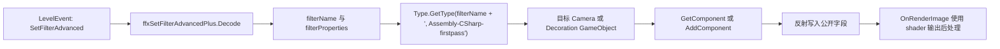

# CameraFilterPack 文件族索引

## 基本信息

`CameraFilterPack_*` 文件族位于 `7thRhythmSource/ADOFAi` 根目录，共 61 个 `.cs` 文件。它们都是无命名空间的 Unity `MonoBehaviour` 后处理组件，类名与文件名一致，并使用 `ExecuteInEditMode` 和 `AddComponentMenu` 暴露到 Unity 组件菜单。

这些类不是 ADOFAI 自己的事件调度层。ADOFAI 对它们的接入主要来自 `SetFilterAdvanced`：事件把滤镜类名保存在 `filter` 字段中，`ffxSetFilterAdvancedPlus.Setup()` 使用 `Type.GetType(filterName + ", Assembly-CSharp-firstpass")` 查找类型，再把组件添加到相机或带 tag 的装饰对象上。

## 运行时接入链路

| 步骤 | 源码位置 | 行为 |
| --- | --- | --- |
| 标准滤镜事件 | `ffxSetFilterPlus.cs` | 使用 `Filter` 枚举和 `scrVfxPlus.filterToComp` 中预注册的 legacy 滤镜组件。 |
| 高级滤镜事件 | `ffxSetFilterAdvancedPlus.cs` | 按字符串 `filterName` 动态查找滤镜类型，支持作用到前景相机、背景相机或 tagged decoration。 |
| 编辑器属性生成 | `PropertyControl_FilterProperties.cs` | 通过 `Type.GetType($"{arg}, Assembly-CSharp-firstpass")` 读取滤镜公开字段，为 `SetFilterAdvanced` 生成可编辑属性。 |
| 事件应用 | `scnGame.ApplyEvent()` | `LevelEventType.SetFilterAdvanced` 创建 `ffxSetFilterAdvancedPlus`。 |
| 场景重置 | `scnGame` | 重置场景时调用 `ffxSetFilterAdvancedPlus.ResetVariables()` 和 `ResetAllFilters()` 清理动态滤镜状态。 |

`ffxSetFilterAdvancedPlus.blacklistedFilterKeywords` 包含 `Blend2Camera_`、`Antialiasing_FXAA`、`Colors_Adjust_PreFilters`。`StartEffect()` 发现 `filterName` 包含这些片段时直接返回。

## 组件共同结构

抽查 `CameraFilterPack_3D_Anomaly`、`CameraFilterPack_Color_Chromatic_Plus` 等文件后可以确认这一类组件使用相同骨架。

| 成员或方法 | 常见行为 |
| --- | --- |
| `public Shader SCShader` | 保存后处理 shader 引用，通常在 `Start()` 中通过 `Shader.Find()` 赋值。 |
| `private float TimeX` | 作为 shader 时间参数，`OnRenderImage()` 中随 `Time.deltaTime` 增加，超过 100 后归零。 |
| `private Material SCMaterial` | 缓存当前 shader 对应材质。 |
| `private Material material` | 懒创建材质，并设置 `HideFlags.HideAndDontSave`。 |
| 公开参数字段 | 使用 `Range` 标注暴露给 Inspector，也会被 `SetFilterAdvanced` 通过反射写入。字段类型以 `float`、`int`、`bool`、`Color`、`Vector2`、`Texture2D` 为主。 |
| `Start()` | 使用固定 shader 路径查找 shader，例如 `CameraFilterPack/3D_Anomaly` 或 `CameraFilterPack/Color_Chromatic_Plus`。 |
| `OnRenderImage(RenderTexture, RenderTexture)` | shader 存在时写入材质参数并 `Graphics.Blit(sourceTexture, destTexture, material)`；shader 缺失时直接 blit 原图。 |
| `OnDisable()` | 如果 `SCMaterial` 存在，调用 `Object.DestroyImmediate(SCMaterial)`。 |

3D 系列会额外写入 `_ScreenResolution`，并常把 `GetComponent<Camera>().depthTextureMode` 设置为 `DepthTextureMode.Depth`，用于深度相关效果。

## 文件族分组

| 分组 | 文件数 | 文件 |
| --- | --- | --- |
| 3D | 14 | `CameraFilterPack_3D_Anomaly.cs`、`CameraFilterPack_3D_Binary.cs`、`CameraFilterPack_3D_BlackHole.cs`、`CameraFilterPack_3D_Computer.cs`、`CameraFilterPack_3D_Distortion.cs`、`CameraFilterPack_3D_Fog_Smoke.cs`、`CameraFilterPack_3D_Ghost.cs`、`CameraFilterPack_3D_Inverse.cs`、`CameraFilterPack_3D_Matrix.cs`、`CameraFilterPack_3D_Mirror.cs`、`CameraFilterPack_3D_Myst.cs`、`CameraFilterPack_3D_Scan_Scene.cs`、`CameraFilterPack_3D_Shield.cs`、`CameraFilterPack_3D_Snow.cs` |
| AAA | 5 | `CameraFilterPack_AAA_Blood_Hit.cs`、`CameraFilterPack_AAA_Blood_Plus.cs`、`CameraFilterPack_AAA_Blood.cs`、`CameraFilterPack_AAA_BloodOnScreen.cs`、`CameraFilterPack_AAA_WaterDropPro.cs` |
| Atmosphere | 2 | `CameraFilterPack_Atmosphere_Fog.cs`、`CameraFilterPack_Atmosphere_Rain_Pro_3D.cs` |
| Blend2Camera | 2 | `CameraFilterPack_Blend2Camera_ColorKey.cs`、`CameraFilterPack_Blend2Camera_SplitScreen3D.cs` |
| Broken | 3 | `CameraFilterPack_Broken_Screen.cs`、`CameraFilterPack_Broken_Simple.cs`、`CameraFilterPack_Broken_Spliter.cs` |
| Classic | 1 | `CameraFilterPack_Classic_ThermalVision.cs` |
| Color | 2 | `CameraFilterPack_Color_Adjust_Levels.cs`、`CameraFilterPack_Color_Chromatic_Plus.cs` |
| Convert | 1 | `CameraFilterPack_Convert_Normal.cs` |
| Distortion | 1 | `CameraFilterPack_Distortion_ShockWaveManual.cs` |
| EXTRA | 1 | `CameraFilterPack_EXTRA_SHOWFPS.cs` |
| Glasses | 6 | `CameraFilterPack_Glasses_On.cs`、`CameraFilterPack_Glasses_On_2.cs`、`CameraFilterPack_Glasses_On_3.cs`、`CameraFilterPack_Glasses_On_4.cs`、`CameraFilterPack_Glasses_On_5.cs`、`CameraFilterPack_Glasses_On_6.cs` |
| Lut | 7 | `CameraFilterPack_Lut_2_Lut.cs`、`CameraFilterPack_Lut_2_Lut_Extra.cs`、`CameraFilterPack_Lut_Mask.cs`、`CameraFilterPack_Lut_PlayWith.cs`、`CameraFilterPack_Lut_Plus.cs`、`CameraFilterPack_Lut_Simple.cs`、`CameraFilterPack_Lut_TestMode.cs` |
| NewGlitch | 7 | `CameraFilterPack_NewGlitch1.cs`、`CameraFilterPack_NewGlitch2.cs`、`CameraFilterPack_NewGlitch3.cs`、`CameraFilterPack_NewGlitch4.cs`、`CameraFilterPack_NewGlitch5.cs`、`CameraFilterPack_NewGlitch6.cs`、`CameraFilterPack_NewGlitch7.cs` |
| Pixelisation | 2 | `CameraFilterPack_Pixelisation_DeepOilPaintHQ.cs`、`CameraFilterPack_Pixelisation_Sweater.cs` |
| Rain | 1 | `CameraFilterPack_Rain_RainFX.cs` |
| TV | 2 | `CameraFilterPack_TV_MovieNoise.cs`、`CameraFilterPack_TV_Vignetting.cs` |
| Vision | 4 | `CameraFilterPack_Vision_Blood.cs`、`CameraFilterPack_Vision_Blood_Fast.cs`、`CameraFilterPack_Vision_Hell_Blood.cs`、`CameraFilterPack_Vision_SniperScore.cs` |

## 代表性字段

| 文件 | 公开字段摘录 | 说明 |
| --- | --- | --- |
| `CameraFilterPack_3D_Anomaly.cs` | `SCShader`、`_Visualize`、`_FixDistance`、`Anomaly_Near`、`Anomaly_Far`、`Intensity`、`AnomalyWithoutObject`、`Anomaly_Distortion`、`Anomaly_Distortion_Size`、`Anomaly_Intensity` | 3D 异常效果，使用深度、距离、扭曲和强度参数。 |
| `CameraFilterPack_3D_Binary.cs` | `SCShader`、`_Visualize`、`_FixDistance`、`LightIntensity`、`MatrixSize`、`MatrixSpeed`、`Fade`、`FadeFromBinary`、`_MatrixColor` | 二进制矩阵视觉，带颜色、大小、速度和淡入参数。 |
| `CameraFilterPack_3D_BlackHole.cs` | `SCShader`、`_Visualize`、`_FixDistance`、`_Distance`、`_Size`、`DistortionLevel`、`DistortionSize`、`AutoAnimatedNear`、`AutoAnimatedNearSpeed` | 黑洞式深度扭曲，支持自动动画。 |
| `CameraFilterPack_Color_Chromatic_Plus.cs` | `SCShader`、`Size`、`Smooth`、`Offset` | 色差增强效果，`OnRenderImage()` 写入 `_Value`、`_Value2` 和 `_Distortion`。 |
| `CameraFilterPack_3D_Scan_Scene.cs` | `SCShader`、`_Visualize`、`_FixDistance`、`_Distance`、`_Size`、`AutoAnimatedNear`、`AutoAnimatedNearSpeed`、`ScanColor`、`Fade` | 扫描场景效果，暴露扫描颜色和淡入参数。 |

## 与 `SetFilter` 的边界

`SetFilter` 和 `SetFilterAdvanced` 是两条不同路径：

| 路径 | 使用方式 | 主要组件 |
| --- | --- | --- |
| `SetFilter` | 通过 `Filter` 枚举选择 `scrVfxPlus.filterToComp` 中预注册组件，并由 `ffxSetFilterPlus.SetFilter()` 按枚举写强度。 | `CameraFilterPackLegacy_*`、`CameraMotionBlur`、`PolarScreen`、`FallingPetals` |
| `SetFilterAdvanced` | 通过字符串类名动态添加组件，并反射公开字段。 | `CameraFilterPack_*` 文件族和其他可通过类名查找的滤镜组件 |

因此本页的 61 个 `CameraFilterPack_*` 文件主要服务高级滤镜属性编辑和运行时动态组件路径；标准滤镜枚举的字段映射仍以 [相机、滤镜与屏幕事件](/api/events/camera-filter-events.md) 和 [相机与 VFX 运行链路](/api/runtime/camera-vfx-chain.md) 为准。

## 阶段 7 覆盖状态

本页已经把 61 个 `CameraFilterPack_*` 文件全部列入文档索引。后续文件级覆盖统计中，这批文件应从“根目录未命中文件族”中移除。下一批建议继续处理剩余 `ffx*` 旧式效果组件，因为它们与事件执行和官方关卡演出直接相连。
