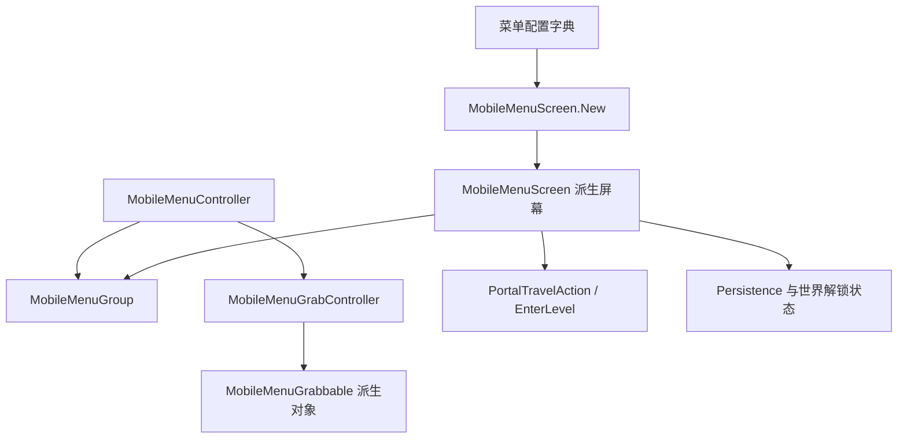

# 编辑器动作补充与移动菜单控件索引

## 基本信息

本页补齐阶段 7 中尚未被文件名命中的编辑器动作类，并按源码职责整理 `MobileMenu` 目录剩余控件。编辑器动作仍以 [ADOFAI.Editor.Actions](/api/editor/editor-actions.md) 为主说明页；本页只补文件级缺口和移动端菜单控件清单。

## 编辑器缩放动作补充

`ADOFAI.Editor.Actions` 目录中的绝大多数动作已经在编辑器动作页按工作流、选择、删除、复制、粘贴、事件和面板分类。本轮补齐 4 个缩放动作文件：

| 文件 | 分组 | 执行内容 |
| --- | --- | --- |
| `ZoomInCameraEditorAction.cs` | `EditorWorkflow` | 调用 `editor.ZoomCamera(0.5f, anchorAtPointer: false)`，放大编辑器相机视图。 |
| `ZoomOutCameraEditorAction.cs` | `EditorWorkflow` | 调用 `editor.ZoomCamera(-0.5f, anchorAtPointer: false)`，缩小编辑器相机视图。 |
| `ZoomInUiEditorAction.cs` | `EditorWorkflow` | 调用 `editor.ZoomInUI()`，放大编辑器 UI 缩放等级。 |
| `ZoomOutUiEditorAction.cs` | `EditorWorkflow` | 调用 `editor.ZoomOutUI()`，缩小编辑器 UI 缩放等级。 |

这 4 个动作与其他 `EditorAction` 一样，不直接修改关卡数据；它们只把快捷键或按钮入口分派到 `scnEditor` 的缩放方法。

## MobileMenu 屏幕基类与基础屏幕

| 文件 | 类型 | 源码事实 |
| --- | --- | --- |
| `MobileMenuScreen.cs` | `MobileMenuScreen` | 移动菜单屏幕抽象基类，保存 transform、可见条件、父 group、选择和交互委托；`New()` 根据字符串创建 portal、title、credits、colors、puzzleRooms、blank、rift、dlcPortal、gallery、description、more 和 featuredPortal 屏幕。 |
| `MobileMenuTitleScreen.cs` | `MobileMenuTitleScreen` | 实例化标题屏幕预制体，连接 `MobileMenuController.onFinishLoading`，完成加载后显示按钮并更新副标题；`Decode()` 读取 `neoCosmos`。 |
| `MobileMenuBlankScreen.cs` | `MobileMenuBlankScreen` | 创建名为 `Blank Screen` 的空 GameObject 作为占位屏幕。 |
| `MobileMenuColorScreen.cs` | `MobileMenuColorScreen` | 实例化颜色选择屏幕预制体。 |
| `MobileMenuCreditsScreen.cs` | `MobileMenuCreditsScreen` | 实例化 credits 屏幕，取得 `scrCreditsText`，在 Neo Cosmos 模式下替换 credits 类型、标题键和部分显示对象。 |
| `MobileMenuMoreScreen.cs` | `MobileMenuMoreScreen` | 查找场景中的 `MoreScreen`，取得 `MobileMenuMorePage`，并把 `OnSelectDescription` 挂到选择回调上。 |
| `MobileMenuPortalScreen.cs` | `MobileMenuPortalScreen` | 实例化世界 portal，读取 world、crown 和解锁条件，设置 sprite、统计容器和锁定状态；`GetDescription()` 和 `GetDifficulty()` 从世界数据与本地化读取展示信息。 |
| `MobileMenuDLCTransitionScreen.cs` | `MobileMenuDLCTransitionScreen` | 实例化 DLC transition screen，选择时调用 `MobileMenuDLCTransitionPortal.EnterPortal(neoCosmos)`。 |
| `MobileMenuFeaturedPortalScreen.cs`、`MobileMenuGalleryScreen.cs`、`MobileMenuDescriptionScreen.cs`、`MobileMenuTaroRiftScreen.cs` | 屏幕派生类 | 被 `MobileMenuScreen.New()` 作为移动菜单屏幕类型创建，分别归入精选入口、图库、说明页和 rift 屏幕族。 |

## 方向、箭头与导航外观

| 文件 | 类型 | 源码事实 |
| --- | --- | --- |
| `MobileMenuArrow.cs` | `MobileMenuArrow` | 控制方向按钮、按钮图像、glow、caption 和特殊图标；`Show()` 会根据目标 group 是否不可访问、captionKey、来源 group 和方向调整显示。 |
| `ArrowAppearance.cs` | `ArrowAppearance` | 箭头外观枚举，包含 regular、主游戏、Neo Cosmos、EX 和 Muse Dash 入口外观。 |
| `MoveDirection.cs` | `MoveDirection` | 移动方向枚举，包含 up、left、right、down。 |
| `MoveDirectionHelper.cs` | `MoveDirectionHelper` | 为 `MoveDirection` 提供 `Invert()` 和 `GetVector()`，把方向转成反向或 `Vector2Int`。 |

## 拖拽对象与隐藏交互

| 文件 | 类型 | 源码事实 |
| --- | --- | --- |
| `MobileMenuGrabbable.cs` | `MobileMenuGrabbable` | 抽象拖拽对象，要求 `Collider2D`；`Grab()` 播放抓取音效并停止回位 tween，`Move()` 移动到世界坐标，`Ungrab()` 播放释放音效并 tween 回原始 localPosition。 |
| `MobileMenuGrabController.cs` | `MobileMenuGrabController` | 非 MonoBehaviour 控制器，通过 2D raycast 抓取 `MobileMenuGrabbable`，维护当前 grabbedObject，并触发 onGrab/onUngrab 回调。 |
| `MobileMenuGrabbableMine.cs` | `MobileMenuGrabbableMine` | 被抓取时执行爆炸流程：启用 explosion、淡出并缩放，隐藏 spike 显示，播放音效，关闭 collider；爆炸后不再移动或释放。 |
| `MobileMenuGrabbablePlanet.cs`、`MobileMenuGrabbablePig.cs`、`MobileMenuGrabbableRose.cs` | 拖拽对象派生类 | 归入移动菜单可拖拽对象族，被抓取控制器和颜色/隐藏交互脚本使用。 |
| `MobileMenuHare.cs`、`MobileMenuPigPuzzle.cs`、`MobileMenuRosePuzzle.cs`、`MobileMenuTreePuzzle.cs` | 隐藏交互脚本 | 归入移动菜单隐藏交互族，由对应屏幕对象和拖拽对象驱动。 |

## 移动菜单谜题、介绍与入口辅助

| 文件 | 类型 | 源码事实 |
| --- | --- | --- |
| `MobileMenuMinesweeperPuzzle.cs` | `MobileMenuMinesweeperPuzzle` | 每帧检查所有 `MobileMenuGrabbableMine.exploded`，完成后 duck 歌曲、播放音效，并进入 `scnMinesweeper`。 |
| `MobileMenuCreditsPuzzle.cs` | `MobileMenuCreditsPuzzle` | 在指定解锁条件下启用 glitch 交互，把 glitch 移到多个 group/screen 位置；完成后设置 `Persistence.unlockedXC` 并重建菜单地图。 |
| `PuzzleRoomsScreen.cs` | `PuzzleRoomsScreen` | 实例化 puzzle rooms 预制体，宽度为基础宽度的 1.5 倍，交互时调用 `PortalTravelAction(Portal.Puzzle1)`。 |
| `MobileMenuCoopIntro.cs` | `MobileMenuCoopIntro` | 移动菜单合作/教程入口流程，决定 intro 类型，准备轨道、控制器图标、颜色选择和 ready 区域，并在完成后恢复菜单控制。 |
| `IntroPhase.cs`、`IntroType.cs` | 介绍流程枚举 | 分别用于记录移动菜单介绍阶段和需要运行的介绍类型。 |
| `MobileMenuTutorial_Switch.cs` | `MobileMenuTutorial_Switch` | Switch 移动菜单教程脚本，移动相机跟随星体、渐隐背景并在到达最后地板时进入 `1-2`。 |
| `CR2024TechSecret.cs` | `CR2024TechSecret` | 归入移动菜单隐藏入口脚本族，与特定活动/技术入口相关。 |

## DLC、视频、评价与子关卡 UI

| 文件 | 类型 | 源码事实 |
| --- | --- | --- |
| `MobileMenuDLCTransitionPortal.cs` | `MobileMenuDLCTransitionPortal` | 根据当前场景选择 Neo Cosmos 或 ADOFAI 粒子/发光引用；进入 portal 时关闭菜单输入、播放 portal 动画、缩放相机和星体，并在淡出后调用 `PortalTravelAction()`。 |
| `MobileMenuReviewPrompt.cs` | `MobileMenuReviewPrompt` | 移动端评价弹窗控制器；世界 0 完成后按日期间隔尝试弹窗，提交按钮打开应用商店链接，取消按钮恢复菜单和歌曲音量。 |
| `MobileMenuSublevelBrowserGenerator.cs` | `MobileMenuSublevelBrowserGenerator` | 为指定 world 生成子关卡按钮，按世界类型选择按钮 sprite，boss 关使用 boss sprite，按钮点击进入 `world-level`。 |
| `MobileTrailerPlayer.cs` | `MobileTrailerPlayer` | 视频预览播放器，检查网络、准备 `VideoPlayer` URL、绑定 AudioSource、播放/暂停/停止并显示缩略图、加载图标和无网络文本。 |
| `MobileMenuMorePage.cs`、`MobileMenuNeoCosmosBuyPage.cs`、`MobileMenuTitle.cs`、`MobileMenuDebug.cs` | 菜单页面组件 | 归入移动菜单页面控制组件族，分别支撑更多页面、购买页、标题页和 debug 显示。 |
| `PlanetColorSwapper.cs` | `PlanetColorSwapper` | 颜色选择屏幕控制器，根据世界完成进度生成可用颜色云，拖拽星体接触颜色云时写入 `Persistence` 并更新 `PlanetRenderer`。 |

## 调用关系

## 覆盖边界

`MobileMenuController`、`MobileMenuMap`、`MobileMenuGroup`、`MobileMenuScreen`、`scnMobileMenu` 的主流程已由 [CLS、关卡选择、移动菜单与本地化](/api/platform/cls-level-select-mobile-localization.md) 覆盖。本页补的是剩余屏幕派生类、方向控件、拖拽对象、隐藏交互、DLC transition、视频和评价弹窗等文件级说明。
