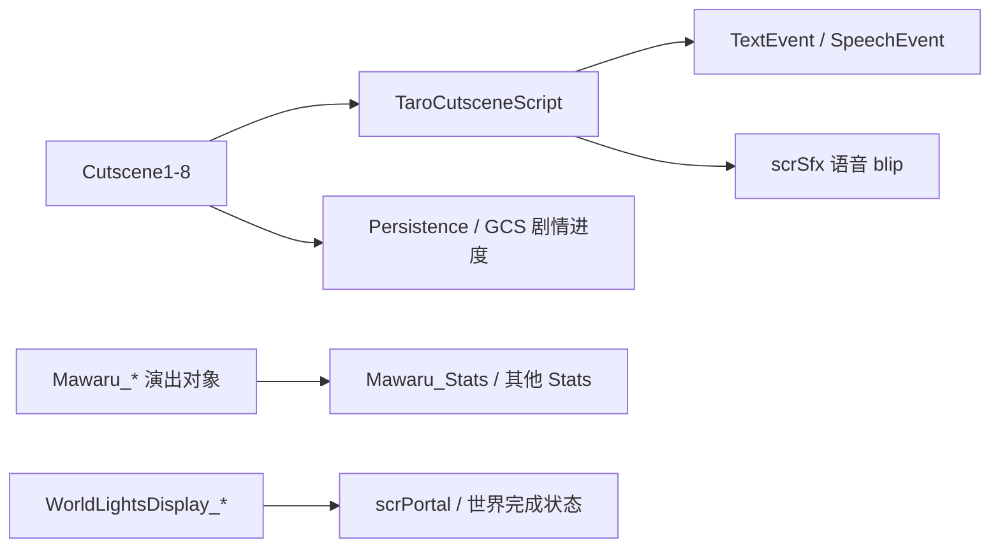

# 官方演出、世界显示与统计脚本索引

## 基本信息

| 项目 | 内容 |
| --- | --- |
| 覆盖范围 | `7thRhythmSource/ADOFAi` 根目录中剩余官方演出、世界完成显示、关卡统计、Taro/Neo Cosmos cutscene 和轻量演出对象。 |
| 主要主题 | 世界完成灯光、Neo Cosmos 统计状态、Mawaru 演出对象、Taro 剧情文本引擎、Cutscene 系列和官方场景演出补项。 |
| 运行方式 | 以静态状态类、Unity 场景组件、DOTween 动画和 `TaroCutsceneScript` 派生类为主，依赖 `Persistence`、`GCS`、`RDString`、`scrController`、`scrConductor`、`scrSfx` 和 `Mawaru_Sprite`。 |
| 阶段位置 | 阶段 7 文件级覆盖与复核。 |

本页补齐的文件多属于官方内容演出，而不是通用 API。它们与阶段 4 的运行时、阶段 5 的事件执行、阶段 6 的平台和关卡选择页面相连：主系统提供节拍、状态、存档和相机，具体关卡脚本负责让角色、灯光、统计面板和剧情文本动起来。

## 分组概览

| 分组 | 覆盖文件 | 主要职责 |
| --- | --- | --- |
| 世界完成显示 | `WorldLightsDisplay`、`WorldLightsDisplay_Crown`、`WorldLightsDisplay_Crystals`、`WorldLightsDisplay_Gems`、`WorldLightsDisplay_Generic`、`WorldLightsDisplay_Lanterns` | 根据世界完成、perfect、speed trial 三种状态显示灯、宝石、水晶、皇冠或灯笼，并支持淡入淡出。 |
| 关卡统计状态 | `Mawaru_Stats`、`Mawaru2_Stats`、`Divine_Stats`、`NewLife_Stats`、`NewLife2_Stats`、`Singsing_Stats`、`Singsing2_Stats`、`ThirdSun_Stats`、`ThirdSun2_Stats` | 官方关卡脚本用的静态计数器、section stats 和 Reset 入口。 |
| Mawaru 演出对象 | `Mawaru_Arm`、`Mawaru_Bar`、`Mawaru_Castle`、`Mawaru_Charlie`、`Mawaru_Coin`、`Mawaru_Medal`、`Mawaru_Mesh`、`Mawaru_Oskari`、`Mawaru_Rock`、`Mawaru_Soccerball`、`Mawaru_WarpTile` | Taro/Mawaru 关卡中的角色、收集物、城堡、金币、奖章、网格和传送地块。 |
| Taro 剧情系统 | `TaroCutsceneScript`、`Cutscene1`、`Cutscene2`、`Cutscene3`、`Cutscene4`、`Cutscene5a`、`Cutscene5b`、`Cutscene5c`、`Cutscene5d`、`Cutscene5e`、`Cutscene6`、`Cutscene7a`、`Cutscene7b`、`Cutscene7c`、`Cutscene7d`、`Cutscene8`、`TemplateCutscene` | 剧情文本解析、角色切换、语音 blip、可跳过状态、剧情进度和各段 Neo Cosmos/Taro cutscene。 |
| 其他官方演出补项 | `CharlieAction`、`TextEvent`、`SpeechEvent`、`EndingSparkle`、`Torch`、`SecretTree`、`CR2024Island`、`XRHare`、`ZodiacBackground`、`ZodiacBackgroundAnimal` | cutscene 动作数据、文本事件、语音事件、结尾粒子、场景装饰与活动/星座背景。 |

## 世界完成显示

| 类 | 源码路径 | 关键入口 | 源码行为 |
| --- | --- | --- | --- |
| `WorldLightsDisplay` | `7thRhythmSource/ADOFAi/WorldLightsDisplay.cs` | `Awake`、`Fade`、抽象 `UpdateStates` | 抽象基类。`Awake` 收集子对象 `SpriteRenderer` 与原始 alpha；`Fade` 按保存的 alpha 乘以目标值，对所有 renderer 做 `DOFade`。 |
| `WorldLightsDisplay_Generic` | `7thRhythmSource/ADOFAi/WorldLightsDisplay_Generic.cs` | `UpdateStates` | 直接把 `lights[0..2]` 分别设为 world complete、perfect、speed trial 的激活状态。 |
| `WorldLightsDisplay_Crown` | `7thRhythmSource/ADOFAi/WorldLightsDisplay_Crown.cs` | `UpdateStates` | 同样按三种状态激活灯；根据当前激活数量选择 1、2、3 个固定位置，把激活的灯排到皇冠布局上。 |
| `WorldLightsDisplay_Gems` | `7thRhythmSource/ADOFAi/WorldLightsDisplay_Gems.cs` | `UpdateStates` | 根据激活数量选择一颗、两颗或三颗宝石的本地位置，形成中间、左右或三角形布局。 |
| `WorldLightsDisplay_Crystals` | `7thRhythmSource/ADOFAi/WorldLightsDisplay_Crystals.cs` | `UpdateStates` | 用对象 instance id 创建 `System.Random`，为激活水晶随机旋转、正反缩放和 sprite；三颗时中间使用大水晶 sprite，两侧使用随机普通水晶。 |
| `WorldLightsDisplay_Lanterns` | `7thRhythmSource/ADOFAi/WorldLightsDisplay_Lanterns.cs` | `Awake`、`UpdateStates`、`DoHolidayLanterns` | 启动时按万圣节或春节替换灯笼 sprite；状态更新时按激活数量调整子对象位置，`dontUpdatePositions` 为真时只更新激活状态。 |

## 关卡统计状态

| 类 | 源码路径 | 主要字段 | `Reset` 行为 |
| --- | --- | --- | --- |
| `Mawaru_Stats` | `7thRhythmSource/ADOFAi/Mawaru_Stats.cs` | `checkpointsUsed`、`goals`、`hifive`、`coins`、`apologized`、`sectionStats`、`finalScore`、`init` | 设置 `init`，清零计数，`sectionStats` 重建为 20 个 0。 |
| `Mawaru2_Stats` | `7thRhythmSource/ADOFAi/Mawaru2_Stats.cs` | `tileScore`、`checkpointsUsed`、`goals`、`hifive`、`coins`、`apologized`、`sectionStats`、`finalScore`、`init` | 清零 `tileScore` 和计数，`sectionStats` 重建为 20 个 0。 |
| `Divine_Stats` | `7thRhythmSource/ADOFAi/Divine_Stats.cs` | `bestTimeTrialTime`、`timeTrialTime`、`sectionStats`、`init` | 把 `timeTrialTime` 设为 60，`bestTimeTrialTime` 读取 `Persistence.t5BestTime`，`sectionStats` 重建为 10 个 0。 |
| `NewLife_Stats` | `7thRhythmSource/ADOFAi/NewLife_Stats.cs` | `checkpointsUsed`、`sectionStats`、`init` | 清零 checkpoint，`sectionStats` 重建为 6 个 0。 |
| `NewLife2_Stats` | `7thRhythmSource/ADOFAi/NewLife2_Stats.cs` | `checkpointsUsed`、`sectionStats`、`init` | 清零 checkpoint，`sectionStats` 重建为 8 个 0。 |
| `Singsing_Stats` | `7thRhythmSource/ADOFAi/Singsing_Stats.cs` | `checkpointsUsed`、`sectionStats`、`init` | 清零 checkpoint，`sectionStats` 重建为 7 个 0。 |
| `Singsing2_Stats` | `7thRhythmSource/ADOFAi/Singsing2_Stats.cs` | `checkpointsUsed`、`sectionStats`、`init` | 清零 checkpoint，`sectionStats` 重建为 7 个 0。 |
| `ThirdSun_Stats` | `7thRhythmSource/ADOFAi/ThirdSun_Stats.cs` | `checkpointsUsed`、`sectionStats`、`init` | 清零 checkpoint，`sectionStats` 重建为 8 个 0。 |
| `ThirdSun2_Stats` | `7thRhythmSource/ADOFAi/ThirdSun2_Stats.cs` | `checkpointsUsed`、`sectionStats`、`init` | 清零 checkpoint，`sectionStats` 重建为 8 个 0。 |

这些统计类全部是静态状态容器，没有继承 Unity 组件。它们的共同特征是显式 `Reset`，用于关卡脚本在开始或重试时重置临时成绩。

## Mawaru 演出对象

| 类 | 源码路径 | 关键入口 | 源码行为 |
| --- | --- | --- | --- |
| `Mawaru_Arm` | `7thRhythmSource/ADOFAi/Mawaru_Arm.cs` | `Hit`、`HitOK` | `Hit` 标记成功拍手、把手向 Y 方向移出、切到 ok sprite，并让 hand container 从 2 倍缩放回到 1；`HitOK` 使用 nah sprite，不设置 `hitgood`。 |
| `Mawaru_Bar` | `7thRhythmSource/ADOFAi/Mawaru_Bar.cs` | `Enable` | 启用前后条 renderer，并把材质 `_Color` 设为白色。 |
| `Mawaru_Castle` | `7thRhythmSource/ADOFAi/Mawaru_Castle.cs` | `Awake`、`SetText`、`Explode`、`UpdateWorry` | 启动时停止火焰粒子并设置 speech 字体；`Explode` 切换城堡和公主状态、播放火焰、显示帽子并设置 gravity；`UpdateWorry` 在指定 beat 区间按 2 拍间隔生成 worry 眼泪动画。 |
| `Mawaru_Charlie` | `7thRhythmSource/ADOFAi/Mawaru_Charlie.cs` | `AddEntry`、`SetAnim`、`RunAction`、`ClearQueue`、`RemoveActionsWithLabel`、`Update` | 维护 `CharlieAction` 队列，按 `timer` 执行动作。`SetAnim` 将字符串映射到角色帧段；`RunAction` 支持 hide、idle、jump、run、dive、flop、warp、victory、talk 等动作，并通过 DOTween 移动 container、压缩/回弹 sprite。 |
| `Mawaru_Coin` | `7thRhythmSource/ADOFAi/Mawaru_Coin.cs` | `Collect` | 继承 `Mawaru_Sprite`，收集后标记 `collected`、加快帧延迟、做上下弹跳，并在延迟后把材质颜色淡到透明。 |
| `Mawaru_Medal` | `7thRhythmSource/ADOFAi/Mawaru_Medal.cs` | 数据组件 | 保存 medal 的 back 与 front 两个 `Mawaru_Sprite` 引用。 |
| `Mawaru_Mesh`、`Mawaru_Oskari`、`Mawaru_Rock`、`Mawaru_Soccerball`、`Mawaru_WarpTile` | `7thRhythmSource/ADOFAi/Mawaru_*.cs` | 关卡演出对象族 | 归入 Mawaru/Taro 官方演出对象族，和 `TaroBGScript`、`Mawaru_Stats`、`Mawaru_Charlie` 一起构成 Neo Cosmos 关卡的特殊对象层。 |

## Taro 剧情文本系统

| 类 | 源码路径 | 关键入口 | 源码行为 |
| --- | --- | --- | --- |
| `TaroCutsceneScript` | `7thRhythmSource/ADOFAi/TaroCutsceneScript.cs` | `Awake`、`SetupFonts`、`ParseText`、`ParseForVoiceBlips`、`StartScene`、`Update`、`AdvanceText`、`RunTextEvent`、`RunSpeechEvent`、`CharFadeIn`、`CharFadeOut` | Taro/Neo Cosmos 剧情基类。它从 `scrDialogBox` 取得 TMP 文本、背景和下一页提示，按语言设置字体与行距；文本中的反引号命令会生成 `TextEvent`，rich text color/size 会生成 `SpeechEvent`；`Update` 按输入推进文本、跳过逐字显示、执行事件、播放语音 blip，并在对话结束后调用 `runnables["OnComplete"]`。 |
| `TemplateCutscene` | `7thRhythmSource/ADOFAi/TemplateCutscene.cs` | `Awake`、`Start`、`Update` | `TaroCutsceneScript` 的测试模板，在 `Awake` 中加入包含 pause、character、shake、wave 等命令的示例台词。 |
| `Cutscene1` | `7thRhythmSource/ADOFAi/Cutscene1.cs` | `Awake`、`Start`、`Scene1`、`Scene2`、`Scene3`、`DestroyWorld`、`FinishCutscene*` | Neo Cosmos 早期剧情脚本，包含姓名输入地板生成、T1/T2/T3 portal 显隐、Charlie 角色上下场、世界破碎动画、剧情进度写入和移动端回到 mobile menu。 |
| `Cutscene2` 到 `Cutscene8` | `7thRhythmSource/ADOFAi/Cutscene*.cs` | 各自 `Awake`、`Start`、场景段落方法 | 同一 cutscene 基类派生的后续剧情段。它们按 `Persistence`、`GCS.seenCutscene*`、world completion 和 `RDC.skipCutscenes` 判断是否显示，再填充 `dialog`、`runnables` 和角色状态。 |

## 剧情辅助数据

| 类型 | 源码路径 | 作用 |
| --- | --- | --- |
| `TextEvent` | `7thRhythmSource/ADOFAi/TextEvent.cs` | `TaroCutsceneScript.ParseText` 生成的文本事件数据，供 `RunTextEvent` 在指定字符位置执行 pause、角色状态、runnable 或显示速度变化。 |
| `SpeechEvent` | `7thRhythmSource/ADOFAi/SpeechEvent.cs` | `ParseForVoiceBlips` 从 rich text tag 中生成的语音事件数据，供 `RunSpeechEvent` 切换当前说话音色和音量。 |
| `CharlieAction` | `7thRhythmSource/ADOFAi/CharlieAction.cs` | `Mawaru_Charlie` 队列项，记录动画名、位置、方向、持续时间、跳跃高度和标签等动作参数。 |

## 官方演出补项清单

| 文件族 | 文件 | 归类说明 |
| --- | --- | --- |
| Cutscene 系列 | `Cutscene1.cs`、`Cutscene2.cs`、`Cutscene3.cs`、`Cutscene4.cs`、`Cutscene5a.cs`、`Cutscene5b.cs`、`Cutscene5c.cs`、`Cutscene5d.cs`、`Cutscene5e.cs`、`Cutscene6.cs`、`Cutscene7a.cs`、`Cutscene7b.cs`、`Cutscene7c.cs`、`Cutscene7d.cs`、`Cutscene8.cs` | Taro/Neo Cosmos 剧情段落，全部由 `TaroCutsceneScript` 提供文本推进和 runnable 机制。 |
| 统计类 | `Mawaru_Stats.cs`、`Mawaru2_Stats.cs`、`Divine_Stats.cs`、`NewLife_Stats.cs`、`NewLife2_Stats.cs`、`Singsing_Stats.cs`、`Singsing2_Stats.cs`、`ThirdSun_Stats.cs`、`ThirdSun2_Stats.cs` | 官方关卡临时统计容器。 |
| 世界显示 | `WorldLightsDisplay.cs`、`WorldLightsDisplay_Crown.cs`、`WorldLightsDisplay_Crystals.cs`、`WorldLightsDisplay_Gems.cs`、`WorldLightsDisplay_Generic.cs`、`WorldLightsDisplay_Lanterns.cs` | 关卡选择世界完成度显示。 |
| Mawaru 对象 | `Mawaru_Arm.cs`、`Mawaru_Bar.cs`、`Mawaru_Castle.cs`、`Mawaru_Charlie.cs`、`Mawaru_Coin.cs`、`Mawaru_Medal.cs`、`Mawaru_Mesh.cs`、`Mawaru_Oskari.cs`、`Mawaru_Rock.cs`、`Mawaru_Soccerball.cs`、`Mawaru_WarpTile.cs` | Taro/Mawaru 关卡专用演出对象。 |
| 装饰演出补项 | `EndingSparkle.cs`、`Torch.cs`、`SecretTree.cs`、`CR2024Island.cs`、`XRHare.cs`、`ZodiacBackground.cs`、`ZodiacBackgroundAnimal.cs`、`ColorCloud.cs`、`GlitchText.cs`、`VirtualAvatarCanvas.cs` | 归入官方场景演出和活动显示补项。 |

## 调用关系

这些文件的文档重点是归属和主职责。具体剧情文本、每段 cutscene 的完整台词和 Unity 场景布置属于资源层，不在源码文档中逐句展开。

