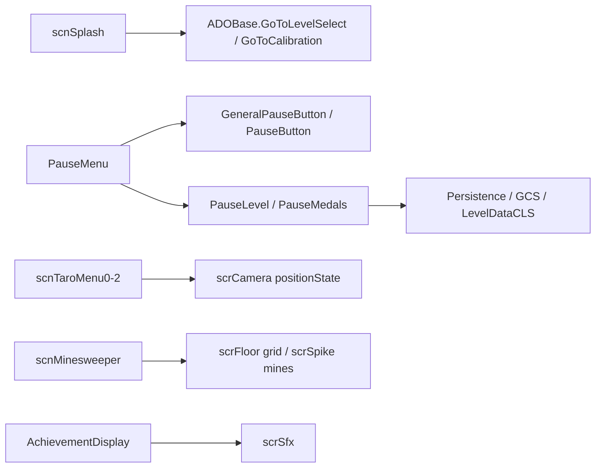

# 根目录 UI、暂停菜单与场景脚本索引

## 基本信息

| 项目 | 内容 |
| --- | --- |
| 覆盖范围 | `7thRhythmSource/ADOFAi` 根目录中尚未被专题页逐项命中的 UI、暂停菜单、玩家选择、场景脚本和小游戏类。 |
| 主要主题 | 成就弹窗、暂停菜单按钮、暂停关卡选择、Taro medal、玩家数量选择、链接点击、启动 splash、Taro 菜单和扫雷小游戏。 |
| 运行方式 | 以 Unity UI 组件和场景脚本为主，依赖 `scrController.pauseMenu`、`Persistence`、`GCS`、`GCNS.worldData`、`scrCamera`、`scrConductor`、`RDInput`、DOTween、TextMeshPro 和 Unity UI。 |
| 阶段位置 | 阶段 7 文件级覆盖与复核。 |

本页继续收束根目录剩余文件。这里的类大多不是数据模型，也不是 `LevelEvent` 运行时效果，而是玩家在菜单、暂停页、移动端入口、DLC 场景和附加小游戏中能碰到的具体 Unity 行为。

## 分组概览

| 分组 | 覆盖文件 | 主要职责 |
| --- | --- | --- |
| 成就与链接 UI | `AchievementDisplay`、`LinkOpener`、`ButtonKeybind`、`AdofaiPointerEventData`、`CustomStandaloneInputModule`、`PropertyInput` | 成就解锁弹窗、富文本链接点击、按钮快捷键和 UI 输入事件辅助。 |
| 暂停菜单按钮 | `GeneralPauseButton`、`PauseButton`、`SocialPauseButton`、`PauseLevelButton`、`MenuArrow`、`MenuMedal`、`OttoButtonController` | 暂停菜单的可聚焦按钮、社交按钮、关卡按钮、箭头、medal 按钮和 debug auto 按钮。 |
| 暂停菜单内容 | `PauseLevel`、`PauseMedals`、`PauseMenuChain`、`PauseMenuChainLink`、`PausePlanets` | 暂停页中的关卡切换、custom level icon、Taro medal 选择、链条摆动和暂停星球动画。 |
| 玩家选择 | `PlayerSelect`、`PlayerSelectButton`、`ControllerIcon`、`ControllerIconHand`、`ControllerIconTester`、`ControllerType`、`RewiredControllerTest` | 移动端玩家数量选择、按钮焦点动画和控制器图标测试。 |
| 场景入口 | `scnSplash`、`scnTaroMenu0`、`scnTaroMenu1`、`scnTaroMenu2`、`scnMinesweeper` | Splash 跳转、Taro 菜单相机 lane、移动菜单地图加载和扫雷小游戏。 |
| 根目录 UI 与显示补项 | `AchievementDisplay`、`DifficultyIndicator`、`NewsSign`、`FeaturedPortal`、`PortalSign`、`PortalCredit`、`PortalCreditData`、`MedalLayout`、`WorldSelectorTile`、`WorkshopLevelList`、`WorkshopThumbnailMaker` | 世界入口、新闻、难度、portal credits、medal 布局、Workshop 列表和缩略图制作相关文件归类。 |

## 成就与链接 UI

| 类 | 源码路径 | 关键入口 | 源码行为 |
| --- | --- | --- | --- |
| `AchievementDisplay` | `7thRhythmSource/ADOFAi/AchievementDisplay.cs` | `Awake`、`ShowAchievements`、`ShowRetroactiveAchievements`、`Advance`、`Finish`、`Update` | 维护内部 `Achievement` 数据，按 id 读取本地化标题、描述和 `Resources/Achievements` 图标；普通成就会展开 bubble、content 和单个成就信息；retroactive 模式会先显示成就图标墙，再切入逐项展示。`Update` 处理鼠标、确认键和右键跳过，`Finish` 播放关闭音效后销毁对象并回调。 |
| `ButtonKeybind` | `7thRhythmSource/ADOFAi/ButtonKeybind.cs` | `Awake`、`Update` | 由 `KeyModifier` 与 `KeyCode` 构造 `EditorKeybind`；每帧检测 `keybind.IsPressed()`，命中时调用同对象 `Button.onClick.Invoke()`。 |
| `LinkOpener` | `7thRhythmSource/ADOFAi/LinkOpener.cs` | `OnPointerClick` | 要求同对象有 `TMP_Text`；点击时用 `TMP_TextUtilities.FindIntersectingLink` 定位 TMP 链接，若命中则用 `ADOBase.platformHelper.OpenURL` 打开 link id。 |
| `AdofaiPointerEventData` | `7thRhythmSource/ADOFAi/AdofaiPointerEventData.cs` | UI 输入辅助 | 文件归入 UI 输入事件辅助族，用于补齐根目录 UI 输入类的文件级覆盖。 |
| `CustomStandaloneInputModule` | `7thRhythmSource/ADOFAi/CustomStandaloneInputModule.cs` | UI 输入辅助 | 文件归入 Unity EventSystem 输入模块补项，与 `AdofaiPointerEventData` 一起服务 UI 指针事件。 |
| `PropertyInput` | `7thRhythmSource/ADOFAi/PropertyInput.cs` | UI 输入辅助 | 文件归入属性输入补项，阶段 3 的属性控件页已经覆盖编辑器属性面板主流程，本页只补根目录文件名。 |

## 暂停菜单按钮

| 类 | 源码路径 | 关键入口 | 源码行为 |
| --- | --- | --- | --- |
| `GeneralPauseButton` | `7thRhythmSource/ADOFAi/GeneralPauseButton.cs` | 抽象 `SetFocus`、`Select` | 暂停菜单按钮基类，保存 `index` 和 `rectangleRT`，通过 `scrController.instance.pauseMenu` 获取当前 pause menu。 |
| `PauseButton` | `7thRhythmSource/ADOFAi/PauseButton.cs` | `Awake`、`SetFocus`、`Select`、`ShowAsSelected`、`SetIconColors`、`LateUpdate` | 继承 `GeneralPauseButton`，按焦点切换 label、icon、rectangle 和 controller button icon 颜色；`Select` 调用 pause menu 的 `Select` 与 `Choose`；`LateUpdate` 用 `PauseMenuChain.WaveFunction` 让按钮矩形和阴影沿链条波形摆动。 |
| `SocialPauseButton` | `7thRhythmSource/ADOFAi/SocialPauseButton.cs` | `SetFocus`、`Select` | 社交按钮版本，焦点时启用背景与 label，并切换 image 颜色；选择时执行 `Action action`。 |
| `PauseLevelButton` | `7thRhythmSource/ADOFAi/PauseLevelButton.cs` | `SetFocus` | 暂停关卡按钮版本，根据 focus 切换 background、icon、CLS raw image、label 和 restartLabel；支持使用 sprite 作为 fill，也支持让 label 使用 icon 色。 |
| `MenuArrow` | `7thRhythmSource/ADOFAi/MenuArrow.cs` | `Start`、`FadeIn`、`FadeOut` | 启动时给 arrow 与 shadow 创建水平往返 DOTween 循环，按 `pointDir` 设置旋转；`FadeIn` 与 `FadeOut` 调整 sprite 颜色透明度。 |
| `MenuMedal` | `7thRhythmSource/ADOFAi/MenuMedal.cs` | `Awake`、`Update`、`SetState`、`TintBack`、`OnClick` | 设置 medal 图像 alpha hit test；背面 alpha 随 unscaled time 正弦闪动；`SetState` 切换正面 medal sprite；点击时调用 pause menu 的 `ChangeMedalFixed(id)`。 |
| `OttoButtonController` | `7thRhythmSource/ADOFAi/OttoButtonController.cs` | `Awake`、`Update` | Debug HUD 按钮控制器；`button` 切换 `RDC.auto`，`beatLevelButton` 标记 `levelWasSkipped` 后调用 `scrController.instance.BeatLevel()`；仅 debug、HUD 开启、gameworld 中显示。 |

## 暂停菜单内容

| 类 | 源码路径 | 关键入口 | 源码行为 |
| --- | --- | --- | --- |
| `PauseLevel` | `7thRhythmSource/ADOFAi/PauseLevel.cs` | `Init`、`Levels`、`CustomLevels`、`InstantiantePauseLevels`、`LoadIconCLS`、`MoveToCurrentIndex`、`UpdateScrollLevels` | 暂停菜单里的关卡选择器。官方关卡路径会按当前 world、level index、进度、boss 解锁、world completion、perfect 和 speed trial 状态实例化按钮；自定义关卡路径会读取 `.adofai` 文本、解码 `LevelDataCLS`、读取 preview icon 并处理为 CLS 按钮图标。它还处理触摸/鼠标横向拖动、当前索引高亮、箭头 speed trial 切换和 Taro/crown/tech 视觉变体。 |
| `PauseMedals` | `7thRhythmSource/ADOFAi/PauseMedals.cs` | `Init`、`Show`、`Hide`、`OnClick`、`WarpToSection` | Taro boss 暂停页的 medal 选择器。`Init` 从 `TaroBGScript.instance.SaveMedals` 得到 medal 状态，用 prefab 创建 `MenuMedal`；点击已解锁段落时把 checkpoint 设到对应 floor、删除保存进度并重启。`Show`/`Hide` 用 DOTween path 展开或收回 medal。 |
| `PauseMenuChain` | `7thRhythmSource/ADOFAi/PauseMenuChain.cs` | `WaveFunction`、`Update`、`UpdateHeight`、`UpdateLinks`、`InitLinks` | 用多条 `SineWave` 配置计算链条 Y 值；每帧根据相邻点更新链节位置与旋转；可按屏幕比例修改链节数量，并在暂停菜单高度变化时调整按钮与链条位置。 |
| `PauseMenuChainLink` | `7thRhythmSource/ADOFAi/PauseMenuChainLink.cs` | 数据组件 | 保存链条 link 的 `RectTransform`、image、lantern、lanternLight 和 `CanvasGroup`，供 `PauseMenuChain`、`PauseLevel` 设置。 |
| `PausePlanets` | `7thRhythmSource/ADOFAi/PausePlanets.cs` | `Update`、`LateUpdate`、`UpdateAnimation`、`UpdatePlanets` | 暂停菜单里的蓝红星球动画。`Update` 用自定义函数让两颗星球沿对称轨迹运动；`LateUpdate` 定时让星球换表情并驱动 samurai 更新；`UpdateAnimation` 把对象挂到指定父级、调整缩放并控制粒子显示。 |

## 玩家选择与控制器图标

| 类 | 源码路径 | 关键入口 | 源码行为 |
| --- | --- | --- | --- |
| `PlayerSelect` | `7thRhythmSource/ADOFAi/PlayerSelect.cs` | `Setup`、`Show`、`Hide`、`SelectHorizontal`、`Choose` | 移动端玩家数量选择界面。`Show` 淡入 canvas、显示 zodiac 背景并让 pause menu 选中第一个按钮；`MoveButtons` 按屏幕高度把按钮从屏幕外滑入/滑出；`Choose` 调用 `scrPlayerManager.SetPlayerCount`、重置玩家外观，并加载 `scnMobileMenu`。 |
| `PlayerSelectButton` | `7thRhythmSource/ADOFAi/PlayerSelectButton.cs` | `Awake`、`SetFocus`、`LateUpdate` | 继承 `PauseButton`，只显示对应玩家数图标；焦点时让 sign 上下跳动，非焦点时让 planets 回到零旋转；焦点期间每帧旋转 planet 图标。 |
| `ControllerIcon`、`ControllerIconHand`、`ControllerIconTester` | `7thRhythmSource/ADOFAi/ControllerIcon*.cs` | 控制器图标族 | 文件归入控制器图标显示与测试补项，和玩家选择、输入提示相关。 |
| `ControllerType`、`RewiredControllerTest` | `7thRhythmSource/ADOFAi/ControllerType.cs`、`7thRhythmSource/ADOFAi/RewiredControllerTest.cs` | 控制器测试族 | 文件归入 Rewired 控制器类型与测试补项；第三方 Rewired 内部类不逐项深写。 |

## 场景入口与小游戏

| 类 | 源码路径 | 关键入口 | 源码行为 |
| --- | --- | --- | --- |
| `scnSplash` | `7thRhythmSource/ADOFAi/scnSplash.cs` | `Start`、`ShowAlphaWarningCoroutine`、`GoToMenu` | Splash 场景脚本。启动后检查 Steam beta 分支，非 public 分支显示 alpha warning 并等待时间或按键；随后移动端/Switch 根据校准 preset 进入关卡选择或校准，桌面端淡出后进入关卡选择。 |
| `scnTaroMenu0` | `7thRhythmSource/ADOFAi/scnTaroMenu0.cs` | `Awake`、`Start`、`Update`、`EnableT5Cutscene`、`AddT5CutsceneVersionOnMobileMenu` | Taro 0 菜单。移动端加载 `taro0` 地图并关闭控制器相机，桌面端设置退出、显示 cutscene、puzzle room 文本；根据星球坐标切换相机 position state；移动端在 T5 完成后给 T5 submenu 增加 cutscene 版本入口。 |
| `scnTaroMenu1` | `7thRhythmSource/ADOFAi/scnTaroMenu1.cs` | `Awake`、`Start`、`Update` | Taro 1 菜单。移动端加载 `taro1` 并把地图中心设到 `T1`；桌面端设置退出文本；根据星球 Y 坐标切换 `TaroMenu1TopLane` 或 `None`。 |
| `scnTaroMenu2` | `7thRhythmSource/ADOFAi/scnTaroMenu2.cs` | `Awake`、`Start`、`DoMaze`、`FinishMaze`、`JumpToWorldPortal`、`Update` | Taro 2 菜单。根据 T4 完成状态显示 toPuzzle/toStage 箭头，可能进入 banishment maze；移动端加载 `taro2` 并设置地图中心，maze 模式会隐藏除 T4 以外的 mobile portal；支持键盘数字跳到 T1/T2/T3/T4 portal。 |
| `scnMinesweeper` | `7thRhythmSource/ADOFAi/scnMinesweeper.cs` | `EnterScene`、`Awake`、`GenerateBoard`、`Update`、`TryRevealTile`、`Fail`、`Win`、`EndLevel` | Neo Cosmos 相关扫雷小游戏。静态 `stageData` 定义三关棋盘大小、炸弹数和 zoom；`GenerateBoard` 实例化 floor 网格并随机放炸弹；玩家移动后按 beat 倒计时揭示格子，首次移动会把起点周围炸弹移走；踩雷时生成 `scrSpike`，胜利后隐藏炸弹地板并进入下一 stage 或返回原场景。 |

## 根目录补项文件清单

| 文件族 | 已归类文件 | 说明 |
| --- | --- | --- |
| Pause UI | `GeneralPauseButton.cs`、`PauseButton.cs`、`SocialPauseButton.cs`、`PauseLevel.cs`、`PauseLevelButton.cs`、`PauseMedals.cs`、`PauseMenuChain.cs`、`PauseMenuChainLink.cs`、`PausePlanets.cs` | 暂停菜单按钮、关卡选择、Taro medal、链条和暂停星球。 |
| Player select | `PlayerSelect.cs`、`PlayerSelectButton.cs`、`ControllerIcon.cs`、`ControllerIconHand.cs`、`ControllerIconTester.cs`、`ControllerType.cs`、`RewiredControllerTest.cs` | 玩家数量选择与控制器图标/测试。 |
| Scene scripts | `scnSplash.cs`、`scnTaroMenu0.cs`、`scnTaroMenu1.cs`、`scnTaroMenu2.cs`、`scnMinesweeper.cs` | Splash、Taro 菜单与扫雷场景。 |
| UI helpers | `AchievementDisplay.cs`、`ButtonKeybind.cs`、`LinkOpener.cs`、`MenuArrow.cs`、`MenuMedal.cs`、`OttoButtonController.cs`、`AdofaiPointerEventData.cs`、`CustomStandaloneInputModule.cs`、`PropertyInput.cs` | 成就、快捷键按钮、链接、箭头、medal、debug 按钮和 UI 输入辅助。 |
| Portal and selection extras | `DifficultyIndicator.cs`、`NewsSign.cs`、`FeaturedPortal.cs`、`PortalSign.cs`、`PortalCredit.cs`、`PortalCreditData.cs`、`MedalLayout.cs`、`WorldSelectorTile.cs` | 已由关卡选择、portal 和平台 UI 主页面解释主流程，本页补文件级归属。 |
| Workshop extras | `WorkshopLevelList.cs`、`WorkshopThumbnailMaker.cs`、`PublishWindow.cs`、`RedeemCode.cs` | Steam Workshop、发布窗口和兑换码相关补项；平台服务主流程见 [平台 Helper、DLC、Steam 与服务](/api/platform/platform-dlc-steam-services.md)。 |

## 与既有文档的关系

这些文件把阶段 4、阶段 6 已说明的控制器、存档、场景流转和平台服务落到具体 UI 上。阶段 7 的作用是保证读者搜索这些根目录文件名时能找到归属，而不是把所有暂停菜单与小游戏源码重复展开成多个长页。

