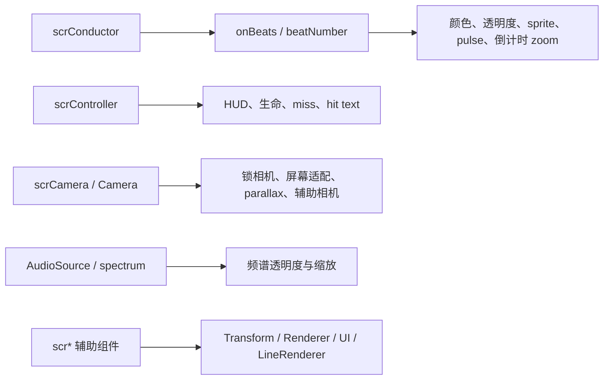

# scr 动画、相机与 HUD 辅助组件索引

## 基本信息

| 项目 | 内容 |
| --- | --- |
| 覆盖范围 | `7thRhythmSource/ADOFAi/scr*.cs` 中第二批剩余轻量组件。 |
| 主要主题 | 运行时动画、beat 驱动显示、相机跟随、背景条、HUD 文本、倒计时、命中反馈和音频频谱响应。 |
| 运行方式 | 多数类挂在场景对象上，通过 Unity 生命周期、`ADOBase.conductor.onBeats`、`scrConductor`、`scrController`、`scrCamera` 或 DOTween 更新显示。 |
| 阶段位置 | 阶段 7 文件级覆盖与复核。 |

这一批 `scr*` 类不负责解析 `.adofai` 数据，也不直接生成关卡事件。它们主要是场景中已经存在的组件：被 Unity 对象挂载后，在 `Start`、`Awake`、`Update`、`LateUpdate` 或 `OnBeat` 中读取控制器、节拍器、相机、音频频谱和 UI 状态，再修改 `Transform`、`SpriteRenderer`、`Image`、`Text`、`TextMeshPro`、`Camera` 或 `LineRenderer`。

## 组件分组

| 分组 | 覆盖文件 | 主要职责 |
| --- | --- | --- |
| Transform 动画 | `scrMove`、`scrRotate`、`scrFloatTween` | 对对象位置、旋转和局部缩放做持续运动或 DOTween 往返动画。 |
| Beat 驱动显示 | `scrColorChangeOnBeat`、`scrOnBeatColor`、`scrOpacityChangeOnBeat`、`scrPulseOnBeat`、`scrFlipOnBeat`、`scrCountdownZoom` | 在节拍回调或节拍号变化时切换颜色、透明度、sprite、缩放或相机 zoom。 |
| 屏幕闪烁与反馈 | `scrFlash`、`scrMissIndicator`、`scrHitTextMesh` | 处理全屏 flash、miss 提示和命中判定文字。 |
| HUD 与倒计时 | `scrCountdown`、`scrHUDText`、`scrLivesCounter`、`scrOffsetText` | 更新倒计时、标题/HUD 显隐、生命显示和 offset 调试文本。 |
| 相机与屏幕适配 | `scrBackgroundSizeFollowCamera`、`scrBGCamNoRotate`、`scrCamera3D`、`scrLockToCamera`、`scrMatchCameraSize`、`scrPlanetCopyCam`、`scrScaleByAspectRatio`、`scrScaleToScreenSize`、`scrParallax` | 根据主相机、屏幕比例、装饰 parallax 或辅助相机同步对象位置、旋转、缩放和相机参数。 |
| 背景与线条演出 | `scrBackgroundBars`、`scrAnimatedAngledLine`、`scrAnimatedLineCircle` | 背景条闪烁、按时间展开直线和圆形线条。 |
| 音频频谱响应 | `scrVolumeTrackerFade`、`scrVolumeTrackerScale` | 读取 `AudioSource` 或 `scrConductor.spectrum`，把频段强度映射到透明度或缩放。 |

## Transform 动画组件

| 类 | 源码路径 | 生命周期 | 源码行为 |
| --- | --- | --- | --- |
| `scrMove` | `7thRhythmSource/ADOFAi/scrMove.cs` | `Update` | 按 `velocity` 和 `Time.deltaTime` 平移对象；`waitTillSongStarts` 为真时等待 `scrConductor.instance.songstarted`，`delay` 会推迟运动；`decelerateOnFail` 为真且控制器处于 `Fail` 或 `Fail2` 时降低 `velocityMultiplier`，并按速度范围启停同对象上的 `scrSpriteAnimator`。 |
| `scrRotate` | `7thRhythmSource/ADOFAi/scrRotate.cs` | `Update` | 每帧按 `degreesPerSecond * Time.deltaTime` 绕 Z 轴旋转。 |
| `scrFloatTween` | `7thRhythmSource/ADOFAi/scrFloatTween.cs` | `Start` | 记录对象初始位置，把局部 Y 先上移 `distance`，然后用 DOTween 在 `duration` 内移动到下方 `distance * 2` 的位置，并设置 `LoopType.Yoyo` 无限往返和 independent update。 |

## Beat 驱动显示组件

| 类 | 源码路径 | 节拍接入 | 源码行为 |
| --- | --- | --- | --- |
| `scrColorChangeOnBeat` | `7thRhythmSource/ADOFAi/scrColorChangeOnBeat.cs` | `ADOBase.conductor.onBeats.Add(this)` | 每次 `OnBeat` 从 `arrcolors` 中选择一个不同于当前索引的新颜色，并写入 `SpriteRenderer.color`。 |
| `scrOnBeatColor` | `7thRhythmSource/ADOFAi/scrOnBeatColor.cs` | `ADOBase.conductor.onBeats.Add(this)` | 每次 `OnBeat` 先把 `Image.color` 设为 `colorOn`，杀掉旧 tween，再用 `DOColor` 在 `transitionDuration` 内回到 `colorOff`。 |
| `scrOpacityChangeOnBeat` | `7thRhythmSource/ADOFAi/scrOpacityChangeOnBeat.cs` | `ADOBase.conductor.onBeats.Add(this)` | 每次 beat 递增计数，用 `counter % arrOpacity.Length` 选择透明度，并写回 `SpriteRenderer.color.a`。 |
| `scrPulseOnBeat` | `7thRhythmSource/ADOFAi/scrPulseOnBeat.cs` | `ADOBase.conductor.onBeats.Add(this)` | 保存初始缩放；每次 beat 杀掉旧 tween，先用 `ScaleXY(pulsewidth)` 放大，再 `DOScale(startScale, time)` 回到初始缩放。 |
| `scrFlipOnBeat` | `7thRhythmSource/ADOFAi/scrFlipOnBeat.cs` | `ADOBase.conductor.onBeats.Add(this)` | 每次 beat 递增计数，用 `counter % sprites.Length` 从数组里取 sprite，并写入同对象的 `SpriteRenderer.sprite`。 |
| `scrCountdownZoom` | `7thRhythmSource/ADOFAi/scrCountdownZoom.cs` | `scrConductor.instance.beatNumber` | 非 lofi 版本、未禁用 zoom 时，在前 4 拍按 beatNumber 调用 `scrCamera.setCamSizeLerp` 做倒计时缩放，并用 `counter` 防止同一拍重复触发。 |
| `scrOnSpecificBeat` | `7thRhythmSource/ADOFAi/scrOnSpecificBeat.cs` | 仅缓存 `scrConductor.instance` | 当前反编译代码中 `Update` 为空，字段包含 `timetotrigger` 和 `onComplete`，但没有实际触发逻辑。 |

## 屏幕闪烁与命中反馈

| 类 | 源码路径 | 关键成员 | 源码行为 |
| --- | --- | --- | --- |
| `scrFlash` | `7thRhythmSource/ADOFAi/scrFlash.cs` | `colorStart`、`colorEnd`、`colortimer`、`colorduration`、`Flash`、`FlashReverse`、`FlashKill`、`FlashBlackStay`、`FlashEx`、`OnDamage`、`OffDamage` | 通过静态颜色和时间变量控制挂载对象 `Renderer.material.color` 的插值。`Flash` 设置起始颜色并淡到透明；`FlashReverse` 按 crotchet 时长反向插值；`FlashKill` 清空闪屏；`FlashBlackStay` 保持黑屏；`OnDamage` 切到半透明红色；`OffDamage` 触发绿色 flash。 |
| `scrMissIndicator` | `7thRhythmSource/ADOFAi/scrMissIndicator.cs` | `StartBlinking`、`FadeOut`、`BlinkForSeconds`、`Die` | 挂载 `SpriteRenderer`，每帧让自身 Z 旋转匹配控制器相机。开始闪烁时循环 tween 到透明，淡出结束或销毁时杀掉 tween。 |
| `scrHitTextMesh` | `7thRhythmSource/ADOFAi/scrHitTextMesh.cs` | `Init`、`Show`、`Update` | 初始化 TextMeshPro 文本、字体和颜色；`Show` 根据 hit margin 设置文本、颜色、glow、位置、旋转和 punch scale；`Update` 在开启 force-on-screen 时把文本钳制到相机视口边界内，超时后杀掉 tween 并隐藏对象。 |

## HUD 与倒计时组件

| 类 | 源码路径 | 关键依赖 | 源码行为 |
| --- | --- | --- | --- |
| `scrCountdown` | `7thRhythmSource/ADOFAi/scrCountdown.cs` | `scrConductor`、`scrController`、`AudioSettings.dspTime`、`GCS`、`RDC` | 通过歌曲 dsp 时间、校准偏移和控制器倒计时字段更新 UI 文本；根据练习模式、speed trial、fast takeoff 和自定义关卡状态显示 `GetReady`、数字、`Go` 或清空文本。 |
| `scrHUDText` | `7thRhythmSource/ADOFAi/scrHUDText.cs` | `RDC.partialNoHud`、`RDC.noHud`、`GCS.d_dontShowTitles`、`scrVfx.instance.currentColourScheme` | 根据 HUD 开关控制 `Graphic.enabled`；`changeColor` 为真时把文本颜色切到当前 VFX 色板，并在自定义关卡中更新 `Shadow.effectColor`。 |
| `scrLivesCounter` | `7thRhythmSource/ADOFAi/scrLivesCounter.cs` | `scrLifePlanet[]`、`GCS.expo`、`ADOBase.isGameWorld` | 静态保存 `instance`；`Reset` 在 expo 模式给 3 条生命，否则设为 -1；`SetLives` 按生命数调用每个 `scrLifePlanet` 的 revive 或 kill；非游戏世界或生命数小于 0 时隐藏。 |
| `scrOffsetText` | `7thRhythmSource/ADOFAi/scrOffsetText.cs` | `UnityEngine.UI.Text`、`KeyCode.LeftBracket`、`KeyCode.RightBracket` | `Start` 把文本颜色设为透明；`Update` 检测左右方括号键，按下时把文本改为蓝色。 |

## 相机、屏幕适配与 parallax

| 类 | 源码路径 | 更新时机 | 源码行为 |
| --- | --- | --- | --- |
| `scrBackgroundSizeFollowCamera` | `7thRhythmSource/ADOFAi/scrBackgroundSizeFollowCamera.cs` | `Update` | 记录 `scrCamera.camsizenormal`，根据当前相机 `orthographicSize / startCamScale` 调整背景对象缩放。 |
| `scrBGCamNoRotate` | `7thRhythmSource/ADOFAi/scrBGCamNoRotate.cs` | `Update` | 读取父对象 Z 旋转，用 `scrMisc.Rotate2D` 计算反向向量，使背景相机对象抵消父级旋转。 |
| `scrCamera3D` | `7thRhythmSource/ADOFAi/scrCamera3D.cs` | `Update` | 以 `speed` 为插值参数，让 3D 相机位置 `Slerp` 到 `scrController.instance.chosenPlanet.transform.position`。 |
| `scrLockToCamera` | `7thRhythmSource/ADOFAi/scrLockToCamera.cs` | `LateUpdate` | 按 `lockPos`、`lockRot`、`lockScale` 分别把对象锁到主相机位置、相机 Z 旋转和相机尺寸比例；可用 `ignoreScaleToScreenSizeComponent` 反向抵消屏幕宽高比例。 |
| `scrMatchCameraSize` | `7thRhythmSource/ADOFAi/scrMatchCameraSize.cs` | `Update` | 自身 `Camera.orthographicSize` 持续同步到 `scrCamera.instance.camobj.orthographicSize`。 |
| `scrPlanetCopyCam` | `7thRhythmSource/ADOFAi/scrPlanetCopyCam.cs` | `LateUpdate` | 辅助相机复制 `scrCamera.instance` 的位置、旋转和 orthographic size，并按 `position`、`scale`、`parallax`、`rotationOffset` 调整深度、偏移和缩放。 |
| `scrScaleByAspectRatio` | `7thRhythmSource/ADOFAi/scrScaleByAspectRatio.cs` | `Update` | 根据当前屏幕宽高比与 `referenceAspectRatio` 的比值缩放对象；只在比值小于 1 时缩小。 |
| `scrScaleToScreenSize` | `7thRhythmSource/ADOFAi/scrScaleToScreenSize.cs` | `Start` | 使用主相机 orthographic size 和 aspect 计算屏幕世界尺寸，并把对象缩放设为覆盖屏幕的 `Vector2`。 |
| `scrParallax` | `7thRhythmSource/ADOFAi/scrParallax.cs` | `LateUpdate` | 缓存起始位置、相机 transform 和可选 `scrDecoration`；普通模式下根据相机位移、`multiplier_x/y` 和起始位置计算 parallax，`clampToScreen` 模式下按屏幕相对位置反投影到世界坐标；装饰对象会叠加 `decoration.parallaxOffset * decoration.camScaleMultiplier`。 |

## 背景条、线条和频谱响应

| 类 | 源码路径 | 关键数据 | 源码行为 |
| --- | --- | --- | --- |
| `scrBackgroundBars` | `7thRhythmSource/ADOFAi/scrBackgroundBars.cs` | `BarStatus`、`arrBgbars`、`colourBarsHit`、`colourBarsMiss` | 静态保存实例；启动时初始化每个 `scrBgbar` 的索引和高度系数，并触发两次 hit flash。`Flash` 按状态选择当前色板并要求所有背景条从目标颜色回到 idle；`Damage` 触发 miss flash；`GetFailMultiplier` 读取玩家 fail bar overload counter。 |
| `scrAnimatedAngledLine` | `7thRhythmSource/ADOFAi/scrAnimatedAngledLine.cs` | `delay`、`fullTime`、`angle`、`minRadius`、`maxRadius`、`LineRenderer` | 按时间推进 `progress`，使用 `DOVirtual.EasedValue` 从 `minRadius` 插值到 `maxRadius`，并按角度计算线段两端坐标。 |
| `scrAnimatedLineCircle` | `7thRhythmSource/ADOFAi/scrAnimatedLineCircle.cs` | `radius`、`delay`、`fullTime`、`LineRenderer` | `Start` 预生成 100 个圆周坐标；`Update` 按进度增加 `LineRenderer.positionCount` 并逐点揭示圆形，完成时追加首点闭合。 |
| `scrVolumeTrackerFade` | `7thRhythmSource/ADOFAi/scrVolumeTrackerFade.cs` | `freq`、`spectrum`、`AudioSource.GetSpectrumData` | 从 `scrConductor` 对象上的 `AudioSource` 取频谱数据，用指定频段的 log 值映射到透明度乘数，并写回 `SpriteRenderer.color.a`。 |
| `scrVolumeTrackerScale` | `7thRhythmSource/ADOFAi/scrVolumeTrackerScale.cs` | `freq`、`scrConductor.spectrum`、`maxmultiplier`、`minmultiplier` | 从 `scrConductor.spectrum[freq]` 读取频段强度，映射为缩放倍数，数值大于 0 时按初始缩放调整 X/Y。 |

## 与主系统的关系

这些组件的调用链大多由 Unity 场景对象驱动。源码中没有统一的注册表把它们全部收集起来，因此阶段 7 用文件级索引记录它们的挂载职责，避免只读事件系统时漏掉这些运行时显示逻辑。

## 覆盖文件清单

| 文件 | 归类 | 说明 |
| --- | --- | --- |
| `scrAnimatedAngledLine.cs` | 线条演出 | 按角度和半径展开一条线。 |
| `scrAnimatedLineCircle.cs` | 线条演出 | 按时间揭示圆形线条。 |
| `scrBackgroundBars.cs` | 背景反馈 | 背景条 hit、miss 和 overload 相关闪烁。 |
| `scrBackgroundSizeFollowCamera.cs` | 相机适配 | 根据相机正交尺寸缩放背景。 |
| `scrBGCamNoRotate.cs` | 相机适配 | 抵消父对象旋转。 |
| `scrCamera3D.cs` | 相机辅助 | 3D 相机缓动到选中星体。 |
| `scrColorChangeOnBeat.cs` | Beat 显示 | beat 时随机切换 sprite 颜色。 |
| `scrCountdown.cs` | HUD | 倒计时文本。 |
| `scrCountdownZoom.cs` | Beat 显示 | 前 4 拍触发相机缩放。 |
| `scrFlash.cs` | 屏幕反馈 | 静态 flash 颜色插值控制器。 |
| `scrFlipOnBeat.cs` | Beat 显示 | beat 时轮换 sprite。 |
| `scrFloatTween.cs` | Transform 动画 | 上下浮动 tween。 |
| `scrHitTextMesh.cs` | 命中反馈 | 命中判定文字和视口钳制。 |
| `scrHUDText.cs` | HUD | HUD 显隐和色板文本颜色。 |
| `scrLivesCounter.cs` | HUD | 生命星体显示。 |
| `scrLockToCamera.cs` | 相机适配 | 位置、旋转、缩放锁到相机。 |
| `scrMatchCameraSize.cs` | 相机适配 | 同步辅助相机正交尺寸。 |
| `scrMissIndicator.cs` | 命中反馈 | miss 提示闪烁和淡出。 |
| `scrMove.cs` | Transform 动画 | 按速度平移对象并可在失败时减速。 |
| `scrOffsetText.cs` | HUD | Offset 按键调试提示。 |
| `scrOnBeatColor.cs` | Beat 显示 | UI Image beat 变色后渐回。 |
| `scrOnSpecificBeat.cs` | Beat 显示 | 当前反编译代码没有执行逻辑。 |
| `scrOpacityChangeOnBeat.cs` | Beat 显示 | beat 时按数组切换透明度。 |
| `scrParallax.cs` | 相机适配 | 相机位移、屏幕钳制和装饰 parallax。 |
| `scrPlanetCopyCam.cs` | 相机适配 | 复制主相机到辅助相机。 |
| `scrPulseOnBeat.cs` | Beat 显示 | beat 时放大再回弹。 |
| `scrRotate.cs` | Transform 动画 | 每帧绕 Z 轴旋转。 |
| `scrScaleByAspectRatio.cs` | 屏幕适配 | 窄屏时按比例缩小。 |
| `scrScaleToScreenSize.cs` | 屏幕适配 | 让对象缩放覆盖相机视野。 |
| `scrVolumeTrackerFade.cs` | 音频响应 | 频谱驱动透明度。 |
| `scrVolumeTrackerScale.cs` | 音频响应 | 频谱驱动缩放。 |

