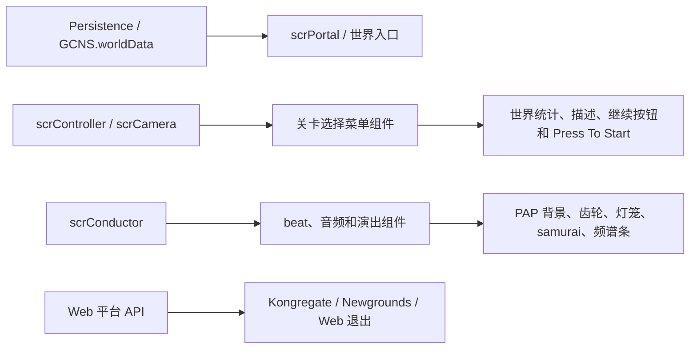

# scr 场景、菜单与服务辅助组件索引

## 基本信息

| 项目 | 内容 |
| --- | --- |
| 覆盖范围 | `7thRhythmSource/ADOFAi/scr*.cs` 中第三批剩余组件。 |
| 主要主题 | 关卡选择菜单、世界入口、Taro 与 Neo Cosmos 场景演出、存档进度、文本替换、选项界面、Web 平台服务、校准和若干遗留空组件。 |
| 运行方式 | 以 Unity 挂载组件为主，通过 `Persistence`、`GCNS.worldData`、`scrPortal.portals`、`scrController`、`scrCamera`、`scrConductor`、DOTween、UI Text/TMP 和平台 API 更新场景对象。 |
| 阶段位置 | 阶段 7 文件级覆盖与复核。 |

这一页补齐的 `scr*` 类大多属于场景对象脚本。它们没有统一继承体系：有的继承 `ADOBase`，有的继承 `MonoBehaviour`，也有少数继承 `ffxPlusBase` 或 `scrDecoration`。源码中的共同点是：它们直接操作 Unity 对象、UI 文本、材质、相机状态或持久化字段，属于主系统外侧的具体场景行为。

## 分组概览

| 分组 | 覆盖文件 | 主要职责 |
| --- | --- | --- |
| 菜单与世界入口 | `scrPortal`、`scrPortalParticles`、`scrMenuMovingFloor`、`scrMenuContinueDisable`、`scrMenuContinueInfo`、`scrMenuWorldStatsText`、`scrPressToStart`、`scrGem`、`scrFlavourText`、`scrFlavourTextNC` | 关卡选择世界入口、继续按钮、世界统计、portal 展开、Taro medal、移动 gem 和世界描述文本。 |
| Taro、Neo Cosmos 与关卡演出 | `scrNeoCosmosEntrance`、`scrClearTaroStoryProg`、`scrPAPPart1BG`、`scrPAPPart3BG`、`scrPAPRopeHex`、`scrACGear`、`scrButterfliesOnFail`、`scrFearGrowsLightningManager`、`scrSamurai`、`scrSpike` | DLC 入口、剧情进度、PAP 背景、beat 齿轮、失败蝴蝶、双押闪电、samurai bob 和尖刺对象。 |
| 文本、本地化与外观 | `scrTextChanger`、`scrTextChangerMultiline`、`scrTextBonusColor`、`scrScrambleText`、`scrLogoText`、`scrImageByLanguage`、`scrIconOrient`、`scrLanternShake`、`scrColorPlanet`、`scrSetEmojiMode`、`scrPrefabDecoration` | 本地化文本替换、多行文本、最高准确率金色文本、乱码背景、Logo 星球颜色、按语言换图、灯笼摆动、星球颜色和 prefab 装饰。 |
| 选项、校准与滚动 UI | `scrOptionsDot`、`scrOptionsExperiencingText`、`scrOptionsWindows`、`ScrollBarSetSize`、`ScrollEvent`、`scrCalibrationLine`、`scrCalibrax`、`ScrCallibrationBGLines` | 选项界面装饰点、体验文本跑马、选项窗口图标、滚动状态、校准线和校准背景线。 |
| 存档、平台服务与调试 | `scrSaveLoader`、`scrSaveManager`、`scrMaxLevelTracker`、`scrKongAPI`、`scrNewgroundsAPIManager`、`scrBenchmark`、`scrTempEscToQuit`、`scrMetronome`、`scrSfx` | 存档清理、最高关卡显示、Kongregate/Newgrounds 接入、分辨率 benchmark、Web 退出、节拍器音频和 SFX 播放。 |
| 轻量视觉与遗留空组件 | `scrBarMaker`、`scrBgbarnew`、`scrBlur`、`scrGfxFloat`、`scrThingShake`、`scrScroller`、`scrLoadingPlanet`、`scrRotateOnAprilFools`、`scrMenu`、`scrPortalUpperPart` | 频谱背景条、RawImage blur、浮动/抖动、循环滚动、加载星球、空壳菜单脚本和 portal 上层空组件。 |

## 菜单与世界入口

| 类 | 源码路径 | 生命周期或入口 | 源码行为 |
| --- | --- | --- | --- |
| `scrPortal` | `7thRhythmSource/ADOFAi/scrPortal.cs` | `Awake`、`Start`、`Update`、多组公开方法 | 用 `world` 作为 key 注册到静态字典 `portals`；根据 `GCNS.worldData`、`Persistence`、DLC 安装状态、mobile menu 和 Taro medal 数据设置 portal 锁定、统计、credits、medal layout、粒子透明度和入口显隐。玩家站到 `jumpPosition` 时会展开 portal、淡入 credits 和 stats；Taro 已完成世界会在普通统计与 medal 展示之间切换。 |
| `scrPortalParticles` | `7thRhythmSource/ADOFAi/scrPortalParticles.cs` | `Start`、`LateUpdate` | 读取父对象的 `FloorRenderer` 与 `scrFloor`，关闭 floor 图标 sprite，并在每帧根据 floor alpha、scale、`speedTrial` 和 `disabled` 刷新粒子、glow、cap、icon 的显隐与颜色。 |
| `scrMenuMovingFloor` | `7thRhythmSource/ADOFAi/scrMenuMovingFloor.cs` | `Awake`、`Start`、公开动画方法 | 保存原始位置和 collider，用 DOTween 驱动 moving gem 上下、跳跃、进入/离开 Xtra island、移出/返回 Taro world，并通过 `scrCamera.positionState` 和 `scrController.responsive` 控制菜单相机与输入。 |
| `scrGem` | `7thRhythmSource/ADOFAi/scrGem.cs` | `Awake`、`Start`、`Update` | 可持续旋转 gem；根据玩家星球靠近 `startPosition` 或 `endPosition` 的距离自动触发本地移动；`LocalMove` 会同步更新 `scrCamera.positionStateInt`，`JumpTo` 调用 `scnLevelSelect.instance.JumpWithKey`。 |
| `scrMenuContinueDisable` | `7thRhythmSource/ADOFAi/scrMenuContinueDisable.cs` | `Awake` | 读取 `Persistence.savedCurrentLevel`，如果 DLC 不可玩、Joker 模式或保存关卡为 `0-0`，则隐藏继续按钮对象。 |
| `scrMenuContinueInfo` | `7thRhythmSource/ADOFAi/scrMenuContinueInfo.cs` | `Start` | 把保存关卡名转为本地化关卡名写入 `Text`；`EX-X` 会先换成 `-X` 查本地化名，再把显示文本改回 `-EX`。 |
| `scrMenuWorldStatsText` | `7thRhythmSource/ADOFAi/scrMenuWorldStatsText.cs` | `Start`、`UpdateText` | 根据 portal 锁定、世界尝试次数、完成百分比、最佳准确率、X accuracy、Speed Trial 完成状态和移动端布局拼接世界统计文本。 |
| `scrPressToStart` | `7thRhythmSource/ADOFAi/scrPressToStart.cs` | `Awake`、`ShowText`、`HideText` | 初始化 press/tap/drum 本地化文本；显示时根据移动端和鼓控制器选择提示，并让 `uiController` 显示难度容器；隐藏时清空文本并在 BB 模式隐藏关卡名。 |
| `scrFlavourText` | `7thRhythmSource/ADOFAi/scrFlavourText.cs` | `Awake`、`Update`、`ShowText` | 在关卡选择中跟踪当前星球四舍五入坐标，匹配 `scrPortal.portals[world].jumpPosition` 后显示世界描述；DLC 区域会调整文本锚点。 |
| `scrFlavourTextNC` | `7thRhythmSource/ADOFAi/scrFlavourTextNC.cs` | `Awake`、`Update`、`ShowText`、`ShowTextRaw` | Taro 菜单版本的世界描述，根据当前场景、Taro 世界解锁条件、相机 lane 和 portal 锁定状态显示描述、locked 文本或 `???`。 |

## Taro、Neo Cosmos 与关卡演出

| 类 | 源码路径 | 关键入口 | 源码行为 |
| --- | --- | --- | --- |
| `scrNeoCosmosEntrance` | `7thRhythmSource/ADOFAi/scrNeoCosmosEntrance.cs` | `Awake`、`Update`、`Enter`、`OpenDLCLink` | 根据总体进度、Joker 模式和 Neo Cosmos 安装/版本状态决定入口显隐、Logo 语言和禁用说明；`Enter` 会关闭星球控制、锁住输入、播放 SFX、移动相机、缩小星球并淡出后加载 Taro 菜单；`OpenDLCLink` 根据 Steam/itch 打开 DLC 链接。 |
| `scrClearTaroStoryProg` | `7thRhythmSource/ADOFAi/scrClearTaroStoryProg.cs` | `Update`、`SetStoryProgTo5`、`SetStoryProgTo7` | 当控制器当前地板等于指定 `floor` 时显示完成文本并调用 `Persistence.ResetTaroStoryProgress`；离开地板后恢复 active 状态。 |
| `scrPAPPart1BG` | `7thRhythmSource/ADOFAi/scrPAPPart1BG.cs` | `Start`、`Pulse`、`DarkenCrosses`、`ToggleHexes`、`SetHexShape`、`Update` | 初始化背景材质 offset、tile、polar；`Pulse` 按 crotchet 和歌曲 pitch 放大再回弹背景；可切换深色叠层、hex 显隐与 hex 动画形态；每帧滚动材质 offset。 |
| `scrPAPPart3BG` | `7thRhythmSource/ADOFAi/scrPAPPart3BG.cs` | `Pulse`、`SetScrollSpeed`、`ResetOffset`、`SetPattern`、`SetPolar`、`SetTileSize`、`Update` | 控制 PAP part 3 边框 pulse、图案 sprite、polar shader 开关、tile 尺寸和材质 offset 滚动。 |
| `scrPAPRopeHex` | `7thRhythmSource/ADOFAi/scrPAPRopeHex.cs` | `Awake`、`Update`、`SetAnim` | 每帧按 `rotationSpeed` 旋转；`SetAnim` 从 `frames` 中按 4 张一组切换 `scrSpriteAnimator.sprites`，越界时输出日志。 |
| `scrACGear` | `7thRhythmSource/ADOFAi/scrACGear.cs` | `Start`、`OnBeat` | 读取 `DOTweenAnimation` 的 ease curve、duration 和目标旋转，注册到 beat；在指定小节拍位触发相对本地旋转 tween。 |
| `scrButterfliesOnFail` | `7thRhythmSource/ADOFAi/scrButterfliesOnFail.cs` | `Update` | 当控制器进入 `Fail2` 时给当前地板添加 `ffxButterflyCircle`，启用 `planetColors` 并启动效果，随后销毁自身。 |
| `scrFearGrowsLightningManager` | `7thRhythmSource/ADOFAi/scrFearGrowsLightningManager.cs` | `Awake` | 非低画质时遍历 `ADOBase.lm.listFloors`，给 `tapsNeeded == 2` 的地板添加 `ffxFearGrowsLightning` 并共享 `lightningBolts`；启动时把闪电 alpha 设为 0 并显示角色对象。 |
| `scrSamurai` | `7thRhythmSource/ADOFAi/scrSamurai.cs` | `Setup`、`Update` | 注册到 beat 列表后，在 beat 帧或暂停更新时把 sprite 和 sprite mask 切到 bob sprite，经过四分之一拍时间后恢复基础 sprite；同时让对象抵消主相机旋转。 |
| `scrSpike` | `7thRhythmSource/ADOFAi/scrSpike.cs` | `Awake`、`Start`、`Update`、`Die` | 初始化 8 个 hit time 槽；运行时用正弦函数让尖刺球体和阴影上下/左右摆动；`Die` 关闭可命中状态、标记 destroyed，并隐藏阴影。 |

## 文本、本地化与外观

| 类 | 源码路径 | 关键入口 | 源码行为 |
| --- | --- | --- | --- |
| `scrTextChanger` | `7thRhythmSource/ADOFAi/scrTextChanger.cs` | `Start` | 根据 desktop、mobile、booth、drum、drumbooth 字段选择本地化 key；可用总体进度阶段限制执行；支持替换 `[[`/`]]` 为红色 rich text、套用 `{s}` 格式，并写入 `Text` 或 `TMP_Text`。 |
| `scrTextChangerMultiline` | `7thRhythmSource/ADOFAi/scrTextChangerMultiline.cs` | `Start` | 遍历 `localizationTokens` 读取本地化文本，按 `scales` 可选地包装 `<size=...>`，再用换行拼成 `Text.text`。 |
| `scrTextBonusColor` | `7thRhythmSource/ADOFAi/scrTextBonusColor.cs` | `Update` | 当 `Persistence.GetIsHighestPossibleAcc(6)` 为真时，把同对象 `Text.color` 设为 `ADOBase.gc.goldTextColor`。 |
| `scrScrambleText` | `7thRhythmSource/ADOFAi/scrScrambleText.cs` | `Awake`、`Update` | 需要 `TMP_Text`；启动时生成 2000 个 ASCII 可见字符填充文本；非最低视觉效果时每 1/60 秒随机调整 `RectTransform` 的 Y 锚点。 |
| `scrLogoText` | `7thRhythmSource/ADOFAi/scrLogoText.cs` | `Awake`、`UpdateColors`、`LateUpdate`、`Enable` | 根据当前语言选择 Logo 实例；从 `Persistence.GetPlayerColor` 读取冰火星球颜色，给 logo 的 fire/ice 图片和 light 图片着色；彩虹 preset 会在 `LateUpdate` 里持续刷新 hue。 |
| `scrImageByLanguage` | `7thRhythmSource/ADOFAi/scrImageByLanguage.cs` | `Awake` | 从 `Resources.Load<Sprite>($"{path}{Persistence.language}")` 加载语言专用图片；若挂载 `Image` 会保持原显示尺寸比例，若挂载 `SpriteRenderer` 则直接换 sprite。 |
| `scrIconOrient` | `7thRhythmSource/ADOFAi/scrIconOrient.cs` | `Start`、`Update` | 缓存主相机对象，每帧调用 `scrMisc.RotateWorld2DCW(transform, 0f)` 让图标保持世界朝向。 |
| `scrLanternShake` | `7thRhythmSource/ADOFAi/scrLanternShake.cs` | `Start`、`Update` | 在 `1-X` 中按节日替换灯笼 sprite；每帧用 `scrConductor.deltaSongPos` 与正弦函数旋转灯笼；debug 下可用按键调试缩放。 |
| `scrColorPlanet` | `7thRhythmSource/ADOFAi/scrColorPlanet.cs` | `Awake`、`Start`、`StartEffect` | 继承 `ffxPlusBase`，让 floor 不再改 sprite 并隐藏 glow；彩虹 preset 会给自身 `SpriteRenderer` 加 `DORainbow`；触发效果时给另一个星球保存新的 `PlanetColor` 并刷新 `scrLogoText`。 |
| `scrSetEmojiMode` | `7thRhythmSource/ADOFAi/scrSetEmojiMode.cs` | `Awake`、`StartEffect` | 继承 `ffxPlusBase`，隐藏地板 glow；触发时对另一个星球调用 `planetRenderer.SetEmojiMode`，并通过 `Persistence.SetEmojiMode` 保存对应玩家的模式。 |
| `scrPrefabDecoration` | `7thRhythmSource/ADOFAi/scrPrefabDecoration.cs` | 属性覆盖、空方法覆盖 | 继承 `scrDecoration`，通过 `sourceLevelEvent.GetString("decorationImage")` 得到 prefab 名称；`HitFloor`、`SetDepth`、`ApplyColor`、`SetVisible`、`SetTile` 当前为空实现，`GetAlpha` 固定返回 1。 |

## 选项、校准与滚动 UI

| 类 | 源码路径 | 关键入口 | 源码行为 |
| --- | --- | --- | --- |
| `scrOptionsDot` | `7thRhythmSource/ADOFAi/scrOptionsDot.cs` | `Awake`、`Update` | Full 视觉质量下初始化点阵，每个点随机在 0.125 到 0.325 缩放之间插值；非 Full 视觉质量直接停用对象。 |
| `scrOptionsExperiencingText` | `7thRhythmSource/ADOFAi/scrOptionsExperiencingText.cs` | `Awake`、`Update`、`SetAngleText` | 读取 `frumsOptions.experiencing` 本地化文本，把 `[angle]` 替换为角度；首次生成宽度后按 `Time.unscaledTime * speed` 让多个 TMP 文本横向循环滚动。 |
| `scrOptionsWindows` | `7thRhythmSource/ADOFAi/scrOptionsWindows.cs` | `Awake`、`Start`、`OnBeat`、`Update`、`SetIcons` | 收集子窗口和 icon，低画质关闭；窗口按 `windowSpeed` 横向循环移动；beat 时可压缩/回弹整个对象；`SetIcons` 根据 `OptionsShape` 和玩家索引切换图标 sprite、颜色和淡出时长。 |
| `ScrollBarSetSize` | `7thRhythmSource/ADOFAi/ScrollBarSetSize.cs` | `Awake`、`LateUpdate`、`SetScrollBarMinimumSize` | 要求同对象有 `Scrollbar`，每帧确保 `scrollbar.size` 不小于 `minimumSize`。 |
| `ScrollEvent` | `7thRhythmSource/ADOFAi/ScrollEvent.cs` | `OnPointerEnter`、`OnPointerExit` | 实现 Unity UI pointer enter/exit，维护静态布尔 `inside` 表示鼠标是否在滚动区域内。 |
| `scrCalibrationLine` | `7thRhythmSource/ADOFAi/scrCalibrationLine.cs` | `Awake`、`Update`、`FadeIn`、`FadeOut` | 保存静态实例；根据 `scnCalibration.averageAngleOffset` 计算目标角度并平滑旋转线条；目标角与当前角相差过大时先补 180 度避免反向绕远；支持淡入淡出。 |
| `scrCalibrax` | `7thRhythmSource/ADOFAi/scrCalibrax.cs` | `Awake`、`Start`、`FadeAndDestroy`、`SetOutlier` | 校准命中点对象，启动时恢复时间和音频暂停状态、缩放出现；`FadeAndDestroy` 淡出并销毁；`SetOutlier` 在 basic 与 outlier 颜色间切换。 |
| `ScrCallibrationBGLines` | `7thRhythmSource/ADOFAi/ScrCallibrationBGLines.cs` | `Start` | 按配置实例化若干 `scrAnimatedLineCircle` 与 `scrAnimatedAngledLine`，设置半径、延迟、持续时间、渐变和宽度，用作校准背景线。 |

## 存档、平台服务与调试

| 类 | 源码路径 | 关键入口 | 源码行为 |
| --- | --- | --- | --- |
| `scrSaveLoader` | `7thRhythmSource/ADOFAi/scrSaveLoader.cs` | `ClearData` | 私有方法 `ClearData` 会打印日志、把 `GCS.maxLevel` 和 PlayerPrefs 的 `maxlevel` 清零、保存 PlayerPrefs，并加载 `scnIntro`。 |
| `scrSaveManager` | `7thRhythmSource/ADOFAi/scrSaveManager.cs` | 无 | 当前类体为空，没有字段和方法。 |
| `scrMaxLevelTracker` | `7thRhythmSource/ADOFAi/scrMaxLevelTracker.cs` | `Start`、`Update` | 获取 `Text` 并设置本地化字体；移动菜单显示英文 Highest Level Reached，其它场景使用 `webgl.maxLevel` 和 `webgl.reset` 本地化文本拼接 `GCS.maxLevel`。 |
| `scrKongAPI` | `7thRhythmSource/ADOFAi/scrKongAPI.cs` | `Start`、`OnKongregateAPILoaded`、`OnKongregateUserInfo`、`Submit` | 单例化并 `DontDestroyOnLoad`；通过 `Application.ExternalEval` 初始化 Kongregate API；连接成功后设置 `Connected`，`Submit` 在已连接时调用外部 stats submit。 |
| `scrNewgroundsAPIManager` | `7thRhythmSource/ADOFAi/scrNewgroundsAPIManager.cs` | `Start`、`ConnectWithDelay`、`StaticCheckMedals`、`CheckMedals` | 非 lofi 时延迟寻找 `NewgroundsAPI` tag 对象并连接 API、获取 medals；`StaticCheckMedals` 只在 lofiVersion 下尝试通过实例检查 medals；`CheckMedals` 当前只输出调试日志。 |
| `scrBenchmark` | `7thRhythmSource/ADOFAi/scrBenchmark.cs` | `Awake`、`Update`、`ChooseNewTarget`、`Finish` | 记录帧 delta，目标为 45 FPS；每轮 1 秒计算平均 FPS，用二分方式调整分辨率比例，最多 5 次后停止并显示结果。 |
| `scrTempEscToQuit` | `7thRhythmSource/ADOFAi/scrTempEscToQuit.cs` | `LateUpdate` | 在 Web 版本中按 `Q` 或 `Escape` 时加载 `scnIntro`。 |
| `scrMetronome` | `7thRhythmSource/ADOFAi/scrMetronome.cs` | `Start`、`OnAudioFilterRead` | 基于 `scrConductor.instance.dspTime` 和 `AudioSettings.outputSampleRate` 计算下一 tick，在音频回调里合成正弦点击声；小节强拍把 amp 翻倍。 |
| `scrSfx` | `7thRhythmSource/ADOFAi/scrSfx.cs` | `Awake`、`PlaySfx` 重载、`PlayMusicVolumePreview`、`StopMusicVolumePreview` | 保存静态实例，配置多个 `AudioSource.ignoreListenerPause`；按 `MixerGroup` 选择 hitsound、sfx、conductor sfx、interface 或 fallback source 播放音效；提供音乐音量预览播放和淡出停止。 |

## 轻量视觉与遗留空组件

| 类 | 源码路径 | 关键入口 | 源码行为 |
| --- | --- | --- | --- |
| `scrBarMaker` | `7thRhythmSource/ADOFAi/scrBarMaker.cs` | `Start`、`Update`、`Flash`、`Damage`、`GetFailMultiplier` | 根据静态背景相机宽度实例化一排 `scrBgbarnew`，给每条分配频段；非 Web 版本每帧更新音频频谱；`Flash` 按当前 VFX 色板要求所有条从 hit/miss 颜色回到 idle 色。 |
| `scrBgbarnew` | `7thRhythmSource/ADOFAi/scrBgbarnew.cs` | `Start`、`Update`、`Flash` | 读取 `scrBarMaker.spectrum[freq]`，维护 running max，并把频谱强度映射到 Y 缩放；`Flash` 当前为空实现。 |
| `scrBlur` | `7thRhythmSource/ADOFAi/scrBlur.cs` | `UpdateTexture`、`BlurTexture` | 从同对象 `RawImage.texture` 创建 RenderTexture 和 blur 材质，设置基础/模糊 tint、tile texture、blur size、pass 数，并通过多次 `Graphics.Blit` 得到模糊后的 `destTexture`。 |
| `scrGfxFloat` | `7thRhythmSource/ADOFAi/scrGfxFloat.cs` | `Start`、`Update`、`Shake` | 记录起点并按 `scrConductor.deltaSongPos` 正弦上下浮动；`Shake` 会先杀掉现有 tween，再执行横向 `DOShakePosition`，结束后恢复浮动更新。 |
| `scrThingShake` | `7thRhythmSource/ADOFAi/scrThingShake.cs` | `activateThingJitter`、`StopShake`、`Update` | 记录本地位置，按持续时间和抖动幅度随机偏移 X/Y；结束后回到保存位置。 |
| `scrScroller` | `7thRhythmSource/ADOFAi/scrScroller.cs` | `Start`、`Update` | 根据 sprite 宽度或 `jumpOffset` 计算循环宽度，让对象跟随相机位置并按 `scrollspeed * Time.deltaTime * ADOBase.d_speed` 横向滚动，超过边界后重置 offset。 |
| `scrLoadingPlanet` | `7thRhythmSource/ADOFAi/scrLoadingPlanet.cs` | `Awake`、`Update` | 以另一个 planet 的位置为圆心，根据 `Time.unscaledTime`、`radius` 和正弦/余弦计算绕行位置。 |
| `scrRotateOnAprilFools` | `7thRhythmSource/ADOFAi/scrRotateOnAprilFools.cs` | `Awake` | 当前反编译代码中 `Awake` 为空。 |
| `scrMenu` | `7thRhythmSource/ADOFAi/scrMenu.cs` | `Start`、`Update` | 当前反编译代码中 `Start` 和 `Update` 均为空。 |
| `scrPortalUpperPart` | `7thRhythmSource/ADOFAi/scrPortalUpperPart.cs` | `Start`、`Update` | 当前反编译代码中 `Start` 和 `Update` 均为空。 |

## 与既有专题的关系

这些类补充了阶段 6 的平台与 UI 页面、阶段 4 的运行时页面，以及阶段 5 的事件效果页面没有逐项展开的具体场景脚本。它们不是新的核心流程，而是把主流程落到关卡选择、DLC 入口、选项菜单、校准、Web 平台和场景演出对象上。

