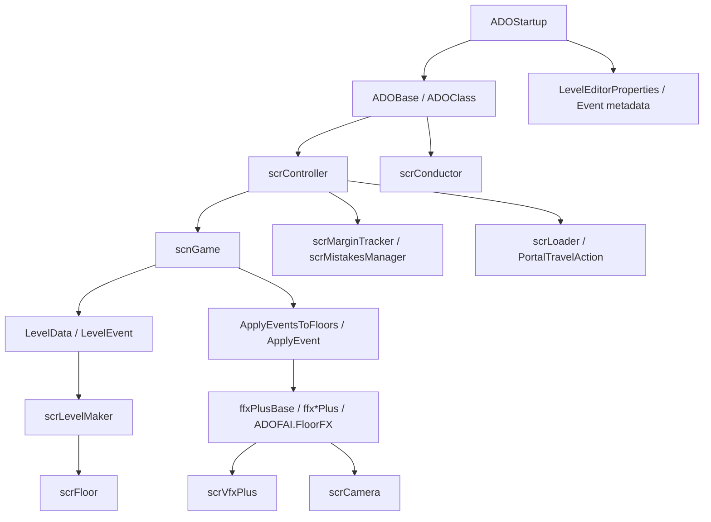
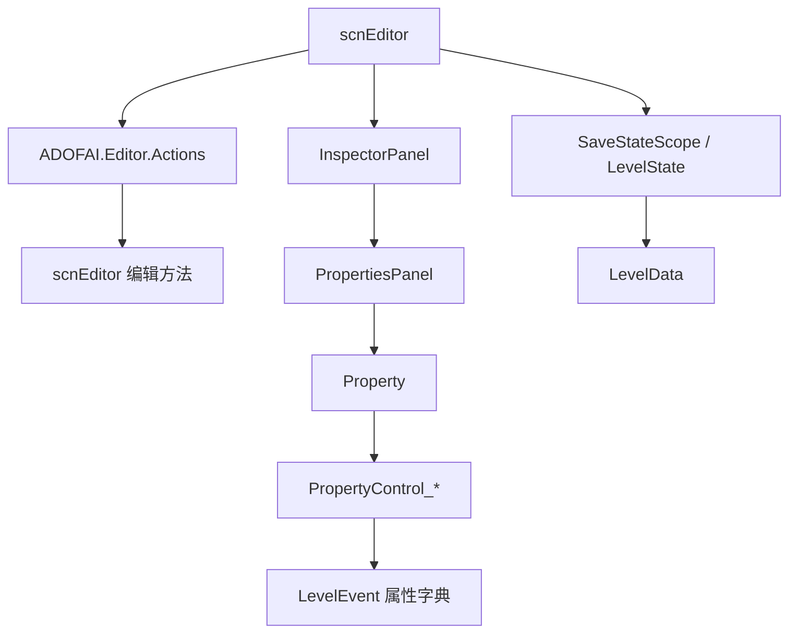

# 阶段 7 全站复核

## 基本信息

本页是 ADOFAI 文档站阶段 7 的收口页，用来记录全站覆盖状态、调用图、第三方边界和最终复核结论。统计范围为 `7thRhythmSource/ADOFAi/**/*.cs`。

## 覆盖结论

| 项目 | 数量 | 说明 |
| --- | --- | --- |
| 源码 `.cs` 文件总数 | 1222 | 递归统计 `7thRhythmSource/ADOFAi`。 |
| 文档 `.md` 文件总数 | 85 | 递归统计 `adofai/docs`。 |
| 文件名或类型名已在文档中命中 | 993 | 用文档正文匹配 `.cs` 文件名或去扩展名后的类型名。 |
| 文件名或类型名尚未在文档中命中 | 229 | 剩余项主要来自第三方库、示例脚本、兼容命名空间和少量根目录小组件。 |

这个数字不是“解释质量”的唯一标准；第三方目录和示例脚本已经由 [平台输入、第三方边界与剩余工具索引](/api/review/platform-input-third-party-boundary.md) 明确边界，不再逐项深写。

## 阶段覆盖清单

| 阶段 | 状态 | 主要页面 |
| --- | --- | --- |
| 阶段 0：文档基础设施与架构侦察 | 已完成 | [架构总览](/architecture/overview.md)、[源码地图](/architecture/source-map.md) |
| 阶段 1：核心骨架 | 已完成 | [ADOBase](/api/core/ADOBase.md)、[ADOStartup](/api/core/ADOStartup.md)、[scrController](/api/core/scrController.md)、[scnGame](/api/core/scnGame.md)、[scnEditor](/api/core/scnEditor.md)、[scrLevelMaker](/api/core/scrLevelMaker.md)、[scrFloor](/api/core/scrFloor.md) |
| 阶段 2：关卡数据模型 | 已完成 | [LevelData](/api/data-models/LevelData.md)、[LevelEvent](/api/data-models/LevelEvent.md)、[LevelEventInfo](/api/data-models/LevelEventInfo.md)、[PropertyInfo](/api/data-models/PropertyInfo.md)、[读取结果与序列化](/api/data-models/serialization-validation.md) |
| 阶段 3：编辑器系统 | 已完成 | [InspectorPanel](/api/editor/InspectorPanel.md)、[PropertyControl 控件族](/api/editor/property-controls.md)、[ADOFAI.Editor.Actions](/api/editor/editor-actions.md)、[scnEditor 长流程](/api/editor/scnEditor-workflows.md)、[阶段 3 编辑器系统复核](/api/editor/stage-3-review.md) |
| 阶段 4：运行时游戏系统 | 已完成 | [运行时输入与判定](/api/runtime/input-judgement.md)、[控制器状态、暂停与练习流程](/api/runtime/controller-pause-flow.md)、[相机与 VFX 运行链路](/api/runtime/camera-vfx-chain.md)、[结算、成绩与进度保存](/api/runtime/results-save-flow.md)、[场景流转与加载跳转](/api/runtime/scene-loading-flow.md) |
| 阶段 5：事件与效果执行 | 已完成 | [事件执行总览](/api/events/event-execution-overview.md)、[轨道与地板事件](/api/events/track-floor-events.md)、[相机、滤镜与屏幕事件](/api/events/camera-filter-events.md)、[装饰、对象、文本与声音事件](/api/events/decoration-object-text-sound-events.md)、[输入、粒子与剩余运行时事件](/api/events/input-particle-runtime-events.md) |
| 阶段 6：平台、存档、服务与 UI | 已完成 | [全局状态、常量与存档](/api/platform/global-state-persistence.md)、[平台 Helper、DLC、Steam 与服务](/api/platform/platform-dlc-steam-services.md)、[CLS、关卡选择、移动菜单与本地化](/api/platform/cls-level-select-mobile-localization.md)、[UI、服务辅助类与依赖接入](/api/platform/ui-service-dependencies.md) |
| 阶段 7：文件级覆盖与复核 | 已完成 | [文件级覆盖清单](/api/review/source-coverage.md)、全部阶段 7 文件族索引和本页 |

## 主干调用图

## 编辑器调用图

## 文件族复核结果

| 文件族 | 收口页面 |
| --- | --- |
| 相机滤镜 | [CameraFilterPack 文件族索引](/api/review/camera-filterpack-coverage.md) |
| 旧式效果组件 | [旧式 ffx 效果组件索引](/api/review/legacy-ffx-coverage.md) |
| `scr*` UI、条件、动画、HUD、场景和服务 | [scr UI、条件与文本辅助组件索引](/api/review/scr-ui-condition-coverage.md)、[scr 动画、相机与 HUD 辅助组件索引](/api/review/scr-animation-hud-camera-coverage.md)、[scr 场景、菜单与服务辅助组件索引](/api/review/scr-scene-menu-service-coverage.md) |
| 根目录 UI、暂停菜单和场景脚本 | [根目录 UI、暂停菜单与场景脚本索引](/api/review/root-ui-scene-coverage.md) |
| 官方演出和世界显示 | [官方演出、世界显示与统计脚本索引](/api/review/official-presentation-coverage.md) |
| 枚举、扩展、IO、音频和网格 | [工具、枚举与网格渲染脚本索引](/api/review/tools-mesh-light-models-coverage.md) |
| 编辑器缩放动作和移动菜单控件 | [编辑器动作补充与移动菜单控件索引](/api/review/editor-actions-mobile-menu-coverage.md) |
| 平台输入、根目录剩余工具和第三方目录 | [平台输入、第三方边界与剩余工具索引](/api/review/platform-input-third-party-boundary.md) |

## 第三方边界

ADOFAI 文档不把第三方库内部类当成 ADOFAI 主工程逐项深写。以下剩余未命中文件族已经有边界说明：

| 目录 | 处理方式 |
| --- | --- |
| `Rewired*` | 记录输入接入点：`ADOStartup`、`RDInput`、`RDInputType_Joystick`。 |
| `ByteSheep.Events` | 记录事件函数接入点：`ffxCallFunction`、`ffxCallFunctionPlus`。 |
| `TMPro.Examples`、`TMPro` | 记录 ADOFAI 正式文本入口：`RDString`、`RDStringToUIText` 和 UI 文本组件。 |
| `BlendModes` | 记录装饰渲染接入点和材质边界。 |
| `MonsterLove.StateMachine` | 记录 `scrController : StateBehaviour` 的状态机接入点。 |
| 其他插件/兼容命名空间 | 按依赖或兼容目录归档，不进入字段方法级深写。 |

## 最终复核结论

ADOFAI 文档站已经覆盖主工程的核心类、数据模型、事件效果、编辑器系统、运行时系统、平台服务、UI、移动菜单、官方演出、工具类和文件级索引。剩余未命中项没有形成未分类的大块 ADOFAI 主工程源码，主要是第三方依赖和示例代码；因此阶段 7 可以标记为已完成。
