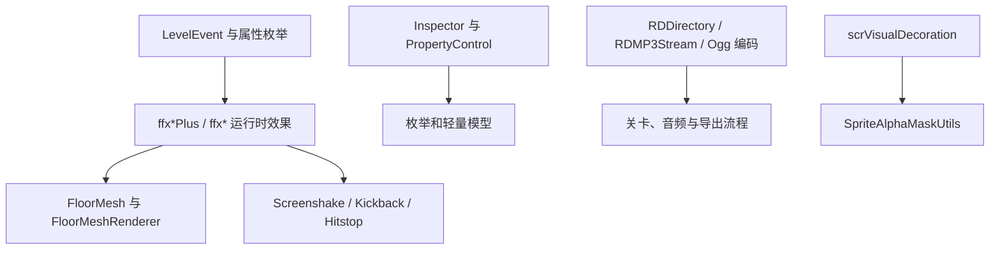

# 工具、枚举与网格渲染脚本索引

## 基本信息

本页收口阶段 7 中剩余的枚举、轻量数据结构、扩展方法、IO/音频工具、网格渲染脚本和小型行为组件。它们多数不构成单独系统，但在运行时、编辑器、关卡事件、渲染和平台工具中被频繁调用。

## 枚举与轻量模型

这些文件主要提供事件字段、编辑器选项、运行时状态或颜色/输入数据包装。

| 文件 | 类型 | 源码事实 |
| --- | --- | --- |
| `AngleCorrectionDirection.cs` | `AngleCorrectionDirection` | 定义角度修正方向，值为 `Backward = -1`、`None`、`Forward`。 |
| `AsyncKeyCode.cs` | `AsyncKeyCode` | 用 `ushort key` 和 `SkyHook.KeyLabel label` 包装异步键盘按键；构造函数支持 key、label 和元组；相等运算先比较 key，再比较 label。 |
| `BarState.cs` | `BarState` | 判定条状态枚举，包含 `Hit`、`Miss`、`Idle`。 |
| `BgDisplayMode.cs` | `BgDisplayMode` | 背景显示方式枚举，包含适配屏幕、原始大小和平铺。 |
| `DecorationBlendMode.cs` | `DecorationBlendMode` | 装饰混合模式枚举，包含无混合、加亮、叠加、柔光、差值和正片叠底等渲染模式。 |
| `FindFloorType.cs` | `FindFloorType` | 编辑器查找目标枚举，区分地板和书签。 |
| `FloorDecorationColorType.cs` | `FloorDecorationColorType` | 地板装饰颜色模式枚举，包含单色、发光、闪烁、切换、彩虹和音量驱动。 |
| `FloorDecorationType.cs` | `FloorDecorationType` | 地板装饰类型枚举，区分普通地板和 midspin。 |
| `FloorDirectionButtonType.cs` | `FloorDirectionButtonType` | 编辑器地板方向按钮枚举，列出方向键位、反引号组合、空格和 Tab。 |
| `FontName.cs` | `FontName` | 字体名枚举，包含默认字体和若干系统字体名。 |
| `Hitbox.cs`、`HitboxType.cs` | `Hitbox`、`HitboxType` | 命中区域形状和命中区域用途枚举，形状包含方形、圆形、胶囊体，用途包含无、击杀、事件。 |
| `HitboxDetectTarget.cs`、`HitboxTargetPlanet.cs`、`HitboxTriggerType.cs` | 多个 hitbox 枚举 | 控制命中区域检测对象、目标星体和触发次数策略。 |
| `NamedColor.cs` | `NamedColor` | 可序列化结构体，保存 `PlanetColorPreset name` 与 `Color color`。 |
| `ParticlePlayMode.cs`、`ParticleShape.cs`、`ParticleSimulationSpace.cs` | 多个粒子枚举 | 分别描述粒子播放命令、粒子形状和模拟空间。 |
| `PlanetColor.cs` | `PlanetColor` | 结构体保存颜色预设或自定义 `Color`；`ToRealColor()` 返回自定义颜色或预设颜色。 |
| `PlanetColorPreset.cs` | `PlanetColorPreset` | 星体颜色预设枚举，包含默认、特殊、合作和自定义颜色项。 |
| `PlanetCount.cs` | `PlanetCount` | 星体数量枚举，当前值为二星体和三星体。 |
| `PlanetDecorationColorType.cs` | `PlanetDecorationColorType` | 星体装饰颜色类型枚举，包含默认、特殊和自定义颜色项。 |
| `PublicPrefabType.cs` | `PublicPrefabType` | 公开预制体类型枚举，包含窗口、灯笼、火把、追逐怪物和官方场景对象。 |
| `RandomMode.cs` | `RandomMode` | 随机模式枚举，包含无、区间随机和二选一。 |
| `RepeatType.cs` | `RepeatType` | 重复单位枚举，区分按拍和按地板。 |
| `SpeedType.cs` | `SpeedType` | 速度类型枚举，区分 `Bpm` 和 `Multiplier`。 |
| `TrackAnimationType.cs`、`TrackAnimationType2.cs` | 轨道动画枚举 | 分别描述轨道出现和消失动画，例如组装、延伸、生长、散开、收回、缩小和淡出。 |
| `UnityLayer.cs` | `UnityLayer` | Unity layer 名称枚举，覆盖默认层、UI、星体、地板、背景、相机、闪光和 Workshop 缩略图层。 |

## 扩展方法

| 文件 | 主要对象 | 源码事实 |
| --- | --- | --- |
| `ExtensionMethods.cs` | `Color`、`Vector2`、`Vector3`、`Vector4`、对象、整数和列表 | 提供 alpha 替换、向量分量替换、轴线最近点、符号/绝对值、比值、角度、旋转、截断、反射格式化字符串、复制到剪贴板、bit 计数和带索引的冒泡排序。 |
| `GOExtensions.cs` | `GameObject`、`Behaviour` | 提供 `GetOrAddComponent<T>()`、`DisableComponent<T>()` 和带名称/父物体容器的 `Instantiate` 重载。 |
| `RDExtensions.cs` | `RectTransform`、`SpriteRenderer`、`Transform`、`uint`、`Behaviour`、`AudioSource`、`RenderTexture`、集合 | 提供锚点位置、富文本标签移除、sprite alpha、transform 移动/缩放、ARGB/RGBA 转色、震动组件、音频播放状态、循环增减、RenderTexture 清理/保存/临时分配和 `ForEach`。 |
| `EnumExtensions.cs` | `HitMargin` | 提供 `IsFail()`、`IsMiss()`、`IsAnyPerfect()`，把命中判定枚举分组成失败、失误和任意 perfect。 |
| `DOTweenExtensions.cs` | DOTween、`SpriteRenderer`、`Image`、`AudioSource` | 提供泛型彩虹颜色 tween，以及 sprite、UI image 的彩虹 tween 和 AudioSource 的淡出停止。 |
| `SuperGameFeelEffectsExtentions.cs` | `Camera` | 给相机挂接或复用 `Screenshake`、`Kickback`、`Hitstop`，并提供 `Shake()`、`Kick()`、`Stop()` 快捷方法。 |

## IO、音频与文本工具

| 文件 | 类型 | 源码事实 |
| --- | --- | --- |
| `RDDirectory.cs` | `RDDirectory` | 抽象目录操作入口，静态方法代理到当前目录实现，默认实现为 `RDDirectory_Default`。 |
| `RDDirectory_Default.cs` | `RDDirectory_Default` | 基于 `System.IO.DirectoryInfo` 实现目录存在判断、创建目录和复制目录；源目录不存在时写日志并返回。 |
| `RDMP3Stream.cs` | `RDMP3Stream` | 包装 `MP3Sharp.MP3Stream`，创建 streaming `AudioClip`，在 `OnAudioRead` 中读取 PCM 并在结束后卸载音频数据。 |
| `AudioclipToOggEncoder.cs` | `AudioclipToOggEncoder` | 用协程把 `AudioClip` 的指定时间段编码为 Ogg/Vorbis 文件；读取采样、转 16-bit PCM、写 Vorbis packet 和 Ogg page，并通过回调报告进度。 |
| `CSVReader.cs` | `CSVReader` | 从 `TextAsset` 读取 CSV 文本，使用正则拆分行与列，处理双引号转义，并生成 `string[,] grid`。 |

## 网格与遮罩渲染

| 文件 | 类型 | 源码事实 |
| --- | --- | --- |
| `FloorMesh.cs` | `FloorMesh` | 生成地板 mesh、UV、polygon collider 和缓存 key；支持普通轨道片段、sprite 四边形和六边形；属性 setter 会标记 `meshChanged` 并加入待刷新集合。 |
| `FloorMeshOld.cs` | `FloorMeshOld` | 旧式地板显示脚本，使用 start/end/circle transform 设置旋转和缩放，并同步材质和 sorting order。 |
| `FloorMeshRenderer.cs` | `FloorMeshRenderer` | 继承 `FloorRenderer`，以 `FloorMesh` 渲染地板；颜色写入材质 shader，`SetAngle()` 把弧度转成角度后传给 mesh。 |
| `MeshBox.cs` | `MeshBox` | 空 MonoBehaviour，源码中只保留 `Start()` 和 `Update()` 空方法。 |
| `MeshPoint.cs` | `MeshPoint` | 结构体保存 `Vector2 position` 与 `int innerPointIndex`。 |
| `PolygonInfo.cs` | `PolygonInfo` | 结构体保存逆时针和顺时针曲线 `RangeInt`，构造函数直接写入两个字段。 |
| `CircleLineRenderer.cs` | `CircleLineRenderer` | 要求 `LineRenderer`，在 `OnValidate()` 中按 `steps` 和 `radius` 计算圆周点并写入 line positions。 |
| `AreaCover.cs` | `AreaCover` | 控制两层 `Mawaru_Sprite` 的伸展、隐藏和闪烁；`Spawn()` 使用 DOTween 扩展缩放，`Hide()` 和 `HideGentle()` 渐隐并关闭 renderer。 |
| `SpriteAlphaMask.cs` | `SpriteAlphaMask` | 保存 alpha mask 使用的 shader property id、sprite、tag、pivot 和 child transform；`maskSize` 根据 sprite bounds 和 pivot 缩放计算。 |
| `SpriteAlphaMaskUtils.cs` | `SpriteAlphaMaskUtils` | 缓存场景中的 `SpriteAlphaMask`，按 tag 绑定到 `scrVisualDecoration`，并把重叠的 mask 合成到 RenderTexture。 |

## Game feel 与小型行为组件

| 文件 | 类型 | 源码事实 |
| --- | --- | --- |
| `ConstantShake.cs` | `ConstantShake` | 每帧撤销上一帧偏移，再按 `strength` 和 `intensity` 生成随机 localPosition 偏移。 |
| `Hitstop.cs` | `Hitstop` | 通过协程按 `AnimationCurve` 修改 `Time.timeScale`；再次触发时恢复旧 timescale 并停止旧协程。 |
| `Kickback.cs` | `Kickback` | 通过协程按方向、曲线、强度和持续时间移动 transform；支持本地空间和小数位四舍五入。 |
| `SetActiveAtAwake.cs` | `SetActiveAtAwake` | `Awake()` 中把 `objectsToSetActive` 列表内对象全部设为 active。 |
| `SetInactiveOnStart.cs` | `SetInactiveOnStart` | `Start()` 中把自身 GameObject 设为 inactive。 |
| `ToggleVisible.cs` | `ToggleVisible` | 依赖 Unity 可见性回调，在可见时启用目标脚本，不可见时按 `ignoreIfDisabled` 条件禁用目标脚本。 |
| `KillSpriteAfterTime.cs` | `KillSpriteAfterTime` | 计时达到 `aliveTime` 后销毁对象；启用 `fadeAway` 时用曲线更新 SpriteRenderer alpha。 |
| `SetSortingLayer.cs` | `SetSortingLayer` | `Awake()` 中读取自身 `Renderer`，设置 sorting layer 名称和 order。 |

## 与主系统的关系

## 覆盖边界

本页覆盖的是散落在根目录中的工具和轻量脚本。`PlanetarySystem`、`PlanetRenderer` 和 `PlanetSprite` 属于星体运行时主对象，已经由运行时输入、判定、星体缩放和颜色相关页面从流程侧说明；如果后续阶段 7 需要进一步压低未命中数，可把它们追加到“星体渲染补充索引”。
