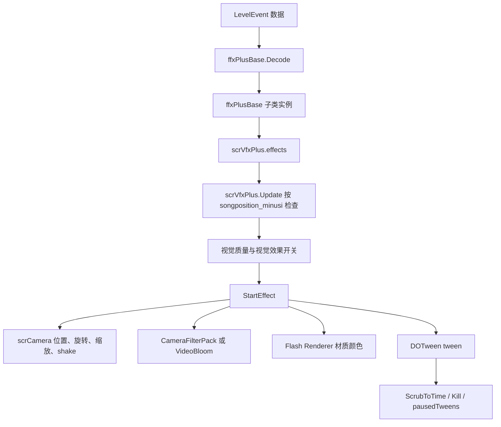

# 相机与 VFX 运行链路

## 覆盖源码

| 类型 | 源码路径 | 角色 |
| --- | --- | --- |
| `scrCamera` | `7thRhythmSource/ADOFAi/scrCamera.cs` | 游戏主相机控制器，管理跟随、移动、旋转、缩放、背景色、闪屏、RenderTexture 相机和自定义帧率输出。 |
| `scrVfxPlus` | `7thRhythmSource/ADOFAi/scrVfxPlus.cs` | 运行时 VFX 调度器，保存 `ffxPlusBase` 列表，按歌曲时间触发效果，并管理视频背景和滤镜组件字典。 |
| `ffxPlusBase` | `7thRhythmSource/ADOFAi/ffxPlusBase.cs` | 事件效果基类，保存触发时间、持续时间、缓动、视觉质量开关、来源事件和常用运行时引用。 |
| `ffxCameraPlus` | `7thRhythmSource/ADOFAi/ffxCameraPlus.cs` | `MoveCamera` 类事件的运行时组件，使用 DOTween 修改相机父物体位置、旋转角和缩放倍率。 |
| `ffxSetFilterPlus` | `7thRhythmSource/ADOFAi/ffxSetFilterPlus.cs` | 预定义滤镜事件组件，启用或关闭 `Filter` 枚举对应的 CameraFilterPack 组件并 tween 强度。 |
| `ffxSetFilterAdvancedPlus` | `7thRhythmSource/ADOFAi/ffxSetFilterAdvancedPlus.cs` | 高级滤镜事件组件，按滤镜类名反射组件字段，支持相机平面和装饰对象目标。 |
| `ffxFlashPlus` | `7thRhythmSource/ADOFAi/ffxFlashPlus.cs` | 前景或背景闪屏组件，修改相机上的闪屏 Renderer 材质颜色。 |
| `ffxShakeScreenPlus` | `7thRhythmSource/ADOFAi/ffxShakeScreenPlus.cs` | 屏幕震动组件，写入 `scrCamera.shake` 并在 tween 完成后清零。 |
| `ffxBloomPlus` | `7thRhythmSource/ADOFAi/ffxBloomPlus.cs` | Bloom 组件控制器，修改 `VideoBloom` 的 threshold、intensity 和 tint。 |
| `Filter` | `7thRhythmSource/ADOFAi/Filter.cs` | 预定义滤镜枚举。 |
| `CamMovementType` | `7thRhythmSource/ADOFAi/CamMovementType.cs` | 相机事件坐标参照方式枚举。 |
| `FilterTargetType` | `7thRhythmSource/ADOFAi/FilterTargetType.cs` | 高级滤镜目标枚举。 |
| `FilterPlane` | `7thRhythmSource/ADOFAi/FilterPlane.cs` | 高级滤镜相机平面枚举。 |

## `scrCamera`

`scrCamera` 继承 `ADOBase`，以静态 `instance` 暴露当前场景相机。它持有主相机、背景相机、静态背景相机、覆盖层相机和暂停行星相机引用。常量 `DefaultCameraOrthoSize` 为 `5f`，相机 Z 坐标常量为 `-10f`。

### 主要字段

| 字段 | 类型 | 作用 |
| --- | --- | --- |
| `camobj` | `Camera` | 主相机组件，`Awake()` 中从当前对象读取。 |
| `BGcam`、`Bgcamstatic` | `Camera` | 背景相机和静态背景相机，RenderTexture 模式会把它们写到同一个目标纹理。 |
| `Overlaycam` | `Camera` | RenderTexture 相机模式的覆盖层相机。 |
| `forceRTCam`、`useRTCam` | `bool` | 控制是否启用 RenderTexture 相机输出。 |
| `camRT` | `RenderTexture` | 当前屏幕尺寸对应的相机渲染纹理。 |
| `isPulsingOnHit` | `bool` | 是否允许命中时相机脉冲。 |
| `isSizeTweening` | `bool` | 是否在 `Update()` 中更新正交尺寸。 |
| `isZoomingOut` | `bool` | `ZoomOut()` 设置的远距离缩放状态。 |
| `isMoveTweening` | `bool` | 是否对相机位置做插值移动。 |
| `followMode` | `bool` | 相机是否跟随玩家所在行星。 |
| `followMovingPlatforms` | `bool` | 跟随移动平台时影响移动速度插值。 |
| `editorRotation` | `bool` | 自定义关卡运行时设为 `true`，避免普通旋转更新覆盖编辑器式相机角度。 |
| `topos`、`pos`、`frompos` | `Vector3` | 目标位置、当前插值位置和起始位置。 |
| `camspeed` | `float` | 相机移动插值时长，官方关卡按起始 crotchet 计算，自定义关卡按 BPM、星体速度和音高计算。 |
| `speedAffectedByBPMChanges` | `bool` | 为真时相机速度会除以当前星体系统速度。 |
| `speedAffectedBySpeedTrial` | `bool` | 为真时相机速度会除以 `GCS.currentSpeedTrial`。 |
| `fromcol`、`tocol`、`col` | `Color` | 背景色插值起点、目标和当前值。 |
| `camsizenormal`、`tosize`、`fromsize` | `float` | 正常相机尺寸、目标尺寸和起始尺寸。 |
| `userSizeMultiplier` | `float` | 用户尺寸倍率，最终正交尺寸会乘以它。 |
| `zoomSize` | `float` | 事件缩放倍率；为 0 时会禁用 `camobj`。 |
| `pulsemagnitude`、`pulsedur` | `float` | 命中脉冲强度和持续时间。 |
| `enableCustomFPS`、`frameRate` | `bool` / `float` | 自定义帧率画面输出开关和目标帧率。 |
| `flashPlusRendererBg`、`flashPlusRendererFg` | `Renderer` | `ffxFlashPlus` 使用的背景和前景闪屏渲染器。 |
| `torot`、`fromrot`、`rot` | `float` | 相机旋转插值目标、起点和当前值。 |
| `offset`、`holdOffset` | `Vector3` | 3D 或 hold 状态下加入相机位置的偏移。 |
| `lastEventRelativePosition` | `Vector2` | `ffxCameraPlus` 记录的上一次相机事件相对位置。 |
| `lastUsedMovementType` | `CamMovementType` | 上一次相机事件使用的坐标参照模式。 |
| `lastTileCamFloor` | `int` | 上一次 tile 相机事件所属地板序号。 |
| `shake` | `Vector3` | 屏幕震动偏移，`Update()` 写入主相机位置。 |
| `furthestPlanet` | `scrPlanet` | 合作模式下推进最远的行星，普通模式下为控制器当前 chosen planet。 |

### 生命周期

| 方法 | 行为 |
| --- | --- |
| `Awake()` | 设置 `instance`，读取 `Camera` 组件；3D 相机会把当前 localPosition 的 X/Y 写入 offset；读取 quad 的 MeshRenderer；`forceRTCam` 为真时立即启用 RenderTexture 相机。 |
| `Start()` | 若存在 controller，则把 `furthestPlanet` 设为当前 chosen planet；记录当前位置为 `topos` 和 `frompos`；设置目标背景色、默认尺寸、低画质背景控制器、自定义关卡的 `editorRotation`，并把 culling mask 加上 `0x80`。 |
| `Update()` | 需要时重建 RenderTexture；根据跟随模式、位置状态和速度计算相机位置；更新旋转、背景色、尺寸；处理异步输入导致的相机 Y 覆盖。 |
| `LateUpdate()` | 检查自定义帧率输出并把对象 Z 坐标固定到 `-10f`。 |
| `Rewind()` | 重置脉冲、移动、缩放、背景色、旋转、计时器和位置，再调用 `Start()` 重新取当前运行状态。 |

### 位置与跟随

`Update()` 在非 free roam 并且没有被暂停跟随限制时更新相机。官方关卡的 `camspeed` 默认来自 `scrConductor.instance.crotchetAtStart * 2`；如果开启 BPM 或 speed trial 影响，会除以当前行星系统速度和 `GCS.currentSpeedTrial`。自定义关卡使用 `ADOBase.conductor.bpm * furthestPlanet.planetarySystem.speed * song.pitch` 计算每拍时间，再把 `camspeed` 设为该时间的两倍。

`positionState` 会把菜单、DLC、CLS、Neo Cosmos credits、Taro menu 等场景位置转换为固定目标坐标。游戏世界或 `isMoveTweening` 为真时，代码用 `Vector3.Lerp(frompos, topos + offset + holdOffset, timer / adjustedSpeed)` 移动相机；`shake` 以 XY 偏移叠加到主相机 localPosition。

`UpdateFollowCam(bool force = false)` 在合作模式下遍历 `playerManager.players`，选择仍存活且不在复活倒计时、并且 `currfloor.seqID` 最大的玩家行星作为 `furthestPlanet`。普通模式直接使用 `ADOBase.controller.chosenPlanet`。如果 `followMode` 为真，它把 `frompos` 设为当前相机位置，`topos` 设为 `furthestPlanet.transform.position`，并重置 `timer`。

### 尺寸、脉冲和 RenderTexture

| 方法 | 行为 |
| --- | --- |
| `UpdateSize()` | 未暂停时推进 `pulsetimer`，把 `fromsize` 到 `tosize` 的插值结果乘以 `userSizeMultiplier` 和 `zoomSize` 写入 `camobj.orthographicSize`；`zoomSize == 0` 时禁用主相机。 |
| `Pulse()` | 在视觉效果不是 Minimum 且自定义关卡允许落地脉冲时，把尺寸从 `camsizenormal - pulsemagnitude` 插回 `camsizenormal`。 |
| `ZoomOut()` | `GCS.DisableAllZooming` 为假时，把目标尺寸设为 `100f`，持续时间设为 `10f`。 |
| `setCamSizeInstant()` | 立即设置 `fromsize` 和 `tosize`。 |
| `setCamSizeSmooth()` | 从当前正交尺寸插到目标尺寸，并更新 `camsizenormal`。 |
| `setCamSizeLerp()` | 直接指定尺寸插值起点、终点和持续时间。 |
| `setNewCamSizeNormal()` | 根据 `smooth` 选择立即或平滑设置，并更新正常尺寸。 |
| `SetupRTCam()` | 切换 RenderTexture 相机，把背景、静态背景、主相机 targetTexture 指向 `camRT` 或 null，并显示或隐藏 overlay 相机和 quad。 |
| `SetCustomFrameRate()` | 启用时为 quad 材质创建新的 RenderTexture，并调用 `UpdateCustomFrameRateScreen()`；关闭时释放自定义纹理并恢复到 `camRT`。 |
| `UpdateCustomFrameRateScreen()` | 依次渲染静态背景、背景、主相机，再把 `camRT` blit 到 quad 材质纹理。 |

## `scrVfxPlus`

`scrVfxPlus` 继承 `ADOBase`，静态 `instance` 返回场景中的 VFX 调度器。它在 `Awake()` 中缓存 `scrConductor.instance`、`scrController.instance`、`scrCamera.instance`，创建 `effects` 列表，并初始化滤镜字典。

### 字段与字典

| 字段 | 类型 | 作用 |
| --- | --- | --- |
| `videoBG` | `VideoPlayer` | 视频背景播放器；自定义关卡从 `ADOBase.customLevel.videoBG` 获取。 |
| `vidOffset` | `float` | 视频背景相对歌曲时间的偏移。 |
| `effects` | `List<ffxPlusBase>` | 待触发的运行时效果列表，`Update()` 按 `currentVfxIndex` 顺序扫描。 |
| `vTrackerFloat` | `scrVolumeTrackerFloat` | 当前对象上的音量追踪组件。 |
| `filterToComp` | `Dictionary<Filter, MonoBehaviour>` | `Filter` 枚举到具体 CameraFilterPack 或图像效果组件的映射。 |
| `filterCurrIntensity` | `Dictionary<Filter, float>` | 每个预定义滤镜当前强度。 |
| `filterTween` | `Dictionary<Filter, Tween>` | 每个预定义滤镜正在运行的 DOTween。 |
| `pausedTweens` | `List<Tween>` | scrub 过程中被推进到中间状态的 tween；`PlayerControl_Enter` 会恢复这些 tween。 |
| `filterDefaultValues` | `Dictionary<Filter, float>` | Aberration、Blizzard、Fisheye、LED、Pixelate 的默认强度。 |
| `camAngle` | `float` | 写入时同步设置 `scrCamera` 对象的 Z 轴旋转。 |
| `hasPlayed` | `bool` | 视频背景是否已经播放过。 |

### 运行时触发

`Update()` 在控制器暂停或歌曲尚未开始时直接返回。否则它根据关卡来源取视觉质量和视觉效果设置：官方关卡使用 `ADOBase.controller.visualQuality` 与 `visualEffects`，非官方关卡强制使用 High 与 Full。

调度器从 `currentVfxIndex` 开始扫描 `effects`：

| 条件 | 行为 |
| --- | --- |
| 效果对象为空 | 结束扫描。 |
| `cond.songposition_minusi < startTime - startEffectOffset` | 当前效果还没到触发时间，结束扫描。 |
| 视觉质量为 High 或效果不是 `hifiEffect` | 允许继续检查。 |
| Minimum 视觉效果且效果 `disableIfMinFx` 为真 | 跳过 StartEffect，但仍标记 triggered。 |
| Full 视觉效果且效果 `disableIfMaxFx` 为真 | 跳过 StartEffect，但仍标记 triggered。 |
| 练习模式中且控制器状态已经到失败之后 | 跳过 StartEffect。 |
| 条件全部通过 | 调用 `ffxPlusBase.StartEffect()`，然后把 `triggered` 设为真。 |

同一帧最多通过 `num > 1000000` 的保护跳出循环。触发扫描之后，如果 `videoBG` 已激活、未播放、已准备并且当前歌曲时间超过倒计时修正后的播放时间，就根据 `shouldPlayVideo` 播放或停止视频，设置 `hasPlayed`，同步 `playbackSpeed` 和 `time`，自定义关卡还会隐藏教程背景。

### Scrub 与重置

| 方法 | 行为 |
| --- | --- |
| `Reset()` | 把 `currentVfxIndex`、`camAngle`、`hasPlayed` 复位，清空效果列表和滤镜 tween，并重建滤镜强度默认值。 |
| `ScrubToTime(float t)` | 对尚未触发且符合视觉质量条件的效果调用 `ScrubToTime(t)`；已经触发的效果会被收集并从列表移除。 |
| `MakeNewFilterDictionary()` | 把 `Filter` 枚举映射到当前相机上的滤镜组件，包括灰度、VHS、雨、雪、压缩、模糊、鱼眼、色差、花瓣等。 |

## `ffxPlusBase`

`ffxPlusBase` 是事件效果基类，继承 `ADOBase`。`Awake()` 会缓存 `scrCamera`、`scrController`、`scrConductor`、`scrVfxPlus` 和当前地板 `scrFloor`。旧的 5 项 `conditionalInfo` 会扩展为 8 项布尔数组，否则初始化为 8 项数组。

### 字段

| 字段 | 类型 | 作用 |
| --- | --- | --- |
| `hifiEffect` | `bool` | 高视觉质量才执行的效果标记。 |
| `disableIfMinFx` | `bool` | 视觉效果为 Minimum 时禁用。 |
| `disableIfMaxFx` | `bool` | 视觉效果为 Full 时禁用。 |
| `startTime` | `double` | 效果触发的歌曲时间。 |
| `startEffectOffset` | `double` | 提前启动偏移。 |
| `duration` | `float` | 效果持续时间。 |
| `ease` | `Ease` | DOTween 缓动类型，默认 `Ease.Linear`。 |
| `triggered` | `bool` | 是否已经被调度器处理。 |
| `degreeOffset` | `float` | 按角度偏移换算出的触发偏移。 |
| `conditionalInfo` | `bool[]` | 条件信息数组。 |
| `runManually` | `bool` | 手动运行标记。 |
| `sourceLevelEvent` | `LevelEvent` | 生成该效果的来源事件。 |
| `cam`、`ctrl`、`cond`、`floor`、`vfx` | 多类型 | 常用运行时对象引用。 |
| `floors` | `List<scrFloor>` | 相关地板列表。 |
| `floorID` | `int` | 地板编号。 |
| `crotchet` | `float` | 当前节拍长度。 |

### 方法

| 方法 | 行为 |
| --- | --- |
| `Decode(LevelEvent evnt)` | 默认空实现，子类读取事件属性。 |
| `PrepVfx()` | 默认空实现，用于子类提前准备效果。 |
| `StartEffect()` | 调用抽象 `StartEffect(scrPlanet planet)`，传入 null。 |
| `StartEffect(scrPlanet planet)` | 抽象方法，所有具体效果必须实现。 |
| `StartEffectWithOffset()` | 根据 BPM、song pitch、地板 speed 和 `degreeOffset` 延迟调用 `StartEffect(planet)`；如果延迟结束时控制器暂停则不触发。 |
| `SetStartTime(float bpm, float degreeOffset = 0f)` | 根据当前地板 entryTime、角度偏移、BPM 和地板 speed 计算 `startTime`。 |
| `ScrubToTime(float t)` | 如果 `t` 已越过 startTime，则启动效果；若越过结束时间则 kill 并完成 tween；否则把 tween Goto 到对应时间并加入 `vfx.pausedTweens`。 |
| `Kill()` | 终止 `eventTweens` 中的 tween。 |
| `AdjustDurationForHardbake()` | 非自定义关卡下把 `duration` 除以歌曲 pitch。 |
| `OnDrawGizmos()` | 在对象位置绘制 `star.png` gizmo。 |

`eventTweens` 默认为 null。相机、滤镜、闪屏、震屏和 Bloom 等子类会覆盖它，让 scrub、kill 和暂停恢复流程能处理正在运行的 tween。

## 相机事件 `ffxCameraPlus`

`ffxCameraPlus` 通过 `MoveCamera` 类事件修改相机父物体、VFX 角度和缩放倍率。它使用 4 个静态 tween：`moveXTween`、`moveYTween`、`rotationTween`、`zoomTween`，因此新的相机事件会 kill 旧的同类 tween。

### 字段

| 字段 | 类型 | 作用 |
| --- | --- | --- |
| `targetPos` | `Vector2` | 目标位置，`Decode()` 中由事件 `position` 乘以 `controller.tileSize` 得到。 |
| `positionUsed` | `bool` | `position` 属性是否启用。 |
| `targetRot` | `float` | 目标旋转角。 |
| `rotationUsed` | `bool` | `rotation` 属性是否启用。 |
| `targetZoom` | `float` | 目标 zoom，事件百分比会除以 100。 |
| `zoomUsed` | `bool` | `zoom` 属性是否启用。 |
| `movementType` | `CamMovementType` | 坐标参照方式。 |
| `movementTypeUsed` | `bool` | `relativeTo` 属性是否启用。 |
| `floorPos` | `Vector3` | 效果所属地板的世界坐标。 |
| `dontDisable` | `bool` | 是否避免在最低视觉效果下被禁用。 |
| `finalPos` | `Vector2` | 计算后的最终相机父物体位置。 |
| `legacyRelativeTo` | `static bool` | 旧版相对坐标行为开关。 |

### 坐标参照

| `CamMovementType` | 行为 |
| --- | --- |
| `Player` | 若当前不是跟随模式，会把相机父物体移动到当前位置相对玩家的位置，重新开启 `followMode` 并强制更新跟随；最终位置使用事件相对坐标。 |
| `Tile` | 若当前是跟随模式，会记录当前相机世界位置到父物体并进入自由模式；`lastEventRelativePosition` 设为当前地板位置，最终位置为事件相对坐标加地板位置。 |
| `Global` | 进入自由模式，`lastEventRelativePosition` 设为零，最终位置为全局坐标。 |
| `LastPosition` | 以当前相机父物体位置为基准；若启用旋转，会把当前 `vfx.camAngle` 加到目标旋转。 |
| `LastPositionNoRotation` | 以当前相机父物体位置为基准，不把当前旋转角加到目标旋转。 |

`StartEffect()` 会根据启用项 kill 旧 tween，调用 `AdjustDurationForHardbake()`，再用 DOTween 修改相机父物体 X/Y、`vfx.camAngle` 和 `cam.zoomSize`。`ScrubToTime()` 在最低视觉效果下尊重 `dontDisable`，并在相机事件结束后、若坐标参照为 Player，会调用 `cam.ViewObjectInstant(cam.furthestPlanet.transform)` 回到玩家视角。

## 滤镜事件

### `Filter` 枚举

`Filter` 包含灰度、棕褐、反色、VHS、电视、雨雪、压缩、Glitch、Pixelate、Waves、Static、Grain、MotionBlur、Fisheye、Aberration、Drawing、Neon、Handheld、NightVision、Funk、Tunnel、Weird3D、Blur、GaussianBlur、Posterize、Sharpen、Contrast、OilPaint、WaterDrop、LightWater、Petals 等预定义滤镜。

### `ffxSetFilterPlus`

`ffxSetFilterPlus` 在 `Awake()` 中设置 `hifiEffect = true`，并根据 `dontDisable` 设置 `disableIfMinFx`。`StartEffect()` 会先 kill 当前滤镜已有 tween；若 duration 为 0，直接写入强度并调用 `SetFilter()`；否则用 DOTween 从当前强度插到目标强度。`disableOthers` 为真时，会遍历 `filterToComp`，kill 其他滤镜 tween 并禁用其他滤镜组件。

`SetFilter()` 先根据 `enableFilter` 设置组件启用状态；移动端会跳过 `CameraMotionBlur` 的启用。启用后，不同 `Filter` 会写入不同组件字段，例如 VHS 写 `TRACKING`，LED 写 `Size`，Waves 写 `WaveIntensity`，Pixelate 写 `_Pixelisation`，MotionBlur 写 `velocityScale`，Aberration 写 `Offset`，Blur 写 `Amount`，WaterDrop 写 `Distortion`。部分滤镜还同步修改 CameraFilterPack 的静态 Change 字段。

`Decode()` 读取：

| 事件属性 | 写入字段 |
| --- | --- |
| `filter` | `filter` |
| `enabled` | `enableFilter` |
| `intensity` | `intensity / 100f` |
| `disableOthers` | `disableOthers` |
| `duration` | `duration * crotchet` |
| `ease` | `ease` |

### `ffxSetFilterAdvancedPlus`

`ffxSetFilterAdvancedPlus` 面向高级滤镜类名。它的 `blacklistedFilterKeywords` 包含 `Blend2Camera_`、`Antialiasing_FXAA`、`Colors_Adjust_PreFilters`，`StartEffect()` 遇到这些关键词会直接返回。

`SetupVariables()` 把 `FilterPlane.Foreground` 映射到 `scrCamera.instance.camobj`，把 `FilterPlane.Background` 映射到 `scrCamera.instance.BGcam`。`Setup()` 根据 `targetType` 选择目标对象：`Camera` 目标使用对应相机的 GameObject，`Decoration` 目标使用 `scrDecorationManager.instance.GetTaggedDecorations(decorationTag)`。之后通过 `Type.GetType(filterName + ", Assembly-CSharp-firstpass")` 查找滤镜类型，并获取公开实例字段。

对每个目标对象，`Setup()` 会：

| 情况 | 行为 |
| --- | --- |
| 已存在该滤镜组件 | 缓存组件和 MonoBehaviour，把滤镜记入 `modifiedFilters`；必要时保存原始字段值。 |
| 不存在该滤镜组件 | 动态 `AddComponent(filterType)`，先禁用 MonoBehaviour，把对象记入 `addedFilters` 和 `isAddedComponent`。 |

`StartEffect()` 只处理 int、float、Color、Vector2 类型字段。事件数据中以 `filter_` 开头且未禁用的属性会进入 `filterProperties`；字段值按 `RDEditorUtils.FilterFieldToUnit()` 和 `UnitMultiplier()` 做单位换算。duration 为 0 时直接写字段；否则为每个字段创建 tween。执行末尾把 MonoBehaviour 的 `enabled` 设置为 `enableFilter`，并把滤镜记入 `usedFilters` 和 `initializedFilters`。

`OnDestroy()` 会销毁本事件动态添加的组件，移除记录，并 kill 字段 tween。静态方法 `ResetAllFilters()`、`ResetFilters()`、`ResetFilterValues()` 用于关闭滤镜、恢复原始字段值和清理 tween。

## 闪屏、震屏和 Bloom

| 类型 | StartEffect 行为 | Decode 行为 |
| --- | --- | --- |
| `ffxFlashPlus` | 视觉效果不是 Minimum 时执行；选择前景或背景闪屏 renderer，kill 材质旧 tween，把材质颜色设为 startColor，再 tween 到 endColor。 | 读取 `duration`、`startColor`、`endColor`、`startOpacity`、`endOpacity`、`ease` 和 `plane`。 |
| `ffxShakeScreenPlus` | 视觉效果不是 Minimum 且 duration 非 0 时执行；根据 ease 计算 multiplier，再用 `DOTween.Shake` 写入 `cam.shake`，完成后清零。 | 读取 `intensity / 100f`、`strength / 100f`、`duration * crotchet`、`ease` 和 `fadeOut`。 |
| `ffxBloomPlus` | 读取相机上的 `VideoBloom`，设置 enabled，再 tween `Threshold`、`MasterAmount` 和 `Tint`。 | 读取 `enabled`、`threshold / 100f`、`intensity / 100f`、`color`、`duration * crotchet` 和 `ease`。 |

## 执行链路

相机和 VFX 的关系可以概括为：`scrCamera` 保存实际相机状态，`scrVfxPlus` 按时间调度效果，`ffxPlusBase` 子类把事件属性解码成对相机、滤镜、闪屏材质或装饰对象的修改。暂停、checkpoint scrub 和练习模式会通过 `scrVfxPlus.pausedTweens` 与 `ffxPlusBase.ScrubToTime()` 介入 tween 状态。
