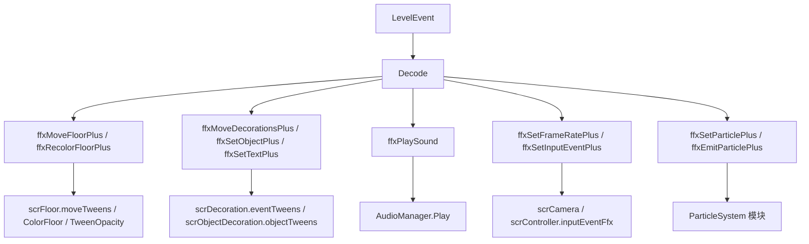

# 运行时效果族补充

## 覆盖源码

| 类型 | 源码路径 | 角色 |
| --- | --- | --- |
| `ffxMoveFloorPlus` | `7thRhythmSource/ADOFAi/ffxMoveFloorPlus.cs` | 移动、旋转、缩放或淡化一段地板。 |
| `ffxRecolorFloorPlus` | `7thRhythmSource/ADOFAi/ffxRecolorFloorPlus.cs` | 重设地板样式、颜色、颜色动画、脉冲和发光强度。 |
| `ffxMoveDecorationsPlus` | `7thRhythmSource/ADOFAi/ffxMoveDecorationsPlus.cs` | 按 tag 移动、旋转、缩放、改色、换图、改遮罩或显隐装饰。 |
| `ffxSetObjectPlus` | `7thRhythmSource/ADOFAi/ffxSetObjectPlus.cs` | 修改对象装饰中的星球和地板对象属性。 |
| `ffxSetTextPlus` | `7thRhythmSource/ADOFAi/ffxSetTextPlus.cs` | 按 tag 修改文本装饰内容。 |
| `ffxPlaySound` | `7thRhythmSource/ADOFAi/ffxPlaySound.cs` | 按歌曲 DSP 时间预排 hitsound 播放。 |
| `ffxSetFrameRatePlus` | `7thRhythmSource/ADOFAi/ffxSetFrameRatePlus.cs` | 开关 `scrCamera` 的自定义帧率 RenderTexture 输出。 |
| `ffxSetInputEventPlus` | `7thRhythmSource/ADOFAi/ffxSetInputEventPlus.cs` | 把带指定 event tag 的效果登记为输入触发事件。 |
| `ADOFAI.FloorFX.ffxSetParticlePlus` | `7thRhythmSource/ADOFAi/ADOFAI.FloorFX/ffxSetParticlePlus.cs` | 按 tag 修改粒子装饰的 ParticleSystem 模块。 |
| `ADOFAI.FloorFX.ffxEmitParticlePlus` | `7thRhythmSource/ADOFAi/ADOFAI.FloorFX/ffxEmitParticlePlus.cs` | 立即让目标粒子装饰发射指定数量粒子。 |

这些类都继承 `ffxPlusBase`，由 `scrVfxPlus` 按歌曲时间触发。相机、滤镜、闪屏、震屏和 Bloom 已在 [相机与 VFX 运行链路](/api/runtime/camera-vfx-chain.md) 中展开，本页只覆盖其他常见效果族。

## 地板移动 `ffxMoveFloorPlus`

`ffxMoveFloorPlus` 在 `Awake()` 中缓存 `ADOBase.lm`。`Decode()` 读取 `startTile`、`endTile`，通过 `scnGame.IDFromTile()` 转为地板序号，并读取 `gapLength`、`positionOffset`、`rotationOffset`、`scale`、`opacity`、`ease` 和 `maxVfxOnly`。

### 字段

| 字段 | 类型 | 作用 |
| --- | --- | --- |
| `start`、`end` | `int` | 目标地板范围。 |
| `gapLength` | `int` | 每次处理后跳过的间隔长度，循环步长为 `1 + gapLength`。 |
| `targetPos` | `Vector2` | 位置偏移，事件向量乘以 `controller.tileSize`。 |
| `targetRot` | `float` | 旋转偏移角。 |
| `targetScaleV2` | `Vector2` | 目标 XY 缩放，事件百分比除以 100。 |
| `targetOpacity` | `float` | 目标透明度，事件百分比除以 100。 |
| `positionUsed`、`rotationUsed`、`scaleUsed`、`opacityUsed` | `bool` | 对应事件属性是否未被禁用。 |

`StartEffect()` 会先 `AdjustDurationForHardbake()`，若 `end < start` 则交换两端。每个目标地板调用内部 `TweenFloor()`，free roam 区域中可落地的子地板也会一起处理。

### Tween 项

| 项 | 写入位置 |
| --- | --- |
| `TweenType.PositionX` / `PositionY` | `target.transform.position.x/y`。 |
| `TweenType.Rotation` | `target.tweenRot.z`，OnUpdate 写回 `targetTransform.eulerAngles`。 |
| `TweenType.ScaleX` / `ScaleY` | `targetTransform.DOScale(...).SetOptions(AxisConstraint.X/Y)`。 |
| `TweenType.Opacity` | `target.TweenOpacity(targetOpacity, duration, ease)`。 |

每类 tween 写入前都会 kill 当前地板 `moveTweens` 中同类型旧 tween。

## 地板改色 `ffxRecolorFloorPlus`

`ffxRecolorFloorPlus` 负责重设地板颜色与样式。`Decode()` 读取地板范围、`trackColor`、`secondaryTrackColor`、`trackColorAnimDuration`、`trackColorType`、`trackColorPulse`、`trackPulseLength`、`trackStyle`、`trackGlowIntensity`、duration 和 ease。

`StartEffect()` 对范围内地板执行：

| 步骤 | 行为 |
| --- | --- |
| 设置样式 | `target.styleNum = (int)style`，调用 `UpdateAngle(false)` 与 `SetTrackStyle(style)`。 |
| 清理旧 tween | kill `TweenType.Color` 和 `TweenType.Glow`。 |
| 地板颜色 | 调用 `target.ColorFloor(colorType, color1, color2, colorAnimDuration / cond.song.pitch, pulseType, pulseLength, start, duration, ease)`。 |
| 发光强度 | 使用 DOTween 修改 `target.glowMultiplier`，写入 `target.moveTweens[TweenType.Glow]`。 |

## 装饰移动 `ffxMoveDecorationsPlus`

`ffxMoveDecorationsPlus` 按 tag 从 `scrDecorationManager` 中取目标装饰。`Awake()` 设置 `hifiEffect = true`；若 `ADOBase.levelIsMikoSkip`，则取消 hifi 限制。官方关卡低视觉质量且不是 MikoSkip 时，`StartEffect()` 直接返回。

### Decode 属性

| 事件属性 | 写入字段 |
| --- | --- |
| `relativeTo` | `movementType`。 |
| `visible` | `visible`。 |
| `decorationImage` | `targetImageFilename`。 |
| `depth` | `targetDepth`。 |
| `parallax` | `targetParallax`。 |
| `parallaxOffset` | 乘 `tileSize` 后写入 `targetParallaxOffset`。 |
| `positionOffset` | 乘 `tileSize` 后写入 `targetPos`。 |
| `pivotOffset` | 乘 `tileSize` 后写入 `targetPivot`。 |
| `rotationOffset` | `targetRot`。 |
| `scale` | 除以 100 后写入 `targetScaleV2`。 |
| `color` | `targetColor`。 |
| `opacity` | 除以 100 后写入 `targetOpacity`。 |
| `maskingType`、`useMaskingDepth`、`maskingFrontDepth`、`maskingBackDepth` | 遮罩相关字段。 |
| `tag` | 按空格拆分为 `targetTags`，空 tag 会写入 `NO TAG`。 |

每个属性还有对应 `Used` 布尔值，来自 `!evnt.disabled[...]`。

### StartEffect 行为

对每个目标 `scrDecoration`：

| 类别 | 行为 |
| --- | --- |
| placement | 自定义关卡中，如果启用 `relativeTo` 且不是 `LastPosition`，调用 `dec.SetPlacementType(movementType)`。 |
| position | 从 `dec.startPos` 或 LastPosition 的 `dec.pivotPosVec` 起算，tween X/Y 并调用 `SetPositionX/Y()`。 |
| parallax offset | tween `SetParallaxOffsetX/Y()`。 |
| pivot | tween `SetPivotX/Y()`。 |
| rotation | tween `SetRotation()`。 |
| scale | tween `SetScale()`，分别约束 X/Y。 |
| color | tween `SetColor()`。 |
| opacity | tween `SetOpacity()`。 |
| parallax | tween `dec.parallax.multiplier`。 |
| visible | 调用 `dec.SetVisible(visible && !dec.forceHide)`。 |
| depth | 调用 `dec.SetDepth(targetDepth)`。 |
| particle image | 对 `scrParticleDecoration` 调用 `SetSprite()`。 |
| visual image / masking | 对 `scrVisualDecoration` 调用 `SetSprite()`、`SetMaskingType()`、`SetMaskingTarget()`、`SetMaskingDepth()`。 |

所有 tween 都写入目标装饰的 `eventTweens` 字典，scrub 或 kill 时可由 `eventTweens` 枚举取到。

## 对象装饰 `ffxSetObjectPlus`

`ffxSetObjectPlus` 只处理 `scrObjectDecoration`。`Decode()` 从 `tag` 取目标 tag，并读取星球对象和地板对象相关属性：`planetColor`、`planetTailColor`、`trackAngle`、`trackColorType`、`trackColor`、`secondaryTrackColor`、`trackColorAnimDuration`、`trackOpacity`、`trackStyle`、`trackIcon`、`trackIconAngle`、`trackIconFlipped`、`trackRedSwirl`、`trackGraySetSpeedIcon`、`trackGlowEnabled`、`trackGlowColor`、`trackIconOutlines`。

### Planet 对象

| 属性 | 行为 |
| --- | --- |
| `planetColor` | kill `ObjectDecorationTweenType.PlanetColor`，tween `dec.GetColor()` 到目标色，并调用 `SetPlanetColor()`。 |
| `planetTailColor` | kill `PlanetTailColor`，tween `dec.planetTailColor` 到目标色，并调用 `SetPlanetTailColor()`。 |

### Floor 对象

| 属性 | 行为 |
| --- | --- |
| `trackAngle` | tween `dec.GetFloorAngle()`，调用 `SetFloorAngle()`。 |
| 颜色组 | kill floor 的 `TweenType.Color`，再调用 `dec.SetFloorColor()`。未启用的颜色属性会使用当前 floor 上的已有值。 |
| `trackOpacity` | tween `dec.GetAlpha()`，调用 `SetOpacity()`。 |
| `trackStyle` | 调用 `SetFloorStyle()`。 |
| `trackRedSwirl` | 调用 `SetFloorRedSwirl()`。 |
| 图标组 | 调用 `SetFloorIcon()`，必要时保持旧 icon 或旧 gray set speed icon。 |
| `trackIconAngle` | tween `dec.floorIconAngle`，调用 `SetFloorIconAngle()`。 |
| `trackIconFlipped` | 调用 `SetFloorIconFlipped()`。 |
| `trackGlowEnabled` | 调用 `SetFloorGlowEnabled()`。 |
| `trackGlowColor` | tween `dec.floorGlowColor`，调用 `SetFloorGlowColor()`。 |
| `trackIconOutlines` | 调用 `SetFloorIconOutlines()`。 |

## 文本与声音

### `ffxSetTextPlus`

`ffxSetTextPlus` 在 `Awake()` 中确保 `decManager` 不为空，默认使用 `ADOBase.controller.decorationManager`。`Decode()` 读取本地化文本 `decText`，并按空格拆分 `tag`。`StartEffect()` 在官方低视觉质量时返回；否则遍历目标 tag 中的 `scrTextDecoration`，调用 `SetText(targetString)`。

### `ffxPlaySound`

`ffxPlaySound` 在 `Awake()` 中设置 `startEffectOffset = 1.0`，并读取 mixer group `ConductorPlaySound`。`StartEffect()` 计算声音 DSP 播放时间：

```text
conductor.dspTimeSongPosZero + startTime / song.pitch - hitSoundOffset
```

然后调用 `AudioManager.Play("snd" + hitSound, dspTime, group, volume)`，并把返回音频的 `time` 设为 `max(hitSoundOffset - startEffectOffset, 0)`。

`ScrubToTime(float t)` 会把 `startEffectOffset` 缩小到当前时间与 startTime 的差值范围内；当目标时间离 startTime 小于等于 0.1 秒时，直接把效果标记为 `triggered`，避免 scrub 后重复排程。

`Decode()` 读取 `hitsound` 和 `hitsoundVolume / 100f`。

## 帧率与输入事件

### `ffxSetFrameRatePlus`

`ffxSetFrameRatePlus` 读取 `enabled` 和 `frameRate`。`StartEffect()` 调用 `cam.SetCustomFrameRate(enableCustomFrameRate, frameRate)`。相机侧会开启或关闭 RenderTexture 帧率锁定输出。

### `ffxSetInputEventPlus`

`ffxSetInputEventPlus` 用于把其他带 event tag 的效果改为输入触发。`Decode()` 读取：

| 属性 | 字段 |
| --- | --- |
| `target` | `InputEventTarget` |
| `state` | `InputEventState` |
| `targetEventTag` | `tag` |
| `ignoreInput` | `ignoreInput` |

`PrepVfx()` 首次运行时遍历当前地板 `floor.plusEffects`，读取每个效果的 `sourceLevelEvent.GetString("eventTag")`，如果该事件 tag 中包含目标 tag，就把效果加入 `inputEvents`，并设置目标效果 `triggered = true`、`runManually = true`。`StartEffect()` 把自身登记到 `ADOBase.controller.inputEventFfx[(int)state][(int)target]`。

## 粒子效果

### `ffxSetParticlePlus`

`ADOFAI.FloorFX.ffxSetParticlePlus` 按 tag 获取 `scrParticleDecoration`，官方低视觉质量下直接返回。它可修改 ParticleSystem 的多组模块：

| 事件属性 | 运行时行为 |
| --- | --- |
| `targetMode` | Start 时 `Play()`，Stop 时 `StopEmitting`，Clear 时 `StopEmittingAndClear`。 |
| `maxParticles` | tween `main.maxParticles`。 |
| `particleLifetime` | tween `main.startLifetime`。 |
| `particleSize` | tween `main.startSize`。 |
| `rotationOverTime` | tween `rotationOverLifetime.z`。 |
| `sizeOverLifetime` | 启用 size over lifetime 并直接设置 curve。 |
| `velocityLimitOverLifetime` | 启用 limit velocity over lifetime 并设置 drag。 |
| `velocity` | tween velocity over lifetime X/Y。 |
| `shapeType` | 在 Rectangle 与 Circle 间设置 shape type。 |
| `color` | 设置 `dec.colorGradient` 和 `main.startColor`。 |
| `colorOverLifetime` | 设置 color over lifetime。 |
| `shapeRadius` | tween shape radius。 |
| `emissionRate` | tween emission rate over time。 |
| `simulationSpeed` | tween `dec.simulationSpeed`。 |
| `arc` | tween shape arc。 |
| `arcMode` | 直接设置 shape arc mode。 |
| `lockRotation`、`lockScale` | 写入装饰锁定字段。 |

`Decode()` 为每个属性设置对应 `use*` 标记，标记来自 `!evnt.disabled[...]`。粒子数值曲线使用 `ToRandomCurve()` 或 `ToLinearCurve(0.01f)` 转换。`ScrubToTime()` 在目标时间落于效果持续区间内时，会对目标粒子执行 `Simulate()`，并处理 atStart 与 autoPlay。

### `ffxEmitParticlePlus`

`ffxEmitParticlePlus` 读取 `count` 和 tag。`StartEffect()` 遍历目标 `scrParticleDecoration`，直接调用 `particleSystem.Emit(count)`。它不创建 tween，也不改粒子模块状态。

## 效果族关系



这些效果共同依赖 `ffxPlusBase` 的触发时间、duration、ease、scrub 和 tween 枚举机制。差异主要在目标对象：地板效果写 `scrFloor`，装饰效果写 `scrDecoration` 与派生类，声音效果使用 DSP 排程，粒子效果写 Unity `ParticleSystem` 模块。
