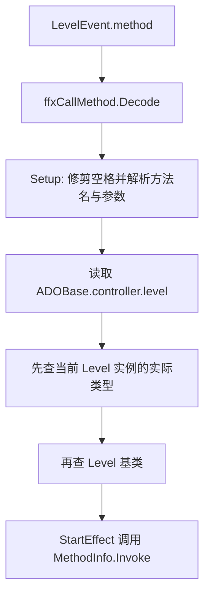

# 官方关卡脚本运行入口

本页记录 ADOFAI 官方关卡脚本在运行时的接入方式。这里的“官方关卡脚本”包含两类代码：一类是 `Level` 派生的普通 C# 对象，由 `scrController` 保存并被 `ffxCallMethod` 反射调用；另一类是挂在场景对象上的 `TaroBGScript` 派生 `MonoBehaviour`，负责特定官方关卡的节拍表、背景、镜头和段落演出。

## 源码范围

| 类型 | 源码路径 | 角色 |
| --- | --- | --- |
| `Level` | `7thRhythmSource/ADOFAi/Level.cs` | 官方关卡脚本基类，提供装饰查找、装饰显示隐藏和空生命周期钩子。 |
| `LevelML` | `7thRhythmSource/ADOFAi/LevelML.cs` | `ML-X` 关卡脚本，控制碎裂、追逐怪物、夜景、骷髅、暗场和地板闪光风格。 |
| `LevelTNO` | `7thRhythmSource/ADOFAi/LevelTNO.cs` | `XN-X` 关卡脚本，控制背景调色盘和星体半径收缩。 |
| `ffxCallMethod` | `7thRhythmSource/ADOFAi/ffxCallMethod.cs` | 运行时效果组件，从事件字段读取方法名并反射调用当前 `Level` 方法。 |
| `TaroBGScript` | `7thRhythmSource/ADOFAi/TaroBGScript.cs` | 官方关卡背景脚本基类，维护歌曲时间、节拍、BPM 表和节拍动作表。 |
| `Mawaru`、`NewLife`、`SingSing`、`ThirdSun`、`DivineIntervention` | `7thRhythmSource/ADOFAi/*.cs` | 继承 `TaroBGScript` 的大型官方关卡演出脚本。 |

## `scrController` 怎样选择 `Level`

`scrController.Awake_Rewind()` 中按场景名创建官方关卡脚本实例：

| 条件 | 创建实例 |
| --- | --- |
| `sceneName == "XN-X"` | `new LevelTNO()` |
| `sceneName == "ML-X"` | `new LevelML()` |

`scrController` 在地板编号向前推进时调用 `level.Hit(currentFloorID)`。基类 `Level.Hit(int floor)` 是空实现，当前已读到的 `LevelML` 和 `LevelTNO` 没有重写该方法，因此这条钩子在这两个类中没有额外行为。

## `ffxCallMethod` 调用路径

`ffxCallMethod` 是事件效果组件，它的入口字段为 `methodName`。`Decode(LevelEvent evnt)` 从事件属性 `method` 读取方法字符串，然后调用 `Setup()`。

### 方法名解析

| 行为 | 源码事实 |
| --- | --- |
| 空格处理 | `Setup()` 调用 `methodName.TrimAllSpaces()`。 |
| 方法格式 | 方法名必须包含 `(`，并且不能包含 `=`。不满足时直接返回。 |
| 参数切分 | `GetParameters(string text)` 要求参数文本以 `(` 开头、以 `)` 结尾；空参数返回 `null`，非空参数按逗号切分。 |
| 方法查找顺序 | 先查 `level.GetType().GetMethod(text)`，再查 `typeof(Level).GetMethod(text)`。 |
| 调用实例 | 找到方法后，`instance` 设置为 `ADOBase.controller.level`。 |
| 找不到方法 | 输出 `Debug.LogWarning("CallCustomMethod: Method " + methodName + " doesn't exist")`。 |

### 参数转换

`StartEffect(scrPlanet planet)` 会在首次执行前调用 `Setup()`，然后根据 `argString` 生成参数列表：

| 参数文本 | 转换方式 |
| --- | --- |
| 以 `str:` 开头 | `RDEditorUtils.DecodeString(text).Remove(0, 4)` |
| 包含 `true` | `bool true` |
| 包含 `false` | `bool false` |
| 包含 `.` | `RDEditorUtils.DecodeFloat(text)` |
| 其他 | `RDEditorUtils.DecodeInt(text)` |

## `Level`

`Level` 继承 `ADOClass`，因此可以通过 `base.controller`、`base.conductor`、`base.decorationManager` 等实例式访问器读取运行时对象。

### 方法表

| 方法 | 行为 |
| --- | --- |
| `virtual void Init()` | 空实现。 |
| `virtual void Hit(int floor)` | 空实现，参数为当前地板编号。 |
| `static T FindDecorationComponent<T>(string decorationTag) where T : Component` | 读取 `scrDecorationManager.instance`，遍历指定 tag 的装饰，在每个装饰的子物体中查找第一个 `T` 组件并返回。 |
| `void HideDecorations(string tag)` | 调用 `SetDecorationVisibility(tag, false)`。 |
| `void ShowDecorations(string tag)` | 调用 `SetDecorationVisibility(tag, true)`。 |
| `void SetDecorationVisibility(string tag, bool visible)` | 私有方法；如果 `base.decorationManager` 为 `null` 则返回，否则遍历指定 tag 的装饰并设置 `gameObject.SetActive(visible)`。 |

## `LevelML`

`LevelML` 继承 `Level`，方法都围绕装饰 tag 查找组件并执行关卡专用行为。

| 方法 | 参数 | 行为 |
| --- | --- | --- |
| `Shatter(string decoTag)` | 装饰 tag | 查找 `Shatter` 组件并调用 `StartShatter()`。 |
| `StartMob()` | 无 | 查找 tag 为 `monsterChase` 的 `MonsterChase` 组件并调用 `StartMob()`。 |
| `StopMob()` | 无 | 查找 tag 为 `monsterChase` 的 `MonsterChase` 组件并调用 `StopMob()`。 |
| `HideLaNuitScenery()` | 无 | 查找 tag 为 `laNuitScenery` 的 `LaNuitScenery` 组件并调用 `FadeOut()`。 |
| `ShowSkeletons()` | 无 | 查找 tag 为 `skeletons` 的 `Skeletons` 组件并调用 `Show()`。 |
| `HideSkeletons()` | 无 | 查找 tag 为 `skeletons` 的 `Skeletons` 组件并调用 `Hide()`。 |
| `FadeInDarkness(float alpha)` | 目标透明度 | 查找 tag 为 `darkness` 的 `SpriteRenderer`，存在时用 `DOFade(alpha, 1f)` 在 1 秒内调整透明度。 |
| `DontLightUpFloors()` | 无 | 设置 `scrVfx.instance.tileFlashStyle = TileFlashStyle.MoveToTopLayer`。 |

## `LevelTNO`

`LevelTNO` 继承 `Level`，当前源码中只包含两个公开方法。

| 方法 | 参数 | 行为 |
| --- | --- | --- |
| `TransitionPalette(int palette, float durBeats)` | 调色盘编号、持续拍数 | 查找 tag 为 `bgController` 的 `TNOBG_controller`，存在时调用 `TransitionPalette(palette, durBeats)`。 |
| `ShrinkPlanetRadius(float durBeats, string easeStr)` | 持续拍数、DOTween ease 名称 | 根据 `base.conductor.bpm`、`base.conductor.song.pitch` 和 `base.controller.currFloor.speed` 把拍数换算成秒；解析 `Ease`；遍历 `base.controller.playerManager`，隐藏选中星体的 ring，并把 `cosmeticRadius` tween 到 `0f`。 |

## `TaroBGScript`

`TaroBGScript` 继承 `ADOBase`，与 `Level` 体系不同，它是场景中的 Unity 组件。它通过 Unity 生命周期和内部节拍表驱动官方关卡演出。

### 时间字段

| 字段 | 类型 | 行为 |
| --- | --- | --- |
| `songBeat`、`lastBeat` | `double` | 当前拍与上一帧拍。 |
| `songTime`、`lastTime` | `double` | 当前歌曲时间与上一帧歌曲时间。 |
| `lastFloor` | `int` | 上一帧地板编号。 |
| `rate` | `float` | 时间倍率，`FirstUpdate()` 中读取 `base.controller.speedTrial`。 |
| `speed` | `float` | 当前地板速度。 |
| `currentBPM` | `float` | 当前 BPM，随 `bpms` 表更新。 |
| `bpms` | `List<Vector2>` | BPM 变化表，`Awake()` 会加入 `(0, 100)`。 |

### 节拍动作表

| 字段 | 类型 | 行为 |
| --- | --- | --- |
| `beatActions` | `List<ActionEntry>` | 只接收拍数和无参动作。 |
| `beatActionArgs` | `List<ActionEntryArg>` | 接收拍数、带参动作和对象参数。 |
| `beatUpdates` | `List<ActionEntry>` | 在持续区间内每帧执行的动作。 |
| `curActionB`、`curActionBArgs` | `int` | 已读到的动作索引。 |

### 方法表

| 方法 | 行为 |
| --- | --- |
| `static TaroBGScript instance` | 使用 `FindAnyObjectByType<TaroBGScript>()` 查找场景实例。 |
| `beats(float numBeats, float bpm = -1f)` | 按当前 BPM 或传入 BPM 把拍数换算成秒，并除以 `rate`。 |
| `mb(float b, Action a, float persist = -1f)` | 添加一个拍点动作。 |
| `mba(float b, Action<object> a, object args, float persist = -1f)` | 添加一个带参数的拍点动作。 |
| `mu(float b, Action a, float persist = -1f)` / `mpf(...)` | 添加持续区间更新动作。 |
| `FirstUpdate()` | 根据当前地板、倒计时和 BPM 表初始化 `songTime`、`songBeat`、`currentBPM`、`lastFloor`、`lastTime` 和 `lastBeat`。 |
| `Update()` | 在 `Start`、`Fail2` 和练习完成状态之外，按 `conductor.songposition_minusi` 和 BPM 表更新歌曲时间与拍数，然后调用 `ReadTables(songBeat, songTime)`。 |
| `ReadTables(double beat, double time)` | 读取节拍动作表：到达拍点后执行一次动作；带持续区间的 update 动作在区间内每帧执行。 |
| `EnableStuff(...)` | 启用 `Mawaru_Sprite` 或列表中的 renderer。 |
| `FadeStuff(...)` | 对 `Mawaru_Sprite` 或列表中的 material 颜色/透明度执行 tween，透明度为 0 时结束后禁用 renderer。 |
| `BGOrtho()` / `BGPersp()` | 切换 `BGMovingCam.orthographic`。 |
| `CacheFloorPosition()` | 缓存地板位置、旋转和垂直方向向量。 |
| `FloorResetPosition(scrFloor floor)` | 把地板恢复到缓存的位置和旋转。 |

## 大型官方演出脚本

以下脚本都继承 `TaroBGScript`，通过 `Start()`、`Update()`、`mb()`、`mba()`、`mu()` 等入口组织官方关卡的背景、镜头、文本、段落评分和演出对象。它们不是 `ADOBase.controller.level` 持有的 `Level` 对象，而是 Unity 场景组件。

| 类型 | 源码路径 | 主要职责 |
| --- | --- | --- |
| `Mawaru` | `7thRhythmSource/ADOFAi/Mawaru.cs` | 管理 `Mawaru` 关卡的文本命令、段落判定、标题、内心声音、收集物、足球、三角形、高五、结尾奖牌和大量背景对象。 |
| `NewLife` | `7thRhythmSource/ADOFAi/NewLife.cs` | 管理 Neo Cosmos 关卡背景、段落评分、线条、激光、三角形、背景缩放、质量分支和结尾对象。 |
| `SingSing` | `7thRhythmSource/ADOFAi/SingSing.cs` | 管理天空、夜晚、晨间、psytrance、cubicle、时钟、云、notefield、冷热地板等演出对象。 |
| `ThirdSun` | `7thRhythmSource/ADOFAi/ThirdSun.cs` | 管理复制相机、背景、段落评分、Sef、vortex、fish、beat box、脉冲数组和地板动画。 |
| `DivineIntervention` | `7thRhythmSource/ADOFAi/DivineIntervention.cs` | 管理 Boss 长短版本、boss 部件、区域遮罩、激光、云、过场、计时挑战和大量地板角度更新逻辑。 |

## 运行边界

`Level` 派生类和 `TaroBGScript` 派生类都服务官方关卡，但入口不同：

| 体系 | 入口 | 调用方式 |
| --- | --- | --- |
| `Level` 体系 | `scrController.level` | `scrController` 创建实例；`ffxCallMethod` 读取事件方法名并反射调用。 |
| `TaroBGScript` 体系 | 场景中的 Unity 组件 | Unity 生命周期执行；脚本内部维护节拍表并按歌曲时间触发演出。 |

这一区分很重要：`ffxCallMethod` 只查找当前 `Level` 实例和 `Level` 基类；它不会自动查找场景中的 `TaroBGScript` 派生组件。
