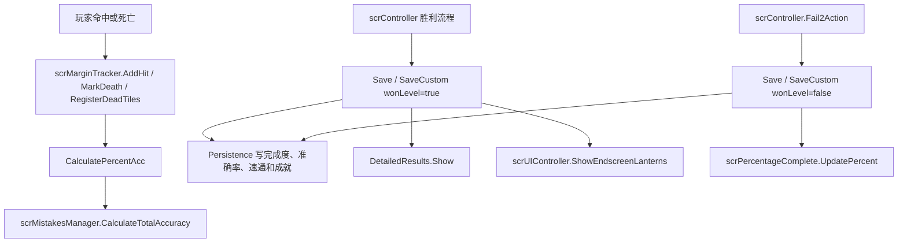

# 结算、成绩与进度保存

## 覆盖源码

| 类型 | 源码路径 | 角色 |
| --- | --- | --- |
| `scrMarginTracker` | `7thRhythmSource/ADOFAi/scrMarginTracker.cs` | 单个玩家的命中、死亡、完成度、普通准确率和 X 准确率统计器。 |
| `scrMistakesManager` | `7thRhythmSource/ADOFAi/scrMistakesManager.cs` | 多玩家统计汇总、官方关卡和自定义关卡成绩保存、checkpoint 进度保存。 |
| `scrMistakesManager.EndLevelInfo` | `7thRhythmSource/ADOFAi/scrMistakesManager.cs` | 结算保存返回值，包含结算类型和新纪录类型。 |
| `EndLevelType` | `7thRhythmSource/ADOFAi/EndLevelType.cs` | 结算类型枚举。 |
| `NewBestType` | `7thRhythmSource/ADOFAi/NewBestType.cs` | 新纪录提示类型枚举。 |
| `DetailedResults` | `7thRhythmSource/ADOFAi/DetailedResults.cs` | 结算详细命中统计文本生成器。 |
| `EndscreenLanterns` | `7thRhythmSource/ADOFAi/EndscreenLanterns.cs` | 结算灯笼 UI，展示世界完成、最高准确率和速通达成状态。 |
| `scrPercentageComplete` | `7thRhythmSource/ADOFAi/scrPercentageComplete.cs` | 失败或新纪录时显示完成度百分比与 new best 文本。 |
| `scrFailBar` | `7thRhythmSource/ADOFAi/scrFailBar.cs` | overload 和 multipress 失败条，负责触发玩家死亡。 |
| `scrController` 结算片段 | `7thRhythmSource/ADOFAi/scrController.cs` | 在胜利和失败状态调用统计保存、详细结果和灯笼 UI。 |
| `scrUIController.ShowEndscreenLanterns()` | `7thRhythmSource/ADOFAi/scrUIController.cs` | 遍历玩家并显示每个玩家对应的结算灯笼。 |

## 枚举

### `EndLevelType`

| 成员 | 用途 |
| --- | --- |
| `None` | 没有特殊结算状态。 |
| `NewBest` | 失败或中途退出时刷新了完成度。 |
| `FirstWin` | 首次以 1 倍速完成关卡或世界。 |
| `NewBestAcc` | 枚举存在，当前读取的保存逻辑没有直接写入该值。 |
| `NewBestMult` | 速通倍率刷新，但不是首次达到世界目标。 |
| `FirstWinSpeedTrial` | 首次达到速通目标。 |
| `WinInPracticeMode` | 练习模式下完成关卡。 |
| `LoseInCheatMode` | 枚举存在，当前读取的保存逻辑没有直接写入该值。 |

### `NewBestType`

| 成员 | 用途 |
| --- | --- |
| `None` | 没有新纪录提示。 |
| `Regular` | 普通新纪录。 |
| `Jingle` | 多次尝试后、完成度提升至少 0.01 时使用的提示类型。 |
| `Applause` | 尝试次数达到更高阈值后的提示类型。 |

## `scrMarginTracker`

`scrMarginTracker` 保存单个玩家的命中历史和派生准确率。每个玩家的 `scrPlayer.marginTracker` 在 `scrMistakesManager` 构造时绑定到静态数组 `scrMistakesManager.marginTrackers` 中对应项。

### 字段与属性

| 成员 | 类型 | 作用 |
| --- | --- | --- |
| `hitMargins` | `List<HitMargin>` | 按时间记录玩家命中的 margin。 |
| `hitMarginsCount` | `int[]` | 按 `HitMargin` 枚举值统计数量，长度按枚举最大值创建。 |
| `hardestDifficulty` | `Difficulty` | 当前统计涉及的最高难度；`Reset()` 设为 `Difficulty.Strict`，后续取当前难度与已有值的较小枚举值。 |
| `lastHitMarginsSize` | `int` | 最近 checkpoint 对应的命中记录长度。 |
| `deadTilesBeforeCheckpoint` | `int` | checkpoint 前 dead tile 数。 |
| `deadTiles` | `int` | 当前累计 dead tile 数。 |
| `deadTilesStartFloor` | `int` | 死亡后开始统计 dead tile 的地板。 |
| `deathsBeforeCheckpoint` | `int` | checkpoint 前死亡次数。 |
| `deaths` | `int` | 当前死亡次数。 |
| `percentComplete` | `float` | 完成度，按 `(currentSeqID + 1) / listFloors.Count` 计算。 |
| `percentAcc` | `float` | 普通准确率。 |
| `percentXAcc` | `float` | X 准确率。 |

### 统计方法

| 方法 | 行为 |
| --- | --- |
| `AddHit(HitMargin hit)` | 把 margin 加入 `hitMargins`，增加 `hitMarginsCount`，重新计算准确率并更新最高难度。 |
| `GetHits(HitMargin hitMargin)` | 返回某个 margin 的数量。 |
| `GetHits(params HitMargin[] hitMargins)` | 汇总多个 margin 的数量。 |
| `GetDeaths()` | 返回 `FailOverload` 数量。 |
| `GetTotalHits()` | 返回 `hitMargins.Count`。 |
| `MarkDeath(int floorID)` | 记录 dead tile 起点并增加 `deaths`。 |
| `RegisterDeadTiles(int floorID)` | 从 `deadTilesStartFloor` 遍历到目标 floor，统计非 auto、非 midSpin 地板，累加到 `deadTiles`，再更新最高难度。 |
| `Reset()` | 清空命中记录和计数，重置 checkpoint、dead tile、死亡和准确率。 |

### checkpoint 回滚

`MarkCheckpoint(int checkpointTileOffset)` 把 `lastHitMarginsSize` 设为当前命中数，然后从尾部向前跳过 TooEarly 和指定数量的非 TooEarly 命中，用于把 checkpoint 记录点移动到合适位置。它同时保存 `deadTilesBeforeCheckpoint` 和 `deathsBeforeCheckpoint`。

`RevertToLastCheckpoint()` 会把 `hitMargins` 回退到 `lastHitMarginsSize`，同步递减 `hitMarginsCount`，再恢复 dead tile 和死亡数。

### 准确率

`CalculatePercentAcc()` 计算三类结果：

| 结果 | 公式来源 |
| --- | --- |
| `percentAcc` | Perfect、EarlyPerfect、LatePerfect、Auto 计为命中；分母为命中记录数加 FailMiss、FailOverload 数；再加 Perfect、Auto 的 `0.0001` 奖励并减 dead tile 的 `0.0001`。 |
| `percentComplete` | 当 `lm` 和 controller 存在时，按当前 seqID 占地板总数计算。 |
| `percentXAcc` | Perfect/Auto 权重 1，EarlyPerfect/LatePerfect 权重 0.75，VeryEarly/VeryLate 权重 0.4，TooEarly/TooLate 和 dead tile 权重 0.2，再乘以 `Math.Pow(0.9875, checkpointsUsed)`。 |

方法末尾会调用 `controller.playerManager.mistakesManager.CalculateTotalAccuracy()`，把单玩家变化同步到总统计。

`IsAllPurePerfect()` 要求不是从 checkpoint 开始，且所有命中都是 `HitMargin.Perfect` 或 `HitMargin.Auto`。

## `scrMistakesManager`

`scrMistakesManager` 管理所有玩家统计。静态 `marginTrackers` 默认包含一个 `scrMarginTracker`；`SetPlayerCount(int playerCount)` 会按玩家数量重建数组。构造函数遍历 controller 的玩家，把每个玩家的 `marginTracker` 指到静态数组对应项。

### 属性与权重

| 成员 | 类型 | 作用 |
| --- | --- | --- |
| `accuracyWeights` | `float[4]` | 合作模式准确率加权，依次为 64、16、12、8。 |
| `hardestDifficulty` | `static Difficulty` | 从所有 tracker 的 `hardestDifficulty` 中取最大值。 |
| `percentComplete` | `float` | 总完成度。 |
| `percentAcc` | `float` | 总普通准确率。 |
| `percentXAcc` | `float` | 总 X 准确率。 |

`CalculateTotalAccuracy()` 在单人模式下直接复制 player one 的统计。合作模式下，它分别按玩家 `percentAcc` 和 `percentXAcc` 降序排列，再按 `accuracyWeights` 计算加权平均；完成度取所有玩家完成度最大值。

### 官方关卡保存 `Save()`

`Save(int worldZeroIndexed, bool wonLevel, float multiplier)` 返回 `EndLevelInfo`。保存前会检查：

| 检查 | 结果 |
| --- | --- |
| 非合作模式、开启 noFail 且 player one 有死亡 | 直接返回默认结果，不保存。 |
| `controller.unlockKeyLimiter` 为真 | 直接返回默认结果，不保存。 |

失败或未完成时，若当前 `percentComplete` 高于存档完成度且 `currentFloorID > 0`，则：

| 行为 | 说明 |
| --- | --- |
| `endLevelType = NewBest` | 标记新完成度记录。 |
| `newBestType = Regular` | 默认普通新纪录。 |
| 根据未刷新次数调整提示 | 尝试次数大于等于 15 时为 `Applause`；大于等于 5 且提升至少 0.01 时为 `Jingle`。 |
| 重置未刷新次数 | `SetWorldAttemptsWithoutNewBest(..., 0)`。 |
| 写入完成度 | `SetPercentCompletion()`。 |

胜利时，方法会写完成度为 1。若此前完成度小于 1 且倍率为 1，则返回 `FirstWin`。若处于 speed trial 且倍率高于历史最佳，则写入 best speed trial；当倍率达到当前世界 `trialAim`，并且保存前未完成速通、保存后已完成速通时，返回 `FirstWinSpeedTrial`，否则返回 `NewBestMult`。之后它会保存普通准确率、X 准确率，并在所有玩家都是 pure perfect 时调用 `SetIsHighestPossibleAcc()`。

方法末尾调用 `Persistence.GiveAchievements()` 和 `Persistence.Save()`。

### 自定义关卡保存 `SaveCustom()`

`SaveCustom(string hash, bool wonLevel, float multiplier)` 不支持合作模式；合作模式调用会抛出 `NotImplementedException("Co-op scoring for customs is not yet implemented!")`。它同样会在 noFail 有死亡或 unlock key limiter 超限时直接返回默认结果。

倍率小于 1 时不会写入成绩。倍率大于等于 1 时：

| 情况 | 保存行为 |
| --- | --- |
| 未完成关卡 | 若完成度刷新且 `currentFloorID > 0`，写入 custom completion，并返回 `NewBest`。 |
| 完成关卡 | 写入 custom completion 为 1。 |
| 首次 1 倍速完成 | 返回 `FirstWin`。 |
| speed trial 倍率刷新 | 写入 custom speed trial，并返回 `FirstWinSpeedTrial`。 |
| 普通准确率刷新 | 写入 custom accuracy；若 pure perfect，同时写 highest possible acc。 |
| X 准确率刷新 | 写入 custom X accuracy。 |
| checkpoint 使用数更少 | 写入 custom min deaths。 |
| tech featured level | 设置 `Persistence.clearedTechFeatured = true`。 |

方法末尾调用 `Persistence.Save()`。

### checkpoint 保存

| 方法 | 行为 |
| --- | --- |
| `SaveCheckpointProgress(bool save)` | 非合作模式且 `GCS.checkpointNum != 0` 时，把 hit margins、`lastHitMarginsSize`、checkpoint、level、hardestDifficulty 和 checkpointsUsed 写入 `Persistence.SetSavedProgress()`；`save` 为真时保存 general prefs。 |
| `LoadCheckpointProgress()` | 非合作模式下读取 saved progress，重建 player one 的 hit margins 与计数，恢复 `GCS.checkpointNum`、`lastHitMarginsSize`、`hardestDifficulty` 和 `scrController.checkpointsUsed`。 |
| `MarkCheckpoint(int checkpointTileOffset)` | 对所有 tracker 调用 `MarkCheckpoint()`。 |
| `RevertToLastCheckpoint()` | 对所有 tracker 调用 `RevertToLastCheckpoint()`。 |
| `Reset()` | 对所有 tracker 调用 `Reset()`。 |
| `IsAllPurePerfect()` | 所有 tracker 都 pure perfect 时返回 true。 |

## `scrController` 中的胜利保存

胜利流程会在 `Won` 相关逻辑中处理玩家、文本、保存和 UI：

| 分支 | 行为 |
| --- | --- |
| 游戏世界或 free roam 生成终点 | 设置 `responsive = false`，处理未到终点玩家，死亡玩家调用 `RegisterDeadTiles()`，每个玩家重新计算准确率。 |
| 练习模式 | 清空 congratulation 文本。 |
| 非官方关卡 | 根据 pure perfect 选择自定义文本或本地化文本；CLS 关卡调用 `SaveCustom(..., wonLevel: true, currentSpeedTrial)` 并显示 endscreen lanterns。 |
| 官方 boss 关卡 | 计算总准确率，选择特殊世界文本或通用祝贺文本；非练习、非 booth 时调用 `Save(currentWorld, true, currentSpeedTrial)` 并显示 endscreen lanterns。 |
| 普通非 boss 内部关卡 | 更新 tutorial progress，不显示详细结算。 |
| 详细结果 | 非 puzzle room、`showDetailedResults` 为真且不是 tutorial progress 分支时，调用 `detailedResults.Show()`。 |
| pure perfect 音效 | 非 auto 且 pure perfect 时播放 `SfxSound.PurePerfect`。 |
| 全 Strict Clear | 游戏世界、最高难度为 Strict、文本对象存在且不是 checkpoint 开始时显示 all strict clear。 |

胜利后调用 `ChangeState(States.Won)`。之后 `PortalTravelAction(Portal.EndOfLevel)` 会根据 speed trial、practice、boss、自定义关卡索引和 `endLevelInfo` 决定返回主菜单、重开当前关卡、进入下一关或加载下一场景。

## `scrController` 中的失败保存

`Fail2Action()` 在 `state == States.Fail` 且当前处于 gameworld 或 free roam 地板时进入 `States.Fail2`。它先调用 `mistakesManager.CalculateTotalAccuracy()`。非 puzzle room 下：

| 情况 | 行为 |
| --- | --- |
| 官方 boss 关卡 | 调用 `mistakesManager.Save(currentWorld, wonLevel: false, currentSpeedTrial)`。 |
| CLS 最后一个关卡且不是练习模式 | 调用 `mistakesManager.SaveCustom(hash, wonLevel: false, currentSpeedTrial)`。 |
| `endLevelInfo.newBestType == Applause` 且不是 instant explode | 播放 `SfxSound.ApplauseQuiet`。 |
| 失败完成度文本 | 调用 `txtPercent.GetComponent<scrPercentageComplete>().UpdatePercent()` 并显示 `txtPercent`。 |

随后增加 `deaths` 和 `scrUIController.deathCounterToFixDotweenBug`，并根据死亡次数、校准进度、输入集中度等条件设置失败提示文本。

## `DetailedResults`

`DetailedResults` 继承 `ADOBase`，用于生成结算详细文本。`Show()` 为每个玩家生成一份结果字符串，激活自身和 controller 的 `detailedResults` 对象，并先显示玩家 0。

### 统计内容

| 文本项 | 数据来源 |
| --- | --- |
| ePerfect | `HitMargin.EarlyPerfect`。 |
| perfect | `HitMargin.Perfect`；非官方关卡中如果存在 `HitMargin.Auto`，显示为 `Perfect(Auto)`。 |
| lPerfect | `HitMargin.LatePerfect`。 |
| tooEarly | 空 `HitMargin[]` 调用得到的计数。 |
| early | `HitMargin.VeryEarly`。 |
| late | `HitMargin.VeryLate`。 |
| missFails | noFail、安全地板或合作模式下显示；合作模式用 `marginTracker.deaths`，否则用 `FailMiss`。 |
| overloadFails | noFail、安全地板或合作模式下显示；来源 `FailOverload`。 |
| accuracy / xAccuracy | 根据 `Persistence.showXAccuracy` 选择 `percentAcc` 或 `percentXAcc`。 |
| checkpoints / practiceAttempts | 根据 `GCS.practiceMode` 选择文本，数值为 `scrController.checkpointsUsed`。 |
| maximumUsedKeys | `controller.unlockKeyLimiter` 为真时显示 `maximumUsedKeys`。 |

Pure perfect 时，准确率文本会包裹为金色 `<color=#FFDA00>`。合作模式下 `Update()` 每 2 秒轮换玩家结果，`ShowForPlayer()` 会把文本颜色设为该玩家 chosen planet 的颜色，并禁用 `hudText`。

## `EndscreenLanterns`

`EndscreenLanterns` 显示世界结算灯笼：蓝色代表完成，黄色代表高准确率或 pure perfect，红色代表 speed trial。

### 初始化

`Setup()` 隐藏灯笼文本，合作模式下显示 planets scaler。CLS 关卡读取自定义世界完成度、highest possible accuracy 和 custom speed trial；官方关卡读取当前世界 complete、perfect 和 speed trial 状态。读取前后会临时处理 `RDC.forceUnlockAllLevels` 与 `Persistence.unlockAllLevels`。

### 显示逻辑

`Show(scrPlayer player, float lanternsDelay = 0f, int soundSet = -1, bool crown = false)` 会根据当前玩家的 `marginTracker` 判断：

| 条件 | 标记 |
| --- | --- |
| `percentComplete >= 1f && player.alive` | 当前已完成。 |
| `percentAcc >= 1f` | 当前达到 great accuracy 条件。 |
| `IsAllPurePerfect()` | 当前 pure perfect，用于黄色灯笼文本选择。 |
| speed trial 开启、当前倍率达到目标、`deadTiles == 0` | 当前速通达成。 |

它会与 `prevLampStates` 比较，只对本次新获得的灯笼播放 ghost effect。非合作模式下，如果之前已经获得对应灯笼，就不会再播放新获得动画。红灯笼只在 speed trial 当前开启或此前已经完成 speed trial 时显示。

`CreateGhostEffect()` 会实例化灯笼材质，显示文本，播放音效，执行材质 `_FlashAlpha`、灯笼缩放、灯笼颜色和文本遮罩 tween，最后淡出文本。

### UIController 入口

`scrUIController.ShowEndscreenLanterns()` 在合作模式下先把 `camy.flashEndscreen` 材质淡到 0.333 alpha。它计算所有玩家中最高 `percentXAcc`，遍历 `playerManager.players` 与 `endscreenLanternsSets`，为每个玩家调用 `EndscreenLanterns.Show()`。合作模式下，会把玩家所有星体切到 `ForegroundUI` layer，并把最高 X 准确率玩家标记为 crown。

## `scrPercentageComplete`

`UpdatePercent()` 读取 `scrController.instance.percentComplete * 100`，向下取整后用 `status.complete` 本地化文本显示。若 `endLevelInfo.endLevelType == EndLevelType.NewBest`，会显示 `newBestText`，文本为 `status.newbest`，并把自身 RectTransform pivot 的 Y 从 0.5 调整为 0.275。

`ShowMessage(string msg)` 直接设置文本并把 `custommessage` 标记为 true。

## `scrFailBar`

`scrFailBar` 挂在玩家层级下，`Awake()` 从父级读取 `scrPlayer`。它维护两条失败计数：

| 字段 | 作用 |
| --- | --- |
| `overloadCounter` | 普通 miss 或外部伤害累积。 |
| `multipressCounter` | 多按累积。 |
| `overloadDamagePerMiss` | 普通 miss 伤害，默认 0.5。 |
| `multipressDamage` | 多按伤害，默认 0.35。 |
| `multipressResetLimit` | 多按计数重置时间，默认 6 拍。 |

`Update()` 在 `isactive` 为真时检查 `DidFail()`，若失败则调用 `player.Die(overload: true, multipressCounter > 1f)`，并把两个计数最多保留到 0.5。随后按 `conductor.deltaSongPos / crotchetAtStart` 衰减两个计数。多按重置计数超过 `multipressResetLimit` 时，清空 `multipressCounter`。

`DidFail()` 会避免在死亡状态中重复触发；当 overload 或 multipress 超过 1，且不是官方关卡终段保护场景时返回 true。官方关卡中，如果不是 gameworld 或完成度已经大于等于 0.96，则不会因为计数超过 1 触发失败。

## 结算链路

这条链路说明：命中统计和准确率首先属于玩家自己的 `scrMarginTracker`；总结果由 `scrMistakesManager` 汇总；是否写入官方或自定义存档由 `Save()`、`SaveCustom()` 决定；最终 UI 再读取这些统计显示详细结果、完成度文本和灯笼。
