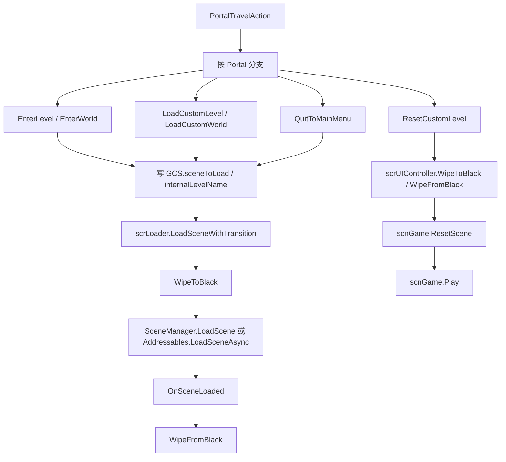

# 场景流转与加载跳转

## 覆盖源码

| 类型 | 源码路径 | 角色 |
| --- | --- | --- |
| `scrLoader` | `7thRhythmSource/ADOFAi/scrLoader.cs` | 全局加载器，负责黑场转场、加载动画、DLC Addressables 场景和普通 Unity 场景加载。 |
| `scrController.PortalTravelAction()` | `7thRhythmSource/ADOFAi/scrController.cs` | 运行时传送门和关卡结束后的跳转分发入口。 |
| `scrController.EnterLevel()` | `7thRhythmSource/ADOFAi/scrController.cs` | 根据世界与关卡编号设置内部关卡名、目标场景和速通状态。 |
| `scrController.EnterWorld()` | `7thRhythmSource/ADOFAi/scrController.cs` | 根据世界进度选择下一个要进入的关卡。 |
| `scrController.LoadCustomWorld()` | `7thRhythmSource/ADOFAi/scrController.cs` | 进入自定义世界，建立自定义关卡路径数组。 |
| `scrController.LoadCustomLevel()` | `7thRhythmSource/ADOFAi/scrController.cs` | 进入单个自定义关卡。 |
| `scrController.QuitToMainMenu()` | `7thRhythmSource/ADOFAi/scrController.cs` | 从当前关卡返回主菜单、DLC 菜单或 CLS。 |
| `scrController.ResetCustomLevel()` | `7thRhythmSource/ADOFAi/scrController.cs` | 在 `scnGame` 内重置自定义关卡，不重新加载 Unity 场景。 |
| `scnGame.ResetScene()` | `7thRhythmSource/ADOFAi/scnGame.cs` | 自定义关卡重置时清理相机、滤镜、装饰、路径、VFX 和音频。 |
| `scrUIController` 转场方法 | `7thRhythmSource/ADOFAi/scrUIController.cs` | 场景内 UI 黑场、淡入淡出和 endscreen lantern 初始化。 |
| `Portal` | `7thRhythmSource/ADOFAi/Portal.cs` | 传送门目标枚举。 |
| `WipeDirection` | `7thRhythmSource/ADOFAi/WipeDirection.cs` | 黑场方向枚举。 |
| `LevelSource` | `7thRhythmSource/ADOFAi/LevelSource.cs` | 世界关卡来源枚举，决定进入独立场景还是 `scnGame`。 |

## 枚举

### `Portal`

`Portal` 枚举包含运行时可跳转目标：`EndOfLevel`、`LastLevelPlayed`、`CalibrationScene`、`EditorScene`、`CustomLevelsScene`、`RDSteamPage`、`PreviousLevel`、`NextLevel`、`LowerSpeed`、`HigherSpeed`、`GoToLevel`、`GoToLevelSpeedTrial`、`GoToWorldBossIfReached`、Taro DLC 入口、Vega DLC 入口、puzzle 房间和 `FoolJoker`。

### `WipeDirection`

| 成员 | 用途 |
| --- | --- |
| `StartsFromLeft` | 黑场从左侧开始。 |
| `StartsFromRight` | 黑场从右侧开始。 |

### `LevelSource`

| 成员 | 用途 |
| --- | --- |
| `Scenes` | 世界关卡直接对应 Unity 场景名。 |
| `Files` | 世界关卡走 `scnGame`，实际关卡名写入 `GCS.internalLevelName`。 |
| `Mixed` | 部分关卡走场景，部分关卡走 `scnGame` 文件加载。 |

## `scrLoader`

`scrLoader` 继承 `ADOBase`，静态 `instance` 在 `Awake()` 设置。它是跨场景加载入口，`ADOBase.loader` 直接返回该实例。

### 字段

| 字段 | 类型 | 作用 |
| --- | --- | --- |
| `planets` | `GameObject` | 加载超过 1 秒后显示的星体加载动画对象。 |
| `ring` | `Transform` | 加载动画旋转环，`Update()` 每秒按 -30 度旋转。 |
| `loadingText` | `GameObject` | 加载文本对象。 |
| `transitionPanel` | `Image` | 黑场转场面板。 |
| `timeSpentLoading` | `float` | 加载计时；`-1` 表示未处于加载状态。 |
| `wipeDirection` | `WipeDirection` | 当前黑场方向。 |
| `wipeToBlack` | `Tweener` | 当前黑场 tween。 |
| `startFrame` | `float` | 场景加载完成时的帧号。 |
| `wipeCued` | `bool` | 新场景已加载，等待若干帧后执行从黑场淡出。 |
| `disableLoadingVisuals` | `bool` | 是否隐藏加载动画和文本。 |

### 生命周期

| 方法 | 行为 |
| --- | --- |
| `Awake()` | 隐藏 `planets`、`loadingText`、`transitionPanel`，把 `timeSpentLoading` 设为 `-1`，设置 `instance`。 |
| `Update()` | 处于加载时累加 `Time.unscaledDeltaTime`；超过 1 秒且未禁用加载视觉时显示 planets 和 loadingText；旋转 ring；如果 `wipeCued` 到达延迟帧数，则隐藏加载视觉并调用 `WipeFromBlack()`。 |

`Update()` 中的延迟帧数为：当前不存在 `ADOBase.customLevel` 时 1 帧，存在自定义关卡时 4 帧。

### 加载方法

| 方法 | 行为 |
| --- | --- |
| `LoadScene(string scene)` | expo 模式更新 `scrController.lastClickTime`；如果 DLCManager 认为目标是 DLC 场景或关卡，使用 `Addressables.LoadSceneAsync(scene)`，否则用 `SceneManager.LoadScene(scene)`。 |
| `LoadSceneWithTransition(WipeDirection direction, string scene = null)` | 可选写入 `GCS.sceneToLoad`，保存 `GCS.directionToWipe`，expo 模式更新时间，然后调用 `WipeToBlack()`。 |
| `WipeToBlack(WipeDirection direction, Action onCancel = null)` | 播放 wipe out 音效，若已有黑场 tween 正在运行则取消；否则设置面板 pivot、scale 和颜色，执行 `DOScaleX(1)`，完成后调用 `LoadTargetScene()`。 |
| `WipeFromBlack()` | 在不是正在 wipe to black 且面板激活时播放 wipe in 音效，按方向设置 pivot，执行 `DOScaleX(0)`。 |
| `LoadTargetScene()` | 把 `timeSpentLoading` 设为 0，`DOTween.KillAll()`，根据 `GCS.sceneToLoad` 加载 DLC Addressables 场景或普通 Unity 场景，并注册 `SceneManager.sceneLoaded`。 |
| `OnSceneLoaded()` | 取消 sceneLoaded 订阅，把 `wipeCued` 设为真，停止加载计时，并记录当前帧。 |

`WipeToBlack()` 和 `WipeFromBlack()` 的持续时间默认 0.3 秒；speed trial 模式下会除以 `GCS.currentSpeedTrial`。

## `scrUIController` 的场景内转场

`scrUIController` 也有转场面板，但它主要用于当前场景内的 UI 黑场和自定义关卡重置，而不是跨场景加载。

| 方法 | 行为 |
| --- | --- |
| `PrepareWipeFromBlack()` | 显示 transitionPanel，设为黑色，pivot 为左侧，scale 为 1。 |
| `WipeFromBlack()` | 播放 wipe in 音效，根据 `GCS.directionToWipe` 设置 pivot，执行 `DOScaleX(0)`，完成后隐藏面板。 |
| `WipeToBlack(WipeDirection direction, Action onComplete, Action onCancel = null)` | 播放 wipe out 音效，设置 `GCS.directionToWipe`，执行 `DOScaleX(1)`，完成后隐藏 achievement 面板并调用 `onComplete`。 |
| `FadeFromBlack(float duration = 1f)` | 把黑场 alpha tween 到 0，完成后隐藏 transitionPanel。 |
| `FadeToBlack(float duration = 1f)` | 把黑场 alpha tween 到 1，完成后隐藏 transitionPanel。 |
| `LevelFinishedLoading()` | 对 `endscreenLanternsSets` 中每个 `EndscreenLanterns` 调用 `Setup()`。 |

## `PortalTravelAction()`

`PortalTravelAction(Portal destination)` 是运行时跳转的主分发方法。若 `transitioningLevel` 已为真，方法立即返回。否则它保存 `portalDestination`，默认 wipe 方向为 `StartsFromRight`，根据目标设置 `GCS.sceneToLoad`、`GCS.internalLevelName`、speed trial 状态或直接进入其他 helper。

### `Portal.EndOfLevel`

| 条件 | 行为 |
| --- | --- |
| Taro `T4` boss 且 story progress 小于 4 | 写 `Persistence.taroStoryProgress = 4` 并保存。 |
| Taro `T5` boss 且 story progress 小于 6 | 写 `Persistence.taroStoryProgress = 6` 并保存。 |
| 当前是 `scnGame` 且 speed trial 或 practice | speed trial 时把 `GCS.nextSpeedRun` 加 0.1，随后 `ResetCustomLevel(false)`。 |
| 当前是 `scnGame` 且 internal level | boss 关卡返回主菜单；否则取下一关，Mixed 世界且下一关是 boss 时清空 `internalLevelName` 并直接加载 boss 场景，否则写 `internalLevelName`。 |
| 当前是 `scnGame` 且自定义世界最后一关 | 返回主菜单。 |
| 当前是 `scnGame` 且自定义世界还有下一关 | `GCS.customLevelIndex++`。 |
| 非 `scnGame` 且 speed trial 或 practice | 首次速通达成时返回主菜单；否则设置下一 speed trial 或 checkpoint 使用数，并重载当前 `levelName`。 |
| 非 `scnGame` 且 boss | 部分世界更新 `GCS.worldEntrance`，然后返回主菜单。 |
| 其他普通关卡 | `GCS.sceneToLoad = ADOBase.GetNextLevelName()`。 |

### 其他 Portal

| Portal | 行为 |
| --- | --- |
| `LastLevelPlayed` | 读取 `Persistence.savedCurrentLevel`，DLC 不可玩时回退到 `1-1`，调用 `EnterLevel()`。 |
| `CalibrationScene` | `GCS.sceneToLoad = "scnCalibration"`。 |
| `EditorScene` | 非 `scnGame` 时关闭 speed trial 与 practice；加载 `scnEditor`，清空 world entrance，并调用 `SteamIntegration.EditorEntered()`。 |
| `FoolJoker` | 翻转 `GCS.FOOL_JOKER`，加载 `GCNS.sceneLevelSelect`。 |
| `TaroDLCMap` | 加载 `GetTaroMenuToGoTo()` 返回的 Taro 菜单。 |
| `VegaDLCMap` | 加载 `scnVegaMenu`。 |
| `PuzzleTest`、`Puzzle1`、`Puzzle2`、`Puzzle3` | 分别加载 puzzle 测试或 puzzle 场景。 |
| `TaroDLCMap3` | 设置 Taro story progress 为 5，保存后加载 `scnTaroMenu3`。 |
| `TaroDLCMapExit` | 返回主菜单。 |
| `CustomLevelsScene` | 关闭 speed trial 和 practice，重置 speed trial 倍率，加载 `scnCLS`，清空 world entrance，并增加 CLS 进入统计。 |
| `RDSteamPage` | 打开 Steam overlay 网页，然后加载关卡选择。 |
| `PreviousLevel` | wipe 方向改为 `StartsFromLeft`，加载上一关。 |
| `NextLevel` | 加载下一关。 |
| `LowerSpeed` | wipe 方向改为左侧，`nextSpeedRun` 减 0.1，重载当前关卡。 |
| `HigherSpeed` | `nextSpeedRun` 加 0.1，重载当前关卡。 |
| `GoToLevel` | 调用 `EnterLevel(portalArguments)` 并直接返回。 |
| `GoToLevelSpeedTrial` | 调用 `EnterLevel(portalArguments, speedTrial: true)` 并直接返回。 |
| `GoToWorldBossIfReached` | 调用 `EnterWorld(portalArguments)` 并直接返回。 |

如果分支没有直接返回或设置 `flag = true`，方法最后调用 `StartLoadingScene(wipeDirection)`，并把 `transitioningLevel` 设为 true。

## 进入官方关卡

### `EnterWorld()`

`EnterWorld(string worldOrLevel, bool speedTrial = false)` 从参数中取世界号。若 `GCS.FOOL_JOKER` 为真，世界号追加 `J`。方法读取 `GCNS.worldData[text]`，根据世界尝试次数和 tutorial progress 选择下一关：

| 条件 | 选择 |
| --- | --- |
| `worldAttempts > 0` | 进入 boss，即 `X`。 |
| `levelTutorialProgress >= levelCount - 1` | 进入 boss，即 `X`。 |
| 其他 | 进入 `levelTutorialProgress + 1`。 |

随后拼成 `world-level` 并调用 `EnterLevel()`。

### `EnterLevel()`

`EnterLevel(string worldAndLevel, bool speedTrial = false)` 会：

1. 写入 `GCS.speedTrialMode`。
2. `GCS.nextSpeedRun` 设为 speed trial 的 `1.1f` 或普通的 `1f`。
3. 关闭 practice。
4. 清空 `GCS.customLevelPaths` 并把 `GCS.customLevelIndex` 设为 0。
5. 解析世界号和关卡号，Fool Joker 模式下给世界号追加 `J`。
6. speed trial 模式下，如果 `worldData.trialAim` 大于 0 且小于等于 1.1，则把 `nextSpeedRun` 改为 trial aim。
7. 根据 `LevelSource` 决定加载场景还是 `scnGame`。

`LevelSource` 分支：

| 来源 | 行为 |
| --- | --- |
| `Files` | `GCS.internalLevelName = worldAndLevel`，`GCS.sceneToLoad = "scnGame"`。 |
| `Mixed` 且不是 boss、关卡号不是 `0` | 同 `Files`。 |
| `Scenes` | `GCS.internalLevelName = null`，`GCS.sceneToLoad = worldAndLevel`。 |
| `Mixed` 的 boss 或关卡 `0` | `GCS.internalLevelName = null`，`GCS.sceneToLoad = worldAndLevel`。 |

最后调用 `StartLoadingScene()` 并把 `transitioningLevel` 设为 true。

## 自定义关卡加载

| 方法 | 行为 |
| --- | --- |
| `LoadCustomWorld(string levelPath, bool skipToMain = false, string levelId = null, bool fromBundle = false)` | 设置 `GCS.sceneToLoad = "scnGame"`；通过 `scnGame.GetWorldPaths(levelPath, excludeMain: false, renamed: true)` 建立路径数组；写入 bundle 标记、索引和可选 level id；然后加载。 |
| `LoadCustomLevel(string levelPath, string levelId = null, bool fromBundle = false)` | 设置 `GCS.sceneToLoad = "scnGame"`；建立单元素 `customLevelPaths`；写入 bundle 标记和可选 level id；然后加载。 |

自定义关卡失败后，`Fail2_Update()` 检测到有效输入时，如果不是关卡编辑器严格编辑模式，会调用 `ResetCustomLevel()`；普通官方场景则调用 `Restart()`。

## 重置自定义关卡

`ResetCustomLevel(bool isRestart = true)` 在 `scnGame` 内执行，不重新加载 Unity 场景：

1. 如果当前是 `scnGame`，先调用 `scrUIController.WipeToBlack()` 并等待回调完成，再隐藏 endscreen lanterns。
2. 隐藏所有地板 bottom glow 和 top glow。
3. 非练习模式且在 `scnGame` 时，把 `GCS.currentSpeedTrial` 更新为 `GCS.nextSpeedRun`。
4. 调用 `ADOBase.customLevel.ResetScene(!isRestart)`。
5. 调用 `ADOBase.customLevel.Play(GCS.checkpointNum, isRestart)`。
6. 把 `transitioningLevel` 设为 false。
7. 如果当前是 `scnGame`，下一帧执行 `scrUIController.WipeFromBlack()` 并恢复 controller responsive。

`scnGame.ResetScene()` 会清理运行时状态：取消倒计时、清空 conditional floor、重置输入事件效果、重载资产、复位相机父物体和相机状态、关闭 Hall of Mirrors、恢复背景色、禁用 Bloom、ScreenScroll、ScreenTile 和滤镜、停止视频背景、重置星球位置、清理 miss indicator、typing letters 和非 independent update 的 DOTween、清空闪屏材质、重置 `scrVfxPlus`、重建路径、重置装饰和 HUD 文本，最后停止歌曲。

## 返回主菜单和重开

| 方法 | 行为 |
| --- | --- |
| `QuitToMainMenu()` | 停止 MP3 加载；web 版本直接加载 `scnIntro`；其他版本走 loader 转场，根据当前关卡来源加载 DLC 菜单、主关卡选择或 `scnCLS`；重置死亡数和 `GCS.currentSpeedTrial`。 |
| `Restart(bool fromBeginning = false)` | `fromBeginning` 为真时先 `RestartProgress()`；然后用 loader 转场重载当前 `ADOBase.sceneName`。 |
| `RestartProgress()` | 把 `GCS.checkpointNum` 设为 0，并删除 saved progress。 |
| `GoToNextLevel()` | speed trial 模式走 `Portal.HigherSpeed`，否则走 `Portal.NextLevel`。 |
| `GoToPrevLevel()` | speed trial 模式走 `Portal.LowerSpeed`，否则走 `Portal.PreviousLevel`。 |

## 关卡名辅助

`ADOBase.GetPreviousLevelName()` 和 `ADOBase.GetNextLevelName()` 都默认使用 `scrController.instance.levelName`。上一关把当前关卡编号减 1，最小为 1。下一关读取当前世界 `levelCount`，如果下一关是最后一个编号，则返回 `world-X`，否则返回递增编号；两者都用 `scrController.currentWorldString` 作为世界前缀。

## 主流程图

这条链路把“跨 Unity 场景加载”和“scnGame 内部重置自定义关卡”分开：前者由 `scrLoader` 和 `GCS.sceneToLoad` 驱动，后者由 `scrUIController` 黑场和 `scnGame.ResetScene()` 驱动。
