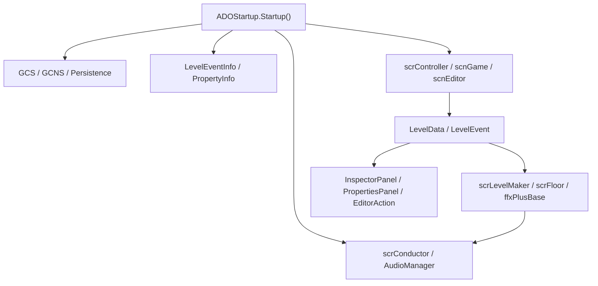
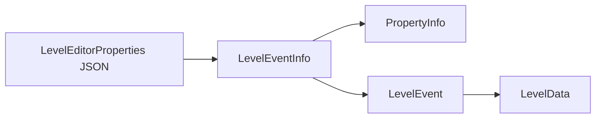

# 架构总览

ADOFAI 主工程由启动初始化、全局状态、场景控制、关卡数据、编辑器、运行时事件效果和平台服务几条主线组成。源码目录中有大量文件位于根目录，命名空间目录主要承载编辑器、数据模型、平台 helper 和少量扩展组件。

## 主干流程

## 启动层

`ADOStartup.Startup()` 使用 `RuntimeInitializeOnLoadMethod(RuntimeInitializeLoadType.BeforeSceneLoad)` 标记，在场景加载前执行。源码中可以看到它按顺序调用平台判定、安装位置判定、构建信息读取、语言环境设置、存档加载、字符串系统设置、Steam 初始化、DLC 检查、事件属性元数据解析、输入系统设置、音频设置和加载器创建。

其中 `SetupLevelEventsInfo()` 从 `Resources.Load<TextAsset>("LevelEditorProperties")` 读取 JSON，并把 `levelEvents`、`settings` 和 `categories` 解码进 `GCS.levelEventsInfo`、`GCS.settingsInfo` 和事件分类列表。这个流程决定了编辑器面板和事件默认值的来源。

## 全局访问层

`ADOBase` 继承 `RDBaseDll`，集中提供静态访问器和场景判断：

| 访问器或属性 | 指向 |
| --- | --- |
| `audioManager` | `AudioManager.Instance` |
| `conductor` | `scrConductor.instance` |
| `controller` | `scrController.instance` |
| `lm` | `scrLevelMaker.instance` |
| `editor` | `scnEditor.instance` |
| `customLevel` | `scnGame.instance` |
| `platformHelper` | `PlatformHelper.instance` |

这些访问器让大量 MonoBehaviour 派生类不需要重复查找场景对象。`ADOClass` 也提供一组相近的实例访问器，但它继承 `RDClassDll`，用于非 MonoBehaviour 风格的基类或脚本对象。

## 关卡数据层

`LevelData` 保存路径、角度、关卡事件、装饰和设置事件。它没有把每个事件拆成不同 C# 子类，而是由 `LevelEvent` 保存 `eventType` 与属性字典。事件属性的类型、默认值、范围、控件类型、显示条件和启用条件由 `PropertyInfo` 解析。

## 编辑器层

`scnEditor` 是关卡编辑器主控制类，内部包含 `LevelState`、`NotificationAction`、`ClipboardContent`、`FloorData` 等状态结构。编辑器动作类集中在 `ADOFAI.Editor.Actions`，包括新建、打开、保存、撤销、重做、复制粘贴、选择、旋转地板、切换面板和播放关卡。

编辑器属性 UI 由 `InspectorPanel`、`PropertiesPanel`、`Property` 和 `PropertyControl_*` 组成。`PropertyControl` 基类提供文本、枚举设置、输入校验、启用状态刷新、粒子预览刷新和路径/地板变更回写入口。

## 运行时层

`scnGame` 负责自定义关卡加载与运行。它持有 `LevelData`、`scrLevelMaker`、装饰管理器、视频背景、图片缓存和事件列表。`scrLevelMaker` 与 `scrFloor` 负责把路径数据转换为场景中的地板对象，并在地板上关联事件效果。

事件效果类大量以 `ffx` 命名。`ffxPlusBase` 是运行时效果基类，`ffxSpeed`、`ffxFlashPlus`、`ffxSetFilterPlus`、`ffxMoveDecorationsPlus`、`ffxCallMethod` 等类承接具体事件行为。后续阶段会建立 `LevelEventType` 到 `ffx` 类的对照表。

## 平台与服务层

平台相关代码分布在 `ADOFAI.Common.Platform` 及其 Windows、Mac、Linux 子命名空间中。启动阶段还接入 Steam、DLC 管理、Analytics、Discord、Rewired 输入和音频配置。第三方依赖只在文档中记录 ADOFAI 的接入点，不逐项展开第三方库内部实现。
