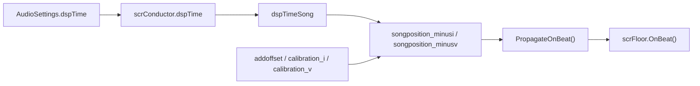

# 音频与节拍运行时

本模块记录 `scrConductor` 负责的音频时钟和节拍传播。它连接 `LevelData` 的歌曲设置、Unity DSP 时间、校准偏移、输入时间同步、hitsound 预排和地板 `OnBeat()`。

## 模块边界

| 类型 | 源码路径 | 角色 |
| --- | --- | --- |
| `scrConductor` | `7thRhythmSource/ADOFAi/scrConductor.cs` | 歌曲排程、DSP 时间、BPM、beat/bar、hitsound、hold sound、校准。 |
| `CalibrationPreset` | `7thRhythmSource/ADOFAi/CalibrationPreset.cs` | 音频输出设备对应的输入偏移预设。 |
| `AudioManager` | `7thRhythmSource/ADOFAi/AudioManager.cs` | 播放和停止具体音效。 |
| `AsyncInputManager` | `7thRhythmSource/ADOFAi/AsyncInputManager.cs` | 异步输入时间同步。 |

## 时间链路

`scrConductor.Update()` 会优先用未暂停时的 unscaled delta 推进 `dspTime`，再用 `AudioSettings.dspTime` 校准。歌曲位置由 `dspTime`、`dspTimeSong`、输入偏移、歌曲 pitch 和关卡 offset 计算。

## 歌曲设置来源

`SetupConductorWithLevelData(LevelData)` 从关卡数据写入 BPM、offset、歌曲音量、hitsound 音量、hitsound、倒计时设置和 pitch。自定义关卡会把 pitch 乘 `GCS.currentSpeedTrial`，编辑器播放会乘 `ADOBase.editor.playbackSpeed`。

## 预排声音

| 声音类型 | 生成来源 | 播放方式 |
| --- | --- | --- |
| 倒计时 tick | 地板 `countdownTicks` | 加入 `extraTicksCountdown`，`Update()` 中提前 5 秒用 `AudioManager.Play("sndHat", ...)`。 |
| 普通 hitsound | 地板 entry time 和 `ffxSetHitsound` | 加入 `hitSoundsData`，`Update()` 中提前 5 秒播放 `snd` 加 hitsound 名。 |
| free roam hitsound | 地板 free roam on/off beat 配置 | 按 0.5 beat 间隔加入 `hitSoundsData`。 |
| 多星体变化 sound | 相邻地板 `numPlanets` 变化 | 使用 `VehiclePositive` 或 `VehicleNegative`。 |
| hold sound | hold 起点、终点和 `ffxSetHoldsound` | 加入 `holdSoundsData`，可用 `PlayWithEndTime()` 设置结束时间。 |

## beat 传播

`songposition_minusi` 超过 `nextBeatTime` 时，`Update()` 调用 `PropagateOnBeat()`。该方法先遍历 `onBeats` 列表并调用每个 `ADOBase.OnBeat()`，再在 `controller.gameworld` 为真时遍历所有地板并调用 `scrFloor.OnBeat()`。

`onBeatFrame` 被写成当前帧号，因此其他代码可以通过 `onBeatHappened` 判断本帧是否刚触发 beat。

## 校准链路

| 环节 | 行为 |
| --- | --- |
| 默认预设 | `ADOStartup.LoadCalibration()` 调用 `CalibrationPreset.LoadDefaults()` 写入 `scrConductor.defaultPresets`。 |
| 当前输出 | `PlatformHelper.instance.GetActiveAudioDeviceType()` 与 `GetActiveAudioDeviceName()`。 |
| 选择预设 | `GetSuitablePresetForCurrentAudioOutput()` 先查用户预设，再查默认预设。 |
| 输入偏移 | `currentPreset.inputOffset` 通过 `calibration_i` 转成秒。 |
| 视觉偏移 | `visualOffset` 通过 `calibration_v` 转成秒，并保存到 `Persistence.visualOffset` 和 `PlayerPrefs`。 |

## 后续扩展

后续运行时音频专题会继续展开 `AudioManager`、`CalibrationPreset`、`RDInput` 和 `AsyncInputManager`，并把 conductor 与判定窗口、地板 entry time、编辑器播放速度之间的关系补成调用图。
