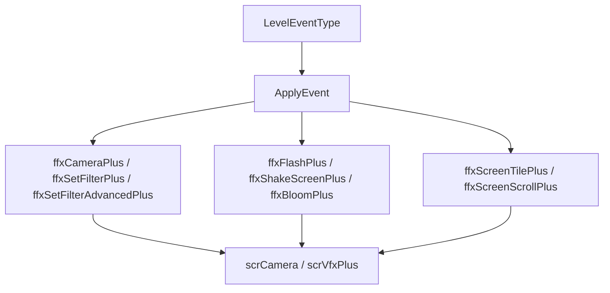

# 相机、滤镜与屏幕事件模块

本模块整理阶段 5 的相机、滤镜和屏幕效果事件。它们都通过 `ApplyEvent()` 创建组件，并由 `scrVfxPlus` 按时间调度。

## 模块边界

| 事件族 | 类型 |
| --- | --- |
| 相机 | `MoveCamera`、`ffxCameraPlus`。 |
| 闪屏 | `Flash`、`ffxFlashPlus`。 |
| 普通滤镜 | `SetFilter`、`ffxSetFilterPlus`。 |
| 高级滤镜 | `SetFilterAdvanced`、`ffxSetFilterAdvancedPlus`。 |
| 屏幕状态 | `HallOfMirrors`、`ShakeScreen`、`Bloom`。 |
| 屏幕纹理 | `ScreenTile`、`ScreenScroll`。 |

## 调度流

## 核心区别

| 类型 | 写入目标 |
| --- | --- |
| `MoveCamera` | 相机父物体位置、`scrVfxPlus.camAngle` 和 `scrCamera.zoomSize`。 |
| `Flash` | `scrCamera` 的前景或背景 flash renderer material color。 |
| `SetFilter` | `scrVfxPlus.filterToComp` 中已有的滤镜组件和强度缓存。 |
| `SetFilterAdvanced` | 前景或背景相机 GameObject 上的 `Assembly-CSharp-firstpass` 滤镜组件公开字段。 |
| `HallOfMirrors` | `scrController.EnableHallOfMirrors()`。 |
| `ShakeScreen` | `scrCamera.shake`。 |
| `Bloom` | 主相机 `VideoBloom` 的 threshold、master amount 和 tint。 |
| `ScreenTile` | 主相机 `ScreenTile.tileX/tileY`。 |
| `ScreenScroll` | 主相机 `ScreenScroll.scrollSpeed`。 |

## 源码研究关注点

| 关注点 | 说明 |
| --- | --- |
| 视觉质量分支 | `ffxCameraPlus`、`ffxFlashPlus`、`ffxSetFilterPlus`、`ffxShakeScreenPlus` 都有最低视觉效果相关分支。 |
| 静态 tween | 相机、闪屏、Bloom、screen tile 都使用静态 tween 字段，后一个事件会 kill 前一个同类 tween。 |
| 高级滤镜反射 | `SetFilterAdvanced` 使用类型名查找 `Assembly-CSharp-firstpass` 组件，只 tween `int`、`float`、`Color` 和 `Vector2` 字段。 |
| 相机相对模式 | `MoveCamera` 的 `relativeTo` 会决定位置相对玩家、地板、全局或上次位置。 |
| Scrub 行为 | 这些效果大多通过 `eventTweens` 支持 scrub；`ScreenScroll` 是立即写入，没有暴露 tween。 |

## 页面

| 页面 | 内容 |
| --- | --- |
| [相机、滤镜与屏幕事件](/api/events/camera-filter-events.md) | `MoveCamera`、`Flash`、`SetFilter`、`SetFilterAdvanced`、`HallOfMirrors`、`ShakeScreen`、`Bloom`、`ScreenTile`、`ScreenScroll` 的字段和执行方式。 |
| [相机与 VFX 运行链路](/api/runtime/camera-vfx-chain.md) | 相机与 VFX 调度基础。 |
| [事件执行总览](/api/events/event-execution-overview.md) | 事件到效果组件的总流程。 |
