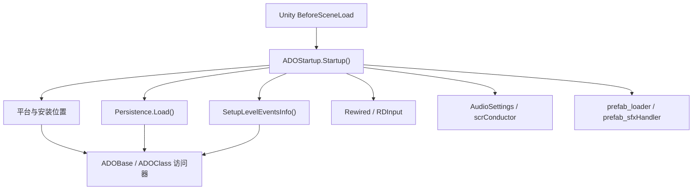

# 核心启动与全局访问

本模块覆盖 ADOFAI 启动前初始化、全局访问器和普通脚本基类。当前已读源码包括 `ADOStartup.cs`、`ADOBase.cs` 和 `ADOClass.cs`。

## 模块边界

| 类型 | 源码路径 | 角色 |
| --- | --- | --- |
| `ADOStartup` | `7thRhythmSource/ADOFAi/ADOStartup.cs` | 场景加载前的初始化入口。 |
| `ADOBase` | `7thRhythmSource/ADOFAi/ADOBase.cs` | MonoBehaviour 类常用的全局访问器和工具方法基类。 |
| `ADOClass` | `7thRhythmSource/ADOFAi/ADOClass.cs` | 非 MonoBehaviour 类常用的实例访问器基类。 |

## 初始化主线

## 关键事实

| 主题 | 源码事实 |
| --- | --- |
| 启动时机 | `ADOStartup.Startup()` 使用 `RuntimeInitializeOnLoadMethod(RuntimeInitializeLoadType.BeforeSceneLoad)`。 |
| 平台状态 | `GetPlatform()` 写入 `ADOBase.platform`。 |
| Steam 目录 | `DetermineAppLocation()` 检查父目录是否为 `steamapps/common`，写入 `ADOBase.appIsInSteamLibrary`。 |
| 事件元数据 | `SetupLevelEventsInfo()` 读取 `LevelEditorProperties`，填充 `GCS.levelEventsInfo`、`GCS.settingsInfo` 和 `GCS.levelEventTypeString`。 |
| 输入 | 启动阶段实例化 `RDConstants.data.prefab_rewiredManager`，再调用 `RDInput.Setup(rewiredManager)`。 |
| 音频 | 启动阶段设置 `AudioSettings` 的 `dspBufferSize`，并调用 `scrConductor.UpdateCurrentAudioOutput()`。 |
| 常驻对象 | `prefab_sfxHandler` 和 `prefab_loader` 都通过 `DontDestroyOnLoad` 保留。 |

## 全局访问器分工

`ADOBase` 更适合 Unity 场景脚本和运行时效果脚本。它提供静态访问器、平台判断、场景判断、关卡跳转、显示尺寸、节日判断和 `OnBeat()` 虚方法。

`ADOClass` 更适合普通类或关卡脚本基类。它提供实例访问器，源码中 `Level` 继承它。相比 `ADOBase`，它没有场景跳转和平台工具方法，但额外提供 `decorationManager` 访问器。

## 后续待展开

| 类型 | 后续页面 |
| --- | --- |
| `scrController` | 阶段 1 下一批核心页面，负责状态机、判定、暂停和结算。 |
| `scrConductor` | 阶段 1 下一批核心页面，负责音频时钟、BPM、hitsound 和校准。 |
| `scnGame` | 阶段 1 下一批核心页面，负责自定义关卡加载和运行。 |
| `scnEditor` | 阶段 1 下一批核心页面，负责编辑器状态、面板、文件操作和事件编辑。 |
| `scrLevelMaker`、`scrFloor` | 阶段 1 后半段，负责路径生成和地板对象。 |
