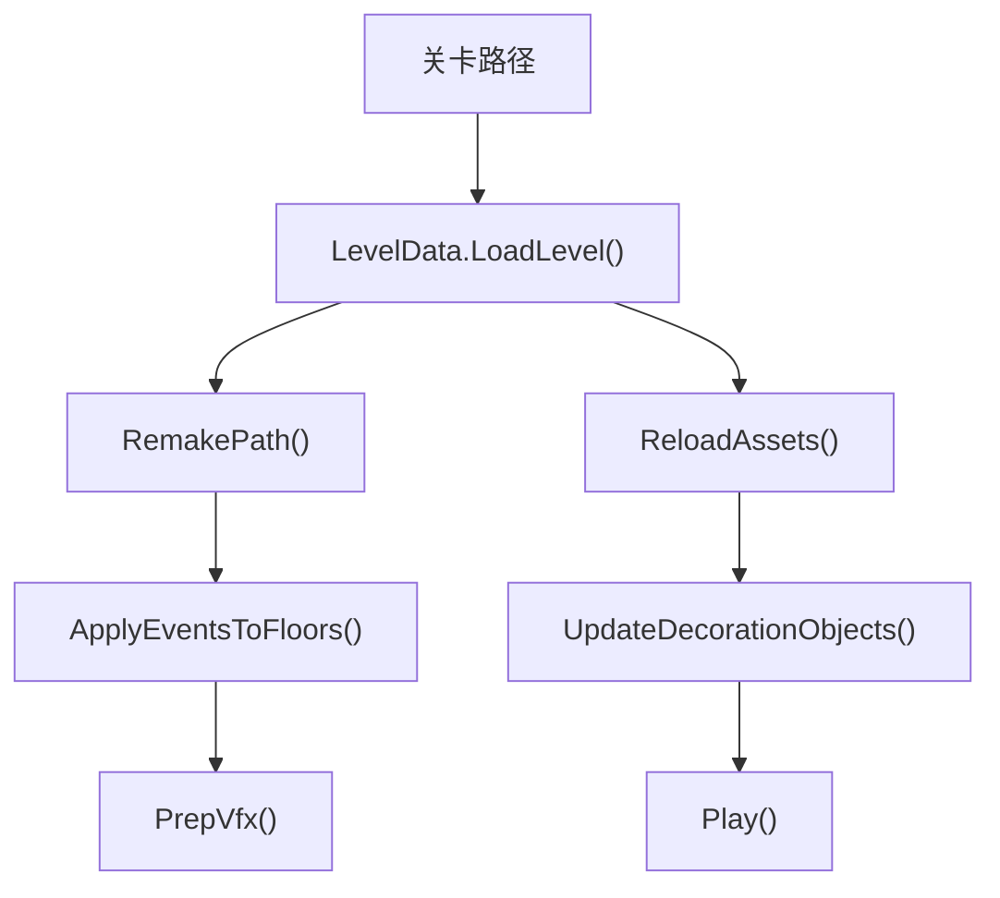

# 自定义关卡运行主线

本模块记录 `scnGame` 如何把 `.adofai` 数据加载为运行时场景。它连接 `LevelData`、`scrLevelMaker`、`scrFloor`、`scrConductor`、`scrDecorationManager` 和 `ffxPlusBase`。

## 主线流程

## 核心协作对象

| 对象 | 作用 |
| --- | --- |
| `LevelData` | 保存路径、角度、事件、装饰和 settings。 |
| `scrConductor` | 从 `LevelData` 读取 BPM、offset、volume、pitch 和 hitsound 设置。 |
| `scrLevelMaker` | 把路径数据和角度数据生成 `scrFloor` 列表。 |
| `scrFloor` | 承载 entry time、speed、track 外观、条件效果和 `plusEffects`。 |
| `scrDecorationManager` | 创建、清理和重置装饰对象。 |
| `scrVfxPlus` | 收集并按时间排序运行时 VFX。 |
| `ffxPlusBase` | 所有运行时事件效果组件的共同基类。 |

## 事件落地

`scnGame.ApplyEventsToFloors()` 先按 floor 分组 `LevelEvent`，再清理旧 `ffxPlusBase`，重新计算地板角度长度和 entry time。普通事件通过 `ApplyEvent()` 变成具体 `ffx` 组件，轨道颜色、速度、动画、位置等核心事件还会直接改写地板状态。

## VFX 准备

`PrepVfx()` 会把地板上的 `plusEffects` 放入三类位置：

| 位置 | 条件 |
| --- | --- |
| floor 的条件效果集合 | `conditionalInfo` 中对应项为真。 |
| `scrVfxPlus.effects` | 非手动运行、非 hit 触发的普通效果。 |
| 装饰 hitbox event | `eventTag` 命中装饰管理器中的 hitbox event tag。 |

最后 `scrVfxPlus.effects` 会按开始时间和 floor id 排序，供运行时按时间触发。

## 资源刷新

| 方法 | 资源 |
| --- | --- |
| `ReloadSong()` | 歌曲音频。 |
| `UpdateBackgroundSprites()` | `CustomBackground.bgImage`。 |
| `UpdateFloorSprites()` | `ColorTrack.trackTexture`。 |
| `UpdateDecorationObjects()` | 装饰图片和 `MoveDecorations.decorationImage`。 |
| `UpdateVideo()` | `miscSettings.bgVideo`。 |

## 后续扩展

后续会继续补 `scrLevelMaker`、`scrFloor` 和 `LevelData`，把“路径生成”、“地板字段”和“.adofai 数据结构”补成可以互相跳转的完整链路。
