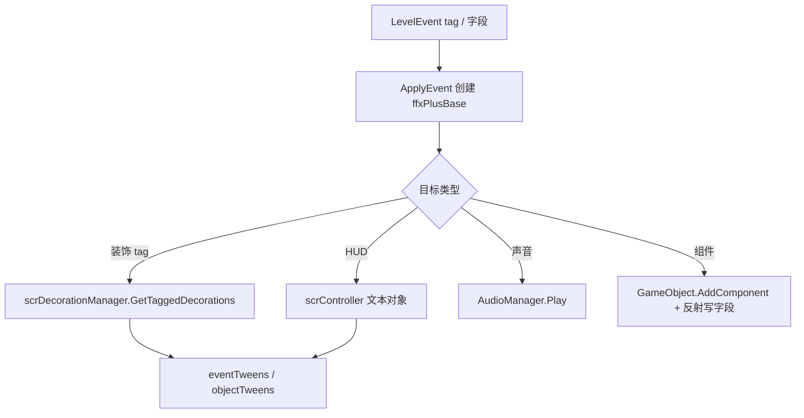

# 装饰、对象、文本与声音事件模块

本模块整理阶段 5 中非相机、非轨道地板的常见运行时事件：装饰 tween、对象装饰、文本、默认 HUD 文案、声音、动态组件和条件死亡。

## 模块边界

| 类别 | 类型 |
| --- | --- |
| 装饰变换 | `MoveDecorations`、`ffxMoveDecorationsPlus`。 |
| 对象装饰 | `SetObject`、`ffxSetObjectPlus`。 |
| 文本装饰 | `SetText`、`ffxSetTextPlus`。 |
| HUD 默认文本 | `SetDefaultText`、`ffxSetDefaultText`。 |
| 声音 | `PlaySound`、`ffxPlaySound`。 |
| 动态组件 | `AddComponent`、`ffxAddComponent`。 |
| 条件死亡 | `KillPlayer`、`ffxKillPlayer`。 |

## 执行流

## 关键差异

| 事件 | 目标 |
| --- | --- |
| `MoveDecorations` | 任意带 tag 的 `scrDecoration`，并按实际类型处理 visual、particle、masking。 |
| `SetObject` | `scrObjectDecoration`，根据 `ObjectDecorationType.Planet` 或 `Floor` 分支执行。 |
| `SetText` | `scrTextDecoration`。 |
| `SetDefaultText` | `scrController.txtLevelName`、Shadow、结算文字字段。 |
| `PlaySound` | `AudioManager` 和 conductor DSP 时间。 |
| `AddComponent` | 当前 floor 的 GameObject。 |
| `KillPlayer` | 当前控制器的 `playerOne`，且需要条件信息命中。 |

## 源码研究关注点

| 关注点 | 说明 |
| --- | --- |
| tag 解析 | `MoveDecorations`、`SetObject`、`SetText` 都按空格拆分 tag，空 tag 使用 `NO TAG`。 |
| 视觉质量 | 官方关卡低视觉质量下，装饰、对象和文本效果会直接返回。 |
| tween 容器 | 装饰使用 `scrDecoration.eventTweens`，对象装饰额外使用 `objectTweens` 和 floor 的 `moveTweens`。 |
| 文本本地化 | `SetText`、`SetDefaultText`、`KillPlayer` 使用 localized 字符串读取。 |
| 动态组件 | `AddComponent` 使用 `Type.GetType` 和反射写字段，若组件继承 `ffxPlusBase`，会并入 floor 的 plusEffects。 |
| 条件死亡 | `KillPlayer` 只在 `conditionalInfo` 命中时执行死亡逻辑。 |

## 页面

| 页面 | 内容 |
| --- | --- |
| [装饰、对象、文本与声音事件](/api/events/decoration-object-text-sound-events.md) | `MoveDecorations`、`SetObject`、`SetText`、`SetDefaultText`、`PlaySound`、`AddComponent` 和 `KillPlayer`。 |
| [事件执行总览](/api/events/event-execution-overview.md) | 事件到运行时效果的总体调度。 |
| [运行时效果族补充](/api/runtime/effect-families.md) | 已有运行时效果族字段说明。 |
