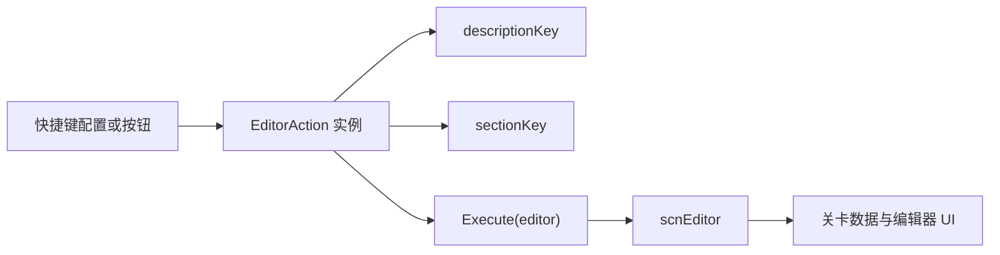

# 编辑器动作系统

## 模块边界

本模块覆盖 `7thRhythmSource/ADOFAi/ADOFAI.Editor.Actions` 下的动作类。动作系统面向编辑器快捷键、菜单按钮和命令入口，核心是 [ADOFAI.Editor.Actions](/api/editor/editor-actions.md)。

| 层级 | 类型 | 职责 |
| --- | --- | --- |
| 动作基类 | `EditorAction` | 定义动作分组、描述键和执行入口。 |
| 组合动作 | `SimpleEditorAction`、`ConditionalEditorAction`、`CompositeEditorAction` | 包装委托、条件分支和多个动作顺序执行。 |
| 具体动作 | `*EditorAction` | 调用 `scnEditor` 的具体编辑方法。 |
| 执行目标 | `scnEditor` | 保存编辑器状态并真正修改关卡、选择、事件、装饰或 UI。 |

## 核心流程

`EditorAction` 的 `sectionKey` 对应快捷键分组。`descriptionKey` 默认由类名推导，少数动作覆写该键以复用显示文案。

## 动作分类

| 分类 | 代表类型 | 主要效果 |
| --- | --- | --- |
| 基础编辑 | `PlayEditorAction`、`UndoEditorAction`、`RedoEditorAction`、`CopyFloorEditorAction`、`PasteFloorEditorAction` | 播放、撤销重做、地板复制粘贴。 |
| 选择和删除 | `SelectNextFloorEditorAction`、`MoveSelectionLeftEditorAction`、`DeleteFloorsEditorAction` | 移动选择、扩展选择、删除地板。 |
| 翻转和旋转 | `FlipFloorsHorizontalEditorAction`、`RotateFloors90ClockwiseEditorAction` | 翻转或旋转路径片段。 |
| 高级编辑 | `CopyEventsEditorAction`、`PasteEventsEditorAction`、`DuplicateDecorationsEditorAction` | 事件、装饰和轨道属性的复制粘贴。 |
| 书签 | `ToggleBookmarkEditorAction`、`SelectNextBookmarkEditorAction` | 添加/移除书签和跳转书签。 |
| 工作流 | `NewLevelEditorAction`、`OpenLevelEditorAction`、`SaveLevelEditorAction`、`CycleNextEventTabEditorAction` | 新建、打开、保存和面板导航。 |
| 其他 | `ToggleAutoEditorAction`、`ToggleShortcutsPanelEditorAction`、`ShowCurrentFloorNumberEditorAction` | 编辑器辅助开关和弹窗。 |

## 源码研究关注点

| 问题 | 入口 |
| --- | --- |
| 快捷键为什么归到某个面板 | 查看动作类的 `sectionKey`。 |
| 快捷键显示名从哪里来 | 查看 `EditorAction.descriptionKey` 和覆写的 `descriptionKey`。 |
| 某个动作真正做了什么 | 进入动作类的 `Execute()`，再继续追踪被调用的 `scnEditor` 方法。 |
| 多步动作怎样组合 | `CompositeEditorAction` 顺序执行多个动作。 |
| 条件动作怎样选择分支 | `ConditionalEditorAction` 调用 `Func<bool>` 决定执行 trueAction 或 falseAction。 |

## 后续补齐

阶段 3 后续继续覆盖编辑器偏好设置、粒子编辑器、编辑器辅助面板和 `scnEditor` 中与动作系统相连的长流程。

