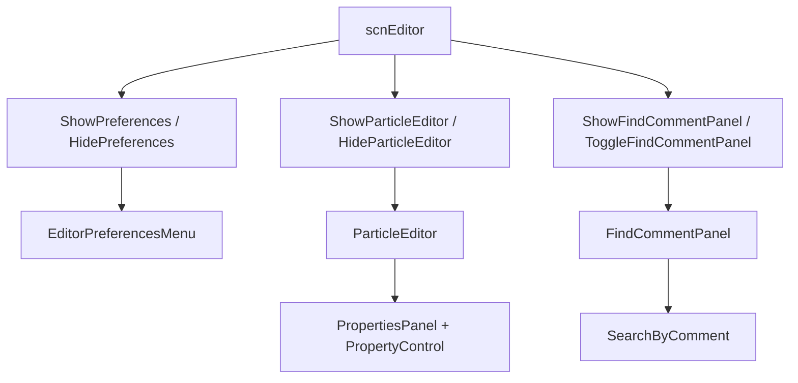

# 编辑器辅助面板

## 模块边界

本模块覆盖阶段 3 的偏好设置、粒子编辑器和辅助查找面板。

| 页面 | 覆盖类型 | 说明 |
| --- | --- | --- |
| [偏好设置、粒子编辑器与辅助面板](/api/editor/preferences-particle-panels.md) | `EditorPreferencesMenu`、`ParticleEditor`、`FindCommentPanel` | 编辑器辅助 UI 的创建、显示、关闭和数据流。 |
| [PropertyControl 控件族](/api/editor/property-controls.md) | `PropertyControl_*` | 粒子编辑器复用的属性控件。 |
| [编辑器动作系统](/modules/editor-actions.md) | `OpenPreferencesEditorAction`、`ToggleFindCommentPanelEditorAction` 等 | 打开这些面板的快捷键动作入口。 |

## 面板关系

三个面板都属于编辑器内部 UI，但职责不同：偏好设置写入 `Persistence`，粒子编辑器编辑 `AddParticle` 事件并实时预览，查找注释面板根据注释搜索地板。

## 源码研究关注点

| 问题 | 入口 |
| --- | --- |
| 偏好设置项从哪里定义 | `EditorPreferencesMenu.SetupMenu()`。 |
| 偏好设置怎样写回 | `EditorPreferencesValueControl<T>` 的 setter 委托和具体控件的监听器。 |
| 粒子编辑器编辑哪些字段 | `ParticleEditor.DrawSettings()`。 |
| 粒子预览怎样更新 | `ParticleEditor.SetEvent()` 和 `UpdatePreview()`。 |
| 查找注释怎样跳转地板 | `FindCommentPanel.Search()`、`Prev()`、`Next()`。 |
| 面板怎样打开关闭 | `scnEditor.ShowPreferences()`、`ShowParticleEditor()`、`ShowFindCommentPanel()`。 |

## 阶段 3 后续

阶段 3 的核心 UI 链路、控件族、动作系统和辅助面板已经覆盖。后续需要继续补 `scnEditor` 中文件打开保存、撤销重做、选择、播放预览等长流程的专题页，并梳理编辑器相关小型 UI 类。

