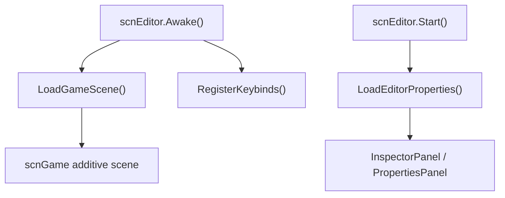

# 编辑器主入口

本模块记录 `scnEditor` 的主职责和它与游戏场景、关卡数据、属性面板、快捷键动作的协作关系。详细的事件面板和控件系统会在阶段 3 展开。

## 启动链路

`scnEditor` 会附加加载 `scnGame`，因此编辑器和运行时关卡预览共享 `LevelData`、路径生成、装饰刷新和事件应用逻辑。

## 编辑器数据回写

| 编辑操作 | 回写路径 |
| --- | --- |
| 改路径 | 修改 pathData 或 angleData 后调用 `RemakePath()`。 |
| 改 floor 事件 | 修改 `LevelData.levelEvents` 后调用 `ApplyEventsToFloors()`。 |
| 改装饰 | 修改 `LevelData.decorations` 后调用 `UpdateDecorationObjects()`。 |
| 播放预览 | `Play()` 调用 `customLevel.Play()`。 |
| 撤销重做 | `UndoOrRedo()` 恢复 `LevelState` 后重建路径和装饰。 |

## 选择模型

`scnEditor` 同时维护 floor 选择和 decoration 选择。floor 选择用 `selectedFloors` 与 `multiSelectPoint` 表示，decoration 选择用 `selectedDecorations` 表示。切换选择会刷新属性面板、选中颜色、相机位置和查找面板信息。

## 快捷键动作

快捷键注册到 `EditorKeybindManager`，动作类集中在 `ADOFAI.Editor.Actions`。这让编辑器输入和具体操作分开：按键负责触发 action，action 再调用 `scnEditor` 的公开方法完成保存、打开、选择、复制粘贴、撤销重做和播放。

## 后续扩展

阶段 3 会继续把编辑器拆成：

| 专题 | 覆盖内容 |
| --- | --- |
| EditorAction 系统 | `ADOFAI.Editor.Actions` 下 86 个动作文件。 |
| Inspector 面板 | `InspectorPanel`、`PropertiesPanel`、`Property`。 |
| PropertyControl | `PropertyControl_*` 控件读写 `LevelEvent` 的方式。 |
| 编辑器弹窗 | 保存、导出、打开 URL、未保存、确认和通知弹窗。 |
| 粒子编辑器与偏好 | `ParticleEditor`、`EditorPreferencesMenu` 和偏好控件。 |
