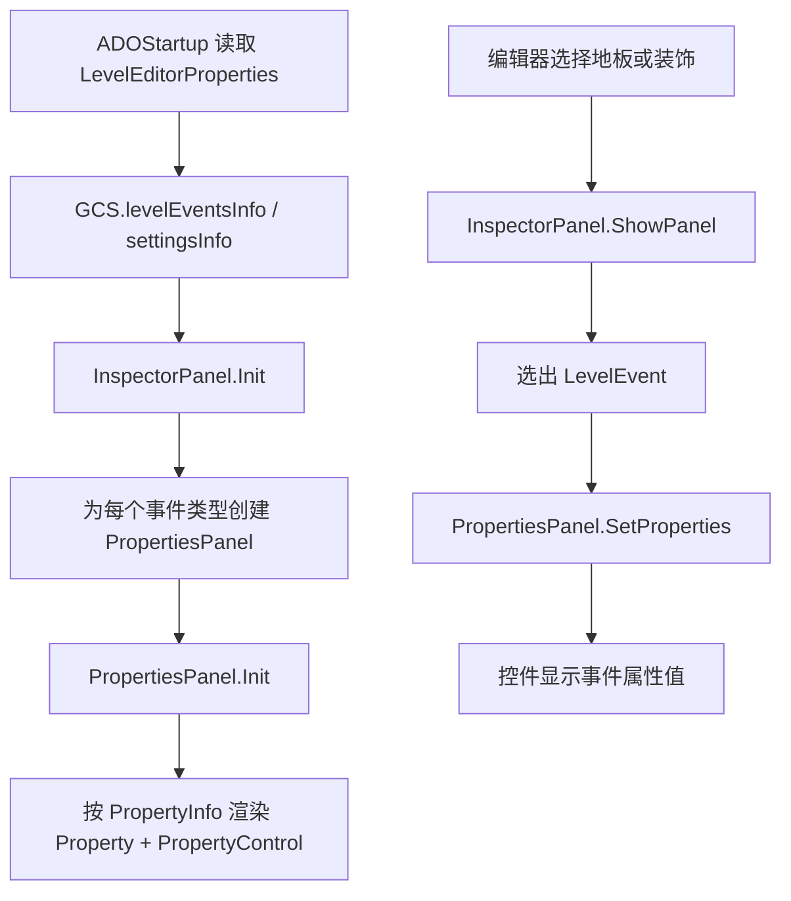

# 编辑器事件与属性面板

## 模块边界

本页覆盖阶段 3 的第一组编辑器系统：事件 Inspector、属性面板和数据模型之间的连接。

| 类型 | 源码路径 | 角色 |
| --- | --- | --- |
| [InspectorPanel](/api/editor/InspectorPanel.md) | `7thRhythmSource/ADOFAi/ADOFAI/InspectorPanel.cs` | 管理事件 tab、当前事件选择、面板显示、删除/启用按钮和装饰多选。 |
| [PropertiesPanel](/api/editor/PropertiesPanel.md) | `7thRhythmSource/ADOFAi/ADOFAI/PropertiesPanel.cs` | 根据属性元数据生成属性行和控件，并把事件值写入 UI。 |
| [Property](/api/data-models/Property.md) | `7thRhythmSource/ADOFAi/ADOFAI/Property.cs` | 单个属性行，连接标签、启用按钮、控件容器和 `PropertyInfo`。 |
| `PropertyControl_*` | `7thRhythmSource/ADOFAi/ADOFAI.LevelEditor.Controls` | 各类具体输入控件，后续阶段 3 会分组覆盖。 |

## 核心流程

这个流程说明 ADOFAI 编辑器事件面板是元数据驱动的。事件属性列表来自 `LevelEditorProperties`，不是在 `InspectorPanel` 或 `PropertiesPanel` 中硬编码完整字段表。

## 职责划分

| 层级 | 负责内容 | 不负责内容 |
| --- | --- | --- |
| `InspectorPanel` | 事件类型 tab、当前选中事件、装饰多选合并、面板显示隐藏、删除与启用按钮。 | 具体属性控件的创建与赋值。 |
| `PropertiesPanel` | 属性行渲染、控件预制体选择、Tab 键焦点导航、分组显示、把事件值写入控件。 | 决定当前要编辑哪个事件。 |
| `Property` | 标签文本、启用按钮、控件容器、`PropertyInfo` 引用。 | 具体输入值逻辑。 |
| `PropertyControl_*` | 具体输入、校验、回写和联动。 | 事件 tab 与面板切换。 |

## 装饰多选

`InspectorPanel.ShowPanel()` 对装饰事件多选有专门分支：

| 情况 | 行为 |
| --- | --- |
| 选中 1 个装饰 | 直接编辑该装饰事件。 |
| 选中多个同类型装饰 | 创建 `isFake = true` 的临时 `LevelEvent`，把真实事件放入 `realEvents`。相同字段显示原值，不同字段禁用或对向量分量写入 `NaN`。 |
| 选中多个不同类型装饰 | 隐藏属性面板并显示类型不同的提示。 |

这个临时事件会在 [LevelEvent](/api/data-models/LevelEvent.md) 的 `ApplyPropertiesToRealEvents()` 中把修改同步回真实事件。

## 源码研究关注点

| 问题 | 入口 |
| --- | --- |
| 为什么某个事件属性没有显示 | [PropertiesPanel](/api/editor/PropertiesPanel.md) 的 `Init()` 会检查 `dontRenderKeys`、`ControlType.Hidden`、Pro 条件和 `Persistence.enableProEvents`。 |
| 某个属性用了哪个控件 | [PropertiesPanel](/api/editor/PropertiesPanel.md) 的 `RenderControl()`。 |
| 多个装饰同时编辑时字段怎样合并 | [InspectorPanel](/api/editor/InspectorPanel.md) 的 `ShowPanel()` 装饰分支。 |
| 属性分组 tab 从哪里来 | [InspectorPanel](/api/editor/InspectorPanel.md) 的 `Init()` 读取 `LevelEventInfo.groups`。 |
| 控件值怎样从事件对象刷新 | [PropertiesPanel](/api/editor/PropertiesPanel.md) 的 `SetProperties()`。 |

## 后续补齐

阶段 3 接下来要覆盖 `PropertyControl_*` 控件族、`ADOFAI.Editor.Actions` 动作系统、偏好设置、粒子编辑器和编辑器辅助面板。

