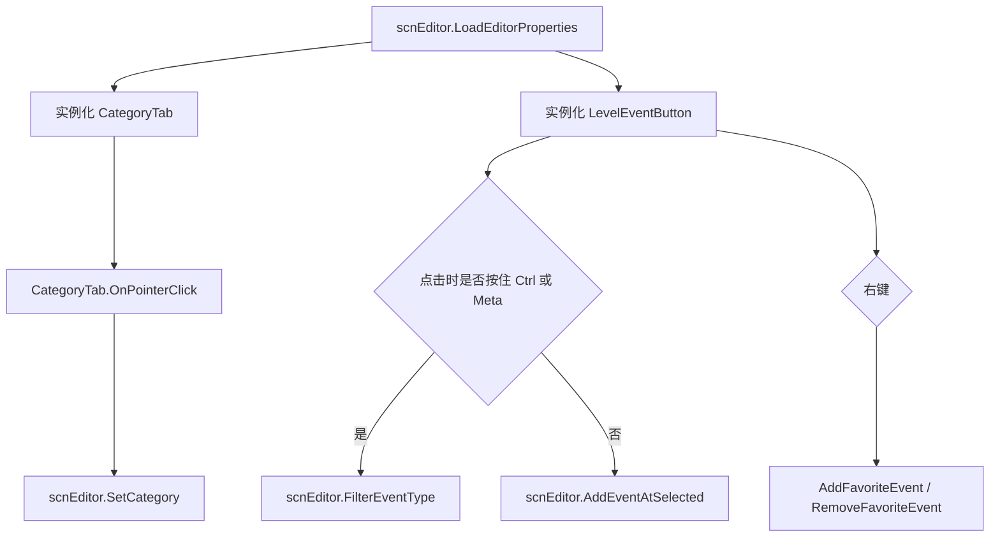
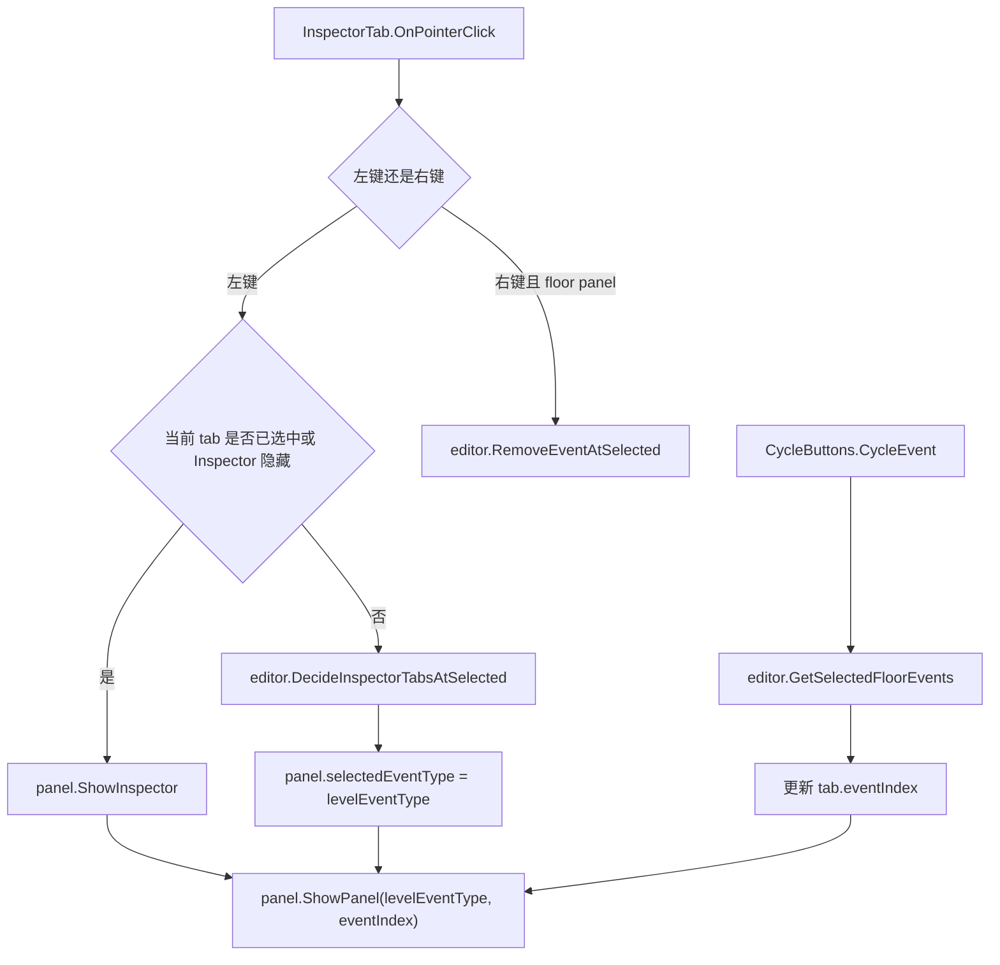
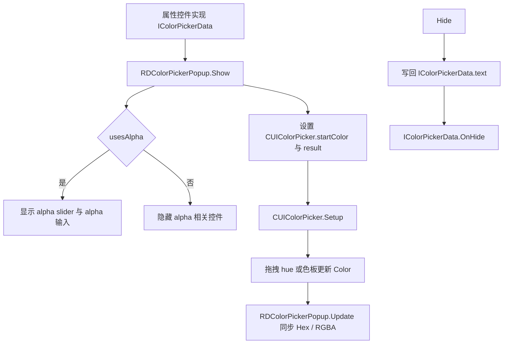
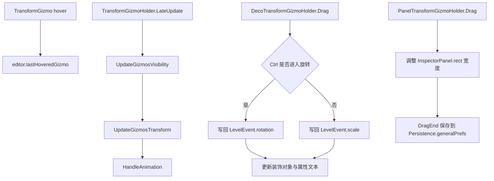

# 编辑器小型 UI 组件

## 模块边界

本页整理编辑器系统中体量较小、但连接频繁的 UI 组件。它们负责把用户输入转换成 `scnEditor`、`InspectorPanel`、`PropertyControl_List`、`scrDecorationManager` 或面板尺寸变化，不直接承担关卡加载和运行时执行。

| 子系统 | 关键类型 |
| --- | --- |
| 事件栏 | `LevelEventButton`、`CategoryTab` |
| Inspector tab | `InspectorTab`、`CycleButtons` |
| 地板与事件提示 | `EventIndicator`、`KeyIndicator`、`FloorDirectionButton`、`scrShortcutText` |
| 颜色控件 | `RDColorPickerPopup`、`CUIColorPicker`、`AlphaSlider`、`IColorPickerData` |
| 列表条目 | `ListItem`、`ListItem_Decoration`、`ListItem_Event`、`AdofaiEventTrigger` |
| Gizmo | `EditorGizmo`、`DecorationPivot`、`TransformGizmo`、`TransformGizmoHolder`、`DecoTransformGizmoHolder`、`PanelTransformGizmoHolder` |
| 其它轻量 UI | `PracticeTimeline`、`DynamicallyOrderedFont`、`FPSCounter` |

## 事件栏到事件写入

事件栏按钮自身只负责 UI 入口。事件能否添加、互斥规则、自动附加事件和地板刷新都在 `scnEditor.AddEventAtSelected` 中完成。

## Inspector tab 切换

同一地板存在多个同类型事件时，`InspectorTab.SetSelected` 会显示 `CycleButtons` 并扩大 tab 宽度。`CycleButtons` 只改变 `eventIndex`，然后让 `InspectorPanel.ShowPanel` 刷新内容。

## 颜色选择器协作

颜色弹窗与具体属性控件通过 `IColorPickerData` 解耦。弹窗不知道自己正在编辑哪种事件属性，只依赖接口读取当前文本、透明度开关、示例 Image、位置设置和隐藏回调。

## 列表项协作

| 组件 | 输入来源 | 输出目标 |
| --- | --- | --- |
| `AdofaiEventTrigger` | Unity pointer、drag、move 接口 | 委托字段，如 `onPointerClick`、`onBeginDrag`、`onDrag`。 |
| `ListItem` | `PropertyControl_List` 生成列表项并调用 `SetEvent` | 点击地板按钮时调用 `ADOBase.editor.SelectFloor`。 |
| `ListItem_Decoration` | `LevelEvent` 和 `scrDecorationManager.GetDecoration` | 点击条目选择装饰，Shift 点击选择范围，可见/锁定按钮写回 `scnEditor.ShowEvent` 和 `scnEditor.LockEvent`。 |
| `ListItem_Event` | `LevelEvent` | 显示事件类型名称和 `GCS.levelEventIcons` 图标。 |

列表项是 `PropertyControl_List` 的 UI 单元。它不会直接重排列表，拖拽逻辑通过 `PropertyControl_List.PointerDown`、`BeginDrag`、`PointerEnter`、`PointerExit` 接收。

## Gizmo 协作

`EditorGizmo` 负责基础缩放，`TransformGizmo` 负责单个手柄方向和 hover，`TransformGizmoHolder` 负责成组手柄的几何计算。装饰 gizmo 和面板 gizmo 的差异体现在子类拖拽逻辑：前者写回装饰事件属性，后者写回面板宽度和偏好设置。

## 练习时间线

`PracticeTimeline` 位于暂停菜单，但它和编辑器阶段有关联：它读取 `ADOBase.lm.listFloors` 的 entry time，将地板序号映射到时间线位置，并把练习起止点写回 `GCS.checkpointNum` 和 `GCS.practiceLength`。它还会根据速度百分比设置预听 AudioSource 的 pitch，并根据地板密度生成一张波形式纹理。

## 阶段 3 边界

阶段 3 当前已覆盖：

| 方向 | 页面 |
| --- | --- |
| 编辑器入口与文件流程 | [scnEditor](/api/core/scnEditor.md)、[scnEditor 长流程](/api/editor/scnEditor-workflows.md)、[编辑器长流程](/modules/editor-workflows.md) |
| Inspector 与属性控件 | [InspectorPanel](/api/editor/InspectorPanel.md)、[PropertiesPanel](/api/editor/PropertiesPanel.md)、[PropertyControl 控件族](/api/editor/property-controls.md)、[编辑器事件与属性面板](/modules/editor-property-panels.md) |
| 快捷键动作 | [ADOFAI.Editor.Actions](/api/editor/editor-actions.md)、[编辑器动作系统](/modules/editor-actions.md) |
| 辅助面板 | [偏好设置、粒子编辑器与辅助面板](/api/editor/preferences-particle-panels.md)、[编辑器辅助面板](/modules/editor-auxiliary-panels.md) |
| 小型 UI 组件 | [编辑器小型 UI 类](/api/editor/editor-ui-widgets.md)、本页 |

阶段 3 的剩余工作应以复核为主：检查是否还有明显属于编辑器系统、且没有被上述页面归类的主工程类。大规模运行时效果、平台服务、菜单和关卡选择不在阶段 3 收口范围内。

## 相关页面

- [编辑器小型 UI 类](/api/editor/editor-ui-widgets.md)
- [编辑器长流程](/modules/editor-workflows.md)
- [编辑器事件与属性面板](/modules/editor-property-panels.md)
- [编辑器动作系统](/modules/editor-actions.md)
