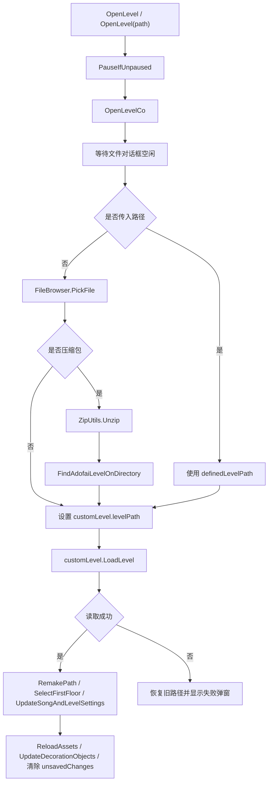
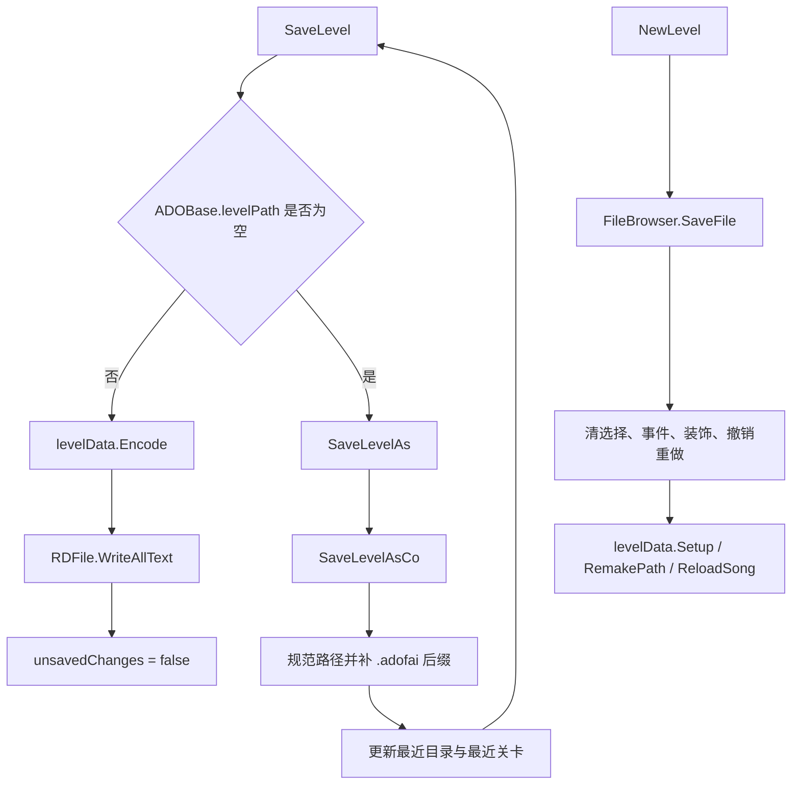
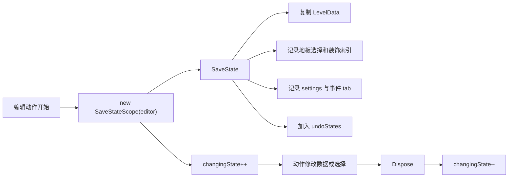
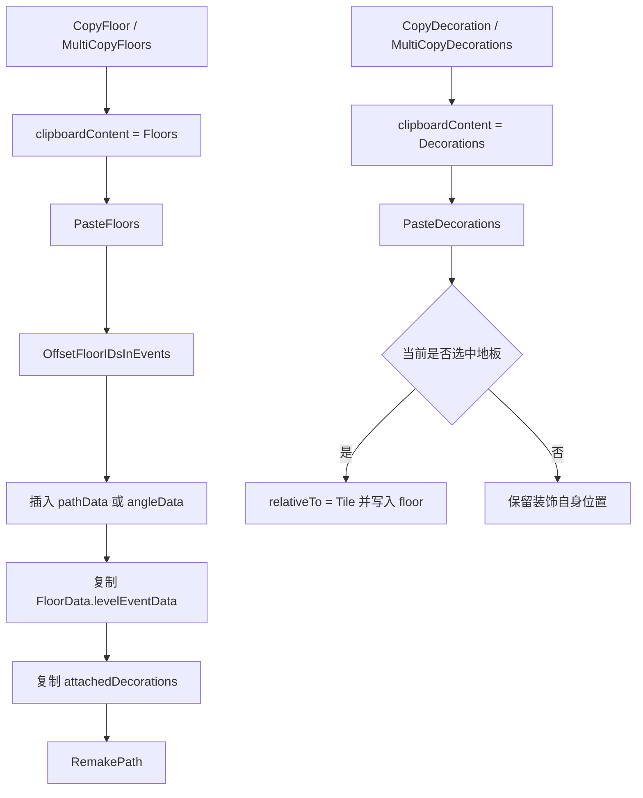
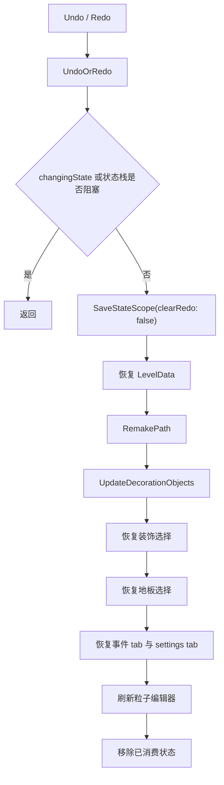

# 编辑器长流程

## 模块边界

本页覆盖 `scnEditor` 中跨文件、数据、选择、面板和运行时预览的长流程。动作类和属性面板已经分别写在 [编辑器动作系统](/modules/editor-actions.md) 与 [编辑器事件与属性面板](/modules/editor-property-panels.md)，这里关注这些入口最终怎样落到 `scnEditor` 的业务方法。

| 范围 | 关键类型 |
| --- | --- |
| 文件操作 | `scnEditor`、`LevelData`、`Persistence`、`FileBrowser`、`ZipUtils` |
| 状态保存 | `SaveStateScope`、`LevelState`、`undoStates`、`redoStates` |
| 选择系统 | `scrFloor`、`LevelEvent`、`scrDecorationManager`、`InspectorPanel` |
| 剪贴板 | `FloorData`、`LevelEvent`、`ClipboardContent` |
| 事件写入 | `LevelEventType`、`EditorConstants.soloTypes`、`EditorConstants.toggleableTypes` |
| 播放预览 | `scrController`、`scrConductor`、`scnGame`、`scrDecorationManager` |

## 文件打开流程

打开流程会清空撤销和重做栈，并更新最近目录、最近关卡。读取失败时不会保留失败路径，而是恢复 `lastLevelPath` 和原来的 `GCS.customLevelId`。

## 保存与新建流程

保存依赖 `LevelData.Encode()`，因此数据模型页里的 settings、actions、decorations 编码规则会直接影响编辑器保存结果。新建关卡会同时重置编辑器可见对象和内存状态，不只是写一个空文件。

## 状态保存流程

`SaveState` 会忽略编辑器未初始化或 `changingState != 0` 的情况。撤销栈最多保留 100 项。选择类操作通常把 `dataHasChanged` 设为 `false`，这样能恢复选择状态，同时不把关卡标成未保存。

## 地板与装饰选择

| 流程 | 主要方法 | 结果 |
| --- | --- | --- |
| 单选地板 | `SelectFloor` | 清空旧地板选择，记录目标地板，更新地板信息、选中色、相机位置和事件面板状态。 |
| 多选地板 | `MultiSelectFloors` | 根据起止地板索引形成连续多选，更新选择文字和选中色。 |
| 注释搜索 | `SearchByComment` | 在启用的 `EditorComment` 事件里按注释文本查找 floor 序号。 |
| 单选装饰 | `SelectDecoration` | 更新装饰选择、相机聚焦、选择框、gizmo、Inspector 面板和装饰列表滚动位置。 |
| 取消装饰 | `DeselectDecoration`、`DeselectAllDecorations` | 移除装饰选中状态并刷新 gizmo、边框和面板。 |

地板和装饰共享 `SaveStateScope`，但它们维护的选择数据不同。地板选择保存在 `selectedFloors` 中，装饰选择保存为 `selectedDecorations`，撤销状态则记录装饰在 `levelData.decorations` 中的索引。

## 剪贴板流程

`PasteFloors` 会拒绝方向指向后方的粘贴内容，并要求当前为单选地板。它先偏移后续事件的 floor id，再插入路径数据或角度数据，最后重建路径并移动相机到粘贴后的地板。

`PasteEvents` 是另一条事件级粘贴路径。它接收目标地板和 `FloorData`，可以选择覆盖同地板旧事件、复制附着装饰、重应用事件，并在粘贴后打开第一个粘贴事件的面板。

## 事件添加规则

| 规则 | 源码行为 |
| --- | --- |
| 单选限制 | `AddEventAtSelected` 只有在 `SelectionIsSingle()` 为真时继续。 |
| 路径锁定 | `lockPathEditing` 开启时，只允许白名单事件继续。 |
| `Hold` 与 `Pause` | 同一地板互斥，冲突时显示 `editor.errorHeldBeatPausedBeat`。 |
| `FreeRoam` 与 `Twirl` | 同一地板互斥，冲突时显示 `editor.errorFreeroamTwirl`。 |
| `FreeRoam` 末尾限制 | 最后一块地板不能添加 `FreeRoam`。 |
| solo 类型 | `EditorConstants.soloTypes` 中的非 toggle 事件同地板同类型只能存在一个。 |
| toggle 类型 | `EditorConstants.toggleableTypes` 中的事件再次添加时会移除现有事件。 |
| `FreeRoam` 附加事件 | 下一块地板缺少 `PositionTrack` 时自动创建 `PositionTrack` 和 `MoveCamera`。 |
| `SetHitsound` | 新事件会继承前一个同 game sound 的 `hitsoundVolume`。 |
| `SetFilterAdvanced` | 新事件会写入 `isNewlyAdded = true`。 |

事件删除通过 `RemoveEventAtSelected` 进入：装饰事件走删除多选装饰路径，普通事件根据当前 tab 索引定位到选中地板上的同类型事件。删除 `Hold` 后会额外调用 `RemakePath()`。

## 撤销与重做恢复

撤销时当前撤销栈顶会进入 `redoStates`，重做时从 `redoStates` 读取。恢复流程会重建路径和装饰对象，再把地板、装饰、事件 tab、settings tab 和粒子编辑器恢复到状态快照中记录的位置。

## 播放预览切换

播放预览由 `Play()` 发起。它会先缓存当前选择：单选地板时缓存 floor 序号和事件 tab 索引，选中装饰且有 `lastSelectedFloor` 时缓存装饰列表。随后编辑器会清理 UI 焦点、地板选择、装饰选择、弹窗阻挡、地板光效和地板编号，启用 conductor，重建路径，设置 `ADOBase.controller.currentSeqID = 0` 和 `GCS.checkpointNum`，再调用 `customLevel.Play(num)`。

播放前还会禁用难度选择、no fail、unlock key limiter 等编辑器控件；`scrDecorationManager` 会隐藏空装饰并关闭编辑器点击碰撞。这个流程说明编辑器预览不是独立播放器，而是把编辑器场景临时切到运行状态。

## 相关页面

- [scnEditor 长流程](/api/editor/scnEditor-workflows.md)
- [scnEditor](/api/core/scnEditor.md)
- [ADOFAI.Editor.Actions](/api/editor/editor-actions.md)
- [编辑器事件与属性面板](/modules/editor-property-panels.md)
- [编辑器动作系统](/modules/editor-actions.md)
