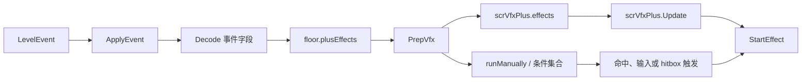

# 事件到效果调度模块

本模块对应阶段 5 的第一块：建立 `LevelEventType` 到 `ffxPlusBase` 的运行时执行框架。后续页面会继续把具体事件族拆成地板、装饰、相机、滤镜、输入、粒子等专题。

## 模块边界

| 边界 | 包含内容 |
| --- | --- |
| 数据入口 | `LevelData.levelEvents`、`LevelEvent`、`LevelEventType`。 |
| 应用入口 | `scnGame.ApplyEventsToFloors`、`scnGame.ApplyEvent`、`scnGame.PrepVfx`。 |
| 效果基类 | `ffxPlusBase` 与所有 `ffx*Plus`、部分 `ffx*` 子类。 |
| 调度器 | `scrVfxPlus.effects`、`scrVfxPlus.Update()`、`scrVfxPlus.ScrubToTime()`。 |
| 手动触发 | `runOnHit`、`runManually`、`SetConditionalEvents`、hitbox event tag、输入事件。 |

## 调度模型

## 两类事件处理

`ApplyEventsToFloors` 先处理会改变地板状态的核心事件，再把普通运行时事件交给 `ApplyEvent()` 创建组件。

| 类型 | 处理方式 |
| --- | --- |
| 核心地板事件 | 在 `ApplyCoreEventsToFloors` 和后续地板状态遍历中处理，例如速度、旋转、轨道颜色、hold、free roam、pause、hide、multitap、tile dimensions。 |
| 效果组件事件 | 由 `ApplyEvent()` 映射为 `ffxPlusBase` 子类，例如相机、背景、闪屏、地板移动、装饰移动、文本、对象、滤镜、声音、粒子、输入和帧率。 |

## 特殊控制事件

| 事件 | 作用 |
| --- | --- |
| `RepeatEvents` | 按 event tag 建立重复次数、间隔、当前地板执行和 gap length；后续同 tag 事件会被重复应用。 |
| `SetConditionalEvents` | 建立 9 类条件 tag：perfect、early perfect、late perfect、very early、very late、too early、too late、loss、on checkpoint。 |
| `SetInputEvent` | 通过 `ffxSetInputEventPlus` 把其他带 tag 的效果登记为输入触发事件。 |
| 带 `eventTag` 的效果 | 如果 tag 对应装饰 hitbox，效果会写入 `scrDecoration.hitboxEvents` 并设置 `runManually`。 |

## 调度结果

| 结果 | 条件 |
| --- | --- |
| 加入 `scrVfxPlus.effects` | 效果不带条件、不手动运行，且 `runOnHit` 为 false。 |
| 加入地板条件集合 | `conditionalInfo` 命中任一条件位。 |
| 标记手动运行 | 事件 tag 对应 hitbox 装饰，或者由输入事件等系统接管。 |
| 命中时运行 | 子类 `runOnHit` 为 true。 |

## 当前页面

| 页面 | 内容 |
| --- | --- |
| [事件执行总览](/api/events/event-execution-overview.md) | `LevelEventType` 分层、`ApplyEventsToFloors`、`ApplyEvent` 映射、`ffxPlusBase` 生命周期、`PrepVfx` 和触发入口。 |
| [运行时效果族补充](/api/runtime/effect-families.md) | 常见效果族的字段和 `StartEffect` 行为。 |
| [官方关卡脚本运行入口](/api/runtime/official-level-scripts.md) | `CallMethod` 到 `Level` 方法的调用链。 |
