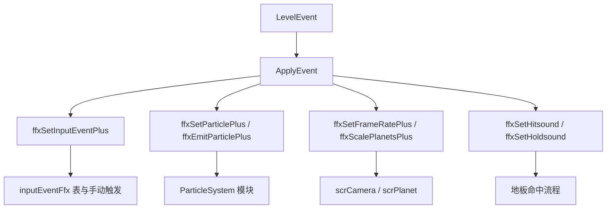

# 输入、粒子与剩余运行时事件模块

本模块收口阶段 5 中剩余的运行时效果族：输入事件、帧率、星球缩放、hitsound、hold sound、粒子设置和粒子发射。

## 模块边界

| 类别 | 类型 |
| --- | --- |
| 输入事件 | `SetInputEvent`、`ffxSetInputEventPlus`。 |
| 运行时帧率 | `SetFrameRate`、`ffxSetFrameRatePlus`。 |
| 星球缩放 | `ScalePlanets`、`ffxScalePlanetsPlus`。 |
| 命中声音 | `SetHitsound`、`ffxSetHitsound`。 |
| Hold 声音 | `SetHoldSound`、`ffxSetHoldsound`。 |
| 粒子设置 | `SetParticle`、`ADOFAI.FloorFX.ffxSetParticlePlus`。 |
| 粒子发射 | `EmitParticle`、`ADOFAI.FloorFX.ffxEmitParticlePlus`。 |

## 执行流

## 关键差异

| 事件 | 关键点 |
| --- | --- |
| `SetInputEvent` | 在 `PrepVfx()` 中收集同 tag 效果，并改成手动触发。 |
| `SetFrameRate` | 直接调用 `scrCamera.SetCustomFrameRate()`。 |
| `ScalePlanets` | 遍历所有玩家，按目标星球 tween `planetScale`。 |
| `SetHitsound` | `runOnHit`，字段写入 `floor.setHitsound`。 |
| `SetHoldSound` | `runOnHit`，字段供 hold 流程读取。 |
| `SetParticle` | 修改 `ParticleSystem` 的 main、velocity、rotation、shape、emission、lifetime、size、color 等模块。 |
| `EmitParticle` | 直接调用 `ParticleSystem.Emit(count)`。 |

## 阶段 5 状态

阶段 5 的主干事件族已经拆分完毕。下一阶段进入平台、存档、服务与 UI；阶段 7 再做 1222 个 `.cs` 文件级覆盖清单，回补旧式官方关卡效果组件和零散文件。

## 页面

| 页面 | 内容 |
| --- | --- |
| [输入、粒子与剩余运行时事件](/api/events/input-particle-runtime-events.md) | 输入事件、帧率、星球缩放、hitsound、hold sound、粒子设置和粒子发射。 |
| [事件执行总览](/api/events/event-execution-overview.md) | 事件调度主线。 |
| [运行时效果族补充](/api/runtime/effect-families.md) | 运行时效果族字段说明。 |
