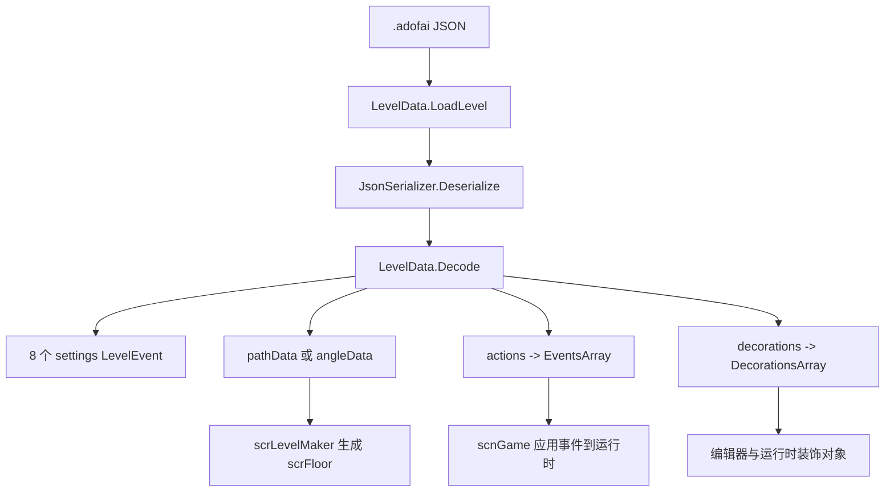

# 关卡数据模型

## 模块边界

本模块覆盖 `.adofai` 文件进入内存后的核心数据结构：

| 类型 | 源码路径 | 角色 |
| --- | --- | --- |
| [LevelData](/api/data-models/LevelData.md) | `7thRhythmSource/ADOFAi/ADOFAI/LevelData.cs` | 关卡总容器，保存路径、角度、settings、事件和装饰。 |
| [LevelEvent](/api/data-models/LevelEvent.md) | `7thRhythmSource/ADOFAi/ADOFAI/LevelEvent.cs` | 单个事件、装饰或 settings 项的统一数据对象。 |
| `EventsArray<T>` | `7thRhythmSource/ADOFAi/EventsArray.cs` | 普通事件列表容器。 |
| `DecorationsArray<T>` | `7thRhythmSource/ADOFAi/DecorationsArray.cs` | 装饰事件列表容器，新增或插入时会通知编辑器装饰列表刷新。 |

阶段 2 后续还会继续覆盖 `LevelEventInfo`、`PropertyInfo`、`Property`、`LevelEventType`、`LevelEventCategory`、`LevelEventExecutionTime` 和序列化转换器。

## 主要职责

关卡数据模型把 JSON 文件中的结构拆成三层：

| 层级 | 数据 | 说明 |
| --- | --- | --- |
| 关卡容器 | `LevelData` | 负责文件读取、版本兼容、路径数据、settings、事件列表和装饰列表。 |
| 事件对象 | `LevelEvent` | 负责事件类型、楼层、属性值、禁用状态、活动状态和编码解码。 |
| 属性元数据 | `LevelEventInfo`、`PropertyInfo` | 负责说明某个事件拥有哪些属性、默认值、控件类型、是否可禁用和是否写入文件。 |

ADOFAI 不把每种 `.adofai` 事件拆成独立数据类。事件种类由 `LevelEventType` 表示，事件字段由元数据驱动，具体字段值统一保存在 `LevelEvent.data`。

## 文件到运行时对象

`LevelData.Decode()` 的职责是恢复数据，不直接生成地板。地板生成由 `scrLevelMaker` 完成，运行时事件效果由 `scnGame` 与效果组件继续处理。

## settings 的设计

`LevelData` 把关卡级设置也表示成 `LevelEvent`。`Setup()` 会创建 8 个 settings 事件：

| settings 字段 | 事件类型名 | 覆盖内容 |
| --- | --- | --- |
| `songSettings` | `SongSettings` | BPM、音频文件、音量、音高、偏移、命中音和倒计时。 |
| `levelSettings` | `LevelSettings` | 艺术家、歌曲名、作者、预览图、描述、标签、授权和难度。 |
| `trackSettings` | `TrackSettings` | 轨道颜色、纹理、样式、消失动画和可见节拍范围。 |
| `backgroundSettings` | `BackgroundSettings` | 背景颜色、背景图、背景图平铺、默认背景地板和形状。 |
| `cameraSettings` | `CameraSettings` | 初始相机参考、位置、旋转、缩放和低特效行为。 |
| `miscSettings` | `MiscSettings` | 背景视频、地板图标描边、星球缓动和文本默认颜色。 |
| `eventSettings` | `EventSettings` | 事件设置元对象。 |
| `decorationSettings` | `DecorationSettings` | 装饰设置元对象。 |

这种设计让 settings 和普通事件共用 `LevelEvent` 的属性读取、编码和解码逻辑。`LevelData` 上的 `artist`、`bpm`、`trackColor`、`camPosition` 等便利属性只是把 settings 字典访问包装成强类型属性。

## 事件与装饰列表

| 列表 | JSON 字段 | 保存对象 | 编码规则 |
| --- | --- | --- | --- |
| `levelEvents` | `actions` | 普通 `LevelEvent` | `EncodeToDictionary()` 筛选 `active` 事件，按 `floor` 排序后写入。 |
| `decorations` | `decorations` | 装饰 `LevelEvent` | `EncodeToDictionary()` 筛选 `active` 装饰后写入。 |

`Decode()` 读取 `actions` 时会根据 `levelEvent.IsDecoration` 决定事件进入 `decorations` 还是 `levelEvents`。读取 `decorations` 字段时则直接创建装饰事件并加入装饰列表。

## 版本兼容主线

`LevelData.Decode()` 会根据 `settings.version` 执行兼容处理。当前编码固定写入版本 `18`，解码遇到高于 18 的版本会返回 `FutureVersion`。

| 兼容范围 | 处理内容 |
| --- | --- |
| 低版本 settings | 读取或补齐 `legacyFlash`、`legacyCamRelativeTo`、`legacyTween`、`disableV15Features`。 |
| 旧路径格式 | 有 `pathData` 时根据 `isOldLevel` 决定保留字符串还是转为 `angleData`。 |
| 版本 7 文本 | `LoadLevel()` 会把 `"enabled"` 替换为 `"active"` 后再解码一次。 |
| 版本 9 到 16 | 重算部分 `Pause` 与 `FreeRoam` 时长，必要时插入新的 `Pause` 事件。 |

`LevelEvent.FixDefaultValues()` 则处理事件字段级兼容，例如装饰图片字段改名、旧 `depth` 到 `parallax`、旧背景缩放字段到 `scalingRatio`、旧命中框字段到 `hitbox`。

## 编辑器联动

`DecorationsArray<T>` 继承 `List<T>`，但重写了 `Add()` 和 `Insert()`：

| 操作 | 额外行为 |
| --- | --- |
| `Add(T item)` | 添加后调用 `CallDecorationUpdate()`。 |
| `Insert(int index, T item)` | 插入后调用 `CallDecorationUpdate()`。 |
| `CallDecorationUpdate()` | 如果 `scnEditor.instance != null`，调用 `scnEditor.instance.propertyControlDecorationsList.OnDecorationUpdate()`。 |

因此，编辑器中改变装饰列表时，装饰列表控件能被通知刷新。普通 `EventsArray<T>` 当前只继承 `List<T>` 并调用基类 `Add()`，没有额外刷新逻辑。

## 源码研究关注点

| 关注点 | 入口 |
| --- | --- |
| 文件读取失败或版本不兼容 | `LevelData.LoadLevel()`、`LevelData.Decode()`、`LoadResult`。 |
| settings 字段来自哪里 | `LevelData.Setup()` 和 `GCS.settingsInfo`。 |
| 事件字段为什么有默认值 | `LevelEvent` 构造函数遍历 `info.propertiesInfo`。 |
| 属性是否写入文件 | `LevelEvent.Encode()` 检查 `PropertyInfo.encode`、`canBeDisabled` 和 `disabled`。 |
| 旧关卡迁移 | `LevelData.Decode()` 的版本分支和 `LevelEvent.FixDefaultValues()`。 |
| 装饰列表刷新 | `DecorationsArray<T>.CallDecorationUpdate()`。 |

## 后续补齐

阶段 2 接下来要继续把元数据层补完整：`LevelEventInfo`、`PropertyInfo`、`Property` 和事件类型枚举会说明事件属性如何被定义、如何进入编辑器控件，以及如何连接到运行时效果类族。

