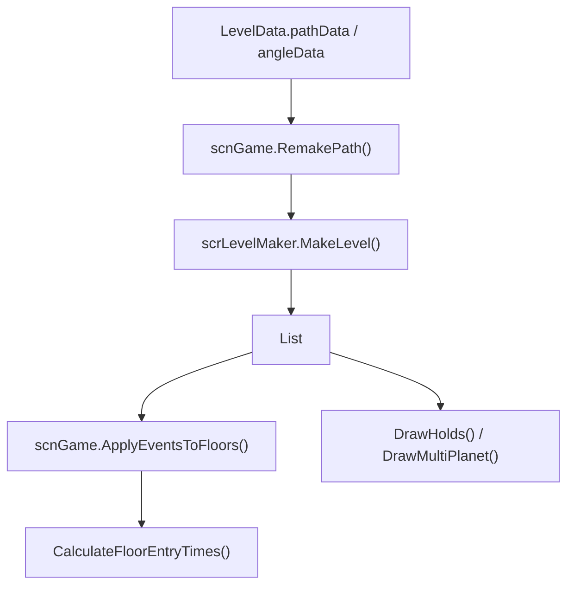

# 路径生成与地板运行时

本模块记录 `scrLevelMaker` 与 `scrFloor` 的协作关系。它解释 `.adofai` 中的路径数据怎样变成可判定、可渲染、可挂事件的地板列表。

## 数据流

## 路径表示

| 表示 | 字段 | 生成方法 |
| --- | --- | --- |
| 旧式字符串路径 | `scrLevelMaker.leveldata` | `InstantiateStringFloors()` |
| 新式角度数组 | `scrLevelMaker.floorAngles` | `InstantiateFloatFloors()` |

旧式字符串使用方向字符表达角度，也用附加字符表达速度、方向反转、兔子/蜗牛图标和 midspin。新式数组直接保存角度，生成过程更接近 `LevelData.angleData`。

## 地板承担的状态

`scrFloor` 同时是渲染对象、判定对象和事件容器：

| 角色 | 字段 |
| --- | --- |
| 渲染 | `floorRenderer`、`iconsprite`、`topGlow`、`bottomGlow`、`customTexture`、`TrackStyle` |
| 路径 | `entryangle`、`exitangle`、`angleLength`、`prevfloor`、`nextfloor` |
| 时间 | `entryTime`、`entryTimePitchAdj`、`entryBeat` |
| 判定 | `marginScale`、`grade`、`tapsNeeded`、`numPlanets`、`auto` |
| 事件 | `plusEffects`、9 类条件效果集合、`eventIcon` |
| 特殊段落 | `holdLength`、`freeroam`、`extraBeats`、`countdownTicks` |

## 与事件系统的关系

`scnGame.ApplyEventsToFloors()` 会清理每块地板已有 `ffxPlusBase`，再把 `LevelEvent` 转换为新的运行时组件。组件会加入 `scrFloor.plusEffects`，有条件触发的组件还会进入对应条件集合。

## 后续扩展

阶段 4 会把判定、hold、free roam、多星体和渲染更新进一步拆分。阶段 5 会把 `ffxPlusBase` 和具体事件效果类接到本模块的 `plusEffects` 上。
