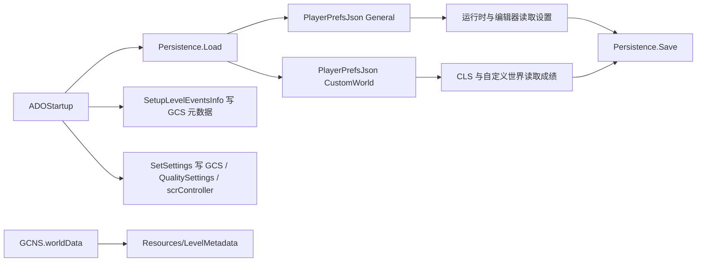

# 平台、存档与全局状态模块

## 模块边界

本模块覆盖第 6 阶段的第一块：`GCS`、`GCNS` 和 `Persistence`。它们位于源码根目录，是启动、场景加载、关卡选择、运行时结算、编辑器偏好和平台服务共同依赖的基础层。

| 类型 | 边界 |
| --- | --- |
| `GCS` | 本次游戏运行中的跨场景状态、调试开关、输入集合、命中窗口常量、文件扩展名和事件元数据缓存。 |
| `GCNS` | 发布号、场景名、世界元数据、精选关卡 ID、分支列表、bundle 路径和世界分类缓存。 |
| `Persistence` | 通用存档、自定义关卡存档、设置项、世界进度、DLC 进度、成就同步和云存档比较。 |

## 核心流程

`Persistence.Load()` 是启动阶段的存档入口；`GCNS.worldData` 是首次访问时才读取 `LevelMetadata`；`GCS` 的事件元数据由启动阶段填充，但 checkpoint、speed trial、自定义关卡路径和场景目标会在运行时不断变化。

## 关键类型

| 类型 | 关键字段或方法 | 说明 |
| --- | --- | --- |
| `GCS` | `checkpointNum`、`practiceMode`、`currentSpeedTrial`、`customLevelPaths`、`sceneToLoad`、`levelEventsInfo` | 连接控制器状态机、自定义关卡加载、编辑器事件面板和场景加载器。 |
| `GCNS.WorldData` | `index`、`levelCount`、`trialAim`、`levelSource`、`isDLC`、`isTech`、`island`、`availableDifficulties` | 从 `LevelMetadata` 解码的世界记录，决定官方关卡入口、DLC 分类和选关显示。 |
| `GCNS` | `releaseNumber`、`worldData`、`allWorlds`、`sceneLevelSelect`、`BundlesLoadPath` | 为存档版本、世界遍历、场景跳转和 bundle 加载提供常量入口。 |
| `Persistence` | `generalPrefs`、`customPrefs`、`Load()`、`Save()`、`WriteSaveToDisk()`、`CheckWithCloud()` | 统一管理设置、官方进度、自定义关卡成绩、成就和云存档。 |

## 状态分层

| 层级 | 代表数据 | 生命周期 |
| --- | --- | --- |
| 临时运行状态 | `GCS.checkpointNum`、`GCS.practiceMode`、`GCS.sceneToLoad`、`GCS.customLevelIndex` | 随当前运行和场景跳转变化，通常不直接落盘。 |
| 元数据缓存 | `GCS.levelEventsInfo`、`GCNS.worldData`、`GCNS.allWorlds` | 启动或首次访问后缓存，后续模块直接读取。 |
| 通用存档 | `Persistence.generalPrefs` | 玩家设置、官方进度、DLC 进度、编辑器偏好和 saved progress。 |
| 自定义存档 | `Persistence.customPrefs` | 自定义世界成绩、精选关卡订阅、CLS 总游玩次数。 |
| Unity 旧式 prefs | `PlayerPrefs` | 源码中仍用于部分音频、偏移、最近文件和编辑器尺寸字段。 |

## 源码研究关注点

| 问题 | 入口 |
| --- | --- |
| 存档何时加载 | [ADOStartup](/api/core/ADOStartup.md) 的启动顺序和 [全局状态、常量与存档](/api/platform/global-state-persistence.md) 的 `Load()` 小节。 |
| 官方世界完成度如何保存 | [全局状态、常量与存档](/api/platform/global-state-persistence.md) 的世界进度方法族，以及 [结算、成绩与进度保存](/api/runtime/results-save-flow.md)。 |
| 自定义关卡成绩在哪个分区 | `Persistence.customPrefs`，键名以 `CustomWorld_` 和 hash 组合。 |
| 场景加载目标从哪里传递 | `GCS.sceneToLoad`、`GCS.internalLevelName`、`GCS.customLevelPaths`，详见 [场景流转与加载模块](/modules/runtime-scene-loading.md)。 |
| 事件属性元数据从哪里来 | `ADOStartup.SetupLevelEventsInfo()` 写入 `GCS.levelEventsInfo` 和 `GCS.settingsInfo`，详见 [关卡数据模型](/modules/level-data-model.md)。 |

## 待接续页面

第 6 阶段还需要继续拆分平台 helper、Steam、DLC、CLS、关卡选择、菜单、移动端 UI 和本地化。当前页面只覆盖全局状态与存档基础层。
